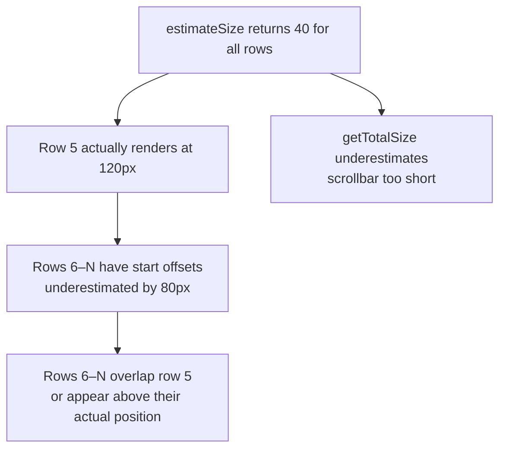
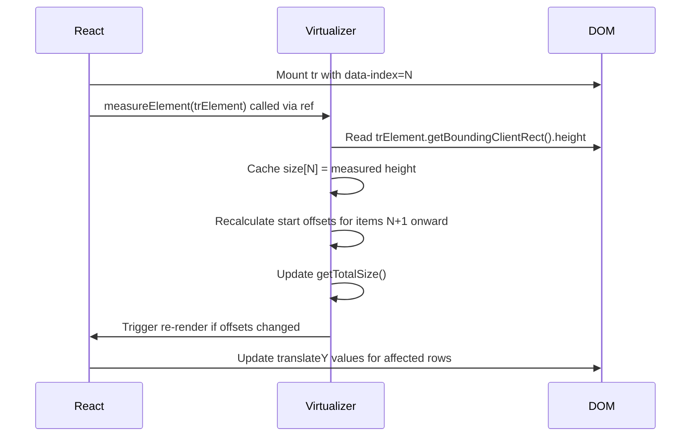

## TanStack Virtual — Dynamic Row Height Estimation

### Overview

Dynamic row height estimation addresses the case where rows do not share a uniform height — cell content wraps, rows contain expandable sections, or data varies in length. The virtualizer cannot know actual heights before rendering. It works with estimates initially, then corrects those estimates as rows are measured in the DOM. The mechanism is `measureElement`, a ref callback that the virtualizer provides for attaching to rendered row elements.

---

### Why Fixed `estimateSize` Breaks for Variable Content

With `estimateSize: () => 40`, the virtualizer assumes every row is 40px. If actual rows vary — some 40px, some 120px — several problems arise:

- `getTotalSize()` is wrong, producing an inaccurate scrollbar.
- `virtualItem.start` offsets for items below incorrectly sized rows accumulate error.
- Rows visually overlap or leave gaps.
- `scrollToIndex` lands at the wrong position.

These errors compound: one incorrectly sized row shifts the `start` offset of every subsequent row.



---

### `measureElement`

`measureElement` is a ref callback on the virtualizer instance. Attaching it to a DOM element causes the virtualizer to read that element's rendered size and update its internal size cache for the corresponding item.

```ts
virtualizer.measureElement(element: Element | null): void
```

The virtualizer reads `data-index` from the element to identify which item is being measured, then updates that item's cached size.

**Key Points:**
- The element must have a `data-index` attribute set to the virtual item's index.
- `measureElement` is called by React's ref system after the element mounts or updates.
- When a measured size differs from the estimate, the virtualizer recalculates all downstream `start` offsets and `getTotalSize()`.
- Measurement occurs after paint — a brief layout shift may be visible on first render before measurements are collected. [Inference: Shift magnitude depends on how far estimates deviate from actual sizes.]

---

### Basic `measureElement` Setup

```tsx
const rowVirtualizer = useVirtualizer({
  count: rows.length,
  getScrollElement: () => parentRef.current,
  estimateSize: () => 50,   // rough initial estimate
  overscan: 5,
})

// In render — attach measureElement as ref, set data-index
{rowVirtualizer.getVirtualItems().map(virtualItem => {
  const row = rows[virtualItem.index]
  return (
    <tr
      key={row.id}
      data-index={virtualItem.index}
      ref={rowVirtualizer.measureElement}
      style={{
        position: 'absolute',
        width: '100%',
        transform: `translateY(${virtualItem.start}px)`,
        // No explicit height — content determines height
      }}
    >
      {row.getVisibleCells().map(cell => (
        <td key={cell.id}>
          {flexRender(cell.column.columnDef.cell, cell.getContext())}
        </td>
      ))}
    </tr>
  )
})}
```

**Key Points:**
- Do not set an explicit `height` on the `<tr>` when using `measureElement`. The element's height must be determined by its content for measurement to be meaningful.
- `data-index` must match `virtualItem.index` exactly — this is how the virtualizer maps a DOM element to its corresponding item.

---

### How the Measurement Cycle Works



**Key Points:**
- The measurement read (`getBoundingClientRect`) happens synchronously inside the ref callback, after the browser has laid out the element.
- If the measured size differs from the estimate, affected downstream offsets are recalculated and a re-render is triggered.
- Items that have already been measured retain their cached size until they are remeasured (e.g., after content changes).

---

### `estimateSize` Strategy for Variable Heights

Even with `measureElement`, `estimateSize` matters because:

1. Items not yet scrolled into view have never been measured — their estimate is used for offset and total size calculations.
2. The initial scroll position and scrollbar size are based entirely on estimates.
3. `scrollToIndex` for unmeasured items uses the estimate to approximate position.

**Strategy: use a data-driven estimate**

```ts
// If row height correlates with data properties, use them
estimateSize: index => {
  const row = rows[index]
  if (row.original.description && row.original.description.length > 200) return 120
  if (row.subRows && row.subRows.length > 0) return 80
  return 40
}
```

**Strategy: use a running average**

```tsx
const measuredHeights = React.useRef<Record<number, number>>({})

const averageHeight = React.useMemo(() => {
  const values = Object.values(measuredHeights.current)
  if (values.length === 0) return 50
  return values.reduce((a, b) => a + b, 0) / values.length
}, [/* updated after measurements */])

const rowVirtualizer = useVirtualizer({
  count: rows.length,
  getScrollElement: () => parentRef.current,
  estimateSize: index =>
    measuredHeights.current[index] ?? averageHeight,
  overscan: 5,
})
```

[Inference: Maintaining a running average requires a mechanism to update it after measurements are collected — either via the virtualizer's `onChange` callback or by triggering a re-render after measurement. The exact pattern depends on implementation.]

**Strategy: pessimistic overestimate**

```ts
estimateSize: () => 100  // assume rows are tall
```

Overestimating produces a scrollbar that appears too long initially, then contracts as measurements are collected. Underestimating produces a scrollbar that grows. Overestimating is often preferable because a contracting scrollbar is less disorienting than a jumping one. [Speculation: User perception of these artifacts varies; neither approach is universally better.]

---

### The `onChange` Callback

The virtualizer fires `onChange` whenever its internal state changes — including after measurements update offsets.

```ts
const rowVirtualizer = useVirtualizer({
  count: rows.length,
  getScrollElement: () => parentRef.current,
  estimateSize: () => 50,
  onChange: (instance, sync) => {
    // instance: the virtualizer
    // sync: true if change was triggered synchronously
    console.log('Total size:', instance.getTotalSize())
    console.log('Is sync:', sync)
  },
})
```

Uses for `onChange`:
- Updating a running average estimate after new measurements are collected.
- Triggering external state updates when the virtual window changes.
- Debugging measurement behavior.

[Inference: `onChange` fires on every scroll event as well as after measurements — it is not exclusively a measurement callback. Filtering for measurement-driven changes requires comparing state across calls.]

---

### Remeasuring After Content Changes

When a row's content changes after it has been measured — for example, a row expands to show additional detail — its cached measurement becomes stale. The virtualizer will not automatically remeasure unless the ref callback fires again (i.e., the element remounts).

To force remeasurement:

#### Option 1 — Force remount via `key` change

```tsx
<tr
  key={`${row.id}-${row.getIsExpanded()}`}  // key changes on expand
  data-index={virtualItem.index}
  ref={rowVirtualizer.measureElement}
>
```

Changing the `key` causes React to unmount and remount the element, triggering the ref callback and a fresh measurement. This remounts the entire row, which may cause a visible flash. [Inference]

#### Option 2 — `resizeItem`

```ts
virtualizer.resizeItem(index: number, size: number): void
```

Manually sets a cached size for a specific item without measuring the DOM.

```tsx
// After expanding a row, set an approximate new height
const handleExpand = (index: number) => {
  row.toggleExpanded()
  rowVirtualizer.resizeItem(index, 200)  // approximate expanded height
}
```

`resizeItem` updates the size cache immediately and triggers offset recalculation. It does not read from the DOM — the size is set programmatically. [Inference: If the actual expanded height differs from the value passed to `resizeItem`, a follow-up `measureElement` call will correct it once the row is in the virtual window.]

#### Option 3 — `measure()` on the virtualizer

```ts
virtualizer.measure(): void
```

Forces the virtualizer to re-call `estimateSize` for all items and discard cached measurements. Use when a bulk content change invalidates all existing measurements — for example, after a font size change or container width change.

```tsx
// Re-measure all items when container width changes
React.useEffect(() => {
  rowVirtualizer.measure()
}, [containerWidth])
```

---

### Handling `ResizeObserver` for Dynamic Content

For rows whose height can change at any time (not just on mount) — for example, rows with async image loading or in-place editing — a `ResizeObserver` can trigger remeasurement whenever the element's size changes.

```tsx
const rowRef = React.useCallback(
  (element: HTMLTableRowElement | null) => {
    if (!element) return

    // Initial measurement via measureElement
    rowVirtualizer.measureElement(element)

    // Observe future size changes
    const observer = new ResizeObserver(() => {
      rowVirtualizer.measureElement(element)
    })
    observer.observe(element)

    return () => observer.disconnect()
  },
  [rowVirtualizer]
)

// Usage
<tr
  data-index={virtualItem.index}
  ref={rowRef}
>
```

[Inference: `ResizeObserver` fires asynchronously after layout. This pattern may trigger multiple measurements and re-renders for rows with animated height changes. Debouncing the observer callback may be advisable in those cases. Behavior may vary by browser.]

---

### Scroll Position Drift

When measurements correct estimates — particularly for rows the user has already scrolled past — the cumulative offset correction can shift the scroll position. This manifests as content appearing to jump during initial scroll through the list.

Mitigation strategies:

**Accurate initial estimates** — the smaller the gap between estimate and actual, the less drift occurs.

**Overscan** — higher overscan means more rows are measured before they are visible, reducing the chance that unmeasured rows cause drift when scrolled to.

**Pessimistic estimates** — overestimating causes the scrollbar to contract rather than expand; this is generally less disorienting than position jumps.

**`scrollRestoration`** — if scroll position is restored from storage (e.g., `initialOffset`), stored positions become invalid after content changes that alter row heights. [Inference: Robust scroll restoration under variable heights requires storing a row index rather than a pixel offset and using `scrollToIndex` to restore position.]

---

### `measureElement` with `display: block` tbody

When `<tbody>` uses `display: block` (required for absolute row positioning), `measureElement` reads the `<tr>` element's `offsetHeight` or `getBoundingClientRect().height`. Both reflect the rendered height correctly under `display: block`. [Inference: This is expected behavior; verify in target browsers if measurement discrepancies appear.]

---

### Variable Column Widths and Row Height

Row heights that depend on text wrapping are sensitive to column widths. If column widths change (via resize), wrapped text reflows and row heights change. Cached measurements become stale.

```tsx
// Re-measure all rows after column resize settles
const columnSizing = table.getState().columnSizing

React.useEffect(() => {
  rowVirtualizer.measure()
}, [columnSizing])
```

This discards all cached heights and re-estimates, triggering remeasurement as rows re-enter the virtual window. [Inference: `rowVirtualizer.measure()` discards cached sizes, so all rows revert to `estimateSize` values until they are remeasured. This may cause a brief layout recalculation.]

---

### Summary of Measurement APIs

| API | When to use |
|---|---|
| `measureElement` ref callback | Initial measurement and remeasurement on remount |
| `resizeItem(index, size)` | Programmatically set a known size without DOM measurement |
| `measure()` | Discard all cached sizes and re-estimate; use after bulk content or layout changes |
| `ResizeObserver` + `measureElement` | Continuous remeasurement for rows with dynamically changing content |
| `onChange` callback | React to measurement-driven state changes; update running average estimates |

---

### Common Mistakes

| Mistake | Consequence | Correction |
|---|---|---|
| Setting explicit `height` on measured `<tr>` | Element height is fixed; measurement reflects the set value, not content | Remove explicit height from rows using `measureElement` |
| Missing `data-index` on measured element | Virtualizer cannot map element to item; measurement silently ignored | Always set `data-index={virtualItem.index}` |
| Not calling `measure()` after column resize | Cached heights reflect pre-resize text wrap; offsets accumulate error | Call `rowVirtualizer.measure()` when `columnSizing` changes |
| Using `key={virtualItem.index}` instead of `key={virtualItem.key}` | Unstable reconciliation; wrong elements remounted during data changes | Use `virtualItem.key` as React `key` |
| Underestimating row height significantly | Scrollbar grows as measurements are collected; disorienting scroll drift | Overestimate or use data-driven estimates |
| Storing scroll position as pixel offset across sessions | Stored offset invalid after row height changes | Store row index; restore with `scrollToIndex` |

---

**Related Topics:**
- `useVirtualizer` Basics — core options, `VirtualItem` structure, scroll container setup
- Row Virtualization with TanStack Table — full integration pattern
- Row Expansion — `resizeItem` and key-based remount patterns for expandable rows
- `ResizeObserver` — browser API for observing element size changes
- Column Virtualization — interaction between column width changes and row height measurement
- `scrollToIndex` — position accuracy for unmeasured items
- Scroll Position Persistence — storing index vs. pixel offset