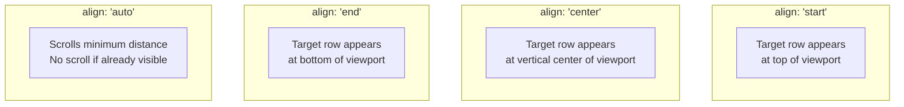
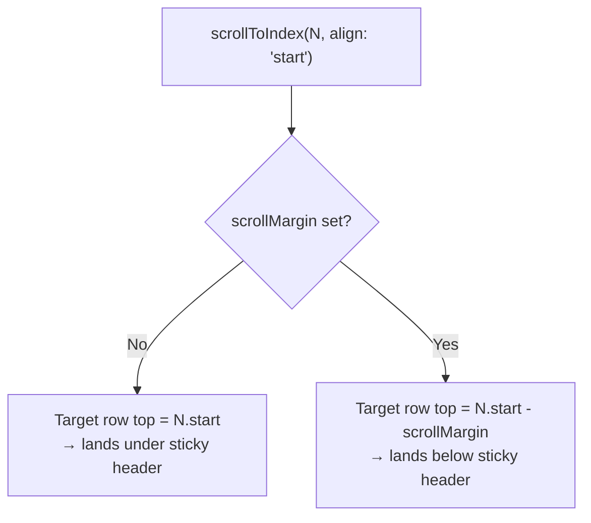
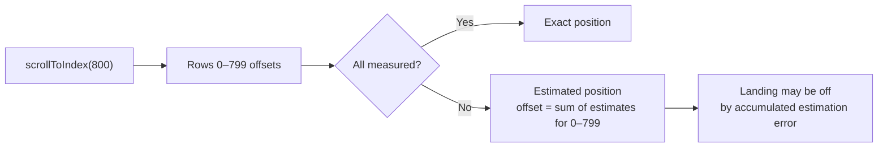

## TanStack Virtual — Scroll-to-Row and Scroll-to-Index

### Overview

`scrollToIndex` is the primary API for programmatically navigating to a specific item in a virtualized list. Because virtualized lists do not render all items, a standard DOM `scrollIntoView` call cannot target an unmounted row — the virtualizer must compute the target offset from its size cache and scroll the container to that position. `scrollToOffset` provides a lower-level complement for pixel-precise navigation.

---

### Core API

```ts
virtualizer.scrollToIndex(
  index: number,
  options?: ScrollToIndexOptions
): void

type ScrollToIndexOptions = {
  align?: 'start' | 'center' | 'end' | 'auto'
  behavior?: 'smooth' | 'auto'
}
```

```ts
virtualizer.scrollToOffset(
  offset: number,
  options?: { behavior?: 'smooth' | 'auto' }
): void
```

---

### `align` Options

`align` controls where in the viewport the target item lands after scrolling.



| Value | Behavior |
|---|---|
| `'start'` | Aligns top of item with top of viewport |
| `'center'` | Centers item vertically in viewport |
| `'end'` | Aligns bottom of item with bottom of viewport |
| `'auto'` | Scrolls least amount to make item visible; no-op if already visible |

**Key Points:**
- `'auto'` is suitable for keyboard navigation — it scrolls only when necessary and does not reposition visible items.
- `'start'` and `'center'` are suitable for explicit "jump to row" actions where the item should be prominently positioned.
- `'end'` is useful for appending scenarios — scrolling to the last item after a new row is added.

---

### `behavior` Options

| Value | Behavior |
|---|---|
| `'auto'` | Instant jump (default) |
| `'smooth'` | Animated scroll via the browser's native smooth scroll |

**Key Points:**
- `'smooth'` delegates animation to the browser's native `scrollTo` with `behavior: 'smooth'`. Duration and easing are browser-controlled and not configurable. [Inference]
- `'smooth'` combined with `scrollToIndex` for an unmeasured item may produce an imprecise landing position if the estimate is inaccurate, because the animation target is computed at call time using the estimate. [Inference: Behavior may vary by browser.]
- `'auto'` is more reliable for programmatic navigation where position accuracy matters more than animation.

---

### Basic Usage

```tsx
const rowVirtualizer = useVirtualizer({
  count: rows.length,
  getScrollElement: () => parentRef.current,
  estimateSize: () => 40,
})

// Jump to row 500 instantly, aligned to top
rowVirtualizer.scrollToIndex(500, { align: 'start' })

// Smoothly scroll to row 200, centered
rowVirtualizer.scrollToIndex(200, { align: 'center', behavior: 'smooth' })

// Scroll only if row 75 is not already visible
rowVirtualizer.scrollToIndex(75, { align: 'auto' })
```

---

### Mapping TanStack Table Rows to Virtual Indices

TanStack Table rows are identified by `row.id` (a string) — not by numeric index. The virtualizer operates on numeric indices into the `rows` array. The mapping is:

```ts
const rows = table.getRowModel().rows

// Find virtual index for a given row ID
const targetIndex = rows.findIndex(r => r.id === targetRowId)

if (targetIndex !== -1) {
  rowVirtualizer.scrollToIndex(targetIndex, { align: 'start' })
}
```

**Key Points:**
- `rows.findIndex` is O(N) — for very large datasets, consider maintaining an `id → index` map that updates when the row model changes.
- The `rows` array changes when sorting, filtering, or grouping state changes. Always derive the index from the current `getRowModel().rows` at call time, not a stale reference.

---

### Maintaining an ID-to-Index Map

```tsx
const rowIndexMap = React.useMemo(() => {
  const map = new Map<string, number>()
  rows.forEach((row, index) => map.set(row.id, index))
  return map
}, [rows])

// Scroll to a row by ID
function scrollToRowId(rowId: string) {
  const index = rowIndexMap.get(rowId)
  if (index !== undefined) {
    rowVirtualizer.scrollToIndex(index, { align: 'auto' })
  }
}
```

The map rebuilds whenever `rows` changes (sort, filter, grouping). [Inference: For tables with very frequent row model updates, memoization cost may outweigh the lookup benefit. Profile before optimizing.]

---

### Scroll on Initial Render

To scroll to a specific row on mount — for example, to restore a previous scroll position — call `scrollToIndex` inside a `useLayoutEffect`. Using `useEffect` may allow a paint at position 0 before the scroll occurs.

```tsx
React.useLayoutEffect(() => {
  if (initialRowIndex !== undefined) {
    rowVirtualizer.scrollToIndex(initialRowIndex, { align: 'start' })
  }
}, []) // run once on mount
```

**Key Points:**
- `useLayoutEffect` fires synchronously after DOM mutations but before the browser paints — this minimizes the flash at position 0.
- `useEffect` may cause a visible jump from position 0 to the target on first render. [Inference: Whether this is visible depends on render timing and browser; `useLayoutEffect` is the safer choice.]

---

### Scroll to Index with Sticky Header

When a sticky header occupies space at the top of the scroll container, `scrollToIndex` with `align: 'start'` positions the row at the top of the scroll content — underneath the header. The `scrollMargin` option corrects this.

```tsx
const HEADER_HEIGHT = 60

const rowVirtualizer = useVirtualizer({
  count: rows.length,
  getScrollElement: () => parentRef.current,
  estimateSize: () => 40,
  scrollMargin: HEADER_HEIGHT,
})
```

With `scrollMargin` set, `scrollToIndex` accounts for the header height and positions the target row below it.



---

### Position Accuracy for Unmeasured Items

When `measureElement` is in use and an item has not yet been scrolled into view, its size is the `estimateSize` value. `scrollToIndex` uses the estimate to compute the target offset.



**Correction pattern — two-pass scroll:**

```tsx
async function scrollToIndexAccurate(index: number) {
  // First pass — scroll using estimate; brings item into virtual window
  rowVirtualizer.scrollToIndex(index, { align: 'start' })

  // Wait for measurements to be collected
  await new Promise(resolve => requestAnimationFrame(resolve))
  await new Promise(resolve => requestAnimationFrame(resolve))

  // Second pass — now that item is measured, scroll again for precision
  rowVirtualizer.scrollToIndex(index, { align: 'start' })
}
```

[Inference: The two-pass pattern is a commonly cited workaround for this limitation. Two `requestAnimationFrame` delays allow the virtualizer to mount the target rows, measure them via `measureElement`, and recalculate offsets before the second scroll. Exact timing behavior is not guaranteed and may need adjustment. Behavior may vary.]

---

### Keyboard Navigation to Selected Row

A common pattern is pressing keyboard shortcuts or clicking a search result to navigate to a specific row.

```tsx
// Keyboard navigation handler
React.useEffect(() => {
  const handleKeyDown = (e: KeyboardEvent) => {
    if (e.key === 'ArrowDown') {
      setSelectedIndex(prev => {
        const next = Math.min(prev + 1, rows.length - 1)
        rowVirtualizer.scrollToIndex(next, { align: 'auto' })
        return next
      })
    }
    if (e.key === 'ArrowUp') {
      setSelectedIndex(prev => {
        const next = Math.max(prev - 1, 0)
        rowVirtualizer.scrollToIndex(next, { align: 'auto' })
        return next
      })
    }
  }

  window.addEventListener('keydown', handleKeyDown)
  return () => window.removeEventListener('keydown', handleKeyDown)
}, [rows.length, rowVirtualizer])
```

**Key Points:**
- `align: 'auto'` is the correct choice for arrow key navigation — it does not reposition rows that are already visible.
- `align: 'start'` on every keypress causes the table to scroll aggressively, repositioning the selected row to the top on every keystroke.

---

### Scroll After Sort or Filter

After sorting or filtering, `rows` contains a new array in a new order. A previously targeted row may now be at a different index. To scroll to the first result after a filter:

```tsx
React.useEffect(() => {
  if (rows.length > 0) {
    rowVirtualizer.scrollToIndex(0, { align: 'start' })
  }
}, [columnFilters, globalFilter])
```

To preserve the selected row's position across a sort:

```tsx
const selectedRowId = '42'

React.useEffect(() => {
  const index = rows.findIndex(r => r.id === selectedRowId)
  if (index !== -1) {
    rowVirtualizer.scrollToIndex(index, { align: 'auto' })
  }
}, [sorting])
```

---

### `scrollToOffset`

`scrollToOffset` scrolls the container to a specific pixel offset directly, bypassing item index calculations.

```ts
rowVirtualizer.scrollToOffset(
  offset: number,
  options?: { behavior?: 'smooth' | 'auto' }
): void
```

```tsx
// Scroll to absolute top
rowVirtualizer.scrollToOffset(0)

// Scroll to 500px from top
rowVirtualizer.scrollToOffset(500, { behavior: 'smooth' })
```

**Key Points:**
- `scrollToOffset` is useful for restoring a previously stored scroll position.
- Stored pixel offsets become inaccurate if row heights change between sessions (content updates, different data). Prefer `scrollToIndex` for cross-session persistence. [Inference]
- `scrollToOffset` with a value beyond `getTotalSize()` scrolls to the maximum scrollable position.

---

### Persisting and Restoring Scroll Position

#### Storing index (recommended)

```tsx
// Store selected row ID in session storage
sessionStorage.setItem('scroll-row-id', targetRow.id)

// On mount, find index and scroll
React.useLayoutEffect(() => {
  const storedId = sessionStorage.getItem('scroll-row-id')
  if (!storedId) return
  const index = rows.findIndex(r => r.id === storedId)
  if (index !== -1) {
    rowVirtualizer.scrollToIndex(index, { align: 'start' })
  }
}, [])
```

#### Storing pixel offset (simpler, less robust)

```tsx
// Store on scroll
parentRef.current?.addEventListener('scroll', () => {
  sessionStorage.setItem('scroll-offset', String(parentRef.current?.scrollTop))
})

// Restore on mount
React.useLayoutEffect(() => {
  const stored = sessionStorage.getItem('scroll-offset')
  if (stored) {
    rowVirtualizer.scrollToOffset(Number(stored))
  }
}, [])
```

[Inference: Pixel offset restoration is fragile across data changes that alter row heights. Index-based restoration is more robust for dynamic data.]

---

### Scroll to Column Index (Horizontal)

The same API applies to column virtualization with `horizontal: true`.

```tsx
const columnVirtualizer = useVirtualizer({
  count: visibleColumns.length,
  getScrollElement: () => parentRef.current,
  estimateSize: index => visibleColumns[index].getSize(),
  horizontal: true,
})

// Scroll to column 15, aligned to start (left edge)
columnVirtualizer.scrollToIndex(15, { align: 'start' })
```

For combined row and column virtualization, both virtualizers share the same scroll container. Scrolling via either virtualizer moves the same element — invoking both consecutively may cause one to override the other. [Inference: Simultaneous row and column scroll-to-index requires careful sequencing or a combined offset approach.]

---

### Common Mistakes

| Mistake | Consequence | Correction |
|---|---|---|
| Using `align: 'start'` for keyboard arrow navigation | Table scrolls aggressively on every keypress | Use `align: 'auto'` for incremental navigation |
| Calling `scrollToIndex` with a stale `rows` reference | Index computed from outdated row order; wrong row targeted | Always derive index from current `table.getRowModel().rows` |
| Missing `scrollMargin` with sticky header | Row lands under the sticky header | Set `scrollMargin` to the header pixel height |
| Using `useEffect` instead of `useLayoutEffect` for mount scroll | Flash at position 0 before scroll executes | Use `useLayoutEffect` for initial scroll |
| Persisting pixel offset across data changes | Restored position misaligned after row height changes | Persist row ID; restore via `scrollToIndex` |
| Single-pass scroll to unmeasured items | Estimated position may be inaccurate | Use two-pass scroll pattern with `requestAnimationFrame` delay |
| Calling `scrollToIndex` after sort without updating index | Scrolls to wrong row at old index | Recompute index from new `rows` array after sort |

---

**Related Topics:**
- Dynamic Row Height Estimation — how measurement accuracy affects `scrollToIndex` precision
- Row Virtualization with TanStack Table — full integration pattern
- `useVirtualizer` Basics — `overscan`, `scrollMargin`, `initialOffset`
- Keyboard Navigation Patterns — arrow key row selection with virtual scrolling
- Column Virtualization — `scrollToIndex` on horizontal virtualizer
- Scroll Position Persistence — storing and restoring scroll state across sessions
- Window Virtualization — `scrollToIndex` behavior with `useWindowVirtualizer`