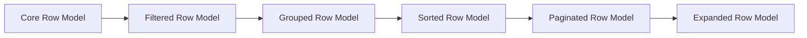

## TanStack Table with React

TanStack Table's React integration is the most mature and widely used adapter in the ecosystem. It provides a thin React-specific wrapper over the framework-agnostic core, exposing hooks and utilities that fit naturally into React's component model.

---

### Installation

Install the React-specific package alongside the core:

```bash
npm install @tanstack/react-table
```

The `@tanstack/react-table` package re-exports everything from `@tanstack/table-core` plus the React adapter layer. You do not need to install the core separately.

---

### Core Hook: `useReactTable`

The primary entry point for React integration is the `useReactTable` hook. It accepts a configuration object and returns a table instance.

```tsx
import {
  useReactTable,
  getCoreRowModel,
} from '@tanstack/react-table'

const table = useReactTable({
  data,
  columns,
  getCoreRowModel: getCoreRowModel(),
})
```

**Key Points:**
- `useReactTable` is a thin wrapper — it calls the framework-agnostic `createTable` factory internally
- The hook does not manage state by default; state must be provided externally or declared with `useState`
- Re-renders are triggered by React's normal diffing mechanism, not by the table instance itself [Inference: behavior may vary depending on memoization strategy]

---

### Defining Columns

Columns are defined using the `createColumnHelper` utility, which provides type inference for accessor-based and display columns.

```tsx
import { createColumnHelper } from '@tanstack/react-table'

type Person = {
  firstName: string
  lastName: string
  age: number
}

const columnHelper = createColumnHelper<Person>()

const columns = [
  columnHelper.accessor('firstName', {
    header: 'First Name',
    cell: info => info.getValue(),
  }),
  columnHelper.accessor('lastName', {
    header: 'Last Name',
  }),
  columnHelper.accessor('age', {
    header: 'Age',
  }),
]
```

Column types available via `createColumnHelper`:

| Method | Purpose |
|---|---|
| `.accessor()` | Binds to a data field; supports sorting, filtering |
| `.display()` | Non-data column (e.g., actions, checkboxes) |
| `.group()` | Groups multiple columns under a shared header |

---

### Rendering the Table

The table instance exposes methods for iterating headers and rows. All rendering is left entirely to your React components — TanStack Table ships no UI.

```tsx
function PersonTable({ data }: { data: Person[] }) {
  const table = useReactTable({
    data,
    columns,
    getCoreRowModel: getCoreRowModel(),
  })

  return (
    <table>
      <thead>
        {table.getHeaderGroups().map(headerGroup => (
          <tr key={headerGroup.id}>
            {headerGroup.headers.map(header => (
              <th key={header.id}>
                {header.isPlaceholder
                  ? null
                  : flexRender(header.column.columnDef.header, header.getContext())}
              </th>
            ))}
          </tr>
        ))}
      </thead>
      <tbody>
        {table.getRowModel().rows.map(row => (
          <tr key={row.id}>
            {row.getVisibleCells().map(cell => (
              <td key={cell.id}>
                {flexRender(cell.column.columnDef.cell, cell.getContext())}
              </td>
            ))}
          </tr>
        ))}
      </tbody>
    </table>
  )
}
```

**Key Points:**
- `flexRender` handles rendering of both static values and React components in column definitions
- `getHeaderGroups()` returns one or more groups to support multi-level headers
- `getRowModel().rows` reflects currently visible rows after sorting, filtering, and pagination are applied
- `getVisibleCells()` respects column visibility state

---

### State Management

TanStack Table separates state from the table instance. You can use fully controlled, partially controlled, or uncontrolled patterns.

#### Uncontrolled (Internal State)

```tsx
const table = useReactTable({
  data,
  columns,
  getCoreRowModel: getCoreRowModel(),
  // no state passed — table manages internally
})
```

[Inference: internal state is managed via `useReducer` or equivalent within the adapter; exact implementation may vary across versions]

#### Controlled State

```tsx
const [sorting, setSorting] = React.useState<SortingState>([])

const table = useReactTable({
  data,
  columns,
  state: { sorting },
  onSortingChange: setSorting,
  getCoreRowModel: getCoreRowModel(),
  getSortedRowModel: getSortedRowModel(),
})
```

Each feature (sorting, filtering, pagination, etc.) has a corresponding `state` key and `on[Feature]Change` handler. You supply both to opt into controlled mode for that feature.

#### Partial Control

You may control only the state slices you care about. Features not included in the `state` object fall back to internal management. [Inference: partial control is additive per feature; not confirmed for all edge cases]

---

### Built-in Feature Row Models

TanStack Table uses a pipeline of **row models** — pure functions that transform rows. Each feature requires its row model to be passed to `useReactTable`.

```tsx
import {
  getCoreRowModel,
  getSortedRowModel,
  getFilteredRowModel,
  getPaginationRowModel,
  getGroupedRowModel,
  getExpandedRowModel,
} from '@tanstack/react-table'

const table = useReactTable({
  data,
  columns,
  state: { sorting, columnFilters, pagination },
  onSortingChange: setSorting,
  onColumnFiltersChange: setColumnFilters,
  onPaginationChange: setPagination,
  getCoreRowModel: getCoreRowModel(),
  getSortedRowModel: getSortedRowModel(),
  getFilteredRowModel: getFilteredRowModel(),
  getPaginationRowModel: getPaginationRowModel(),
})
```

Row model pipeline (order matters):



**Key Points:**
- Including a row model opt-in enables that feature's computation
- Omitting a row model disables that feature entirely — no sorting or filtering occurs unless the corresponding model is passed
- The pipeline order is fixed internally; the order you pass options does not change execution order [Inference]

---

### Sorting

```tsx
const [sorting, setSorting] = React.useState<SortingState>([])

const table = useReactTable({
  data,
  columns,
  state: { sorting },
  onSortingChange: setSorting,
  getCoreRowModel: getCoreRowModel(),
  getSortedRowModel: getSortedRowModel(),
})
```

Attach sort toggle to a header:

```tsx
<th
  onClick={header.column.getToggleSortingHandler()}
  style={{ cursor: 'pointer' }}
>
  {flexRender(header.column.columnDef.header, header.getContext())}
  {header.column.getIsSorted() === 'asc' ? ' ↑' : ''}
  {header.column.getIsSorted() === 'desc' ? ' ↓' : ''}
</th>
```

**Key Points:**
- `getToggleSortingHandler()` cycles through: unsorted → ascending → descending
- Multi-sort is supported via shift-click by default; configure with `enableMultiSort`
- Custom sort functions can be provided per column via `sortingFn`

---

### Column Filtering

```tsx
const [columnFilters, setColumnFilters] = React.useState<ColumnFiltersState>([])

const table = useReactTable({
  data,
  columns,
  state: { columnFilters },
  onColumnFiltersChange: setColumnFilters,
  getCoreRowModel: getCoreRowModel(),
  getFilteredRowModel: getFilteredRowModel(),
})
```

Render a filter input per column:

```tsx
<input
  value={(table.getColumn('firstName')?.getFilterValue() as string) ?? ''}
  onChange={e =>
    table.getColumn('firstName')?.setFilterValue(e.target.value)
  }
  placeholder="Filter first name..."
/>
```

**Key Points:**
- `getFilterValue()` / `setFilterValue()` are per-column APIs
- Built-in filter functions include `includesString`, `equalsString`, `inNumberRange`, and others
- Custom filter functions are accepted via the `filterFn` column option

---

### Global Filtering

```tsx
const [globalFilter, setGlobalFilter] = React.useState('')

const table = useReactTable({
  data,
  columns,
  state: { globalFilter },
  onGlobalFilterChange: setGlobalFilter,
  getCoreRowModel: getCoreRowModel(),
  getFilteredRowModel: getFilteredRowModel(),
})
```

```tsx
<input
  value={globalFilter}
  onChange={e => setGlobalFilter(e.target.value)}
  placeholder="Search all columns..."
/>
```

Global filtering and column filtering can be used simultaneously.

---

### Pagination

```tsx
const [pagination, setPagination] = React.useState<PaginationState>({
  pageIndex: 0,
  pageSize: 10,
})

const table = useReactTable({
  data,
  columns,
  state: { pagination },
  onPaginationChange: setPagination,
  getCoreRowModel: getCoreRowModel(),
  getPaginationRowModel: getPaginationRowModel(),
})
```

Pagination controls:

```tsx
<button onClick={() => table.previousPage()} disabled={!table.getCanPreviousPage()}>
  Previous
</button>
<span>
  Page {table.getState().pagination.pageIndex + 1} of {table.getPageCount()}
</span>
<button onClick={() => table.nextPage()} disabled={!table.getCanNextPage()}>
  Next
</button>
```

**Key Points:**
- `pageIndex` is zero-based
- `getPaginationRowModel` slices the already-filtered and sorted rows — it operates at the end of the pipeline
- For server-side pagination, set `manualPagination: true` and provide `rowCount`

---

### Server-Side Data (Manual Modes)

For server-driven sorting, filtering, and pagination, set the corresponding `manual*` flag:

```tsx
const table = useReactTable({
  data,             // data for the current page only
  columns,
  rowCount: serverTotalRowCount,
  state: { sorting, columnFilters, pagination },
  onSortingChange: setSorting,
  onColumnFiltersChange: setColumnFilters,
  onPaginationChange: setPagination,
  manualSorting: true,
  manualFiltering: true,
  manualPagination: true,
  getCoreRowModel: getCoreRowModel(),
})
```

When manual modes are active, TanStack Table skips client-side computation for those features. Your state change handlers are responsible for triggering the server fetch. [Inference: the table instance still exposes all APIs; only the row model computation is bypassed]

---

### Column Visibility

```tsx
const [columnVisibility, setColumnVisibility] = React.useState<VisibilityState>({})

const table = useReactTable({
  data,
  columns,
  state: { columnVisibility },
  onColumnVisibilityChange: setColumnVisibility,
  getCoreRowModel: getCoreRowModel(),
})
```

Toggle visibility:

```tsx
{table.getAllLeafColumns().map(column => (
  <label key={column.id}>
    <input
      type="checkbox"
      checked={column.getIsVisible()}
      onChange={column.getToggleVisibilityHandler()}
    />
    {column.id}
  </label>
))}
```

---

### Column Pinning

```tsx
const [columnPinning, setColumnPinning] = React.useState<ColumnPinningState>({
  left: ['firstName'],
  right: ['actions'],
})

const table = useReactTable({
  data,
  columns,
  state: { columnPinning },
  onColumnPinningChange: setColumnPinning,
  getCoreRowModel: getCoreRowModel(),
})
```

**Key Points:**
- Pinned columns are accessible via `table.getLeftVisibleLeafColumns()`, `table.getCenterVisibleLeafColumns()`, and `table.getRightVisibleLeafColumns()`
- Actual sticky CSS positioning is the responsibility of your styles — TanStack Table provides data, not layout

---

### Row Selection

```tsx
const [rowSelection, setRowSelection] = React.useState<RowSelectionState>({})

const table = useReactTable({
  data,
  columns,
  state: { rowSelection },
  onRowSelectionChange: setRowSelection,
  getCoreRowModel: getCoreRowModel(),
  enableRowSelection: true,
})
```

Add a checkbox column:

```tsx
columnHelper.display({
  id: 'select',
  header: ({ table }) => (
    <input
      type="checkbox"
      checked={table.getIsAllPageRowsSelected()}
      onChange={table.getToggleAllPageRowsSelectedHandler()}
    />
  ),
  cell: ({ row }) => (
    <input
      type="checkbox"
      checked={row.getIsSelected()}
      disabled={!row.getCanSelect()}
      onChange={row.getToggleSelectedHandler()}
    />
  ),
})
```

---

### Row Expansion

```tsx
const [expanded, setExpanded] = React.useState<ExpandedState>({})

const table = useReactTable({
  data,
  columns,
  state: { expanded },
  onExpandedChange: setExpanded,
  getSubRows: row => row.subRows,
  getCoreRowModel: getCoreRowModel(),
  getExpandedRowModel: getExpandedRowModel(),
})
```

**Key Points:**
- `getSubRows` is required to tell the table how to find nested rows
- Expanded rows appear inline in `getRowModel().rows` — no separate API call is needed
- For custom expanded content (detail panels), render conditionally based on `row.getIsExpanded()`

---

### Grouping and Aggregation

```tsx
import { getGroupedRowModel } from '@tanstack/react-table'

columnHelper.accessor('age', {
  aggregationFn: 'mean',
  aggregatedCell: ({ getValue }) => Math.round(getValue<number>()),
})

const table = useReactTable({
  data,
  columns,
  state: { grouping, expanded },
  onGroupingChange: setGrouping,
  onExpandedChange: setExpanded,
  getCoreRowModel: getCoreRowModel(),
  getGroupedRowModel: getGroupedRowModel(),
  getExpandedRowModel: getExpandedRowModel(),
})
```

Built-in aggregation functions include `sum`, `min`, `max`, `mean`, `median`, `unique`, `uniqueCount`, and `count`.

---

### Column Ordering and Resizing

#### Column Ordering

```tsx
const [columnOrder, setColumnOrder] = React.useState<ColumnOrderState>(
  columns.map(col => col.id as string)
)

const table = useReactTable({
  data,
  columns,
  state: { columnOrder },
  onColumnOrderChange: setColumnOrder,
  getCoreRowModel: getCoreRowModel(),
})
```

#### Column Resizing

```tsx
const table = useReactTable({
  data,
  columns,
  columnResizeMode: 'onChange', // or 'onEnd'
  getCoreRowModel: getCoreRowModel(),
})
```

Attach resize handle:

```tsx
<div
  onMouseDown={header.getResizeHandler()}
  onTouchStart={header.getResizeHandler()}
  className={`resizer ${header.column.getIsResizing() ? 'isResizing' : ''}`}
/>
```

Column widths are available via `header.getSize()` and `cell.column.getSize()`.

---

### Performance: Memoization

TanStack Table does not perform internal memoization of data or columns by default [Inference: confirmed in official documentation recommendations; may vary by version]. Passing unstable references on every render can cause unnecessary recomputation.

```tsx
// Memoize data and columns to avoid re-creating on every render
const data = React.useMemo(() => fetchedData, [fetchedData])
const columns = React.useMemo(() => [...columnDefs], [])

const table = useReactTable({ data, columns, ... })
```

**Key Points:**
- `React.useMemo` for both `data` and `columns` is the recommended pattern per official TanStack Table documentation
- Behavior without memoization may still be correct but could incur unnecessary work [Inference]
- For very large datasets, consider virtualizing rows using `@tanstack/react-virtual` alongside the table

---

### Virtualization with `@tanstack/react-virtual`

TanStack Table integrates naturally with TanStack Virtual for rendering large datasets:

```tsx
import { useVirtualizer } from '@tanstack/react-virtual'

const rows = table.getRowModel().rows
const parentRef = React.useRef<HTMLDivElement>(null)

const rowVirtualizer = useVirtualizer({
  count: rows.length,
  getScrollElement: () => parentRef.current,
  estimateSize: () => 35,
  overscan: 10,
})

return (
  <div ref={parentRef} style={{ height: '500px', overflow: 'auto' }}>
    <div style={{ height: `${rowVirtualizer.getTotalSize()}px`, position: 'relative' }}>
      {rowVirtualizer.getVirtualItems().map(virtualRow => {
        const row = rows[virtualRow.index]
        return (
          <tr
            key={row.id}
            style={{
              position: 'absolute',
              top: virtualRow.start,
              height: `${virtualRow.size}px`,
            }}
          >
            {row.getVisibleCells().map(cell => (
              <td key={cell.id}>
                {flexRender(cell.column.columnDef.cell, cell.getContext())}
              </td>
            ))}
          </tr>
        )
      })}
    </div>
  </div>
)
```

---

### Full Feature Example

A table combining sorting, filtering, and pagination:

```tsx
import React from 'react'
import {
  useReactTable,
  getCoreRowModel,
  getSortedRowModel,
  getFilteredRowModel,
  getPaginationRowModel,
  flexRender,
  createColumnHelper,
  type SortingState,
  type ColumnFiltersState,
  type PaginationState,
} from '@tanstack/react-table'

type User = { id: number; name: string; email: string; age: number }

const columnHelper = createColumnHelper<User>()

const columns = [
  columnHelper.accessor('name', { header: 'Name' }),
  columnHelper.accessor('email', { header: 'Email' }),
  columnHelper.accessor('age', { header: 'Age' }),
]

export function UserTable({ data }: { data: User[] }) {
  const [sorting, setSorting] = React.useState<SortingState>([])
  const [columnFilters, setColumnFilters] = React.useState<ColumnFiltersState>([])
  const [pagination, setPagination] = React.useState<PaginationState>({
    pageIndex: 0,
    pageSize: 5,
  })

  const table = useReactTable({
    data,
    columns,
    state: { sorting, columnFilters, pagination },
    onSortingChange: setSorting,
    onColumnFiltersChange: setColumnFilters,
    onPaginationChange: setPagination,
    getCoreRowModel: getCoreRowModel(),
    getSortedRowModel: getSortedRowModel(),
    getFilteredRowModel: getFilteredRowModel(),
    getPaginationRowModel: getPaginationRowModel(),
  })

  return (
    <div>
      <input
        value={(table.getColumn('name')?.getFilterValue() as string) ?? ''}
        onChange={e => table.getColumn('name')?.setFilterValue(e.target.value)}
        placeholder="Filter by name..."
      />
      <table>
        <thead>
          {table.getHeaderGroups().map(hg => (
            <tr key={hg.id}>
              {hg.headers.map(header => (
                <th key={header.id} onClick={header.column.getToggleSortingHandler()}>
                  {flexRender(header.column.columnDef.header, header.getContext())}
                  {header.column.getIsSorted() === 'asc' ? ' ↑' : header.column.getIsSorted() === 'desc' ? ' ↓' : ''}
                </th>
              ))}
            </tr>
          ))}
        </thead>
        <tbody>
          {table.getRowModel().rows.map(row => (
            <tr key={row.id}>
              {row.getVisibleCells().map(cell => (
                <td key={cell.id}>
                  {flexRender(cell.column.columnDef.cell, cell.getContext())}
                </td>
              ))}
            </tr>
          ))}
        </tbody>
      </table>
      <div>
        <button onClick={() => table.previousPage()} disabled={!table.getCanPreviousPage()}>Previous</button>
        <span>Page {table.getState().pagination.pageIndex + 1} of {table.getPageCount()}</span>
        <button onClick={() => table.nextPage()} disabled={!table.getCanNextPage()}>Next</button>
      </div>
    </div>
  )
}
```

---

### Architecture Overview

The following diagram illustrates the relationship between the framework-agnostic core, the React adapter, and your component layer:

<svg viewBox="0 0 700 340" xmlns="http://www.w3.org/2000/svg" font-family="monospace" font-size="13">
  <!-- Core layer -->
  <rect x="200" y="20" width="300" height="60" rx="8" fill="#1e293b" stroke="#38bdf8" stroke-width="1.5"/>
  <text x="350" y="46" text-anchor="middle" fill="#38bdf8" font-size="12" font-weight="bold">@tanstack/table-core</text>
  <text x="350" y="66" text-anchor="middle" fill="#94a3b8" font-size="11">createTable · row models · features</text>

  <!-- Adapter layer -->
  <rect x="200" y="130" width="300" height="60" rx="8" fill="#1e293b" stroke="#a78bfa" stroke-width="1.5"/>
  <text x="350" y="156" text-anchor="middle" fill="#a78bfa" font-size="12" font-weight="bold">@tanstack/react-table</text>
  <text x="350" y="176" text-anchor="middle" fill="#94a3b8" font-size="11">useReactTable · flexRender</text>

  <!-- Component layer -->
  <rect x="140" y="240" width="180" height="60" rx="8" fill="#1e293b" stroke="#34d399" stroke-width="1.5"/>
  <text x="230" y="266" text-anchor="middle" fill="#34d399" font-size="12" font-weight="bold">Your Components</text>
  <text x="230" y="286" text-anchor="middle" fill="#94a3b8" font-size="11">&lt;table&gt; · &lt;tr&gt; · &lt;td&gt;</text>

  <!-- State layer -->
  <rect x="380" y="240" width="180" height="60" rx="8" fill="#1e293b" stroke="#fb923c" stroke-width="1.5"/>
  <text x="470" y="266" text-anchor="middle" fill="#fb923c" font-size="12" font-weight="bold">React State</text>
  <text x="470" y="286" text-anchor="middle" fill="#94a3b8" font-size="11">useState · external stores</text>

  <!-- Arrows -->
  <line x1="350" y1="80" x2="350" y2="130" stroke="#64748b" stroke-width="1.5" marker-end="url(#arr)"/>
  <line x1="280" y1="190" x2="230" y2="240" stroke="#64748b" stroke-width="1.5" marker-end="url(#arr)"/>
  <line x1="420" y1="190" x2="470" y2="240" stroke="#64748b" stroke-width="1.5" marker-end="url(#arr)"/>

  <defs>
    <marker id="arr" markerWidth="8" markerHeight="8" refX="4" refY="4" orient="auto">
      <path d="M0,0 L0,8 L8,4 z" fill="#64748b"/>
    </marker>
  </defs>
</svg>

---

### Key Behavioral Notes

- TanStack Table does not render any DOM — all markup is your responsibility
- The table instance is stable across renders if inputs are memoized; it is a plain object, not a React component [Inference]
- `flexRender` accepts either a React component or a plain value; it handles both cases uniformly
- Column definitions support `meta` for custom typed metadata accessible in cell renderers
- The `table` object returned by `useReactTable` exposes the full API surface of the core, plus React-specific helpers

---

**Related Topics**

- TanStack Table with Vue
- TanStack Table with Svelte
- TanStack Table with Angular
- TanStack Table with Solid
- Custom Cell Renderers and Column Meta
- Server-Side Sorting, Filtering, and Pagination
- Row Virtualization with `@tanstack/react-virtual`
- TanStack Table with React Query (data fetching integration)
- Headless UI Patterns for Accessible Tables
- Column Pinning and Frozen Columns Deep Dive
- Faceted Filtering and Dynamic Filter UI