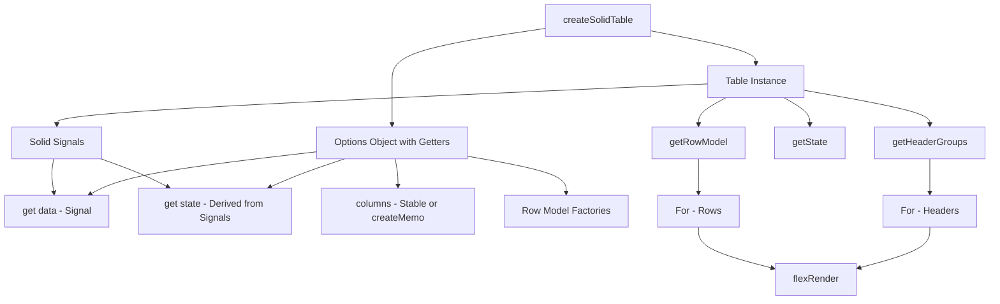

## TanStack Table with Solid

TanStack Table's headless architecture integrates with Solid's fine-grained reactivity system. The Solid adapter wraps the core table logic in Solid primitives — signals, stores, and reactive accessors — giving you a fully reactive table without virtual DOM diffing overhead.

---

### Installation

```bash
npm install @tanstack/solid-table
```

Peer dependencies: `solid-js` >= 1.0.0.

---

### Core Concepts in the Solid Adapter

Solid's reactivity model differs fundamentally from React's. There is no re-render cycle; instead, fine-grained signals update only the DOM nodes that depend on them. TanStack Table's Solid adapter is built around this model.

**Key Points:**
- `createSolidTable` is the Solid-specific factory (analogous to `useReactTable` in React)
- Table state is managed via Solid signals internally
- Accessor functions returned by the table (e.g., `table.getHeaderGroups()`) are reactive — calling them inside a JSX expression or a `createEffect` tracks dependencies automatically
- Column definitions and data should be stable references or wrapped in signals/memos to avoid unnecessary recomputation [Inference: based on Solid's reactive tracking semantics; actual behavior may vary]

---

### Basic Setup

```tsx
import {
  createSolidTable,
  getCoreRowModel,
  flexRender,
  type ColumnDef,
} from '@tanstack/solid-table'
import { createSignal, For } from 'solid-js'

type Person = {
  id: number
  name: string
  age: number
  email: string
}

const defaultData: Person[] = [
  { id: 1, name: 'Alice', age: 30, email: 'alice@example.com' },
  { id: 2, name: 'Bob', age: 25, email: 'bob@example.com' },
  { id: 3, name: 'Carol', age: 35, email: 'carol@example.com' },
]

const columns: ColumnDef<Person>[] = [
  {
    accessorKey: 'name',
    header: 'Name',
  },
  {
    accessorKey: 'age',
    header: 'Age',
  },
  {
    accessorKey: 'email',
    header: 'Email',
  },
]

function App() {
  const [data] = createSignal(defaultData)

  const table = createSolidTable({
    get data() { return data() },
    columns,
    getCoreRowModel: getCoreRowModel(),
  })

  return (
    <table>
      <thead>
        <For each={table.getHeaderGroups()}>
          {headerGroup => (
            <tr>
              <For each={headerGroup.headers}>
                {header => (
                  <th>
                    {flexRender(
                      header.column.columnDef.header,
                      header.getContext()
                    )}
                  </th>
                )}
              </For>
            </tr>
          )}
        </For>
      </thead>
      <tbody>
        <For each={table.getRowModel().rows}>
          {row => (
            <tr>
              <For each={row.getVisibleCells()}>
                {cell => (
                  <td>
                    {flexRender(
                      cell.column.columnDef.cell,
                      cell.getContext()
                    )}
                  </td>
                )}
              </For>
            </tr>
          )}
        </For>
      </tbody>
    </table>
  )
}
```

**Key Points:**
- The `get data()` getter syntax inside the options object is the idiomatic Solid pattern for passing reactive values. It defers evaluation so the table tracks the signal reactively. Passing `data()` directly (eagerly) would break reactivity. [Inference: consistent with Solid's lazy getter convention; verify against adapter source if behavior is critical]
- `columns` is defined outside the component. Because column definitions are stable (non-reactive), they don't need to be wrapped in a signal.
- `<For>` is used instead of `.map()` because Solid's `<For>` is keyed and reactive — it reuses DOM nodes when items shift, avoiding full list teardown. Using `.map()` in Solid JSX works but loses this optimization.

---

### Reactive Data Updates

Because `data` is a signal, updating it causes the table to reflect changes automatically.

```tsx
function App() {
  const [data, setData] = createSignal(defaultData)

  const table = createSolidTable({
    get data() { return data() },
    columns,
    getCoreRowModel: getCoreRowModel(),
  })

  const addRow = () => {
    setData(prev => [
      ...prev,
      { id: Date.now(), name: 'New User', age: 0, email: '' },
    ])
  }

  return (
    <>
      <button onClick={addRow}>Add Row</button>
      {/* table JSX */}
    </>
  )
}
```

No manual invalidation or effect wiring is needed. The table's row model recomputes when `data()` changes because the getter is tracked.

---

### Managed vs. Unmanaged State

TanStack Table supports two state modes. Both work in Solid, but the patterns differ.

#### Unmanaged (Internal) State

The table manages state internally. You don't hold the state in your own signals.

```tsx
const table = createSolidTable({
  get data() { return data() },
  columns,
  getCoreRowModel: getCoreRowModel(),
  // sorting, filtering etc. handled internally
  getSortedRowModel: getSortedRowModel(),
})
```

This is the simplest setup. You can still read state via `table.getState()`.

#### Managed (Controlled) State

You own the state in Solid signals and pass it back into the table.

```tsx
import { createSortingState } from '@tanstack/solid-table' // not a real import — see note
import { createSignal } from 'solid-js'
import {
  createSolidTable,
  getCoreRowModel,
  getSortedRowModel,
  type SortingState,
} from '@tanstack/solid-table'

function App() {
  const [data] = createSignal(defaultData)
  const [sorting, setSorting] = createSignal<SortingState>([])

  const table = createSolidTable({
    get data() { return data() },
    columns,
    getCoreRowModel: getCoreRowModel(),
    getSortedRowModel: getSortedRowModel(),
    get state() {
      return { sorting: sorting() }
    },
    onSortingChange: updater => {
      setSorting(prev =>
        typeof updater === 'function' ? updater(prev) : updater
      )
    },
  })

  return (/* table JSX */)
}
```

**Key Points:**
- `get state()` uses the same getter pattern so the table tracks the signal.
- `onSortingChange` receives either a new value or an updater function (TanStack Table's functional update pattern). Always handle both forms.
- Controlled state is required when state needs to be persisted (URL, localStorage), shared across components, or driven by external logic.

---

### Sorting

```tsx
import {
  createSolidTable,
  getCoreRowModel,
  getSortedRowModel,
  type SortingState,
} from '@tanstack/solid-table'

function SortableTable() {
  const [data] = createSignal(defaultData)
  const [sorting, setSorting] = createSignal<SortingState>([])

  const table = createSolidTable({
    get data() { return data() },
    columns: [
      { accessorKey: 'name', header: 'Name', enableSorting: true },
      { accessorKey: 'age',  header: 'Age',  enableSorting: true },
      { accessorKey: 'email', header: 'Email' },
    ],
    getCoreRowModel: getCoreRowModel(),
    getSortedRowModel: getSortedRowModel(),
    get state() { return { sorting: sorting() } },
    onSortingChange: u => setSorting(p => typeof u === 'function' ? u(p) : u),
  })

  return (
    <table>
      <thead>
        <For each={table.getHeaderGroups()}>
          {headerGroup => (
            <tr>
              <For each={headerGroup.headers}>
                {header => (
                  <th onClick={header.column.getToggleSortingHandler()}>
                    {flexRender(header.column.columnDef.header, header.getContext())}
                    {' '}
                    {{
                      asc: '▲',
                      desc: '▼',
                    }[header.column.getIsSorted() as string] ?? ''}
                  </th>
                )}
              </For>
            </tr>
          )}
        </For>
      </thead>
      <tbody>
        <For each={table.getRowModel().rows}>
          {row => (
            <tr>
              <For each={row.getVisibleCells()}>
                {cell => (
                  <td>{flexRender(cell.column.columnDef.cell, cell.getContext())}</td>
                )}
              </For>
            </tr>
          )}
        </For>
      </tbody>
    </table>
  )
}
```

---

### Column Filtering

```tsx
import {
  createSolidTable,
  getCoreRowModel,
  getFilteredRowModel,
  type ColumnFiltersState,
} from '@tanstack/solid-table'

function FilterableTable() {
  const [data] = createSignal(defaultData)
  const [columnFilters, setColumnFilters] = createSignal<ColumnFiltersState>([])

  const table = createSolidTable({
    get data() { return data() },
    columns,
    getCoreRowModel: getCoreRowModel(),
    getFilteredRowModel: getFilteredRowModel(),
    get state() { return { columnFilters: columnFilters() } },
    onColumnFiltersChange: u =>
      setColumnFilters(p => typeof u === 'function' ? u(p) : u),
  })

  return (
    <>
      <input
        placeholder="Filter by name…"
        onInput={e =>
          table.getColumn('name')?.setFilterValue(e.currentTarget.value)
        }
      />
      {/* table JSX */}
    </>
  )
}
```

**Key Points:**
- `getFilteredRowModel` must be imported and passed in the options; otherwise filtering has no effect.
- `setFilterValue` is a convenience method on the column instance. It internally calls `onColumnFiltersChange`.

---

### Global Filtering

```tsx
import {
  createSolidTable,
  getCoreRowModel,
  getFilteredRowModel,
} from '@tanstack/solid-table'

function GlobalFilterTable() {
  const [data] = createSignal(defaultData)
  const [globalFilter, setGlobalFilter] = createSignal('')

  const table = createSolidTable({
    get data() { return data() },
    columns,
    getCoreRowModel: getCoreRowModel(),
    getFilteredRowModel: getFilteredRowModel(),
    get state() { return { globalFilter: globalFilter() } },
    onGlobalFilterChange: u =>
      setGlobalFilter(p => typeof u === 'function' ? u(p) : u),
  })

  return (
    <>
      <input
        value={globalFilter()}
        onInput={e => setGlobalFilter(e.currentTarget.value)}
        placeholder="Search all columns…"
      />
      {/* table JSX */}
    </>
  )
}
```

---

### Pagination

```tsx
import {
  createSolidTable,
  getCoreRowModel,
  getPaginationRowModel,
  type PaginationState,
} from '@tanstack/solid-table'

function PaginatedTable() {
  const [data] = createSignal(defaultData)
  const [pagination, setPagination] = createSignal<PaginationState>({
    pageIndex: 0,
    pageSize: 10,
  })

  const table = createSolidTable({
    get data() { return data() },
    columns,
    getCoreRowModel: getCoreRowModel(),
    getPaginationRowModel: getPaginationRowModel(),
    get state() { return { pagination: pagination() } },
    onPaginationChange: u =>
      setPagination(p => typeof u === 'function' ? u(p) : u),
  })

  return (
    <>
      {/* table JSX */}
      <div>
        <button
          onClick={() => table.previousPage()}
          disabled={!table.getCanPreviousPage()}
        >
          Previous
        </button>
        <span>
          Page {table.getState().pagination.pageIndex + 1} of{' '}
          {table.getPageCount()}
        </span>
        <button
          onClick={() => table.nextPage()}
          disabled={!table.getCanNextPage()}
        >
          Next
        </button>
        <select
          value={pagination().pageSize}
          onChange={e =>
            table.setPageSize(Number(e.currentTarget.value))
          }
        >
          <For each={[5, 10, 20, 50]}>
            {size => <option value={size}>{size}</option>}
          </For>
        </select>
      </div>
    </>
  )
}
```

---

### Row Selection

```tsx
import {
  createSolidTable,
  getCoreRowModel,
  type RowSelectionState,
} from '@tanstack/solid-table'

function SelectableTable() {
  const [data] = createSignal(defaultData)
  const [rowSelection, setRowSelection] = createSignal<RowSelectionState>({})

  const columns: ColumnDef<Person>[] = [
    {
      id: 'select',
      header: ({ table }) => (
        <input
          type="checkbox"
          checked={table.getIsAllPageRowsSelected()}
          indeterminate={table.getIsSomePageRowsSelected()}
          onChange={table.getToggleAllPageRowsSelectedHandler()}
        />
      ),
      cell: ({ row }) => (
        <input
          type="checkbox"
          checked={row.getIsSelected()}
          disabled={!row.getCanSelect()}
          onChange={row.getToggleSelectedHandler()}
        />
      ),
    },
    { accessorKey: 'name', header: 'Name' },
    { accessorKey: 'age',  header: 'Age' },
  ]

  const table = createSolidTable({
    get data() { return data() },
    columns,
    getCoreRowModel: getCoreRowModel(),
    enableRowSelection: true,
    get state() { return { rowSelection: rowSelection() } },
    onRowSelectionChange: u =>
      setRowSelection(p => typeof u === 'function' ? u(p) : u),
  })

  return (
    <>
      {/* table JSX */}
      <div>
        Selected rows:{' '}
        {Object.keys(rowSelection()).length}
      </div>
    </>
  )
}
```

**Key Points:**
- `enableRowSelection` can also accept a function `(row) => boolean` for conditional row selectability.
- `indeterminate` is a DOM property, not an HTML attribute — in Solid JSX it can be set via `ref` if the attribute binding doesn't apply it correctly on all browsers. [Inference: known issue in some JSX environments; test in target browsers]

---

### Column Visibility

```tsx
import { createSignal } from 'solid-js'
import {
  createSolidTable,
  getCoreRowModel,
  type VisibilityState,
} from '@tanstack/solid-table'

function VisibilityTable() {
  const [data] = createSignal(defaultData)
  const [columnVisibility, setColumnVisibility] = createSignal<VisibilityState>({})

  const table = createSolidTable({
    get data() { return data() },
    columns,
    getCoreRowModel: getCoreRowModel(),
    get state() { return { columnVisibility: columnVisibility() } },
    onColumnVisibilityChange: u =>
      setColumnVisibility(p => typeof u === 'function' ? u(p) : u),
  })

  return (
    <>
      <div>
        <For each={table.getAllLeafColumns()}>
          {column => (
            <label>
              <input
                type="checkbox"
                checked={column.getIsVisible()}
                onChange={column.getToggleVisibilityHandler()}
              />
              {column.id}
            </label>
          )}
        </For>
      </div>
      {/* table JSX */}
    </>
  )
}
```

---

### Column Pinning

Column pinning allows columns to be fixed to the left or right side of the table.

```tsx
import {
  createSolidTable,
  getCoreRowModel,
  type ColumnPinningState,
} from '@tanstack/solid-table'

function PinnedTable() {
  const [data] = createSignal(defaultData)
  const [columnPinning, setColumnPinning] = createSignal<ColumnPinningState>({
    left: ['name'],
    right: [],
  })

  const table = createSolidTable({
    get data() { return data() },
    columns,
    getCoreRowModel: getCoreRowModel(),
    get state() { return { columnPinning: columnPinning() } },
    onColumnPinningChange: u =>
      setColumnPinning(p => typeof u === 'function' ? u(p) : u),
  })

  // Retrieve pinned and center column groups separately
  const leftCols  = () => table.getLeftLeafColumns()
  const centerCols = () => table.getCenterLeafColumns()
  const rightCols  = () => table.getRightLeafColumns()

  return (/* render with separate sections for left/center/right */)
}
```

**Key Points:**
- `getLeftLeafColumns()`, `getCenterLeafColumns()`, `getRightLeafColumns()` let you render each pinned section independently.
- Actual visual pinning (sticky positioning) requires CSS — the table API only tracks state; it does not apply styles. [Inference: standard TanStack Table behavior; confirm against docs]

---

### Column Ordering

```tsx
import {
  createSolidTable,
  getCoreRowModel,
  type ColumnOrderState,
} from '@tanstack/solid-table'

function OrderedTable() {
  const [data] = createSignal(defaultData)
  const [columnOrder, setColumnOrder] = createSignal<ColumnOrderState>(
    ['name', 'age', 'email']
  )

  const table = createSolidTable({
    get data() { return data() },
    columns,
    getCoreRowModel: getCoreRowModel(),
    get state() { return { columnOrder: columnOrder() } },
    onColumnOrderChange: u =>
      setColumnOrder(p => typeof u === 'function' ? u(p) : u),
  })

  const shuffleColumns = () => {
    setColumnOrder(prev => [...prev].sort(() => Math.random() - 0.5))
  }

  return (
    <>
      <button onClick={shuffleColumns}>Shuffle Columns</button>
      {/* table JSX */}
    </>
  )
}
```

---

### Column Resizing

```tsx
import {
  createSolidTable,
  getCoreRowModel,
  type ColumnSizingState,
} from '@tanstack/solid-table'

function ResizableTable() {
  const [data] = createSignal(defaultData)

  const table = createSolidTable({
    get data() { return data() },
    columns,
    getCoreRowModel: getCoreRowModel(),
    enableColumnResizing: true,
    columnResizeMode: 'onChange', // or 'onEnd'
  })

  return (
    <table style={{ width: table.getTotalSize() + 'px' }}>
      <thead>
        <For each={table.getHeaderGroups()}>
          {headerGroup => (
            <tr>
              <For each={headerGroup.headers}>
                {header => (
                  <th style={{ width: header.getSize() + 'px', position: 'relative' }}>
                    {flexRender(header.column.columnDef.header, header.getContext())}
                    <div
                      onMouseDown={header.getResizeHandler()}
                      onTouchStart={header.getResizeHandler()}
                      style={{
                        position: 'absolute',
                        right: 0,
                        top: 0,
                        height: '100%',
                        width: '4px',
                        cursor: 'col-resize',
                        background: header.column.getIsResizing() ? 'blue' : 'transparent',
                      }}
                    />
                  </th>
                )}
              </For>
            </tr>
          )}
        </For>
      </thead>
      {/* tbody */}
    </table>
  )
}
```

**Key Points:**
- `columnResizeMode: 'onChange'` updates column sizes on every mouse move. `'onEnd'` updates only when the drag finishes. [Inference: performance tradeoff; `'onEnd'` may be preferable for large tables, but actual impact depends on implementation]
- `header.getResizeHandler()` returns a unified handler for both mouse and touch. Pass it to both `onMouseDown` and `onTouchStart`.

---

### Grouping and Aggregation

```tsx
import {
  createSolidTable,
  getCoreRowModel,
  getGroupedRowModel,
  getExpandedRowModel,
  type GroupingState,
  type ExpandedState,
} from '@tanstack/solid-table'

type SalesRow = {
  region: string
  product: string
  revenue: number
}

const salesData: SalesRow[] = [
  { region: 'North', product: 'A', revenue: 100 },
  { region: 'North', product: 'B', revenue: 200 },
  { region: 'South', product: 'A', revenue: 150 },
  { region: 'South', product: 'B', revenue: 300 },
]

function GroupedTable() {
  const [data] = createSignal(salesData)
  const [grouping, setGrouping] = createSignal<GroupingState>([])
  const [expanded, setExpanded] = createSignal<ExpandedState>({})

  const columns: ColumnDef<SalesRow>[] = [
    { accessorKey: 'region',  header: 'Region' },
    { accessorKey: 'product', header: 'Product' },
    {
      accessorKey: 'revenue',
      header: 'Revenue',
      aggregationFn: 'sum',
      aggregatedCell: ({ getValue }) => `$${getValue<number>()}`,
    },
  ]

  const table = createSolidTable({
    get data() { return data() },
    columns,
    getCoreRowModel: getCoreRowModel(),
    getGroupedRowModel: getGroupedRowModel(),
    getExpandedRowModel: getExpandedRowModel(),
    get state() { return { grouping: grouping(), expanded: expanded() } },
    onGroupingChange: u => setGrouping(p => typeof u === 'function' ? u(p) : u),
    onExpandedChange: u => setExpanded(p => typeof u === 'function' ? u(p) : u),
  })

  return (/* table JSX with row.getIsGrouped() check */)
}
```

---

### Virtualization with `@tanstack/solid-virtual`

For large datasets, pair TanStack Table with TanStack Virtual's Solid adapter.

```tsx
import { createVirtualizer } from '@tanstack/solid-virtual'
import { createSignal } from 'solid-js'

function VirtualTable() {
  let tableContainerRef: HTMLDivElement | undefined

  const [data] = createSignal(Array.from({ length: 10_000 }, (_, i) => ({
    id: i,
    name: `User ${i}`,
    age: 20 + (i % 50),
    email: `user${i}@example.com`,
  })))

  const table = createSolidTable({
    get data() { return data() },
    columns,
    getCoreRowModel: getCoreRowModel(),
  })

  const rowVirtualizer = createVirtualizer({
    get count() { return table.getRowModel().rows.length },
    getScrollElement: () => tableContainerRef ?? null,
    estimateSize: () => 35,
    overscan: 10,
  })

  return (
    <div
      ref={tableContainerRef}
      style={{ height: '500px', overflow: 'auto' }}
    >
      <table>
        <thead>{/* headers */}</thead>
        <tbody
          style={{
            height: `${rowVirtualizer.getTotalSize()}px`,
            position: 'relative',
          }}
        >
          <For each={rowVirtualizer.getVirtualItems()}>
            {virtualRow => {
              const row = table.getRowModel().rows[virtualRow.index]
              return (
                <tr
                  style={{
                    position: 'absolute',
                    top: `${virtualRow.start}px`,
                    width: '100%',
                  }}
                >
                  <For each={row.getVisibleCells()}>
                    {cell => (
                      <td>
                        {flexRender(cell.column.columnDef.cell, cell.getContext())}
                      </td>
                    )}
                  </For>
                </tr>
              )
            }}
          </For>
        </tbody>
      </table>
    </div>
  )
}
```

**Key Points:**
- `createVirtualizer` uses the same getter pattern (`get count()`) for reactivity.
- Only visible rows are rendered in the DOM. The `tbody` is given an explicit height equal to the total virtual size so the scrollbar reflects the full dataset.
- This pattern is sometimes called "windowed rendering." [Unverified: exact naming conventions vary by source]

---

### Column Definitions — Custom Cell Renderers

```tsx
const columns: ColumnDef<Person>[] = [
  {
    accessorKey: 'name',
    header: 'Name',
    cell: info => (
      <strong>{info.getValue<string>()}</strong>
    ),
  },
  {
    accessorKey: 'age',
    header: 'Age',
    cell: info => {
      const age = info.getValue<number>()
      return (
        <span style={{ color: age >= 30 ? 'red' : 'green' }}>
          {age}
        </span>
      )
    },
  },
  {
    id: 'actions',
    header: 'Actions',
    cell: ({ row }) => (
      <button onClick={() => console.log('Row data:', row.original)}>
        View
      </button>
    ),
  },
]
```

---

### Accessor Functions vs. Accessor Keys

```tsx
const columns: ColumnDef<Person>[] = [
  // accessorKey — string path into row data
  { accessorKey: 'name', header: 'Name' },

  // accessorFn — custom extraction function
  {
    id: 'fullInfo',
    accessorFn: row => `${row.name} (${row.age})`,
    header: 'Info',
  },
]
```

**Key Points:**
- When using `accessorFn`, an explicit `id` is required because there is no key to infer it from.
- `accessorFn` receives the full row object, allowing computed or derived values.

---

### Solid-Specific Reactivity Patterns

#### Deriving from Table State with `createMemo`

```tsx
import { createMemo } from 'solid-js'

const selectedRows = createMemo(() =>
  table.getSelectedRowModel().rows.map(r => r.original)
)

// selectedRows() is a stable derived value that only recomputes when selection changes
```

#### Watching Table State with `createEffect`

```tsx
import { createEffect } from 'solid-js'

createEffect(() => {
  const state = table.getState()
  console.log('Sorting changed:', state.sorting)
  // Runs whenever sorting signal changes
})
```

**Key Points:**
- `createMemo` is preferable to recomputing values inline in JSX when the derivation is expensive. [Inference: consistent with Solid performance best practices]
- `createEffect` is appropriate for side effects like persistence or logging, not for deriving values used in the UI.

---

### Lazy Column Definitions with `createMemo`

If column definitions depend on reactive state (e.g., dynamic columns from a server), wrap them in `createMemo`:

```tsx
const columns = createMemo<ColumnDef<Person>[]>(() => {
  return dynamicFields().map(field => ({
    accessorKey: field.key,
    header: field.label,
  }))
})

const table = createSolidTable({
  get data() { return data() },
  get columns() { return columns() },
  getCoreRowModel: getCoreRowModel(),
})
```

**Key Points:**
- Columns that don't change should not be wrapped in `createMemo` — that introduces unnecessary reactive overhead. Only wrap when columns are derived from reactive state. [Inference: general Solid best practice; verify for specific use cases]

---

### Server-Side Operations

For server-side sorting, filtering, and pagination, disable the corresponding client-side row models and handle the operations externally.

```tsx
function ServerTable() {
  const [data, setData] = createSignal<Person[]>([])
  const [pageCount, setPageCount] = createSignal(0)
  const [pagination, setPagination] = createSignal<PaginationState>({
    pageIndex: 0,
    pageSize: 10,
  })
  const [sorting, setSorting] = createSignal<SortingState>([])

  createEffect(async () => {
    const { pageIndex, pageSize } = pagination()
    const sort = sorting()

    const response = await fetch(
      `/api/people?page=${pageIndex}&size=${pageSize}&sort=${JSON.stringify(sort)}`
    )
    const json = await response.json()
    setData(json.rows)
    setPageCount(json.pageCount)
  })

  const table = createSolidTable({
    get data() { return data() },
    columns,
    getCoreRowModel: getCoreRowModel(),
    // No getSortedRowModel or getPaginationRowModel — server handles these
    manualPagination: true,
    manualSorting: true,
    get pageCount() { return pageCount() },
    get state() { return { pagination: pagination(), sorting: sorting() } },
    onPaginationChange: u => setPagination(p => typeof u === 'function' ? u(p) : u),
    onSortingChange: u => setSorting(p => typeof u === 'function' ? u(p) : u),
  })

  return (/* table JSX */)
}
```

**Key Points:**
- `manualPagination: true` and `manualSorting: true` tell the table not to apply its own row transformations.
- The `createEffect` re-fires whenever `pagination()` or `sorting()` changes, fetching fresh data automatically.
- `pageCount` must also use a getter if it derives from a signal.

---

### Structural Diagram



---

### Common Pitfalls

| Pitfall | Problem | Fix |
|---|---|---|
| Passing `data()` eagerly | Breaks reactivity — value captured once at construction | Use `get data() { return data() }` |
| Using `.map()` instead of `<For>` | Solid re-creates all DOM nodes on array change | Use `<For each={...}>` |
| Forgetting `get state()` getter | State signal not tracked; table won't update | Wrap state in getter |
| Not handling updater function form in `onChange` | Crashes when TanStack passes a function | Always check `typeof updater === 'function'` |
| Wrapping stable columns in `createMemo` | Unnecessary reactive overhead | Only memoize if columns derive from signals |
| Inline `columns` array inside component without `createMemo` | New array reference every "render" cycle — [Inference: may cause issues depending on Solid version and internal table comparisons] | Define outside component or use `createMemo` |

---

**Related Topics:**
- TanStack Table with Vue
- TanStack Table with Angular
- TanStack Table — Virtualization (deep dive with `@tanstack/solid-virtual`)
- TanStack Table — Custom Filter Functions
- TanStack Table — Faceted Filters
- TanStack Table — Expanding Rows
- TanStack Table — Sub-rows and Tree Data
- TanStack Table — Editable Cells (inline editing pattern)
- TanStack Table — Column Sizing and `columnResizeMode`
- TanStack Query + TanStack Table (server-side integration with caching)