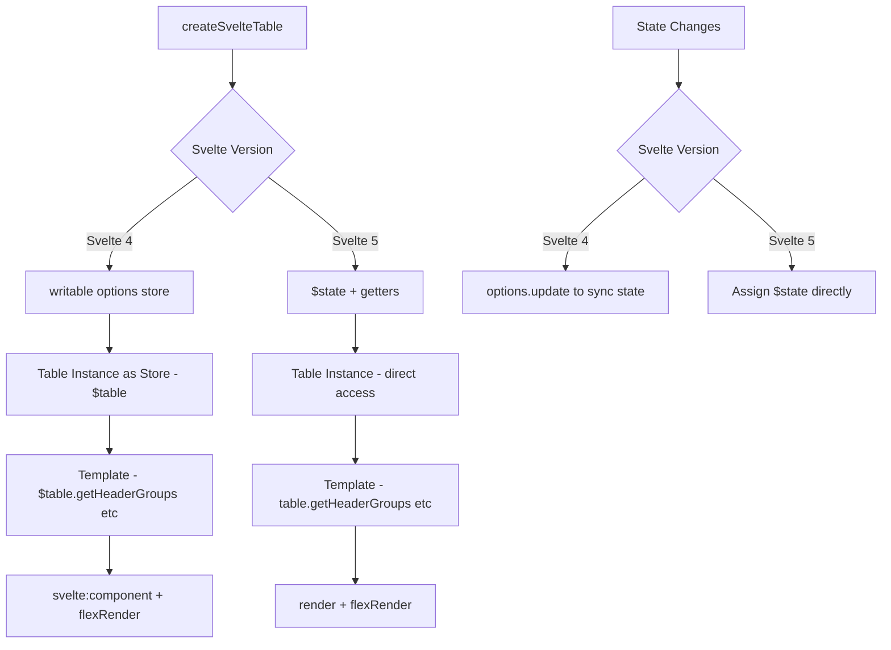

## TanStack Table with Svelte

TanStack Table provides a Svelte adapter that integrates with Svelte's reactivity system. The adapter exposes a `createSvelteTable` factory that returns a reactive table instance, with state management handled through Svelte stores or runes depending on which version of Svelte you are targeting.

---

### Version Note

TanStack Table v8 supports both Svelte 4 (store-based reactivity) and Svelte 5 (runes-based reactivity). The adapter and patterns differ between them. This document covers both, with sections labeled accordingly where they diverge.

---

### Installation

```bash
npm install @tanstack/svelte-table
```

Peer dependency: `svelte` >= 4.0.0.

---

### Core Concepts in the Svelte Adapter

**Key Points:**
- `createSvelteTable` is the Svelte-specific factory function
- In Svelte 4, the table instance is a Svelte store — you subscribe to it with `$table` syntax in templates
- In Svelte 5, the table instance works with runes (`$state`, `$derived`) for reactivity
- `flexRender` handles rendering of header and cell definitions, including components and functions
- Column definitions are plain objects and do not need to be reactive unless they derive from store/state values

---

### Svelte 4 — Basic Setup

```svelte
<script lang="ts">
  import {
    createSvelteTable,
    getCoreRowModel,
    flexRender,
    type ColumnDef,
    type TableOptions,
  } from '@tanstack/svelte-table'
  import { writable } from 'svelte/store'

  type Person = {
    id: number
    name: string
    age: number
    email: string
  }

  const defaultData: Person[] = [
    { id: 1, name: 'Alice', age: 30, email: 'alice@example.com' },
    { id: 2, name: 'Bob',   age: 25, email: 'bob@example.com' },
    { id: 3, name: 'Carol', age: 35, email: 'carol@example.com' },
  ]

  const columns: ColumnDef<Person>[] = [
    { accessorKey: 'name',  header: 'Name' },
    { accessorKey: 'age',   header: 'Age' },
    { accessorKey: 'email', header: 'Email' },
  ]

  const options = writable<TableOptions<Person>>({
    data: defaultData,
    columns,
    getCoreRowModel: getCoreRowModel(),
  })

  const table = createSvelteTable(options)
</script>

<table>
  <thead>
    {#each $table.getHeaderGroups() as headerGroup}
      <tr>
        {#each headerGroup.headers as header}
          <th>
            {#if !header.isPlaceholder}
              <svelte:component
                this={flexRender(header.column.columnDef.header, header.getContext())}
              />
            {/if}
          </th>
        {/each}
      </tr>
    {/each}
  </thead>
  <tbody>
    {#each $table.getRowModel().rows as row}
      <tr>
        {#each row.getVisibleCells() as cell}
          <td>
            <svelte:component
              this={flexRender(cell.column.columnDef.cell, cell.getContext())}
            />
          </td>
        {/each}
      </tr>
    {/each}
  </tbody>
</table>
```

**Key Points:**
- `createSvelteTable` accepts a Svelte `writable` store containing the table options. This is the primary mechanism for driving reactivity in Svelte 4.
- The table instance is itself a store — prefix with `$` in the template to auto-subscribe.
- `<svelte:component this={flexRender(...)} />` is the idiomatic Svelte 4 pattern for rendering dynamic components or primitive values from column definitions.
- `header.isPlaceholder` guards against rendering empty header cells in multi-level header groups.

---

### Svelte 4 — Reactive Data Updates

To update data reactively, update the `options` store:

```svelte
<script lang="ts">
  import { writable } from 'svelte/store'

  let data = [...defaultData]

  const options = writable({
    data,
    columns,
    getCoreRowModel: getCoreRowModel(),
  })

  function addRow() {
    data = [
      ...data,
      { id: Date.now(), name: 'New User', age: 0, email: '' },
    ]
    options.update(o => ({ ...o, data }))
  }
</script>

<button on:click={addRow}>Add Row</button>
```

**Key Points:**
- `options.update(o => ({ ...o, data }))` merges the new data into the existing options object. Replacing the entire store value with a new object also works.
- Mutating `data` in place without updating the store will not trigger reactivity.

---

### Svelte 4 — Managed State (Sorting)

State management in Svelte 4 uses the `options` store to feed state back into the table.

```svelte
<script lang="ts">
  import {
    createSvelteTable,
    getCoreRowModel,
    getSortedRowModel,
    flexRender,
    type SortingState,
    type TableOptions,
  } from '@tanstack/svelte-table'
  import { writable } from 'svelte/store'

  let sorting: SortingState = []

  const options = writable<TableOptions<Person>>({
    data: defaultData,
    columns,
    getCoreRowModel: getCoreRowModel(),
    getSortedRowModel: getSortedRowModel(),
    state: { sorting },
    onSortingChange: updater => {
      sorting = typeof updater === 'function' ? updater(sorting) : updater
      options.update(o => ({ ...o, state: { ...o.state, sorting } }))
    },
  })

  const table = createSvelteTable(options)
</script>

<thead>
  {#each $table.getHeaderGroups() as headerGroup}
    <tr>
      {#each headerGroup.headers as header}
        <th on:click={header.column.getToggleSortingHandler()}>
          <svelte:component
            this={flexRender(header.column.columnDef.header, header.getContext())}
          />
          {#if header.column.getIsSorted() === 'asc'}▲{/if}
          {#if header.column.getIsSorted() === 'desc'}▼{/if}
        </th>
      {/each}
    </tr>
  {/each}
</thead>
```

**Key Points:**
- `onSortingChange` receives either a new `SortingState` value or an updater function — always handle both forms.
- After computing the new state, call `options.update(...)` to push it back into the table. Without this, the table's internal state and your local variable diverge.
- `getSortedRowModel` must be included in the options; without it, sorting has no effect on the displayed rows.

---

### Svelte 4 — Column Filtering

```svelte
<script lang="ts">
  import {
    createSvelteTable,
    getCoreRowModel,
    getFilteredRowModel,
    type ColumnFiltersState,
  } from '@tanstack/svelte-table'
  import { writable } from 'svelte/store'

  let columnFilters: ColumnFiltersState = []

  const options = writable({
    data: defaultData,
    columns,
    getCoreRowModel: getCoreRowModel(),
    getFilteredRowModel: getFilteredRowModel(),
    state: { columnFilters },
    onColumnFiltersChange: updater => {
      columnFilters =
        typeof updater === 'function' ? updater(columnFilters) : updater
      options.update(o => ({
        ...o,
        state: { ...o.state, columnFilters },
      }))
    },
  })

  const table = createSvelteTable(options)
</script>

<input
  placeholder="Filter by name…"
  on:input={e =>
    $table.getColumn('name')?.setFilterValue(e.currentTarget.value)
  }
/>
```

---

### Svelte 4 — Pagination

```svelte
<script lang="ts">
  import {
    createSvelteTable,
    getCoreRowModel,
    getPaginationRowModel,
    type PaginationState,
  } from '@tanstack/svelte-table'
  import { writable } from 'svelte/store'

  let pagination: PaginationState = { pageIndex: 0, pageSize: 10 }

  const options = writable({
    data: defaultData,
    columns,
    getCoreRowModel: getCoreRowModel(),
    getPaginationRowModel: getPaginationRowModel(),
    state: { pagination },
    onPaginationChange: updater => {
      pagination =
        typeof updater === 'function' ? updater(pagination) : updater
      options.update(o => ({ ...o, state: { ...o.state, pagination } }))
    },
  })

  const table = createSvelteTable(options)
</script>

<button
  on:click={() => $table.previousPage()}
  disabled={!$table.getCanPreviousPage()}
>
  Previous
</button>
<span>
  Page {$table.getState().pagination.pageIndex + 1} of {$table.getPageCount()}
</span>
<button
  on:click={() => $table.nextPage()}
  disabled={!$table.getCanNextPage()}
>
  Next
</button>

<select
  value={pagination.pageSize}
  on:change={e => $table.setPageSize(Number(e.currentTarget.value))}
>
  {#each [5, 10, 20, 50] as size}
    <option value={size}>{size}</option>
  {/each}
</select>
```

---

### Svelte 4 — Row Selection

```svelte
<script lang="ts">
  import { type RowSelectionState, type ColumnDef } from '@tanstack/svelte-table'
  import { writable } from 'svelte/store'

  let rowSelection: RowSelectionState = {}

  const columns: ColumnDef<Person>[] = [
    {
      id: 'select',
      header: ({ table }) => ({
        // Returning a component or a render function
        // See "Rendering Components in Cells" section below
      }),
      cell: ({ row }) => row.getIsSelected(),
    },
    { accessorKey: 'name',  header: 'Name' },
    { accessorKey: 'age',   header: 'Age' },
  ]

  const options = writable({
    data: defaultData,
    columns,
    getCoreRowModel: getCoreRowModel(),
    enableRowSelection: true,
    state: { rowSelection },
    onRowSelectionChange: updater => {
      rowSelection =
        typeof updater === 'function' ? updater(rowSelection) : updater
      options.update(o => ({ ...o, state: { ...o.state, rowSelection } }))
    },
  })

  const table = createSvelteTable(options)
</script>
```

---

### Rendering Svelte Components in Cells

`flexRender` can render a Svelte component if you pass it directly as the `cell` or `header` value in a column definition.

```svelte
<!-- ActionCell.svelte -->
<script lang="ts">
  export let row: any
  export let getValue: () => any
</script>

<button on:click={() => console.log(row.original)}>
  View
</button>
```

```ts
// In your column definition
import ActionCell from './ActionCell.svelte'

const columns: ColumnDef<Person>[] = [
  {
    id: 'actions',
    header: 'Actions',
    cell: props => ({
      component: ActionCell,
      props: { row: props.row, getValue: props.getValue },
    }),
  },
]
```

```svelte
<!-- In the table template -->
<svelte:component this={flexRender(cell.column.columnDef.cell, cell.getContext())} />
```

**Key Points:**
- The exact API for passing Svelte components to `flexRender` may vary across minor versions of `@tanstack/svelte-table`. [Unverified: confirm against the installed version's documentation or source. Behavior is not guaranteed to be stable across adapter updates.]
- Alternatively, bypass `flexRender` entirely for cells where you always render a fixed Svelte component, and call the component directly in the template using the cell context.

---

### Svelte 5 — Runes-Based Setup

Svelte 5 replaces stores with runes. The `createSvelteTable` API adapts to this model.

```svelte
<script lang="ts">
  import {
    createSvelteTable,
    getCoreRowModel,
    flexRender,
    type ColumnDef,
  } from '@tanstack/svelte-table'

  type Person = {
    id: number
    name: string
    age: number
    email: string
  }

  let data = $state<Person[]>([
    { id: 1, name: 'Alice', age: 30, email: 'alice@example.com' },
    { id: 2, name: 'Bob',   age: 25, email: 'bob@example.com' },
  ])

  const columns: ColumnDef<Person>[] = [
    { accessorKey: 'name',  header: 'Name' },
    { accessorKey: 'age',   header: 'Age' },
    { accessorKey: 'email', header: 'Email' },
  ]

  const table = createSvelteTable({
    get data() { return data },
    columns,
    getCoreRowModel: getCoreRowModel(),
  })
</script>

<table>
  <thead>
    {#each table.getHeaderGroups() as headerGroup}
      <tr>
        {#each headerGroup.headers as header}
          <th>
            {@render flexRender(header.column.columnDef.header, header.getContext())}
          </th>
        {/each}
      </tr>
    {/each}
  </thead>
  <tbody>
    {#each table.getRowModel().rows as row}
      <tr>
        {#each row.getVisibleCells() as cell}
          <td>
            {@render flexRender(cell.column.columnDef.cell, cell.getContext())}
          </td>
        {/each}
      </tr>
    {/each}
  </tbody>
</table>
```

**Key Points:**
- In Svelte 5, `data` is declared with `$state` instead of a writable store.
- The `get data()` getter pattern (same as Solid) is used to pass reactive values lazily.
- `{@render ...}` replaces `<svelte:component this={...} />` in Svelte 5's snippet-based rendering model.
- The table instance is no longer a store — no `$table` prefix is needed. Access it directly.
- [Inference: Svelte 5 adapter support in `@tanstack/svelte-table` may require a specific minimum version; verify the changelog before upgrading.]

---

### Svelte 5 — Managed Sorting

```svelte
<script lang="ts">
  import {
    createSvelteTable,
    getCoreRowModel,
    getSortedRowModel,
    type SortingState,
  } from '@tanstack/svelte-table'

  let data = $state(defaultData)
  let sorting = $state<SortingState>([])

  const table = createSvelteTable({
    get data() { return data },
    columns,
    getCoreRowModel: getCoreRowModel(),
    getSortedRowModel: getSortedRowModel(),
    get state() { return { sorting } },
    onSortingChange: updater => {
      sorting = typeof updater === 'function' ? updater(sorting) : updater
    },
  })
</script>

<thead>
  {#each table.getHeaderGroups() as headerGroup}
    <tr>
      {#each headerGroup.headers as header}
        <th onclick={header.column.getToggleSortingHandler()}>
          {@render flexRender(header.column.columnDef.header, header.getContext())}
          {header.column.getIsSorted() === 'asc' ? '▲' : header.column.getIsSorted() === 'desc' ? '▼' : ''}
        </th>
      {/each}
    </tr>
  {/each}
</thead>
```

**Key Points:**
- `$state` variables are mutable and reactive — assigning to `sorting` directly inside `onSortingChange` is correct Svelte 5 idiom.
- In Svelte 5, event handlers use `onclick` (lowercase, no colon) instead of `on:click`.
- The `get state()` getter ensures the table tracks the `sorting` rune reactively.

---

### Svelte 5 — Pagination

```svelte
<script lang="ts">
  import {
    createSvelteTable,
    getCoreRowModel,
    getPaginationRowModel,
    type PaginationState,
  } from '@tanstack/svelte-table'

  let data = $state(defaultData)
  let pagination = $state<PaginationState>({ pageIndex: 0, pageSize: 10 })

  const table = createSvelteTable({
    get data() { return data },
    columns,
    getCoreRowModel: getCoreRowModel(),
    getPaginationRowModel: getPaginationRowModel(),
    get state() { return { pagination } },
    onPaginationChange: updater => {
      pagination =
        typeof updater === 'function' ? updater(pagination) : updater
    },
  })
</script>

<button onclick={() => table.previousPage()} disabled={!table.getCanPreviousPage()}>
  Previous
</button>
<span>
  Page {table.getState().pagination.pageIndex + 1} of {table.getPageCount()}
</span>
<button onclick={() => table.nextPage()} disabled={!table.getCanNextPage()}>
  Next
</button>
```

---

### Svelte 5 — Column Filtering

```svelte
<script lang="ts">
  import {
    createSvelteTable,
    getCoreRowModel,
    getFilteredRowModel,
    type ColumnFiltersState,
  } from '@tanstack/svelte-table'

  let data = $state(defaultData)
  let columnFilters = $state<ColumnFiltersState>([])

  const table = createSvelteTable({
    get data() { return data },
    columns,
    getCoreRowModel: getCoreRowModel(),
    getFilteredRowModel: getFilteredRowModel(),
    get state() { return { columnFilters } },
    onColumnFiltersChange: updater => {
      columnFilters =
        typeof updater === 'function' ? updater(columnFilters) : updater
    },
  })
</script>

<input
  placeholder="Filter by name…"
  oninput={e => table.getColumn('name')?.setFilterValue(e.currentTarget.value)}
/>
```

---

### Column Visibility

The pattern is identical between Svelte 4 and 5 except for state management syntax.

```svelte
<!-- Svelte 5 version -->
<script lang="ts">
  import { type VisibilityState } from '@tanstack/svelte-table'

  let columnVisibility = $state<VisibilityState>({})

  const table = createSvelteTable({
    get data() { return data },
    columns,
    getCoreRowModel: getCoreRowModel(),
    get state() { return { columnVisibility } },
    onColumnVisibilityChange: updater => {
      columnVisibility =
        typeof updater === 'function' ? updater(columnVisibility) : updater
    },
  })
</script>

{#each table.getAllLeafColumns() as column}
  <label>
    <input
      type="checkbox"
      checked={column.getIsVisible()}
      onchange={column.getToggleVisibilityHandler()}
    />
    {column.id}
  </label>
{/each}
```

---

### Column Resizing

```svelte
<script lang="ts">
  const table = createSvelteTable({
    get data() { return data },
    columns,
    getCoreRowModel: getCoreRowModel(),
    enableColumnResizing: true,
    columnResizeMode: 'onChange',
  })
</script>

<table style:width="{table.getTotalSize()}px">
  <thead>
    {#each table.getHeaderGroups() as headerGroup}
      <tr>
        {#each headerGroup.headers as header}
          <th style:width="{header.getSize()}px" style="position: relative;">
            {@render flexRender(header.column.columnDef.header, header.getContext())}
            <!-- svelte-ignore a11y-no-static-element-interactions -->
            <div
              onmousedown={header.getResizeHandler()}
              ontouchstart={header.getResizeHandler()}
              style="
                position: absolute; right: 0; top: 0; height: 100%; width: 4px;
                cursor: col-resize;
                background: {header.column.getIsResizing() ? 'blue' : 'transparent'};
              "
            />
          </th>
        {/each}
      </tr>
    {/each}
  </thead>
</table>
```

**Key Points:**
- `style:width="{...}px"` is Svelte's directive syntax for single CSS properties and avoids string interpolation in `style=""`.
- The resize handle div has no semantic role — Svelte's accessibility linter may warn about event handlers on non-interactive elements. The `<!-- svelte-ignore -->` comment suppresses this where acceptable.

---

### Server-Side Operations

```svelte
<!-- Svelte 5 version -->
<script lang="ts">
  import { onMount } from 'svelte'
  import {
    createSvelteTable,
    getCoreRowModel,
    type PaginationState,
    type SortingState,
  } from '@tanstack/svelte-table'

  let data = $state<Person[]>([])
  let pageCount = $state(0)
  let pagination = $state<PaginationState>({ pageIndex: 0, pageSize: 10 })
  let sorting = $state<SortingState>([])

  async function fetchData() {
    const { pageIndex, pageSize } = pagination
    const res = await fetch(
      `/api/people?page=${pageIndex}&size=${pageSize}&sort=${JSON.stringify(sorting)}`
    )
    const json = await res.json()
    data = json.rows
    pageCount = json.pageCount
  }

  $effect(() => {
    // Tracks pagination and sorting; re-runs when either changes
    pagination
    sorting
    fetchData()
  })

  const table = createSvelteTable({
    get data() { return data },
    columns,
    getCoreRowModel: getCoreRowModel(),
    manualPagination: true,
    manualSorting: true,
    get pageCount() { return pageCount },
    get state() { return { pagination, sorting } },
    onPaginationChange: u => {
      pagination = typeof u === 'function' ? u(pagination) : u
    },
    onSortingChange: u => {
      sorting = typeof u === 'function' ? u(sorting) : u
    },
  })
</script>
```

**Key Points:**
- `$effect` is Svelte 5's replacement for `$: { ... }` reactive statements and `onMount` for reactive side effects. It tracks any `$state` variables accessed within its body.
- Explicitly reading `pagination` and `sorting` inside `$effect` ensures the effect re-runs when either changes.
- `manualPagination: true` and `manualSorting: true` disable client-side row transformations.

---

### Svelte 4 — Server-Side Equivalent

```svelte
<script lang="ts">
  import { writable } from 'svelte/store'
  import { onMount } from 'svelte'

  let data: Person[] = []
  let pageCount = 0
  let pagination: PaginationState = { pageIndex: 0, pageSize: 10 }
  let sorting: SortingState = []

  async function fetchData() {
    const res = await fetch(
      `/api/people?page=${pagination.pageIndex}&size=${pagination.pageSize}`
    )
    const json = await res.json()
    data = json.rows
    pageCount = json.pageCount
    options.update(o => ({ ...o, data, pageCount }))
  }

  const options = writable({
    data,
    columns,
    getCoreRowModel: getCoreRowModel(),
    manualPagination: true,
    manualSorting: true,
    pageCount,
    state: { pagination, sorting },
    onPaginationChange: updater => {
      pagination = typeof updater === 'function' ? updater(pagination) : updater
      options.update(o => ({
        ...o,
        state: { ...o.state, pagination },
      }))
      fetchData()
    },
    onSortingChange: updater => {
      sorting = typeof updater === 'function' ? updater(sorting) : updater
      options.update(o => ({
        ...o,
        state: { ...o.state, sorting },
      }))
      fetchData()
    },
  })

  const table = createSvelteTable(options)

  onMount(fetchData)
</script>
```

---

### Virtualization with `@tanstack/svelte-virtual`

```bash
npm install @tanstack/svelte-virtual
```

```svelte
<!-- Svelte 5 -->
<script lang="ts">
  import { createVirtualizer } from '@tanstack/svelte-virtual'
  import {
    createSvelteTable,
    getCoreRowModel,
  } from '@tanstack/svelte-table'

  let data = $state(
    Array.from({ length: 10_000 }, (_, i) => ({
      id: i,
      name: `User ${i}`,
      age: 20 + (i % 50),
      email: `user${i}@example.com`,
    }))
  )

  const table = createSvelteTable({
    get data() { return data },
    columns,
    getCoreRowModel: getCoreRowModel(),
  })

  let containerEl = $state<HTMLDivElement | undefined>()

  const virtualizer = createVirtualizer({
    get count() { return table.getRowModel().rows.length },
    getScrollElement: () => containerEl ?? null,
    estimateSize: () => 35,
    overscan: 10,
  })
</script>

<div bind:this={containerEl} style="height: 500px; overflow: auto;">
  <table>
    <thead>{/* headers */}</thead>
    <tbody style:height="{virtualizer.getTotalSize()}px" style="position: relative;">
      {#each virtualizer.getVirtualItems() as virtualRow}
        {@const row = table.getRowModel().rows[virtualRow.index]}
        <tr style:position="absolute" style:top="{virtualRow.start}px" style:width="100%">
          {#each row.getVisibleCells() as cell}
            <td>
              {@render flexRender(cell.column.columnDef.cell, cell.getContext())}
            </td>
          {/each}
        </tr>
      {/each}
    </tbody>
  </table>
</div>
```

**Key Points:**
- `bind:this={containerEl}` binds the DOM element reference. In Svelte 5 with runes, `containerEl` must be declared with `$state` to be bindable via `bind:this`.
- The `get count()` getter ensures the virtualizer tracks the row model reactively.
- [Inference: `@tanstack/svelte-virtual` may follow its own versioning and Svelte 5 compatibility timeline; verify before use.]

---

### Accessor Functions vs. Accessor Keys

```ts
const columns: ColumnDef<Person>[] = [
  // accessorKey — string path
  { accessorKey: 'name', header: 'Name' },

  // accessorFn — derived value
  {
    id: 'summary',
    accessorFn: row => `${row.name} (age ${row.age})`,
    header: 'Summary',
  },
]
```

An explicit `id` is required when using `accessorFn`.

---

### Custom Cell and Header Rendering Patterns

Three patterns exist for cell/header content in the Svelte adapter:

**Pattern 1 — String/primitive value**
```ts
{ accessorKey: 'name', header: 'Name' }
```
`flexRender` returns the string directly.

**Pattern 2 — Render function**
```ts
{
  accessorKey: 'age',
  header: () => 'Age (years)',
  cell: info => info.getValue<number>().toString(),
}
```

**Pattern 3 — Svelte Component**
```ts
import MyHeaderComponent from './MyHeaderComponent.svelte'
import MyCellComponent  from './MyCellComponent.svelte'

{
  id: 'actions',
  header: MyHeaderComponent,
  cell: MyCellComponent,
}
```

When passing a Svelte component, `flexRender` wraps it appropriately. The component receives the cell/header context as props. [Unverified: exact prop passing convention may differ between Svelte 4 and 5 adapter implementations; verify against adapter source or documentation.]

---

### Structural Diagram



---

### Svelte 4 vs. Svelte 5 Comparison

| Aspect | Svelte 4 | Svelte 5 |
|---|---|---|
| State primitive | `writable` store | `$state` rune |
| Options input | `writable<TableOptions<T>>` store | Plain object with getters |
| Table instance | Store — use `$table` in template | Direct — use `table` |
| Reactive data | `options.update(o => ({ ...o, data }))` | `data = newData` (assignment) |
| State sync | Must call `options.update` in every `onChange` | Assign rune directly in `onChange` |
| Component rendering | `<svelte:component this={flexRender(...)} />` | `{@render flexRender(...)}` |
| Event syntax | `on:click` | `onclick` |
| Side effects | `$: { ... }` or `onMount` | `$effect(() => { ... })` |

---

### Common Pitfalls

| Pitfall | Problem | Fix |
|---|---|---|
| Svelte 4: forgetting `options.update` in `onChange` | State diverges; table stops reflecting changes | Always call `options.update` after computing new state |
| Svelte 4: mutating `data` array in place | Does not trigger store reactivity | Reassign with new array reference and call `options.update` |
| Svelte 5: passing `data` eagerly without getter | Breaks reactivity | Use `get data() { return data }` |
| Svelte 5: using `<svelte:component>` | Deprecated pattern in Svelte 5 | Use `{@render ...}` with snippets |
| Using `.map()` instead of `{#each}` | Works but does not benefit from Svelte's keyed list diffing | Prefer `{#each}` with a `(key)` expression for stable lists |
| Not handling updater function form | Crashes when TanStack passes a function updater | Check `typeof updater === 'function'` in every `onChange` |
| Passing a Svelte component without `flexRender` | Component not instantiated correctly | Always pass through `flexRender` or use a template wrapper |

---

**Related Topics:**
- TanStack Table with Vue
- TanStack Table with Angular
- TanStack Virtual — Svelte Adapter
- TanStack Table — Custom Filter Functions
- TanStack Table — Faceted Filters
- TanStack Table — Expanding Rows and Sub-rows
- TanStack Table — Editable Cells
- TanStack Table — Column Sizing and Resize Modes
- TanStack Query + TanStack Table (server-side with caching)
- Svelte 5 Runes — Reactivity Model (general reference)