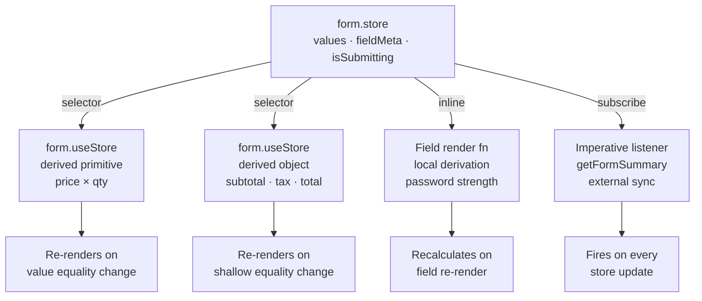

## Derived State and Computed Values in TanStack Form

Derived state refers to values calculated from form state rather than stored directly in the form store. TanStack Form does not provide a built-in computed-value registry, so derived state is constructed at the subscription layer — in selectors, in components, or in external logic that reads from the store.

---

### What Counts as Derived State

Raw store state includes field values, field metadata, and form metadata. Derived state is anything calculated from that raw state:

```
Raw state                     Derived state (examples)
──────────────────────────────────────────────────────
values.price, values.qty  →   totalCost = price * qty
values.password,          →   passwordsMatch = a === b
  values.confirm
fieldMeta (all fields)    →   firstError = first field with errors
values.startDate,         →   durationDays = end - start
  values.endDate
fieldMeta (all fields)    →   allTouched = every field is touched
values.items[]            →   itemCount, subtotal, hasEmptyRow
```

None of these live in the store. They are computed on read, inside selectors or components.

---

### Deriving Values Inside `form.useStore` Selectors

The selector passed to `form.useStore` is the primary site for deriving values from form state. The selector runs synchronously and its return value is what the component receives.

```tsx
const total = form.useStore((state) => {
  const price = Number(state.values.price) || 0
  const quantity = Number(state.values.quantity) || 0
  return price * quantity
})
```

This component re-renders only when `total` changes — not when unrelated fields change. If `price` changes but the product is still the same number (e.g. `0 * anything`), no re-render occurs.

**Key Points**
- The selector should be a pure function with no side effects
- TanStack Form compares the return value by reference equality for objects/arrays, and by value equality for primitives [Inference — behavior may vary]
- For primitive derived values, this is efficient; for derived objects, see the stability section below

---

### Deriving Values Directly in Components

For derived values that do not need to gate re-renders, compute inline from the field state:

```tsx
<form.Field name="password">
  {(field) => {
    const strength = computePasswordStrength(field.state.value)
    return (
      <div>
        <input value={field.state.value} onChange={(e) => field.handleChange(e.target.value)} />
        <meter value={strength} min={0} max={4} />
      </div>
    )
  }}
</form.Field>
```

This pattern is appropriate when the derived value is local to that field's render. The component re-renders whenever the field re-renders (per its own selector), and the derivation is recalculated at that time.

---

### Cross-field Derived State

When a derived value depends on two or more fields, use `form.useStore` with a multi-field selector:

```tsx
function PasswordMatchStatus() {
  const match = form.useStore((state) =>
    state.values.password === state.values.confirmPassword
  )

  return <p>{match ? '✓ Passwords match' : '✗ Passwords do not match'}</p>
}
```

```tsx
function OrderSummary() {
  const { subtotal, tax, total } = form.useStore((state) => {
    const items = state.values.items ?? []
    const subtotal = items.reduce((sum, item) => sum + item.price * item.qty, 0)
    const tax = subtotal * 0.08
    return {
      subtotal,
      tax,
      total: subtotal + tax,
    }
  })

  return (
    <dl>
      <dt>Subtotal</dt><dd>{subtotal.toFixed(2)}</dd>
      <dt>Tax</dt><dd>{tax.toFixed(2)}</dd>
      <dt>Total</dt><dd>{total.toFixed(2)}</dd>
    </dl>
  )
}
```

> [Inference] The selector returning a plain object causes a new object reference on every evaluation. If the computed primitive values inside it are unchanged, TanStack Form's shallow equality check on the object's properties should prevent a re-render. Behavior is not guaranteed and may vary by version.

---

### Derived Validity State

TanStack Form exposes `isValid` and `canSubmit` as pre-derived boolean flags on form state. For custom validity derivations, compute from `fieldMeta`:

```tsx
// Are all required fields filled?
const allFilled = form.useStore((state) =>
  ['name', 'email', 'phone'].every(
    (field) => String(state.values[field] ?? '').trim().length > 0
  )
)

// Does any field have an error?
const hasAnyError = form.useStore((state) =>
  Object.values(state.fieldMeta).some(
    (meta) => meta.errors.length > 0
  )
)

// Are all touched fields valid?
const touchedFieldsValid = form.useStore((state) =>
  Object.entries(state.fieldMeta).every(
    ([, meta]) => !meta.isTouched || meta.errors.length === 0
  )
)
```

---

### Deriving State from Array Fields

For dynamic field arrays, derived aggregates are computed by iterating `values`:

```tsx
function CartTotals() {
  const { count, total, hasOutOfStock } = form.useStore((state) => {
    const items = state.values.cartItems ?? []
    return {
      count: items.length,
      total: items.reduce((sum, i) => sum + (i.price ?? 0) * (i.qty ?? 0), 0),
      hasOutOfStock: items.some((i) => i.stock === 0),
    }
  })

  return (
    <div>
      <p>{count} items</p>
      <p>Total: ${total.toFixed(2)}</p>
      {hasOutOfStock && <p>Some items are out of stock</p>}
    </div>
  )
}
```

> [Inference] Selectors that iterate arrays run on every store update. If the array is large and updates are frequent, the iteration cost may be noticeable. Memoizing the selector or the derived output externally (e.g. with `useMemo`) can reduce redundant work. Behavior and performance characteristics are not guaranteed.

---

### Stabilizing Derived Objects with `useMemo`

When a selector returns a derived object and the component is sensitive to unnecessary re-renders, wrap the derived computation in `useMemo` keyed to the source values:

```tsx
function OrderSummary() {
  const items = form.useStore((state) => state.values.items ?? [])

  const summary = useMemo(() => {
    const subtotal = items.reduce((sum, i) => sum + i.price * i.qty, 0)
    const tax = subtotal * 0.08
    return { subtotal, tax, total: subtotal + tax }
  }, [items])

  return (
    <dl>
      <dt>Subtotal</dt><dd>{summary.subtotal.toFixed(2)}</dd>
      <dt>Total</dt><dd>{summary.total.toFixed(2)}</dd>
    </dl>
  )
}
```

This separates the subscription concern (`useStore` watching `items`) from the derivation concern (`useMemo` recalculating only when `items` changes).

---

### Derived State Outside React

In framework-agnostic code or in effects, derive values imperatively from `form.store.state`:

```ts
function getFormSummary(form) {
  const state = form.store.state
  const values = state.values
  return {
    isComplete: Boolean(values.name && values.email),
    wordCount: String(values.bio ?? '').split(/\s+/).filter(Boolean).length,
    hasErrors: Object.values(state.fieldMeta).some((m) => m.errors.length > 0),
  }
}
```

Called inside a `form.store.subscribe` callback, this derives state on each update:

```ts
form.store.subscribe(() => {
  const summary = getFormSummary(form)
  updateExternalUI(summary)
})
```

---

### Derivation at Validation Time

Validators have access to the full form values via `form.getFieldValue` and through the validator context, enabling derived-value validation:

```ts
<form.Field
  name="endDate"
  validators={{
    onChange: ({ value, fieldApi }) => {
      const startDate = fieldApi.form.getFieldValue('startDate')
      if (!startDate || !value) return undefined
      return new Date(value) <= new Date(startDate)
        ? 'End date must be after start date'
        : undefined
    },
  }}
/>
```

This is a form of derivation at validation time — the error message is derived from the relationship between two field values, not stored state.

---

### Architecture Overview



---

### Selector Stability Reference

| Selector return type | Equality check | Re-render risk |
|---|---|---|
| Primitive (`boolean`, `number`, `string`) | Value equality | Low — only on actual change |
| Plain object `{ a, b }` | Shallow equality [Inference] | Medium — new ref if values unchanged but object recreated |
| Array | Reference equality | High — new array ref on every selector call |
| Memoized object/array | Reference equality | Low — stable ref when inputs unchanged |

> [Inference] Equality behavior is based on observed patterns in TanStack Store, which backs TanStack Form. It is not guaranteed and may change across versions.

---

### Common Mistakes

**Deriving objects without stability consideration**

```tsx
// New object on every store update — may cause unnecessary re-renders [Inference]
const data = form.useStore((s) => ({
  name: s.values.name,
  email: s.values.email,
}))

// Prefer separate primitive subscriptions when possible
const name = form.useStore((s) => s.values.name)
const email = form.useStore((s) => s.values.email)
```

**Performing side effects inside selectors**

```tsx
// Wrong — selectors must be pure
const value = form.useStore((s) => {
  logToAnalytics(s.values) // side effect in selector
  return s.values.email
})

// Correct — side effects belong in listeners or effects
const email = form.useStore((s) => s.values.email)
useEffect(() => { logToAnalytics({ email }) }, [email])
```

**Deriving arrays from store and using them as dependency array entries**

```tsx
// items is a new array reference on every render — effect fires constantly [Inference]
const items = form.useStore((s) => s.values.items)
useEffect(() => { recalculate(items) }, [items])

// Better — derive the scalar you actually depend on
const itemCount = form.useStore((s) => s.values.items?.length ?? 0)
useEffect(() => { recalculate() }, [itemCount])
```

---

### Summary

TanStack Form has no dedicated computed-value API. Derived state is built at the read layer: inside `form.useStore` selectors for reactive React components, inside render functions for field-local derivations, and inside `form.store.subscribe` callbacks for imperative or external consumers. Selector purity, return-value stability, and targeted subscriptions are the key concerns when working with derived state.

**Related Topics**
- Field-level subscribers and selector patterns
- Form-level subscribers and `form.useStore`
- `form.store.subscribe` for imperative derived state
- Array field patterns and aggregate derivation
- Cross-field validation using derived comparisons
- Integrating TanStack Form derived state with external stores