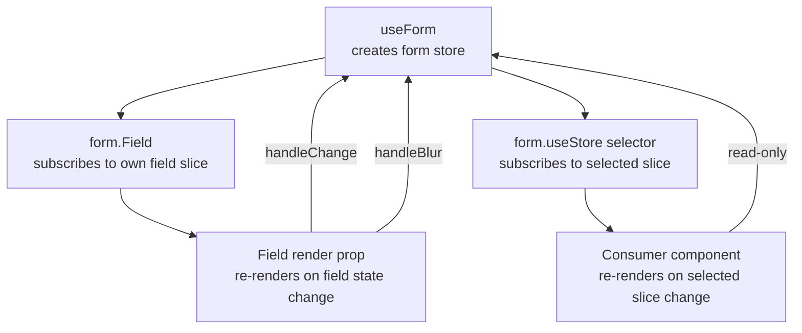

## TanStack Form with React

TanStack Form's React adapter is the primary integration layer for React applications. It wraps the framework-agnostic core with React-specific hooks, context, and component APIs that map form state into the React rendering model. This document covers the full React adapter surface: setup, form creation, field rendering, validation, submission, and advanced patterns.

---

### Installation

```bash
npm install @tanstack/react-form
```

No peer dependencies beyond React itself are required. The React adapter bundles its own bindings against the core package.

---

### Creating a Form

Forms are created with `useForm`. The hook returns a `form` instance that is the entry point for all field rendering, state access, and imperative control.

```tsx
import { useForm } from '@tanstack/react-form'

function MyForm() {
  const form = useForm({
    defaultValues: {
      name: '',
      email: '',
      age: 0,
    },
    onSubmit: async ({ value }) => {
      console.log('Submitted:', value)
    },
  })

  return (
    <form
      onSubmit={(e) => {
        e.preventDefault()
        form.handleSubmit()
      }}
    >
      {/* fields */}
    </form>
  )
}
```

**Key Points**
- `defaultValues` defines the initial shape and types of all fields
- `onSubmit` receives `{ value, formApi }` — `value` is the fully typed form values object
- `form.handleSubmit()` triggers validation and, if valid, calls `onSubmit`
- Calling `e.preventDefault()` is required — TanStack Form does not suppress the native submit event automatically

---

### `useForm` Options

```ts
useForm({
  defaultValues: { ... },

  // Called on valid submission
  onSubmit: async ({ value, formApi }) => { },

  // Called when submission is attempted but form is invalid
  onSubmitInvalid: ({ value, formApi }) => { },

  // Transform values before they reach onSubmit [Inference]
  transform: useTransform(transformFn, [deps]),

  // Validators that run at the form level
  validators: {
    onChange: ({ value }) => { /* return string or undefined */ },
    onSubmit: ({ value }) => { /* return string or undefined */ },
  },
})
```

---

### Rendering Fields with `form.Field`

`form.Field` is the primary field rendering component. It accepts a `name` prop and a render prop child that receives the `field` API.

```tsx
<form.Field name="email">
  {(field) => (
    <div>
      <label htmlFor={field.name}>Email</label>
      <input
        id={field.name}
        name={field.name}
        value={field.state.value}
        onChange={(e) => field.handleChange(e.target.value)}
        onBlur={field.handleBlur}
      />
      {field.state.meta.errors.map((err) => (
        <p key={err}>{err}</p>
      ))}
    </div>
  )}
</form.Field>
```

**`field` API surface**

| Property / Method | Description |
|---|---|
| `field.name` | Field name string |
| `field.state.value` | Current field value |
| `field.state.meta.errors` | Active error array |
| `field.state.meta.isTouched` | Whether field has been blurred |
| `field.state.meta.isDirty` | Whether value differs from default |
| `field.state.meta.isValidating` | Whether async validation is running |
| `field.handleChange(value)` | Update field value |
| `field.handleBlur()` | Mark field as touched |
| `field.setMeta(updater)` | Imperatively update field metadata |
| `field.validate(cause)` | Manually trigger validation |
| `field.form` | Reference to the parent form API |

---

### TypeScript Integration

`useForm` infers the form value type from `defaultValues`. Field names are type-checked, and `field.state.value` is typed to the field's value type.

```tsx
type FormValues = {
  username: string
  age: number
  tags: string[]
}

const form = useForm<FormValues>({
  defaultValues: {
    username: '',
    age: 0,
    tags: [],
  },
  onSubmit: async ({ value }) => {
    // value is typed as FormValues
  },
})

// name is autocompleted and type-checked
<form.Field name="username">
  {(field) => {
    // field.state.value is typed as string
  }}
</form.Field>
```

---

### Field Validation

Validators are attached per field via the `validators` prop on `form.Field`:

```tsx
<form.Field
  name="email"
  validators={{
    onChange: ({ value }) =>
      !value.includes('@') ? 'Invalid email' : undefined,

    onBlur: ({ value }) =>
      value.length < 3 ? 'Too short' : undefined,

    onSubmit: ({ value }) =>
      !value ? 'Required' : undefined,
  }}
>
  {(field) => (
    <input
      value={field.state.value}
      onChange={(e) => field.handleChange(e.target.value)}
      onBlur={field.handleBlur}
    />
  )}
</form.Field>
```

**Async validation with debounce:**

```tsx
<form.Field
  name="username"
  asyncDebounceMs={400}
  validators={{
    onChangeAsync: async ({ value }) => {
      const taken = await checkUsername(value)
      return taken ? 'Username already taken' : undefined
    },
  }}
>
  {(field) => (
    <div>
      <input
        value={field.state.value}
        onChange={(e) => field.handleChange(e.target.value)}
        onBlur={field.handleBlur}
      />
      {field.state.meta.isValidating && <span>Checking…</span>}
    </div>
  )}
</form.Field>
```

---

### Cross-field Validation with `onChangeListenTo`

A field can re-run its validation when another field changes using `onChangeListenTo`:

```tsx
<form.Field
  name="confirmPassword"
  onChangeListenTo={['password']}
  validators={{
    onChange: ({ value, fieldApi }) => {
      const password = fieldApi.form.getFieldValue('password')
      return value !== password ? 'Passwords do not match' : undefined
    },
  }}
>
  {(field) => (
    <input
      type="password"
      value={field.state.value}
      onChange={(e) => field.handleChange(e.target.value)}
      onBlur={field.handleBlur}
    />
  )}
</form.Field>
```

When `password` changes, `confirmPassword` re-validates automatically.

---

### Form-level Validation

Validators applied at the `useForm` level run against the full values object:

```tsx
const form = useForm({
  defaultValues: { startDate: '', endDate: '' },
  validators: {
    onChange: ({ value }) => {
      if (value.startDate && value.endDate) {
        return new Date(value.endDate) <= new Date(value.startDate)
          ? 'End date must be after start date'
          : undefined
      }
    },
  },
  onSubmit: async ({ value }) => { },
})
```

Form-level errors are stored in `form.state.errorMap` keyed by event type, and must be displayed manually:

```tsx
const formErrors = form.useStore((s) => s.errorMap)

{formErrors.onChange && (
  <p role="alert">{String(formErrors.onChange)}</p>
)}
```

---

### Handling Submission State

```tsx
function SubmitButton() {
  const canSubmit = form.useStore((s) => s.canSubmit)
  const isSubmitting = form.useStore((s) => s.isSubmitting)

  return (
    <button type="submit" disabled={!canSubmit || isSubmitting}>
      {isSubmitting ? 'Submitting…' : 'Submit'}
    </button>
  )
}
```

Isolating the submit button into its own component means only it re-renders when `canSubmit` or `isSubmitting` changes.

---

### Array Fields

Array fields are managed via `form.Field` with an array `defaultValue`, and sub-fields are rendered by calling `field.pushValue`, `field.removeValue`, and accessing `field.state.value` as an array.

```tsx
<form.Field name="emails" defaultValue={[]}>
  {(field) => (
    <div>
      {field.state.value.map((_, index) => (
        <form.Field key={index} name={`emails[${index}]`}>
          {(subField) => (
            <div>
              <input
                value={subField.state.value}
                onChange={(e) => subField.handleChange(e.target.value)}
              />
              <button type="button" onClick={() => field.removeValue(index)}>
                Remove
              </button>
            </div>
          )}
        </form.Field>
      ))}
      <button type="button" onClick={() => field.pushValue('')}>
        Add Email
      </button>
    </div>
  )}
</form.Field>
```

---

### Nested Object Fields

Nested field names use dot notation:

```tsx
<form.Field name="address.street">
  {(field) => (
    <input
      value={field.state.value}
      onChange={(e) => field.handleChange(e.target.value)}
      onBlur={field.handleBlur}
    />
  )}
</form.Field>

<form.Field name="address.city">
  {(field) => (
    <input
      value={field.state.value}
      onChange={(e) => field.handleChange(e.target.value)}
      onBlur={field.handleBlur}
    />
  )}
</form.Field>
```

TanStack Form resolves dot-notation paths into the nested structure of `defaultValues` automatically.

---

### Accessing Form State Outside Fields

`form.useStore` gives any component access to form state with selector-based re-render control:

```tsx
// Dirty indicator
const isDirty = form.useStore((s) => s.isDirty)

// All current values (re-renders on every keystroke)
const values = form.useStore((s) => s.values)

// Submission attempt count
const attempts = form.useStore((s) => s.submissionAttempts)
```

---

### Resetting the Form

```tsx
// Reset to defaultValues
form.reset()

// Reset to specific values
form.reset({ name: 'Jane', email: '' })
```

`form.reset()` clears all field values to defaults, clears errors, and resets metadata flags (`isTouched`, `isDirty`, `isSubmitted`).

---

### Imperative Field Control

The `form` API exposes imperative methods for reading and writing field state outside of the render prop:

```tsx
// Read
const email = form.getFieldValue('email')
const meta = form.getFieldMeta('email')

// Write
form.setFieldValue('email', 'user@example.com')
form.setFieldMeta('email', (prev) => ({ ...prev, isTouched: true }))

// Trigger validation manually
form.validateField('email', 'change')
form.validateAllFields('submit')
```

---

### Using `useField` Hook

For cases where the render prop pattern is inconvenient — particularly when building reusable field components — use the `useField` hook:

```tsx
import { useField } from '@tanstack/react-form'

function EmailField({ form }) {
  const field = useField({ form, name: 'email' })

  return (
    <div>
      <input
        value={field.state.value}
        onChange={(e) => field.handleChange(e.target.value)}
        onBlur={field.handleBlur}
      />
      {field.state.meta.errors.map((e) => <p key={e}>{e}</p>)}
    </div>
  )
}
```

`useField` returns the same `field` API as the render prop. It requires a reference to the `form` instance, typically passed as a prop or accessed via context.

---

### Sharing Form via Context

When the form instance needs to be accessible deep in the component tree without prop-drilling, pass it through React context:

```tsx
const FormContext = React.createContext(null)

function MyForm() {
  const form = useForm({ defaultValues: { name: '' }, onSubmit: async () => {} })

  return (
    <FormContext.Provider value={form}>
      <form onSubmit={(e) => { e.preventDefault(); form.handleSubmit() }}>
        <DeepFieldComponent />
      </form>
    </FormContext.Provider>
  )
}

function DeepFieldComponent() {
  const form = React.useContext(FormContext)

  return (
    <form.Field name="name">
      {(field) => (
        <input
          value={field.state.value}
          onChange={(e) => field.handleChange(e.target.value)}
        />
      )}
    </form.Field>
  )
}
```

---

### Rendering Lifecycle and Re-render Isolation



`form.Field` components re-render in isolation from each other. A change in `email` does not cause `username`'s `form.Field` to re-render. Components consuming `form.useStore` re-render only when their selected slice changes.

---

### Full Example

```tsx
import { useForm } from '@tanstack/react-form'

type SignupValues = {
  username: string
  email: string
  password: string
}

export function SignupForm() {
  const form = useForm<SignupValues>({
    defaultValues: { username: '', email: '', password: '' },
    onSubmit: async ({ value }) => {
      await registerUser(value)
    },
  })

  return (
    <form onSubmit={(e) => { e.preventDefault(); form.handleSubmit() }}>
      <form.Field
        name="username"
        validators={{
          onChange: ({ value }) => !value ? 'Required' : undefined,
        }}
      >
        {(field) => (
          <div>
            <label>Username</label>
            <input
              value={field.state.value}
              onChange={(e) => field.handleChange(e.target.value)}
              onBlur={field.handleBlur}
            />
            {field.state.meta.isTouched && field.state.meta.errors.map((e) => (
              <p key={e}>{e}</p>
            ))}
          </div>
        )}
      </form.Field>

      <form.Field
        name="email"
        validators={{
          onChange: ({ value }) =>
            !value.includes('@') ? 'Invalid email' : undefined,
        }}
      >
        {(field) => (
          <div>
            <label>Email</label>
            <input
              value={field.state.value}
              onChange={(e) => field.handleChange(e.target.value)}
              onBlur={field.handleBlur}
            />
            {field.state.meta.isTouched && field.state.meta.errors.map((e) => (
              <p key={e}>{e}</p>
            ))}
          </div>
        )}
      </form.Field>

      <form.Field
        name="password"
        validators={{
          onChange: ({ value }) =>
            value.length < 8 ? 'Minimum 8 characters' : undefined,
        }}
      >
        {(field) => (
          <div>
            <label>Password</label>
            <input
              type="password"
              value={field.state.value}
              onChange={(e) => field.handleChange(e.target.value)}
              onBlur={field.handleBlur}
            />
            {field.state.meta.isTouched && field.state.meta.errors.map((e) => (
              <p key={e}>{e}</p>
            ))}
          </div>
        )}
      </form.Field>

      <button type="submit">Sign Up</button>
    </form>
  )
}
```

---

### Common Mistakes

**Not calling `e.preventDefault()`**

```tsx
// Native form submission fires — page reloads
<form onSubmit={() => form.handleSubmit()}>

// Correct
<form onSubmit={(e) => { e.preventDefault(); form.handleSubmit() }}>
```

**Initializing `defaultValues` with `undefined` fields**

```tsx
// undefined fields are untracked — type inference breaks
const form = useForm({ defaultValues: { name: undefined } })

// Use empty strings or null as placeholders
const form = useForm({ defaultValues: { name: '' } })
```

**Reading `field.state.value` outside the render prop**

```tsx
// Wrong — field.state is stale outside the subscription context
const value = someFieldRef.state.value

// Correct — use form.getFieldValue for imperative reads
const value = form.getFieldValue('email')
```

**Placing validation logic in `onSubmit` instead of validators**

```tsx
// Bypasses TanStack Form's validation pipeline and canSubmit flag
onSubmit: async ({ value }) => {
  if (!value.email) throw new Error('Required')
}

// Correct — declare validators on the field
validators={{ onSubmit: ({ value }) => !value ? 'Required' : undefined }}
```

---

### Summary

The React adapter for TanStack Form centers on three APIs: `useForm` to create the form instance, `form.Field` to render and subscribe individual fields, and `form.useStore` to consume form state in arbitrary components. Fields re-render in isolation, state is fully controlled, and TypeScript types flow from `defaultValues` through to field render props. Validation, array fields, nested objects, and cross-field dependencies are all handled within this same model.

**Related Topics**
- TanStack Form with Vue and Solid adapters
- Schema validation with Zod, Valibot, and Yup via `@tanstack/zod-form-adapter`
- Array field patterns — dynamic lists, reordering, nested arrays
- Form state persistence — saving and restoring form state across navigation
- Server-side validation and error mapping into field errors
- Integrating TanStack Form with TanStack Router for route-level form state