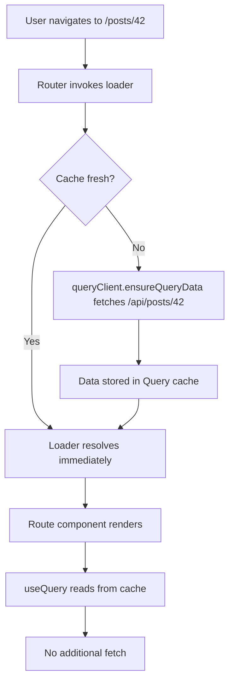

## Combining TanStack Query and TanStack Router

TanStack Query and TanStack Router are designed to complement each other. Query handles server state — fetching, caching, and synchronizing data. Router handles navigation, URL state, and route-level data loading. Combining them creates a cohesive architecture where the URL drives data fetching and UI state reflects both navigation and server data simultaneously.

---

### Why Combine Them

Used independently, each library solves its own problem well. Together, they address a deeper challenge: **coordinating when data is fetched relative to navigation events**, so users never see loading spinners that could have been avoided, and URLs always reflect the true application state.

**Key Points:**
- Router controls *when* and *where* the user is
- Query controls *what data* is available and its freshness
- The integration point is the route loader — where navigation triggers data fetching

---

### Core Integration Pattern: Route Loaders with `ensureQueryData`

The primary integration pattern uses TanStack Router's `loader` function to prefetch Query data before a route renders.

**Example:**

```ts
// queryClient.ts
import { QueryClient } from '@tanstack/react-query'
export const queryClient = new QueryClient()
```

```ts
// queries/posts.ts
import { queryOptions } from '@tanstack/react-query'

export const postsQueryOptions = queryOptions({
  queryKey: ['posts'],
  queryFn: async () => {
    const res = await fetch('/api/posts')
    return res.json()
  },
})
```

```ts
// routes/posts.tsx
import { createFileRoute } from '@tanstack/react-router'
import { queryClient } from '../queryClient'
import { postsQueryOptions } from '../queries/posts'

export const Route = createFileRoute('/posts')({
  loader: () => queryClient.ensureQueryData(postsQueryOptions),
  component: PostsPage,
})
```

```tsx
// component uses useQuery — data is already in cache
function PostsPage() {
  const { data: posts } = useQuery(postsQueryOptions)
  return <ul>{posts.map(p => <li key={p.id}>{p.title}</li>)}</ul>
}
```

**Key Points:**
- `ensureQueryData` fetches if data is missing or stale; resolves immediately if cache is fresh
- The component's `useQuery` call reads from the already-populated cache — no redundant fetch
- This pattern avoids the "fetch-on-render" waterfall

---

### `queryOptions` as the Shared Contract

`queryOptions()` (from `@tanstack/react-query` v5+) is a factory that produces a typed options object. Defining query options once and sharing them between the loader and the component is the idiomatic way to keep the two layers in sync.

```ts
// Defined once, used in loader AND component
export const postDetailQueryOptions = (postId: string) =>
  queryOptions({
    queryKey: ['posts', postId],
    queryFn: () => fetchPost(postId),
    staleTime: 1000 * 60 * 5, // 5 minutes
  })
```

```ts
// In route loader (Router)
loader: ({ params }) =>
  queryClient.ensureQueryData(postDetailQueryOptions(params.postId))
```

```ts
// In component (Query)
const { data } = useQuery(postDetailQueryOptions(postId))
```

**Key Points:**
- Single source of truth for `queryKey`, `queryFn`, and cache configuration
- TypeScript infers the return type throughout — loader, component, and any prefetch call share the same type
- Changing cache behavior in one place propagates everywhere

---

### Route Parameters to Query Keys

Route params naturally map to query key segments. This alignment is not accidental — it mirrors the URL-as-state philosophy of both libraries.

```ts
export const Route = createFileRoute('/posts/$postId')({
  loader: ({ params }) =>
    queryClient.ensureQueryData(postDetailQueryOptions(params.postId)),
  component: PostDetail,
})

function PostDetail() {
  const { postId } = Route.useParams()
  const { data } = useQuery(postDetailQueryOptions(postId))
  // ...
}
```

**Key Points:**
- `params.postId` drives both the loader and the component query
- When the URL changes (e.g., navigating from `/posts/1` to `/posts/2`), Router triggers a new loader call, which runs `ensureQueryData` with the new param — Query either returns cached data or fetches fresh
- [Inference] This pattern encourages query key structures that mirror route hierarchy, improving cache predictability

---

### Search Parameters as Query Inputs

TanStack Router's typed search params (`validateSearch`) integrate cleanly with Query when filters, pagination, or sort state live in the URL.

```ts
import { z } from 'zod'
import { createFileRoute } from '@tanstack/react-router'

const searchSchema = z.object({
  page: z.number().catch(1),
  filter: z.string().catch(''),
})

export const Route = createFileRoute('/posts')({
  validateSearch: searchSchema,
  loader: ({ context: { queryClient }, search }) =>
    queryClient.ensureQueryData(postsQueryOptions(search)),
  component: PostsPage,
})
```

```ts
export const postsQueryOptions = (search: { page: number; filter: string }) =>
  queryOptions({
    queryKey: ['posts', search],
    queryFn: () => fetchPosts(search),
  })
```

```tsx
function PostsPage() {
  const search = Route.useSearch()
  const { data } = useQuery(postsQueryOptions(search))
  // ...
}
```

**Key Points:**
- URL search params become part of the query key — cache entries are scoped per unique search state
- Navigating to `?page=2` triggers a new loader, which fetches or serves cached page 2 data
- No separate local state needed for pagination or filtering — the URL is the state

---

### Context-Based QueryClient Injection

Rather than importing `queryClient` directly into every route file, TanStack Router supports a router context object that is typed and injected at the root. This is the recommended pattern for testability and modularity.

```ts
// router.tsx
import { createRouter } from '@tanstack/react-router'
import { QueryClient } from '@tanstack/react-query'
import { routeTree } from './routeTree.gen'

export interface RouterContext {
  queryClient: QueryClient
}

export const router = createRouter({
  routeTree,
  context: { queryClient: undefined! }, // typed placeholder
})
```

```tsx
// main.tsx
const queryClient = new QueryClient()

<RouterProvider router={router} context={{ queryClient }} />
```

```ts
// In any route loader
loader: ({ context: { queryClient } }) =>
  queryClient.ensureQueryData(postsQueryOptions)
```

**Key Points:**
- `queryClient` is injected, not imported — routes do not have a hard dependency on a module-level singleton
- [Inference] This improves testability since tests can inject a different `QueryClient` instance per test
- TypeScript enforces the context shape across all routes via the `RouterContext` interface

---

### Pending and Error States

Router exposes `pendingComponent` and `errorComponent` at the route level. These integrate with the loading and error states produced by Query during prefetch.

```ts
export const Route = createFileRoute('/posts/$postId')({
  loader: ({ context: { queryClient }, params }) =>
    queryClient.ensureQueryData(postDetailQueryOptions(params.postId)),
  pendingComponent: () => <div>Loading post…</div>,
  errorComponent: ({ error }) => <div>Error: {error.message}</div>,
  component: PostDetail,
})
```

**Key Points:**
- If `ensureQueryData` is pending, Router renders `pendingComponent` during navigation
- If `ensureQueryData` throws, Router renders `errorComponent`
- The component itself can still use `useQuery` with `suspense: true` for fine-grained local loading states, though behavior depends on configuration [Unverified — exact interaction between router error boundaries and React Query suspense mode may vary by version]

---

### Prefetching on Hover / Intent

Beyond loaders, Query's `prefetchQuery` can be called proactively — for example, when a user hovers over a link — to warm the cache before navigation begins.

```tsx
function PostLink({ postId }: { postId: string }) {
  const queryClient = useQueryClient()

  return (
    <Link
      to="/posts/$postId"
      params={{ postId }}
      onMouseEnter={() =>
        queryClient.prefetchQuery(postDetailQueryOptions(postId))
      }
    >
      View Post
    </Link>
  )
}
```

**Key Points:**
- When the user clicks and Router invokes the loader, `ensureQueryData` finds fresh data in cache and resolves immediately
- This is purely additive — if prefetch is skipped or fails, the loader fetches normally
- [Inference] This pattern is most valuable for list-to-detail navigation where user intent is predictable from hover behavior

---

### Invalidation After Mutations

After a mutation, Query's `invalidateQueries` causes stale data to be refetched. Combined with Router, this can be triggered post-navigation or within the same route.

```ts
const mutation = useMutation({
  mutationFn: updatePost,
  onSuccess: (_, variables) => {
    queryClient.invalidateQueries({ queryKey: ['posts', variables.postId] })
    queryClient.invalidateQueries({ queryKey: ['posts'] })
  },
})
```

**Key Points:**
- Invalidation causes active `useQuery` subscriptions to refetch — no manual state update required
- If the invalidated query is not currently observed (user is on another route), it will be refetched when next accessed
- Router does not need to be involved in invalidation unless a navigation is also desired post-mutation

---

### Structural Overview



---

### Common Pitfalls

**Pitfall: Mismatched query keys between loader and component**

If the loader uses a different `queryKey` than `useQuery` in the component, the prefetch is wasted and a second fetch occurs. Using shared `queryOptions` factories eliminates this class of error.

**Pitfall: Importing `queryClient` directly instead of using context**

Module-level singletons work but reduce testability and make it harder to support multiple router instances. Prefer context injection.

**Pitfall: Relying on loader data via `Route.useLoaderData()` instead of `useQuery`**

`Route.useLoaderData()` returns the value the loader resolved with — which is the raw fetch result if you return it, or `undefined` if `ensureQueryData` resolved from cache. Using `useQuery` in the component is more reliable since it always reads from the canonical cache.

**Pitfall: Not accounting for `staleTime`**

If `staleTime` is `0` (default), `ensureQueryData` will always fetch during navigation even if data was fetched moments ago. Set an appropriate `staleTime` on shared `queryOptions` to prevent redundant requests during rapid navigation. [Inference — actual fetch behavior depends on timing and cache state at navigation time]

---

**Related Topics:**
- `prefetchQuery` vs `ensureQueryData` — behavioral differences and when to use each
- TanStack Router `beforeLoad` vs `loader` — sequencing and use cases
- Suspense mode with TanStack Query in route components
- Optimistic updates with Query + Router navigation
- Deferred data loading with `defer` and `Await` in TanStack Router
- Testing route loaders that depend on QueryClient
- SSR hydration — dehydrating Query cache and rehydrating in Router context