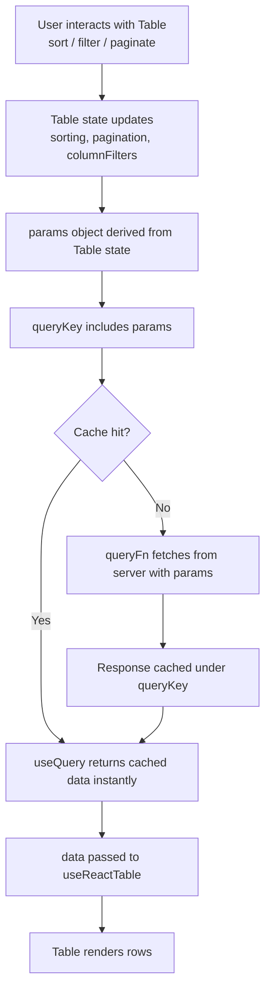

## Combining TanStack Query and TanStack Table

TanStack Query and TanStack Table solve adjacent problems: Query manages the lifecycle of server data, and Table manages the transformation and display of that data. Combining them creates a pipeline where Query owns fetching, caching, and synchronization, while Table owns sorting, filtering, pagination, and row selection — each library doing what it does best without overlap.

---

### Why Combine Them

Table is a headless utility — it operates on whatever array of data you give it. Query is the natural supplier of that array. The combination becomes non-trivial when server-side operations (sorting, filtering, pagination) are required, because Table's state must then drive Query's fetch parameters rather than operating on a local data copy.

**Key Points:**
- Client-side mode: Query fetches once, Table operates on the full dataset in memory
- Server-side mode: Table state (sort, filter, pagination) flows into Query's `queryKey` and `queryFn`, triggering refetches when table state changes
- The boundary between the two is the `data` prop passed to `useReactTable`

---

### Basic Integration: Client-Side Operations

When the full dataset fits in memory, Query fetches it and Table handles all transformations locally.

```ts
// queries/users.ts
import { queryOptions } from '@tanstack/react-query'

export const usersQueryOptions = queryOptions({
  queryKey: ['users'],
  queryFn: async (): Promise<User[]> => {
    const res = await fetch('/api/users')
    return res.json()
  },
})
```

```tsx
// components/UsersTable.tsx
import { useQuery } from '@tanstack/react-query'
import {
  useReactTable,
  getCoreRowModel,
  getSortedRowModel,
  getFilteredRowModel,
  getPaginationRowModel,
  flexRender,
} from '@tanstack/react-table'

function UsersTable() {
  const { data = [], isLoading } = useQuery(usersQueryOptions)

  const table = useReactTable({
    data,
    columns,
    getCoreRowModel: getCoreRowModel(),
    getSortedRowModel: getSortedRowModel(),
    getFilteredRowModel: getFilteredRowModel(),
    getPaginationRowModel: getPaginationRowModel(),
  })

  if (isLoading) return <div>Loading…</div>

  return (
    <table>
      <thead>
        {table.getHeaderGroups().map(hg => (
          <tr key={hg.id}>
            {hg.headers.map(h => (
              <th key={h.id} onClick={h.column.getToggleSortingHandler()}>
                {flexRender(h.column.columnDef.header, h.getContext())}
              </th>
            ))}
          </tr>
        ))}
      </thead>
      <tbody>
        {table.getRowModel().rows.map(row => (
          <tr key={row.id}>
            {row.getVisibleCells().map(cell => (
              <td key={cell.id}>
                {flexRender(cell.column.columnDef.cell, cell.getContext())}
              </td>
            ))}
          </tr>
        ))}
      </tbody>
    </table>
  )
}
```

**Key Points:**
- `data` defaults to `[]` to keep Table stable during the loading state — passing `undefined` can cause layout shifts or errors depending on column definitions
- All sorting, filtering, and pagination happen in memory; no additional fetches occur when the user interacts with the table
- This pattern is appropriate when the total dataset is small enough that transferring it in one request is acceptable

---

### Column Definitions

Column definitions are independent of both Query and Table's fetch state. Define them outside the component to avoid recreation on every render.

```ts
import { createColumnHelper } from '@tanstack/react-table'

type User = { id: number; name: string; email: string; role: string }

const columnHelper = createColumnHelper<User>()

const columns = [
  columnHelper.accessor('id', { header: 'ID' }),
  columnHelper.accessor('name', {
    header: 'Name',
    cell: info => <strong>{info.getValue()}</strong>,
  }),
  columnHelper.accessor('email', { header: 'Email' }),
  columnHelper.accessor('role', {
    header: 'Role',
    filterFn: 'equals',
  }),
]
```

**Key Points:**
- `createColumnHelper` provides type inference tied to the row data type
- Column definitions do not reference Query state — they describe shape and behavior, not data source
- `filterFn`, `sortingFn`, and `cell` renderers operate on data already delivered by Query

---

### Server-Side Operations: The Core Pattern

When datasets are large, sorting, filtering, and pagination must happen on the server. Table state becomes the input to Query's fetch parameters.

```ts
// queries/users.ts
export type UsersParams = {
  page: number
  pageSize: number
  sortField: string
  sortDir: 'asc' | 'desc'
  filter: string
}

export const usersQueryOptions = (params: UsersParams) =>
  queryOptions({
    queryKey: ['users', params],
    queryFn: async () => {
      const url = new URL('/api/users', window.location.origin)
      url.searchParams.set('page', String(params.page))
      url.searchParams.set('pageSize', String(params.pageSize))
      url.searchParams.set('sortField', params.sortField)
      url.searchParams.set('sortDir', params.sortDir)
      url.searchParams.set('filter', params.filter)
      const res = await fetch(url)
      return res.json() as Promise<{ rows: User[]; totalRows: number }>
    },
    placeholderData: keepPreviousData,
  })
```

```tsx
function UsersTable() {
  const [sorting, setSorting] = useState<SortingState>([])
  const [columnFilters, setColumnFilters] = useState<ColumnFiltersState>([])
  const [pagination, setPagination] = useState<PaginationState>({
    pageIndex: 0,
    pageSize: 20,
  })

  const params: UsersParams = {
    page: pagination.pageIndex,
    pageSize: pagination.pageSize,
    sortField: sorting[0]?.id ?? 'id',
    sortDir: sorting[0]?.desc ? 'desc' : 'asc',
    filter: (columnFilters[0]?.value as string) ?? '',
  }

  const { data, isLoading, isFetching } = useQuery(usersQueryOptions(params))

  const table = useReactTable({
    data: data?.rows ?? [],
    columns,
    rowCount: data?.totalRows ?? 0,
    state: { sorting, columnFilters, pagination },
    onSortingChange: setSorting,
    onColumnFiltersChange: setColumnFilters,
    onPaginationChange: setPagination,
    manualSorting: true,
    manualFiltering: true,
    manualPagination: true,
    getCoreRowModel: getCoreRowModel(),
  })

  return (
    <>
      {isFetching && <span>Refreshing…</span>}
      {/* table JSX */}
    </>
  )
}
```

**Key Points:**
- `manualSorting`, `manualFiltering`, `manualPagination` tell Table not to apply its own transformations — the server handles them
- `rowCount` is required for manual pagination so Table can calculate page count correctly
- The entire `params` object is the query key — any change to table state produces a new cache entry and triggers a fetch
- `keepPreviousData` (imported from `@tanstack/react-query`) keeps the previous page visible while the next page loads, preventing layout collapse

---

### `keepPreviousData` for Smooth Pagination

Without `keepPreviousData`, navigating to the next page replaces the table contents with a loading state momentarily. With it, the old data remains visible until new data arrives.

```ts
import { keepPreviousData } from '@tanstack/react-query'

queryOptions({
  queryKey: ['users', params],
  queryFn: fetchUsers,
  placeholderData: keepPreviousData,
})
```

**Key Points:**
- `placeholderData: keepPreviousData` is the v5 API; earlier versions used `keepPreviousData: true` directly on `useQuery` [behavior may vary by version — verify against installed version]
- `isFetching` is `true` while new data is loading even when `isLoading` is `false`, allowing a subtle loading indicator without removing the table

---

### Query Key Strategy for Table State

The query key must fully encode all parameters that affect the server response. A mismatch between key and fetch parameters produces stale cache hits.

```ts
// Fragile — object reference changes but key may not reflect all fields
queryKey: ['users', params]

// More explicit — each field is a named key segment
queryKey: ['users', { page, pageSize, sortField, sortDir, filter }]
```

**Key Points:**
- TanStack Query performs deep equality on query keys — nested objects are compared by value, not reference
- [Inference] Flattening params into named key segments makes it easier to invalidate specific subsets (e.g., `invalidateQueries({ queryKey: ['users'] })` invalidates all user queries regardless of params)
- Avoid including non-serializable values (functions, class instances) in query keys

---

### Row Selection with Mutations

Table's row selection state integrates naturally with Query mutations — selected rows become the mutation payload.

```tsx
const [rowSelection, setRowSelection] = useState<RowSelectionState>({})

const table = useReactTable({
  data: data?.rows ?? [],
  columns,
  state: { rowSelection },
  onRowSelectionChange: setRowSelection,
  getCoreRowModel: getCoreRowModel(),
})

const deleteMutation = useMutation({
  mutationFn: (ids: number[]) =>
    fetch('/api/users', {
      method: 'DELETE',
      body: JSON.stringify({ ids }),
    }),
  onSuccess: () => {
    queryClient.invalidateQueries({ queryKey: ['users'] })
    setRowSelection({})
  },
})

function handleDelete() {
  const selectedIds = table
    .getSelectedRowModel()
    .rows.map(row => row.original.id)
  deleteMutation.mutate(selectedIds)
}
```

**Key Points:**
- `getSelectedRowModel().rows` returns the actual row objects — `.original` accesses the underlying data record
- After a successful delete, invalidating `['users']` causes the table to refetch with current params
- Clearing `rowSelection` after mutation avoids stale selection state pointing to deleted rows

---

### Optimistic Updates with Table Data

For mutations that modify existing rows (e.g., toggling a status), optimistic updates can reflect changes immediately before the server confirms.

```ts
const toggleMutation = useMutation({
  mutationFn: ({ id, active }: { id: number; active: boolean }) =>
    fetch(`/api/users/${id}`, {
      method: 'PATCH',
      body: JSON.stringify({ active }),
    }),
  onMutate: async ({ id, active }) => {
    await queryClient.cancelQueries({ queryKey: ['users', params] })
    const previous = queryClient.getQueryData(['users', params])
    queryClient.setQueryData(['users', params], (old: UsersResponse) => ({
      ...old,
      rows: old.rows.map(u => (u.id === id ? { ...u, active } : u)),
    }))
    return { previous }
  },
  onError: (_err, _vars, context) => {
    if (context?.previous) {
      queryClient.setQueryData(['users', params], context.previous)
    }
  },
  onSettled: () => {
    queryClient.invalidateQueries({ queryKey: ['users'] })
  },
})
```

**Key Points:**
- `cancelQueries` prevents an in-flight refetch from overwriting the optimistic update
- `setQueryData` directly mutates the cache — Table re-renders immediately because `useQuery` is subscribed to the cache entry
- On error, the previous snapshot is restored; on settle, a real refetch reconciles server truth
- [Inference] The `params` object used as the cache key must be stable in scope during the mutation lifecycle — capture it at mutation time if it might change

---

### Debouncing Filter Input

Filter inputs that trigger server fetches should be debounced to avoid a fetch per keystroke.

```tsx
const [filterInput, setFilterInput] = useState('')
const [filter, setFilter] = useState('')

useEffect(() => {
  const timeout = setTimeout(() => setFilter(filterInput), 300)
  return () => clearTimeout(timeout)
}, [filterInput])

// filterInput drives the visible input value
// filter drives the query params and query key
```

**Key Points:**
- Two state values — one for the immediate input, one for the debounced query param — prevent excessive cache entries
- [Inference] 300ms is a common debounce interval; adjust based on API latency and UX requirements
- The debounced `filter` value feeds into `params`, which feeds into the query key — no fetch occurs until the debounce fires

---

### Data Flow Diagram



---

### TypeScript: Typing the Full Pipeline

```ts
// Shared types
type User = {
  id: number
  name: string
  email: string
  role: 'admin' | 'viewer'
}

type UsersResponse = {
  rows: User[]
  totalRows: number
}

// Query
const usersQueryOptions = (params: UsersParams) =>
  queryOptions<UsersResponse>({
    queryKey: ['users', params],
    queryFn: () => fetchUsers(params),
  })

// Column helper infers from User type
const columnHelper = createColumnHelper<User>()
```

**Key Points:**
- `queryOptions<UsersResponse>` types the return value — `data?.rows` is typed as `User[]` without casting
- `createColumnHelper<User>()` types accessor paths — invalid field names are caught at compile time
- [Inference] Keeping `User` and `UsersResponse` in a shared types file prevents drift between query and column definitions

---

### Common Pitfalls

**Pitfall: Passing `undefined` as `data` to `useReactTable`**

Table expects an array. If `data` is `undefined` during loading, provide a stable empty array fallback (`data?.rows ?? []`). Avoid recreating the fallback array inline on each render if it causes unnecessary re-renders — define it outside the component or use `useMemo`.

**Pitfall: Forgetting `manualPagination` / `manualSorting`**

If `manualPagination` is not set, Table will also apply its own client-side pagination on top of server-paginated data, resulting in incorrect row counts and display.

**Pitfall: Non-stable `data` reference causing infinite re-renders**

If `queryFn` returns a new object reference on every call (e.g., due to transformation inside `queryFn`), and the component derives state from `data` in a `useEffect` without proper deps, render loops can occur. Keep `queryFn` pure and transformations outside Query. [Inference — actual behavior depends on component structure]

**Pitfall: Query key not matching all fetch parameters**

If a parameter affects the server response but is omitted from the query key, stale data is served from cache when that parameter changes. Every variable in `queryFn` that affects the response must appear in `queryKey`.

---

**Related Topics:**
- Virtualizing large tables with TanStack Virtual alongside Query-fed data
- Persisting table state (sort, filter, pagination) in the URL with TanStack Router
- Infinite scroll with `useInfiniteQuery` and TanStack Table
- Column visibility and column ordering state management
- Global filter vs. column-level filter with server-side fetch
- Using React Query DevTools to debug query key collisions
- Prefetching the next page while the current page is displayed