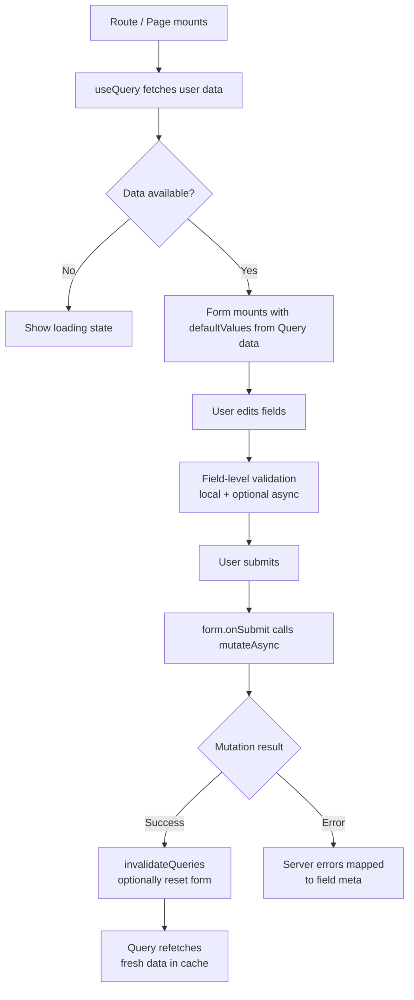

## Combining TanStack Form and TanStack Query

TanStack Form manages form state, validation, and submission lifecycle. TanStack Query manages server state — fetching, caching, and mutating remote data. Combining them creates a clean boundary: Form owns what the user is doing locally, Query owns what the server knows and what gets sent to it. The integration points are submission (Form → Query mutation) and pre-population (Query fetch → Form initial values).

---

### Why Combine Them

Form and Query do not overlap in responsibility. The combination becomes necessary when:

- A form must be pre-populated with server data (edit forms)
- Submission must go to a server and the result affects cached state
- Validation must consult the server (e.g., checking username availability)
- Submission errors from the server must surface in form field state

**Key Points:**
- Form does not fetch or cache — it holds transient user input
- Query does not hold input state — it holds server state snapshots
- The handoff points are `form.handleSubmit` → `mutation.mutateAsync` and `useQuery` data → `defaultValues`

---

### Basic Integration: Submission via Mutation

The most common pattern: Form collects input, `handleSubmit` calls a Query mutation.

```ts
// queries/users.ts
import { useMutation, useQueryClient } from '@tanstack/react-query'

export function useCreateUserMutation() {
  const queryClient = useQueryClient()
  return useMutation({
    mutationFn: async (values: CreateUserInput) => {
      const res = await fetch('/api/users', {
        method: 'POST',
        headers: { 'Content-Type': 'application/json' },
        body: JSON.stringify(values),
      })
      if (!res.ok) throw new Error(await res.text())
      return res.json()
    },
    onSuccess: () => {
      queryClient.invalidateQueries({ queryKey: ['users'] })
    },
  })
}
```

```tsx
// components/CreateUserForm.tsx
import { useForm } from '@tanstack/react-form'
import { useCreateUserMutation } from '../queries/users'

function CreateUserForm() {
  const mutation = useCreateUserMutation()

  const form = useForm({
    defaultValues: {
      name: '',
      email: '',
      role: 'viewer',
    },
    onSubmit: async ({ value }) => {
      await mutation.mutateAsync(value)
    },
  })

  return (
    <form
      onSubmit={e => {
        e.preventDefault()
        form.handleSubmit()
      }}
    >
      <form.Field name="name">
        {field => (
          <input
            value={field.state.value}
            onChange={e => field.handleChange(e.target.value)}
            onBlur={field.handleBlur}
          />
        )}
      </form.Field>

      <form.Field name="email">
        {field => (
          <input
            type="email"
            value={field.state.value}
            onChange={e => field.handleChange(e.target.value)}
          />
        )}
      </form.Field>

      <button type="submit" disabled={mutation.isPending}>
        {mutation.isPending ? 'Saving…' : 'Create User'}
      </button>
    </form>
  )
}
```

**Key Points:**
- `mutation.mutateAsync` is used inside `onSubmit` so that thrown errors propagate back into Form's submission error state
- `mutation.isPending` disables the submit button during the in-flight request
- `onSuccess` invalidates the `['users']` cache so any list using that query reflects the new record

---

### Pre-populating Forms with Query Data (Edit Forms)

Edit forms must fetch existing data and use it as the form's starting state. The key constraint is that `defaultValues` in TanStack Form are only read once — at initialization — so the Query data must be available before the form mounts, or the form must be conditionally rendered.

```ts
// queries/users.ts
import { queryOptions } from '@tanstack/react-query'

export const userQueryOptions = (userId: string) =>
  queryOptions({
    queryKey: ['users', userId],
    queryFn: async () => {
      const res = await fetch(`/api/users/${userId}`)
      return res.json() as Promise<User>
    },
  })
```

```tsx
// components/EditUserForm.tsx
import { useQuery } from '@tanstack/react-query'
import { useForm } from '@tanstack/react-form'

function EditUserForm({ userId }: { userId: string }) {
  const { data: user, isLoading } = useQuery(userQueryOptions(userId))

  if (isLoading || !user) return <div>Loading…</div>

  return <EditUserFormInner user={user} />
}

function EditUserFormInner({ user }: { user: User }) {
  const mutation = useUpdateUserMutation(user.id)

  const form = useForm({
    defaultValues: {
      name: user.name,
      email: user.email,
      role: user.role,
    },
    onSubmit: async ({ value }) => {
      await mutation.mutateAsync(value)
    },
  })

  // ... form JSX
}
```

**Key Points:**
- The outer component gates rendering on Query data being available — `EditUserFormInner` only mounts when `user` exists
- This avoids the problem of `defaultValues` being set to `undefined` and then trying to update them after fetch
- The inner component receives `user` as a prop — its `defaultValues` are stable at mount time
- [Inference] Splitting into outer/inner is a common pattern but not the only approach; `useForm` with a `key` prop tied to the user ID is an alternative that remounts the form when the subject changes

---

### Resetting Form to Server State

After a successful update, or when the user wants to discard changes, the form can be reset to the latest Query-cached values.

```tsx
function EditUserFormInner({ user }: { user: User }) {
  const mutation = useUpdateUserMutation(user.id)

  const form = useForm({
    defaultValues: {
      name: user.name,
      email: user.email,
      role: user.role,
    },
    onSubmit: async ({ value }) => {
      await mutation.mutateAsync(value)
    },
  })

  function handleDiscard() {
    form.reset()
  }

  return (
    <>
      {/* fields */}
      <button type="button" onClick={handleDiscard}>Discard</button>
    </>
  )
}
```

**Key Points:**
- `form.reset()` restores all fields to `defaultValues` — the values the form was initialized with
- If the parent re-fetches and passes a fresh `user` prop, the form must remount (via `key`) to pick up the new defaults — `reset()` alone returns to the original mount-time defaults, not the freshest server value
- [Inference] For long-lived edit forms where server data may change externally, periodically syncing defaults requires either remounting or manually calling `form.setFieldValue` for each field

---

### Surfacing Server Errors in Form Fields

When a mutation fails with field-level validation errors from the server, those errors should appear on the relevant fields rather than as a generic message.

```ts
type ServerValidationError = {
  field: string
  message: string
}

export function useCreateUserMutation() {
  return useMutation({
    mutationFn: async (values: CreateUserInput) => {
      const res = await fetch('/api/users', {
        method: 'POST',
        headers: { 'Content-Type': 'application/json' },
        body: JSON.stringify(values),
      })
      if (!res.ok) {
        const errors: ServerValidationError[] = await res.json()
        throw errors
      }
      return res.json()
    },
  })
}
```

```tsx
const form = useForm({
  defaultValues: { name: '', email: '' },
  onSubmit: async ({ value }) => {
    try {
      await mutation.mutateAsync(value)
    } catch (errors) {
      if (Array.isArray(errors)) {
        errors.forEach((err: ServerValidationError) => {
          form.setFieldMeta(err.field as keyof typeof value, meta => ({
            ...meta,
            errors: [err.message],
          }))
        })
      }
    }
  },
})
```

**Key Points:**
- The `mutationFn` throws the structured error array so `onSubmit` can catch and process it
- `form.setFieldMeta` updates the error state of a specific field — the field renders the error via `field.state.meta.errors`
- [Unverified — `setFieldMeta` API shape may differ by TanStack Form version; verify against installed version]
- This pattern requires the server to return structured, field-keyed error responses

---

### Async Field-Level Validation Against the Server

Some validations require a server round-trip — checking if a username or email is already taken, for example. TanStack Form's field `validators` support async functions.

```tsx
<form.Field
  name="email"
  validators={{
    onChangeAsync: async ({ value }) => {
      if (!value) return undefined
      const res = await fetch(`/api/users/check-email?email=${encodeURIComponent(value)}`)
      const { taken } = await res.json()
      return taken ? 'This email is already in use' : undefined
    },
    onChangeAsyncDebounceMs: 400,
  }}
>
  {field => (
    <div>
      <input
        value={field.state.value}
        onChange={e => field.handleChange(e.target.value)}
      />
      {field.state.meta.errors.map(err => (
        <span key={err}>{err}</span>
      ))}
      {field.state.meta.isValidating && <span>Checking…</span>}
    </div>
  )}
</form.Field>
```

**Key Points:**
- `onChangeAsyncDebounceMs` debounces the validation call — without it, every keystroke fires a request
- Returning `undefined` signals no error; returning a string signals a validation error
- `field.state.meta.isValidating` is `true` while the async validator is in flight — use it to show a spinner or disable submit
- These validation fetches bypass TanStack Query — they are raw `fetch` calls initiated by the form validator, not cached [Inference — wrapping them in Query's `fetchQuery` is possible but adds complexity for ephemeral validation checks]

---

### Using `useQueryClient` Inside Form Submit

When a mutation is not defined separately, `useQueryClient` can be used directly inside `onSubmit` for simple cases.

```tsx
function QuickEditForm({ item }: { item: Item }) {
  const queryClient = useQueryClient()

  const form = useForm({
    defaultValues: { label: item.label },
    onSubmit: async ({ value }) => {
      await fetch(`/api/items/${item.id}`, {
        method: 'PATCH',
        body: JSON.stringify(value),
      })
      await queryClient.invalidateQueries({ queryKey: ['items'] })
    },
  })

  // ...
}
```

**Key Points:**
- This is appropriate for lightweight forms where mutation state (`isPending`, `isError`) is not needed in the UI
- For any form where the user needs feedback during submission, a proper `useMutation` is preferable — it exposes `isPending`, `isError`, and `error` as reactive state
- [Inference] Inline fetch inside `onSubmit` bypasses Query's error handling and retry logic

---

### Disabling Form During Submission

TanStack Form exposes submission state that should be used to prevent double-submission and give user feedback.

```tsx
<form
  onSubmit={e => {
    e.preventDefault()
    form.handleSubmit()
  }}
>
  <form.Subscribe
    selector={state => [state.canSubmit, state.isSubmitting]}
  >
    {([canSubmit, isSubmitting]) => (
      <button type="submit" disabled={!canSubmit || isSubmitting}>
        {isSubmitting ? 'Saving…' : 'Save'}
      </button>
    )}
  </form.Subscribe>
</form>
```

**Key Points:**
- `canSubmit` is `false` when the form has validation errors or is already submitting
- `isSubmitting` is `true` for the duration of the `onSubmit` async function — including while `mutateAsync` is pending
- `form.Subscribe` avoids re-rendering the entire form component when only submission state changes

---

### Data Flow Diagram



---

### Coordinating Loading and Disabled States

When a form depends on Query data and submits via a mutation, multiple async states must be reflected in the UI simultaneously.

```tsx
function EditForm({ userId }: { userId: string }) {
  const { data: user, isLoading: isLoadingUser } = useQuery(userQueryOptions(userId))
  const mutation = useUpdateUserMutation(userId)

  if (isLoadingUser) return <div>Loading…</div>
  if (!user) return <div>User not found</div>

  return (
    <EditFormInner
      user={user}
      isSaving={mutation.isPending}
      saveError={mutation.error}
    />
  )
}
```

**Key Points:**
- Loading state from Query gates whether the form renders at all
- Mutation state (`isPending`, `error`) is passed as props to the inner form component
- Keeping these concerns in the outer component prevents the inner form from needing to know about Query directly [Inference — this is a structural preference, not a requirement]

---

### Common Pitfalls

**Pitfall: Setting `defaultValues` from potentially undefined Query data**

If `useQuery` is called in the same component as `useForm`, and `defaultValues` uses `data?.name ?? ''`, the form initializes with empty strings on first render. When data arrives, the defaults do not update — the form stays empty. Gate the form render on data being present.

**Pitfall: Using `mutation.mutate` instead of `mutation.mutateAsync` in `onSubmit`**

`mutation.mutate` does not return a Promise. Inside `onSubmit`, which is async, using `mutate` means the function resolves before the mutation completes — Form's `isSubmitting` clears prematurely. Always use `mutateAsync` inside `onSubmit`.

**Pitfall: Not propagating mutation errors to form state**

If `mutateAsync` throws and the error is not caught inside `onSubmit`, it surfaces as an unhandled rejection. Wrap `mutateAsync` in try/catch and map server errors to field state explicitly.

**Pitfall: Async validators making uncached fetch calls on every render cycle**

Async validators in `onChangeAsync` run on every change event (subject to debounce). They bypass Query's cache — if the same check is run repeatedly, each fires a new request. For validation that benefits from caching, `fetchQuery` with a short `staleTime` is one option, though this adds coupling. [Inference]

---

**Related Topics:**
- TanStack Form array fields with dynamic server-populated options
- Optimistic form submission with Query cache updates before server confirmation
- Multi-step forms where each step fetches dependent data via Query
- Form state persistence across navigation with TanStack Router
- Using Zod with TanStack Form validators alongside server-side schema validation
- Combining Form, Query, and Router for full create/edit/redirect flows
- TanStack Form `form.store` and selective subscriptions for performance