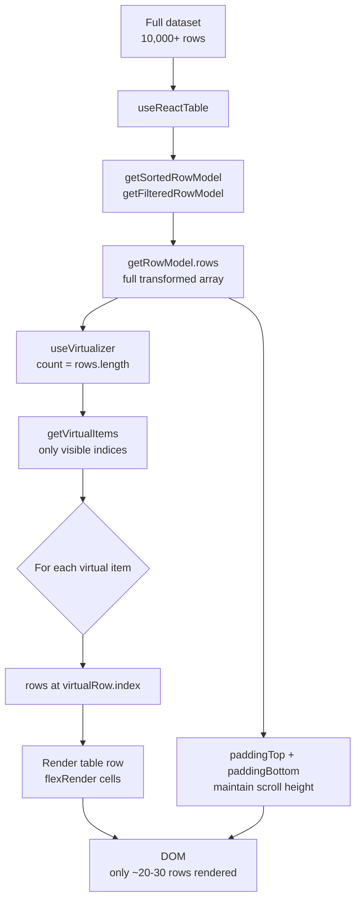

## Combining TanStack Virtual and TanStack Table

TanStack Virtual handles DOM virtualization — rendering only the rows visible in the viewport rather than the entire dataset. TanStack Table handles data transformation — sorting, filtering, pagination, and row models. Combining them produces tables that remain performant at tens of thousands of rows by keeping the rendered DOM small while Table continues to operate on the full in-memory dataset.

---

### Why Combine Them

Table has no built-in virtualization. It produces a row model — an array of row objects — but renders nothing itself. Virtual has no concept of rows, columns, or data — it virtualizes any list of sized items. The combination works because Table's `getRowModel().rows` is exactly the array Virtual needs to virtualize.

**Key Points:**
- Table produces `rows[]` — Virtual consumes it as the item list
- Virtual calculates which indices are visible and what offset each item needs
- Only visible rows are rendered as DOM nodes; off-screen rows are represented by padding space
- All of Table's transformations (sort, filter) operate on the full row array — Virtual only affects what gets rendered

---

### Core Concepts: How Virtual Works

Before combining, the key Virtual primitives:

```ts
import { useVirtualizer } from '@tanstack/react-virtual'

const rowVirtualizer = useVirtualizer({
  count: rows.length,          // total number of items
  getScrollElement: () => parentRef.current,  // scrollable container
  estimateSize: () => 48,      // estimated row height in px
  overscan: 5,                 // extra rows rendered above/below viewport
})
```

- `rowVirtualizer.getVirtualItems()` — the subset of items currently in or near the viewport
- `rowVirtualizer.getTotalSize()` — total height of all items combined (used for padding)
- Each virtual item has an `index` (position in the full array) and `start` (pixel offset from top)

---

### Basic Integration

The scroll container holds a tall inner element (sized to the total virtual height), and only visible rows are absolutely positioned within it.

```tsx
import { useReactTable, getCoreRowModel, flexRender } from '@tanstack/react-table'
import { useVirtualizer } from '@tanstack/react-virtual'
import { useRef } from 'react'

function VirtualTable({ data, columns }) {
  const parentRef = useRef<HTMLDivElement>(null)

  const table = useReactTable({
    data,
    columns,
    getCoreRowModel: getCoreRowModel(),
  })

  const rows = table.getRowModel().rows

  const rowVirtualizer = useVirtualizer({
    count: rows.length,
    getScrollElement: () => parentRef.current,
    estimateSize: () => 48,
    overscan: 10,
  })

  const virtualItems = rowVirtualizer.getVirtualItems()
  const totalSize = rowVirtualizer.getTotalSize()

  // Padding to fill space above and below rendered rows
  const paddingTop = virtualItems.length > 0 ? virtualItems[0].start : 0
  const paddingBottom =
    virtualItems.length > 0
      ? totalSize - virtualItems[virtualItems.length - 1].end
      : 0

  return (
    <div ref={parentRef} style={{ height: '600px', overflow: 'auto' }}>
      <table style={{ width: '100%', borderCollapse: 'collapse' }}>
        <thead>
          {table.getHeaderGroups().map(hg => (
            <tr key={hg.id}>
              {hg.headers.map(h => (
                <th key={h.id}>
                  {flexRender(h.column.columnDef.header, h.getContext())}
                </th>
              ))}
            </tr>
          ))}
        </thead>
        <tbody>
          {paddingTop > 0 && (
            <tr><td style={{ height: paddingTop }} /></tr>
          )}
          {virtualItems.map(virtualRow => {
            const row = rows[virtualRow.index]
            return (
              <tr key={row.id}>
                {row.getVisibleCells().map(cell => (
                  <td key={cell.id}>
                    {flexRender(cell.column.columnDef.cell, cell.getContext())}
                  </td>
                ))}
              </tr>
            )
          })}
          {paddingBottom > 0 && (
            <tr><td style={{ height: paddingBottom }} /></tr>
          )}
        </tbody>
      </table>
    </div>
  )
}
```

**Key Points:**
- The scroll container (`parentRef`) must have a fixed height and `overflow: auto` or `overflow: scroll`
- `paddingTop` and `paddingBottom` are spacer rows that maintain correct scroll height without rendering off-screen rows
- `virtualRow.index` maps back into `rows[]` — this is the bridge between Virtual and Table
- `overscan` renders a buffer of rows beyond the visible area to reduce blank flicker during fast scrolling

---

### Variable Row Heights with `measureElement`

When rows have dynamic content (multiline text, expandable sections), estimated heights are inaccurate. Virtual supports measured heights via a callback ref on each rendered row.

```tsx
const rowVirtualizer = useVirtualizer({
  count: rows.length,
  getScrollElement: () => parentRef.current,
  estimateSize: () => 48,
  overscan: 10,
  measureElement:
    typeof window !== 'undefined' &&
    navigator.userAgent.indexOf('Firefox') === -1
      ? element => element?.getBoundingClientRect().height
      : undefined,
})
```

```tsx
{virtualItems.map(virtualRow => {
  const row = rows[virtualRow.index]
  return (
    <tr
      key={row.id}
      data-index={virtualRow.index}
      ref={node => rowVirtualizer.measureElement(node)}
    >
      {row.getVisibleCells().map(cell => (
        <td key={cell.id}>
          {flexRender(cell.column.columnDef.cell, cell.getContext())}
        </td>
      ))}
    </tr>
  )
})}
```

**Key Points:**
- `data-index` on the row element lets `measureElement` identify which virtual item to update
- Virtual stores measured heights and uses them for future scroll calculations — initial renders use `estimateSize` until measurement completes
- [Unverified — the Firefox caveat around `getBoundingClientRect` behavior may vary by browser version; verify if Firefox support is required]
- When row content changes height (e.g., row expansion), the virtualizer needs to re-measure — call `rowVirtualizer.measure()` after the DOM update

---

### Sticky Headers

The `<thead>` must be sticky so it remains visible while the body scrolls. This is a CSS concern, not a Virtual concern, but it interacts with the virtualization layout.

```tsx
<table style={{ width: '100%', borderCollapse: 'collapse' }}>
  <thead style={{ position: 'sticky', top: 0, background: 'white', zIndex: 1 }}>
    {table.getHeaderGroups().map(hg => (
      <tr key={hg.id}>
        {hg.headers.map(h => (
          <th key={h.id}>
            {flexRender(h.column.columnDef.header, h.getContext())}
          </th>
        ))}
      </tr>
    ))}
  </thead>
  <tbody>
    {/* virtual rows */}
  </tbody>
</table>
```

**Key Points:**
- `position: sticky; top: 0` keeps the header pinned at the top of the scroll container
- `zIndex` prevents virtual rows from rendering visually on top of the header during scroll
- The scroll container itself must not have `position: static` for sticky to work correctly — `overflow: auto` on the container is compatible with sticky children [Inference — exact behavior depends on browser and CSS stacking context]

---

### Sorting with Virtualization

Table sorting recomputes `getRowModel().rows` — Virtual receives the new sorted array and scrolls back to the top. Scroll position must be reset manually when sort changes.

```tsx
const [sorting, setSorting] = useState<SortingState>([])

const table = useReactTable({
  data,
  columns,
  state: { sorting },
  onSortingChange: updater => {
    setSorting(updater)
    rowVirtualizer.scrollToIndex(0)
  },
  getCoreRowModel: getCoreRowModel(),
  getSortedRowModel: getSortedRowModel(),
})
```

**Key Points:**
- Without `scrollToIndex(0)`, the viewport stays at whatever scroll offset it was — the user sees the middle of the newly sorted data without context
- `getSortedRowModel()` must be included in `useReactTable` for client-side sorting to function
- Sorting is entirely handled by Table — Virtual simply virtualizes whatever order `rows` arrives in

---

### Filtering with Virtualization

Filtering changes `rows.length` — Virtual's `count` updates accordingly, and scroll position should reset.

```tsx
const [columnFilters, setColumnFilters] = useState<ColumnFiltersState>([])

const table = useReactTable({
  data,
  columns,
  state: { columnFilters },
  onColumnFiltersChange: updater => {
    setColumnFilters(updater)
    rowVirtualizer.scrollToIndex(0)
  },
  getCoreRowModel: getCoreRowModel(),
  getFilteredRowModel: getFilteredRowModel(),
})

const rows = table.getRowModel().rows

// rows.length passed to virtualizer count — updates automatically on filter change
const rowVirtualizer = useVirtualizer({
  count: rows.length,
  getScrollElement: () => parentRef.current,
  estimateSize: () => 48,
  overscan: 10,
})
```

**Key Points:**
- `count: rows.length` is reactive — when filtering reduces `rows`, Virtual adjusts total height and virtual items automatically
- `getFilteredRowModel()` must be registered in `useReactTable`
- Resetting scroll on filter change prevents the virtualizer from referencing indices that no longer exist in the filtered set

---

### Row Expansion with Virtualization

Expanded rows change the DOM height without changing `rows.length`. Virtual must re-measure after expansion state changes.

```tsx
const [expanded, setExpanded] = useState<ExpandedState>({})

const table = useReactTable({
  data,
  columns,
  state: { expanded },
  onExpandedChange: setExpanded,
  getExpandedRowModel: getExpandedRowModel(),
  getSubRows: row => row.subRows,
  getCoreRowModel: getCoreRowModel(),
})

// After expansion changes, re-measure all items
useEffect(() => {
  rowVirtualizer.measure()
}, [expanded, rowVirtualizer])
```

**Key Points:**
- Expanded sub-rows appear as additional entries in `getRowModel().rows` — they are new rows in the array, not height changes to existing rows
- `rowVirtualizer.measure()` forces re-measurement of all rendered elements — call it after any state change that affects row heights or count
- [Inference] For deeply nested expansion, the row count change is automatically reflected in `count: rows.length`; the primary concern is scroll position and re-measurement timing

---

### Column Virtualization for Wide Tables

When tables have many columns, column virtualization can be added alongside row virtualization using a second `useVirtualizer` instance.

```tsx
const columnVirtualizer = useVirtualizer({
  count: table.getVisibleLeafColumns().length,
  getScrollElement: () => parentRef.current,
  estimateSize: index =>
    table.getVisibleLeafColumns()[index].getSize(),
  horizontal: true,
  overscan: 3,
})

const virtualColumns = columnVirtualizer.getVirtualItems()
const totalColumnWidth = columnVirtualizer.getTotalSize()
```

```tsx
<tbody>
  {paddingTop > 0 && <tr><td style={{ height: paddingTop }} /></tr>}
  {virtualRows.map(virtualRow => {
    const row = rows[virtualRow.index]
    return (
      <tr key={row.id}>
        {paddingLeft > 0 && <td style={{ width: paddingLeft }} />}
        {virtualColumns.map(virtualCol => {
          const cell = row.getVisibleCells()[virtualCol.index]
          return (
            <td key={cell.id}>
              {flexRender(cell.column.columnDef.cell, cell.getContext())}
            </td>
          )
        })}
        {paddingRight > 0 && <td style={{ width: paddingRight }} />}
      </tr>
    )
  })}
  {paddingBottom > 0 && <tr><td style={{ height: paddingBottom }} /></tr>}
</tbody>
```

**Key Points:**
- `horizontal: true` tells Virtual to measure scroll position on the x-axis
- Column widths must be defined on column defs (`size` property) for `estimateSize` to be accurate
- Both virtualizers share the same scroll container — horizontal and vertical scroll are handled by the same `parentRef`
- [Inference] Column virtualization is most beneficial when column count exceeds ~20; below that, the overhead of two virtualizers may not be justified

---

### `scrollToIndex` for Programmatic Navigation

Virtual exposes `scrollToIndex` for jumping to a specific row — useful for "jump to row" features or post-mutation focus.

```ts
rowVirtualizer.scrollToIndex(targetIndex, { align: 'start' | 'center' | 'end' | 'auto' })
```

```tsx
function handleJumpToRow(rowId: string) {
  const index = rows.findIndex(r => r.id === rowId)
  if (index !== -1) {
    rowVirtualizer.scrollToIndex(index, { align: 'start' })
  }
}
```

**Key Points:**
- `align: 'auto'` scrolls only if the item is not already visible — the least disruptive option for most cases
- `align: 'start'` brings the item to the top of the viewport
- The index must be in the current `rows` array — if the target row is filtered out, it will not be found
- [Inference] After a mutation that adds a new row, the row may not yet be in `rows` if Query has not refetched; call `scrollToIndex` after the data update settles

---

### Architecture Diagram



---

### Performance Considerations

**`estimateSize` accuracy**

Virtual uses `estimateSize` for initial layout. Inaccurate estimates cause scroll position jumps as items are measured. Measure a representative row before setting this value.

**Stable `data` reference**

If `data` is recreated on every render (e.g., inside the component body), Table recomputes its row model and Virtual recalculates item positions on every render cycle. Define `data` outside the component or memoize it.

```ts
// Outside component or memoized
const data = useMemo(() => processRawData(raw), [raw])
```

**`overscan` tuning**

Higher `overscan` reduces blank-row flicker during fast scroll but increases DOM node count. A value between 5–15 is typical; adjust based on row complexity and scroll speed requirements. [Inference — optimal value varies by use case]

**Avoid `key` on the scroll container**

Remounting the scroll container resets scroll position and forces Virtual to restart measurement. Keep the container stable across re-renders.

---

### Common Pitfalls

**Pitfall: Fixed height container not set**

Virtual requires a scroll container with a defined height. Without it, all rows render because the container expands to fit content and never scrolls — defeating virtualization entirely.

**Pitfall: `count` not updated after filter**

If `count` is set once from the initial row count rather than reactively from `rows.length`, Virtual renders stale indices after filtering. Always derive `count` from `table.getRowModel().rows.length` directly.

**Pitfall: Padding rows using `<td colSpan>` instead of height**

Padding spacers should use `height` on a single `<td>` inside a `<tr>`. Using `colSpan` equal to column count is a common approach but can interfere with column width calculations in some browser/CSS combinations. [Inference]

**Pitfall: `ref` instability on measured rows**

If the `ref` callback passed to each row is recreated on every render (e.g., defined inline as an arrow function), Virtual receives redundant measurement calls. Use a stable ref callback or the pattern from Virtual's official examples where `measureElement` is passed directly.

**Pitfall: Sorting without resetting scroll**

After a sort, `rows[0]` is a different record than before. Without `scrollToIndex(0)`, the user sees whatever rows happen to fall at the previous scroll offset — disorienting in large datasets.

---

**Related Topics:**
- Combining Virtual, Table, and Query for server-paginated virtualized tables
- Infinite scroll with `useInfiniteQuery` feeding into a virtualized Table
- Fixed and pinned columns alongside row virtualization
- Virtual grid layout for non-table data (cards, tiles)
- Window-based virtualization vs. container-based virtualization tradeoffs
- Accessible virtualized tables — ARIA roles and keyboard navigation considerations
- TanStack Table column sizing and resizing with Virtual column widths