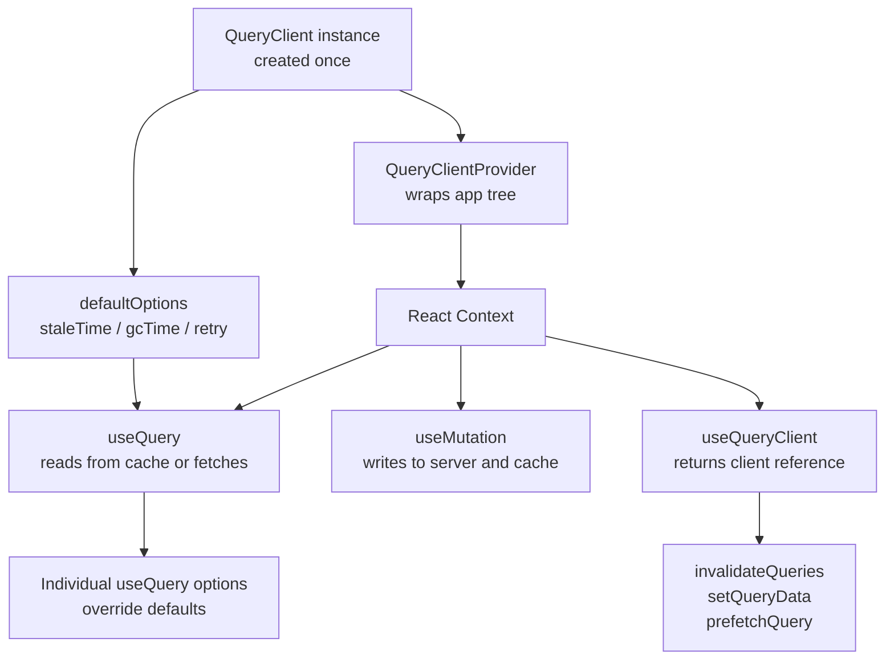

## Sharing QueryClient Across the App

`QueryClient` is the central coordinator of TanStack Query — it holds the cache, manages query lifecycles, handles retries, and processes mutations. How it is created, where it lives, and how components access it determines the correctness, testability, and performance of the entire data layer. Getting this architecture right matters more than most implementation details in a Query-based application.

---

### What `QueryClient` Is

`QueryClient` is a class instance that owns:

- The **query cache** — all fetched data, indexed by query key
- The **mutation cache** — in-flight and completed mutations
- **Default options** — retry behavior, stale time, cache time, refetch triggers
- **Observers** — subscriptions from active `useQuery` calls

A single `QueryClient` instance should serve the entire application for the duration of a session. Creating multiple instances partitions the cache — queries in one client are invisible to another.

---

### Creating the Instance: Where It Lives

**Key Points:**
- The instance must be created **outside** the render cycle — creating it inside a component body recreates it on every render, destroying the cache
- For React applications, the standard approach is module-level creation or `useState`/`useRef` inside the root component

**Module-level (simplest, most common):**

```ts
// queryClient.ts
import { QueryClient } from '@tanstack/react-query'

export const queryClient = new QueryClient({
  defaultOptions: {
    queries: {
      staleTime: 1000 * 60,       // 1 minute
      gcTime: 1000 * 60 * 10,     // 10 minutes (formerly cacheTime in v4)
      retry: 2,
      refetchOnWindowFocus: true,
    },
    mutations: {
      retry: 0,
    },
  },
})
```

**Key Points:**
- Module-level creation means the instance is shared across the entire module graph — any file that imports `queryClient.ts` gets the same instance
- This is appropriate for client-only SPAs
- For SSR or testing, module-level singletons are problematic — see SSR and testing sections below

---

### Providing the Instance: `QueryClientProvider`

All components that use TanStack Query hooks must be descendants of `QueryClientProvider`.

```tsx
// main.tsx
import { QueryClientProvider } from '@tanstack/react-query'
import { queryClient } from './queryClient'
import App from './App'

ReactDOM.createRoot(document.getElementById('root')!).render(
  <QueryClientProvider client={queryClient}>
    <App />
  </QueryClientProvider>
)
```

**Key Points:**
- `QueryClientProvider` injects the `QueryClient` instance into React context
- All `useQuery`, `useMutation`, `useQueryClient`, and related hooks read from this context
- The provider should wrap the entire app — placing it lower in the tree limits Query to the subtree it covers
- Multiple `QueryClientProvider` instances can be nested, but inner ones override the outer for their subtree — this is rarely intentional

---

### Accessing the Instance: `useQueryClient`

Inside any component or custom hook beneath the provider, `useQueryClient` returns the active client.

```ts
import { useQueryClient } from '@tanstack/react-query'

function SomeComponent() {
  const queryClient = useQueryClient()

  function handleAction() {
    queryClient.invalidateQueries({ queryKey: ['posts'] })
  }

  // ...
}
```

**Key Points:**
- `useQueryClient` reads from context — it always returns the client provided by the nearest `QueryClientProvider`
- Do not import the module-level singleton directly inside components if context injection is in use — `useQueryClient` is the correct access pattern for component code
- Outside React (event handlers, utilities, store actions), importing the module-level instance directly is acceptable

---

### Default Options

`QueryClient` default options apply to all queries and mutations unless overridden at the call site. Setting them centrally avoids repeating configuration across every `useQuery`.

```ts
const queryClient = new QueryClient({
  defaultOptions: {
    queries: {
      staleTime: 1000 * 30,         // data considered fresh for 30 seconds
      gcTime: 1000 * 60 * 5,        // unused cache entries garbage collected after 5 minutes
      retry: (failureCount, error) => {
        if (error instanceof NotFoundError) return false
        return failureCount < 3
      },
      refetchOnWindowFocus: false,   // disable for apps where background refetch is disruptive
    },
  },
})
```

**Key Points:**
- `staleTime` defaults to `0` — without setting it, every component mount triggers a background refetch even for data just fetched
- `gcTime` controls how long unused (unobserved) cache entries are retained — setting it too low causes unnecessary refetches when a component unmounts and remounts
- `retry` can be a function — use it to skip retries on 4xx errors that will not resolve with retrying
- Individual `useQuery` calls can override any default via their own options object

---

### Per-Query Override of Defaults

```ts
// Global default: staleTime = 30s
// This query overrides to 5 minutes
const { data } = useQuery({
  queryKey: ['config'],
  queryFn: fetchAppConfig,
  staleTime: 1000 * 60 * 5,
  gcTime: Infinity,   // never garbage collect app config
})
```

**Key Points:**
- Options passed directly to `useQuery` take precedence over `defaultOptions`
- `gcTime: Infinity` is appropriate for data that never becomes invalid during a session (e.g., static configuration, enum lists)
- [Inference] Overriding at the query level is the correct place for data-specific cache behavior; `defaultOptions` should represent sensible baseline behavior for the majority of queries

---

### SSR: Per-Request Instances

In server-side rendering, a module-level singleton is shared across all requests on the server — leaking data between users. Each request must create its own `QueryClient`.

```ts
// In a Next.js or Remix loader / server component
import { QueryClient } from '@tanstack/react-query'

export async function getServerSideProps() {
  const queryClient = new QueryClient({
    defaultOptions: {
      queries: { staleTime: 60 * 1000 },
    },
  })

  await queryClient.prefetchQuery({
    queryKey: ['posts'],
    queryFn: fetchPosts,
  })

  return {
    props: {
      dehydratedState: dehydrate(queryClient),
    },
  }
}
```

```tsx
// _app.tsx (Next.js pages router)
import { HydrationBoundary, QueryClientProvider } from '@tanstack/react-query'
import { useState } from 'react'

export default function App({ Component, pageProps }) {
  const [queryClient] = useState(() => new QueryClient())

  return (
    <QueryClientProvider client={queryClient}>
      <HydrationBoundary state={pageProps.dehydratedState}>
        <Component {...pageProps} />
      </HydrationBoundary>
    </QueryClientProvider>
  )
}
```

**Key Points:**
- `useState(() => new QueryClient())` creates the client once per component mount using a lazy initializer — it is not recreated on re-render
- `dehydrate` serializes the server-side cache into a plain object that can be passed as a prop
- `HydrationBoundary` rehydrates the serialized state into the client-side cache on mount — components find data already available without a client-side fetch
- The server instance is discarded after the response; only the client instance persists in the browser

---

### Testing: Isolated Instances Per Test

Tests must not share a `QueryClient` — cache state from one test contaminates others. Create a fresh instance per test.

```ts
// test-utils.tsx
import { QueryClient, QueryClientProvider } from '@tanstack/react-query'
import { render } from '@testing-library/react'

export function createTestQueryClient() {
  return new QueryClient({
    defaultOptions: {
      queries: {
        retry: false,       // disable retries so tests fail fast
        gcTime: Infinity,   // prevent garbage collection during test
      },
    },
    logger: {
      log: console.log,
      warn: console.warn,
      error: () => {},      // suppress error logging in test output
    },
  })
}

export function renderWithQuery(ui: React.ReactElement) {
  const queryClient = createTestQueryClient()
  return {
    ...render(
      <QueryClientProvider client={queryClient}>
        {ui}
      </QueryClientProvider>
    ),
    queryClient,
  }
}
```

```ts
// SomeComponent.test.tsx
import { renderWithQuery } from './test-utils'

test('displays user list', async () => {
  const { queryClient } = renderWithQuery(<UserList />)

  // Pre-populate cache to avoid real fetches
  queryClient.setQueryData(['users'], mockUsers)

  // ...assertions
})
```

**Key Points:**
- `retry: false` is critical in tests — without it, failed queries retry up to 3 times, causing slow tests
- `queryClient.setQueryData` pre-populates the cache synchronously — components render with data immediately, no async waiting for fetch
- Returning `queryClient` from `renderWithQuery` allows tests to assert on cache state directly
- [Inference] The `logger.error` suppression avoids noisy output when testing error states intentionally

---

### TanStack Router Context Injection

When using TanStack Router, the `QueryClient` can be injected via router context rather than imported as a module singleton — improving modularity and testability.

```ts
// router.ts
import { createRouter } from '@tanstack/react-router'
import { routeTree } from './routeTree.gen'
import type { QueryClient } from '@tanstack/react-query'

export interface RouterContext {
  queryClient: QueryClient
}

export const router = createRouter({
  routeTree,
  context: { queryClient: undefined! },
})
```

```tsx
// main.tsx
const queryClient = new QueryClient()

<QueryClientProvider client={queryClient}>
  <RouterProvider router={router} context={{ queryClient }} />
</QueryClientProvider>
```

```ts
// Any route loader
loader: ({ context: { queryClient } }) =>
  queryClient.ensureQueryData(postsQueryOptions)
```

**Key Points:**
- Route loaders receive `queryClient` via context — no import of a module-level singleton needed
- In tests, a different `QueryClient` can be injected via context, making route loaders fully testable in isolation
- `QueryClientProvider` still wraps `RouterProvider` — component-level hooks (`useQueryClient`) continue to work via React context

---

### Multiple Clients: Intentional Partitioning

Rare but valid: some applications need separate caches for separate concerns — for example, user-generated content cached independently from application configuration.

```tsx
const appConfigClient = new QueryClient({
  defaultOptions: { queries: { staleTime: Infinity } },
})

const userDataClient = new QueryClient({
  defaultOptions: { queries: { staleTime: 1000 * 30 } },
})

function App() {
  return (
    <QueryClientProvider client={appConfigClient}>
      <QueryClientProvider client={userDataClient}>
        <Main />
      </QueryClientProvider>
    </QueryClientProvider>
  )
}
```

**Key Points:**
- Components use `useQueryClient()` — which returns the nearest provider's client
- To access an outer client from inside the inner provider, pass it explicitly via props or a separate context
- [Inference] This pattern is uncommon and adds complexity; prefer a single client with query-level `staleTime` and `gcTime` overrides in most cases

---

### Architecture Overview



---

### Common Pitfalls

**Pitfall: Creating `QueryClient` inside a component body**

```tsx
// Wrong — recreated on every render
function App() {
  const queryClient = new QueryClient() // ← destroys cache on every render
  return <QueryClientProvider client={queryClient}>...</QueryClientProvider>
}

// Correct
const queryClient = new QueryClient()
function App() {
  return <QueryClientProvider client={queryClient}>...</QueryClientProvider>
}
```

**Pitfall: Module-level singleton in SSR**

On the server, module-level state is shared across concurrent requests. User A's cached data is visible to User B. Always create per-request instances on the server.

**Pitfall: Importing the singleton directly in components instead of `useQueryClient`**

Importing the singleton directly in component code bypasses context — if the component is ever rendered under a different provider (in tests or a nested partition), it silently uses the wrong client.

**Pitfall: Not setting `retry: false` in tests**

Default retry behavior causes failed queries to retry three times before settling. Tests that expect failure states wait through all retries, making them slow and timing-dependent.

**Pitfall: Setting `gcTime` too low globally**

If `gcTime` is set to a very short value (or `0`), cache entries are discarded quickly after a component unmounts. Navigating back to the same route triggers a full refetch. Pair `gcTime` with `staleTime` intentionally: `staleTime` controls freshness, `gcTime` controls how long stale-but-cached data is retained.

---

**Related Topics:**
- `dehydrate` and `hydrate` for SSR cache transfer in detail
- `QueryCache` and `MutationCache` event listeners for logging and error reporting
- Persisting the Query cache to `localStorage` or `IndexedDB` with `createSyncStoragePersister`
- `queryClient.setQueryData` for optimistic updates and test seeding
- `queryClient.prefetchQuery` vs `ensureQueryData` — differences and when to use each
- Configuring global error handlers via `QueryCache` `onError` callback
- React Query DevTools setup and usage for cache inspection