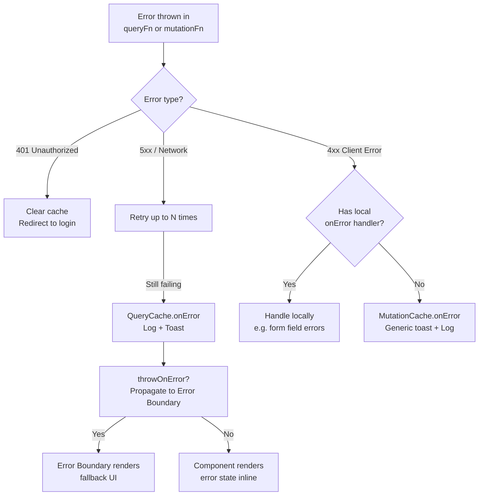

## Unified Error Handling Strategies

Error handling in TanStack applications is distributed by default — each `useQuery` and `useMutation` call handles its own errors locally. A unified strategy centralizes the common cases (logging, toast notifications, authentication redirects) while preserving the ability to handle specific errors at the call site. The goal is a consistent error experience without duplicating logic across every data-fetching hook.

---

### Error Sources in TanStack Query

Before centralizing, understand where errors originate:

- **`queryFn` throws or returns a rejected Promise** — Query catches it and stores it in `query.state.error`
- **`mutationFn` throws or returns a rejected Promise** — Mutation catches it and stores it in `mutation.error`
- **Network errors** — fetch rejections, timeouts
- **HTTP errors** — servers that return `4xx`/`5xx` with a response body; `fetch` does not throw on non-2xx by default — the `queryFn` must throw explicitly
- **Parsing errors** — malformed JSON, schema validation failures

**Key Points:**
- `fetch` considers any completed HTTP response a success — a `404` or `500` does not throw unless the `queryFn` checks `res.ok` and throws
- Error objects stored in cache are whatever was thrown — they can be `Error` instances, plain objects, or strings depending on the `queryFn` implementation
- Standardizing the thrown error type across all `queryFn` implementations is the first step toward unified handling

---

### Standardizing the Error Type

A custom error class that carries HTTP status, a message, and optional structured data makes downstream handling consistent.

```ts
// errors/AppError.ts
export class AppError extends Error {
  constructor(
    public readonly status: number,
    message: string,
    public readonly data?: unknown,
  ) {
    super(message)
    this.name = 'AppError'
  }
}

export function isAppError(error: unknown): error is AppError {
  return error instanceof AppError
}
```

```ts
// lib/fetch.ts
export async function apiFetch<T>(
  url: string,
  options?: RequestInit,
): Promise<T> {
  const res = await fetch(url, options)

  if (!res.ok) {
    let data: unknown
    try { data = await res.json() } catch { data = undefined }
    throw new AppError(res.status, `HTTP ${res.status}: ${res.statusText}`, data)
  }

  return res.json() as Promise<T>
}
```

**Key Points:**
- All `queryFn` and `mutationFn` implementations that use `apiFetch` throw `AppError` consistently
- `isAppError` is a type guard — error handling code can narrow the type before accessing `.status` or `.data`
- Keeping `AppError` as a true `Error` subclass means stack traces are preserved and `instanceof` checks work correctly
- [Inference] Teams that use a validation library (Zod, Valibot) can extend this to produce `ValidationError` subclasses for parse failures, keeping all structured errors under a shared hierarchy

---

### Global Error Handling via `QueryCache`

`QueryCache` accepts an `onError` callback that fires for every query error across the entire application. This is the primary hook for centralized logging and notifications.

```ts
// queryClient.ts
import { QueryClient, QueryCache, MutationCache } from '@tanstack/react-query'
import { toast } from 'your-toast-library'
import { isAppError } from './errors/AppError'

export const queryClient = new QueryClient({
  queryCache: new QueryCache({
    onError: (error, query) => {
      // Only notify for background refetch errors, not initial load errors
      // (initial load errors should be handled by error boundaries or components)
      if (query.state.data !== undefined) {
        const message = isAppError(error)
          ? `Data refresh failed: ${error.message}`
          : 'An unexpected error occurred'
        toast.error(message)
      }
    },
  }),
  mutationCache: new MutationCache({
    onError: (error, _variables, _context, mutation) => {
      if (mutation.options.onError) return // let local handler take over
      const message = isAppError(error)
        ? error.message
        : 'Mutation failed unexpectedly'
      toast.error(message)
    },
  }),
})
```

**Key Points:**
- `QueryCache.onError` receives the error and the full `Query` object — `query.state.data !== undefined` distinguishes background refetch failures (data was previously loaded) from initial fetch failures
- `MutationCache.onError` checks `mutation.options.onError` — if the call site provided its own error handler, the global handler defers to it, preventing double-notification
- `query.queryKey` is available in `QueryCache.onError` — use it to customize messages per query type
- [Inference] This pattern fires for every query error including retried-and-ultimately-failed queries; the callback runs after all retries are exhausted

---

### Global Retry Configuration

Retry behavior is the first line of error mitigation. Configuring it globally avoids retrying errors that will never recover.

```ts
const queryClient = new QueryClient({
  defaultOptions: {
    queries: {
      retry: (failureCount, error) => {
        if (isAppError(error)) {
          // Never retry client errors — they will not resolve
          if (error.status >= 400 && error.status < 500) return false
        }
        return failureCount < 3
      },
      retryDelay: attemptIndex => Math.min(1000 * 2 ** attemptIndex, 30000),
    },
    mutations: {
      retry: 0, // mutations are not idempotent by default — do not retry
    },
  },
})
```

**Key Points:**
- `4xx` errors indicate client or authorization problems — retrying will not change the outcome
- `5xx` errors and network failures may be transient — retrying is reasonable
- `retryDelay` with exponential backoff avoids hammering a degraded server
- Mutations default to no retry — submitting a form twice on network failure can produce duplicate records; retry only if the mutation endpoint is known to be idempotent

---

### Error Boundaries for Query Errors

React error boundaries catch errors thrown during render. TanStack Query can be configured to throw errors into the React tree via `throwOnError`, making error boundaries the display layer for fatal query failures.

```ts
const { data } = useQuery({
  queryKey: ['user', userId],
  queryFn: fetchUser,
  throwOnError: true,   // throws into the nearest error boundary on failure
})
```

```tsx
// components/QueryErrorBoundary.tsx
import { QueryErrorResetBoundary } from '@tanstack/react-query'
import { ErrorBoundary } from 'react-error-boundary'

function QueryErrorBoundary({ children }: { children: React.ReactNode }) {
  return (
    <QueryErrorResetBoundary>
      {({ reset }) => (
        <ErrorBoundary
          onReset={reset}
          fallbackRender={({ error, resetErrorBoundary }) => (
            <div>
              <p>
                {isAppError(error)
                  ? `Error ${error.status}: ${error.message}`
                  : 'Something went wrong'}
              </p>
              <button onClick={resetErrorBoundary}>Try again</button>
            </div>
          )}
        >
          {children}
        </ErrorBoundary>
      )}
    </QueryErrorResetBoundary>
  )
}
```

**Key Points:**
- `QueryErrorResetBoundary` coordinates with `react-error-boundary` — calling `reset` clears the error boundary state and retries the failed query
- `throwOnError` can be set globally in `defaultOptions.queries` or per query — setting it globally means all query failures propagate to error boundaries, which requires error boundaries to be placed carefully throughout the tree
- Without `QueryErrorResetBoundary`, resetting the error boundary does not retry the query — it just re-renders, and the error re-throws immediately
- [Inference] `throwOnError: (error) => error.status >= 500` is a useful pattern — server errors go to error boundaries while client errors (4xx) are handled inline

---

### Inline Error Handling at the Call Site

Not all errors warrant a global response. Field-level validation errors from mutations, for example, belong on form fields, not in a toast.

```tsx
function CreatePostForm() {
  const mutation = useMutation({
    mutationFn: createPost,
    onError: (error) => {
      if (isAppError(error) && error.status === 422) {
        // Validation error — handle in form, not globally
        applyServerErrors(error.data)
        return
      }
      // For other errors, fall through to global MutationCache.onError
      // by NOT calling anything here (global handler checks mutation.options.onError)
    },
    onSuccess: () => {
      queryClient.invalidateQueries({ queryKey: ['posts'] })
    },
  })
  // ...
}
```

**Key Points:**
- The local `onError` intercepts specific error types; for errors it does not handle, it can choose whether to re-throw, notify, or stay silent
- The `MutationCache.onError` check (`if (mutation.options.onError) return`) in the global handler means providing any local `onError` suppresses the global toast — handle all cases locally if you opt in
- [Inference] A more granular approach is to have the local handler set a flag on the error or re-throw specific types, and have the global handler check the flag — but this adds coupling

---

### Centralized Error Logging

Production applications need errors sent to a logging or monitoring service. `QueryCache.onError` and `MutationCache.onError` are the right attachment points.

```ts
import * as Sentry from '@sentry/react'

const queryClient = new QueryClient({
  queryCache: new QueryCache({
    onError: (error, query) => {
      Sentry.captureException(error, {
        extra: {
          queryKey: query.queryKey,
          queryHash: query.queryHash,
        },
      })
    },
  }),
  mutationCache: new MutationCache({
    onError: (error, variables, _context, mutation) => {
      Sentry.captureException(error, {
        extra: {
          mutationKey: mutation.options.mutationKey,
          variables,
        },
      })
    },
  }),
})
```

**Key Points:**
- `query.queryHash` is a stable string representation of the query key — useful for grouping errors by query type in the logging service
- `variables` in `MutationCache.onError` contains the mutation input — log with caution if inputs contain sensitive data (passwords, PII)
- [Inference] Logging every retry failure is noisy; consider logging only after all retries are exhausted, which is when `QueryCache.onError` fires

---

### Authentication Errors: Global Redirect

`401 Unauthorized` errors typically require a global response — redirecting to login — regardless of which query triggered them.

```ts
import { router } from './router'

const queryClient = new QueryClient({
  queryCache: new QueryCache({
    onError: (error) => {
      if (isAppError(error) && error.status === 401) {
        queryClient.clear()   // clear cache — it belongs to the now-logged-out user
        router.navigate({ to: '/login', search: { redirect: window.location.pathname } })
      }
    },
  }),
  mutationCache: new MutationCache({
    onError: (error) => {
      if (isAppError(error) && error.status === 401) {
        queryClient.clear()
        router.navigate({ to: '/login' })
      }
    },
  }),
})
```

**Key Points:**
- `queryClient.clear()` removes all cached data — necessary because cache entries belong to the authenticated session
- Passing the current path as a `redirect` search param allows the login page to return the user to their original destination after re-authentication
- [Inference] If multiple queries fail with `401` simultaneously (e.g., on page load after token expiry), this handler fires multiple times — deduplicate with a flag or use an interceptor layer in `apiFetch`
- `router.navigate` assumes TanStack Router; adapt to `window.location` or your router's imperative API as appropriate

---

### Deduplicating Concurrent Error Responses

When several queries fail simultaneously with the same error type (e.g., all return `401` when a token expires), the global handler fires once per query. Deduplication prevents multiple toasts or multiple redirects.

```ts
let isRedirecting = false

const queryClient = new QueryClient({
  queryCache: new QueryCache({
    onError: (error) => {
      if (isAppError(error) && error.status === 401) {
        if (isRedirecting) return
        isRedirecting = true
        queryClient.clear()
        router.navigate({ to: '/login' }).then(() => {
          isRedirecting = false
        })
      }
    },
  }),
})
```

**Key Points:**
- A module-level flag is a simple but effective deduplication mechanism for synchronous bursts of errors
- [Inference] This flag approach is not safe across async boundaries if navigation takes time — resetting it in the navigation callback mitigates this
- More robust solutions involve an in-flight token refresh queue, but that is typically handled at the `apiFetch` level rather than in Query's error callbacks

---

### Error Handling Decision Tree



---

### Common Pitfalls

**Pitfall: `fetch` not throwing on non-2xx responses**

The most common source of silent errors. `fetch` resolves for any completed HTTP response. Without checking `res.ok` and throwing, `queryFn` returns `undefined` or a partial object on error responses, and Query considers the query successful.

**Pitfall: Double-notification from global and local handlers**

If both `MutationCache.onError` and a local `onError` show a toast, the user sees two notifications for one failure. The global handler must check whether a local handler is present and defer, or the local handler must suppress the global handler explicitly.

**Pitfall: `throwOnError: true` globally without placing error boundaries**

If all query errors throw into the React tree but no error boundary catches them, the entire app unmounts. Place `QueryErrorBoundary` at route boundaries and around critical sections before enabling `throwOnError` globally.

**Pitfall: Logging sensitive mutation variables**

`variables` in `MutationCache.onError` contains the full mutation input. Logging it directly to an external service may expose passwords, tokens, or PII. Sanitize or omit sensitive fields before logging.

**Pitfall: Not clearing the cache on logout or session expiry**

After a `401` redirect to login, if the cache is not cleared, the next authenticated user (or the same user after re-login) may see stale data from the previous session. Always call `queryClient.clear()` on session termination.

---

**Related Topics:**
- Implementing a token refresh interceptor in `apiFetch` before errors reach Query
- `useQuery` `select` option for transforming or validating response shape before caching
- Suspense mode error propagation and `useErrorBoundary` interaction
- Per-route error boundaries with TanStack Router `errorComponent`
- Structuring server validation error responses for predictable client-side mapping
- Offline detection and pausing queries with `networkMode` configuration
- React Query DevTools for inspecting error state and query retry history