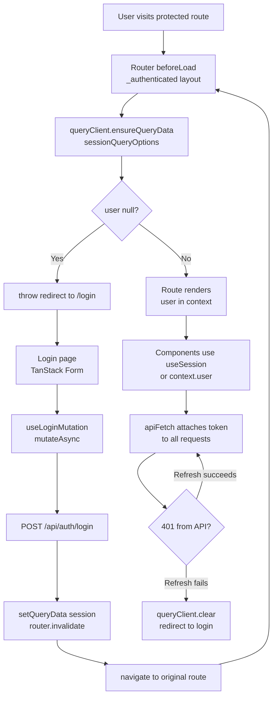

## Authentication Patterns Across TanStack Libraries

Authentication state touches every layer of a TanStack application — routing enforces access, Query fetches and caches user identity, Form handles credential input, and all data-fetching must carry auth tokens. None of these libraries owns authentication; each plays a role in a coordinated system. The patterns here describe how to wire authentication state through all of them without redundancy or inconsistency.

---

### Authentication as Shared State

Authentication state — whether a user is logged in, who they are, and what token represents them — is not owned by any single TanStack library. The architecture question is where this state lives and how each library reads from it.

**Common ownership models:**

- **Query as the source of truth** — a `['session']` or `['me']` query holds the user object; components and routes derive auth state from it
- **External store** — Zustand, Jotai, or a plain module-level variable holds the token and user; Query and Router read from it
- **Cookie/session-based** — token lives in an HttpOnly cookie; Query fetches `/api/me` to determine identity; no token management in JS

**Key Points:**
- Query is a natural fit for session state because it already handles staleness, background refresh, and cache invalidation
- Token storage (memory vs. `localStorage` vs. cookie) is a security decision that precedes the TanStack architecture; these patterns apply regardless of where the token is stored
- [Inference] Using Query as the auth source of truth simplifies the architecture — a single `useQuery(['session'])` becomes the canonical check rather than synchronizing separate auth state with Query cache

---

### Session Query: The Auth Source of Truth

A dedicated query that fetches the current authenticated user serves as the application's auth state.

```ts
// queries/session.ts
import { queryOptions } from '@tanstack/react-query'
import { AppError } from '../errors/AppError'

export type SessionUser = {
  id: string
  name: string
  email: string
  roles: string[]
}

export const sessionQueryOptions = queryOptions({
  queryKey: ['session'],
  queryFn: async (): Promise<SessionUser | null> => {
    const res = await fetch('/api/me')
    if (res.status === 401) return null   // not authenticated — not an error
    if (!res.ok) throw new AppError(res.status, 'Failed to fetch session')
    return res.json()
  },
  staleTime: 1000 * 60 * 5,   // session considered fresh for 5 minutes
  retry: false,                 // do not retry session checks
})
```

```ts
// hooks/useSession.ts
import { useQuery } from '@tanstack/react-query'
import { sessionQueryOptions } from '../queries/session'

export function useSession() {
  const { data: user, isLoading, isError } = useQuery(sessionQueryOptions)
  return {
    user,
    isAuthenticated: user !== null && user !== undefined,
    isLoading,
    isError,
  }
}
```

**Key Points:**
- `401` returns `null` rather than throwing — unauthenticated state is valid, not an error
- `retry: false` avoids repeated session checks when the user is genuinely unauthenticated
- `staleTime` should be long enough to avoid refetching on every navigation but short enough to detect session expiry in long-running sessions
- All other parts of the app — Router guards, component access checks — derive their auth state from this single query

---

### TanStack Router: Route Guards with `beforeLoad`

TanStack Router's `beforeLoad` runs before the route renders and before the loader fetches data. It is the correct location for authentication checks.

```ts
// routes/__root.tsx
import { createRootRouteWithContext } from '@tanstack/react-router'
import type { QueryClient } from '@tanstack/react-query'
import type { SessionUser } from '../queries/session'

export interface RouterContext {
  queryClient: QueryClient
  user: SessionUser | null
}

export const Route = createRootRouteWithContext<RouterContext>()({
  component: RootLayout,
})
```

```ts
// routes/_authenticated.tsx
import { createFileRoute, redirect } from '@tanstack/react-router'
import { sessionQueryOptions } from '../queries/session'

export const Route = createFileRoute('/_authenticated')({
  beforeLoad: async ({ context: { queryClient } }) => {
    const user = await queryClient.ensureQueryData(sessionQueryOptions)
    if (!user) {
      throw redirect({
        to: '/login',
        search: { redirect: location.href },
      })
    }
    return { user }
  },
})
```

```ts
// routes/_authenticated/dashboard.tsx
import { createFileRoute } from '@tanstack/react-router'

export const Route = createFileRoute('/_authenticated/dashboard')({
  component: Dashboard,
})
```

**Key Points:**
- The `_authenticated` layout route acts as a guard parent — all routes nested under it inherit the `beforeLoad` check
- `ensureQueryData` uses cached session data if fresh, otherwise fetches — the session check is fast when cached
- `throw redirect(...)` in `beforeLoad` aborts navigation and redirects before any child loaders run
- The `redirect` search param captures the intended destination so the login page can redirect back after authentication
- Returning `{ user }` from `beforeLoad` merges into route context — child routes can access `context.user` without re-fetching

---

### Role-Based Access Control in Routes

Beyond authentication, some routes require specific roles or permissions.

```ts
// routes/_authenticated/admin.tsx
import { createFileRoute, redirect } from '@tanstack/react-router'

export const Route = createFileRoute('/_authenticated/admin')({
  beforeLoad: ({ context: { user } }) => {
    // user is guaranteed non-null here — parent route checked authentication
    if (!user.roles.includes('admin')) {
      throw redirect({ to: '/unauthorized' })
    }
  },
  component: AdminPanel,
})
```

```ts
// Reusable guard factory
function requireRole(role: string) {
  return ({ context: { user } }: { context: RouterContext }) => {
    if (!user?.roles.includes(role)) {
      throw redirect({ to: '/unauthorized' })
    }
  }
}

export const Route = createFileRoute('/_authenticated/admin')({
  beforeLoad: requireRole('admin'),
  component: AdminPanel,
})
```

**Key Points:**
- Role checks in child routes rely on `user` already being set by the parent authenticated layout — no redundant session fetch
- `requireRole` as a factory reduces repetition across role-protected routes
- [Inference] For complex permission models (e.g., resource-level permissions), `beforeLoad` may need to fetch additional data — use `queryClient.ensureQueryData` with a permissions query rather than encoding permissions directly in the session object

---

### Attaching Auth Tokens to Requests

Every `queryFn` and `mutationFn` that reaches a protected endpoint must carry the auth token. Centralizing this in `apiFetch` avoids repeating token attachment logic across every query.

```ts
// lib/fetch.ts
import { AppError } from '../errors/AppError'

function getToken(): string | null {
  // Source depends on storage strategy:
  // memory variable, sessionStorage, or omit entirely for cookie-based auth
  return sessionStorage.getItem('access_token')
}

export async function apiFetch<T>(
  url: string,
  options: RequestInit = {},
): Promise<T> {
  const token = getToken()

  const res = await fetch(url, {
    ...options,
    headers: {
      'Content-Type': 'application/json',
      ...(token ? { Authorization: `Bearer ${token}` } : {}),
      ...options.headers,
    },
  })

  if (!res.ok) {
    let data: unknown
    try { data = await res.json() } catch { data = undefined }
    throw new AppError(res.status, res.statusText, data)
  }

  return res.json()
}
```

**Key Points:**
- All `queryFn` and `mutationFn` implementations use `apiFetch` — token attachment is automatic
- For cookie-based auth, `Authorization` headers are not needed; `credentials: 'include'` on the fetch options handles session cookies
- `getToken()` isolates storage access — changing from `sessionStorage` to an in-memory variable requires changing one function, not every query
- [Inference] For OAuth flows with token refresh, `apiFetch` is the right place to intercept `401` responses, refresh the token, and retry the original request before throwing

---

### Token Refresh Interceptor

When access tokens expire, a `401` from any query should trigger a silent refresh before surfacing the error to the application.

```ts
// lib/fetch.ts
let refreshPromise: Promise<string> | null = null

async function refreshToken(): Promise<string> {
  if (refreshPromise) return refreshPromise  // deduplicate concurrent refreshes

  refreshPromise = fetch('/api/auth/refresh', { method: 'POST', credentials: 'include' })
    .then(res => {
      if (!res.ok) throw new AppError(401, 'Session expired')
      return res.json() as Promise<{ accessToken: string }>
    })
    .then(({ accessToken }) => {
      sessionStorage.setItem('access_token', accessToken)
      return accessToken
    })
    .finally(() => { refreshPromise = null })

  return refreshPromise
}

export async function apiFetch<T>(url: string, options: RequestInit = {}): Promise<T> {
  const res = await fetch(url, {
    ...options,
    headers: {
      'Content-Type': 'application/json',
      Authorization: `Bearer ${getToken()}`,
      ...options.headers,
    },
  })

  if (res.status === 401) {
    try {
      const newToken = await refreshToken()
      const retryRes = await fetch(url, {
        ...options,
        headers: {
          'Content-Type': 'application/json',
          Authorization: `Bearer ${newToken}`,
          ...options.headers,
        },
      })
      if (!retryRes.ok) throw new AppError(retryRes.status, retryRes.statusText)
      return retryRes.json()
    } catch {
      // Refresh failed — clear session and let global error handler redirect
      sessionStorage.removeItem('access_token')
      queryClient.clear()
      throw new AppError(401, 'Session expired')
    }
  }

  if (!res.ok) throw new AppError(res.status, res.statusText)
  return res.json()
}
```

**Key Points:**
- `refreshPromise` deduplication ensures multiple concurrent `401` responses trigger only one refresh request
- After a successful refresh, the original request is retried with the new token — the `queryFn` caller sees the successful response, not the `401`
- If refresh fails, the `401` propagates to `QueryCache.onError`, which handles the redirect to login
- [Inference] This interceptor pattern is appropriate when the refresh endpoint uses an HttpOnly refresh token cookie — the access token is in JS storage, but the refresh credential is not

---

### Login Form with TanStack Form and Query

The login flow uses TanStack Form for input and validation, and a Query mutation for the API call. On success, the session query is invalidated and updated.

```ts
// queries/auth.ts
import { useMutation, useQueryClient } from '@tanstack/react-query'
import { useRouter } from '@tanstack/react-router'

export function useLoginMutation() {
  const queryClient = useQueryClient()
  const router = useRouter()

  return useMutation({
    mutationFn: async (credentials: { email: string; password: string }) => {
      const res = await fetch('/api/auth/login', {
        method: 'POST',
        headers: { 'Content-Type': 'application/json' },
        body: JSON.stringify(credentials),
        credentials: 'include',
      })
      if (!res.ok) throw new AppError(res.status, 'Invalid credentials')
      return res.json() as Promise<{ accessToken: string; user: SessionUser }>
    },
    onSuccess: async ({ accessToken, user }) => {
      sessionStorage.setItem('access_token', accessToken)
      queryClient.setQueryData(['session'], user)   // populate cache immediately
      await router.invalidate()                      // re-run route guards with new session
    },
  })
}
```

```tsx
// routes/login.tsx
import { useForm } from '@tanstack/react-form'
import { useLoginMutation } from '../queries/auth'
import { useNavigate, useSearch } from '@tanstack/react-router'

function LoginPage() {
  const mutation = useLoginMutation()
  const navigate = useNavigate()
  const { redirect } = useSearch({ from: '/login' })

  const form = useForm({
    defaultValues: { email: '', password: '' },
    onSubmit: async ({ value }) => {
      await mutation.mutateAsync(value)
      navigate({ to: redirect ?? '/dashboard' })
    },
  })

  return (
    <form
      onSubmit={e => {
        e.preventDefault()
        form.handleSubmit()
      }}
    >
      <form.Field name="email">
        {field => (
          <input
            type="email"
            value={field.state.value}
            onChange={e => field.handleChange(e.target.value)}
          />
        )}
      </form.Field>

      <form.Field name="password">
        {field => (
          <input
            type="password"
            value={field.state.value}
            onChange={e => field.handleChange(e.target.value)}
          />
        )}
      </form.Field>

      <form.Subscribe selector={s => [s.canSubmit, s.isSubmitting]}>
        {([canSubmit, isSubmitting]) => (
          <button type="submit" disabled={!canSubmit || isSubmitting}>
            {isSubmitting ? 'Signing in…' : 'Sign in'}
          </button>
        )}
      </form.Subscribe>

      {mutation.isError && (
        <p>{isAppError(mutation.error) ? mutation.error.message : 'Login failed'}</p>
      )}
    </form>
  )
}
```

**Key Points:**
- `queryClient.setQueryData(['session'], user)` immediately populates the session cache from the login response — no additional `/api/me` fetch needed
- `router.invalidate()` forces Router to re-run `beforeLoad` guards on all active routes — necessary so authenticated routes re-evaluate with the new session
- `mutation.mutateAsync` is used in `onSubmit` so `form.isSubmitting` stays `true` for the duration of both the mutation and the navigation
- The `redirect` search param from the original guarded route is consumed here to return the user to their intended destination

---

### Logout

Logout must clear tokens, clear the Query cache, and redirect — in that order.

```ts
// queries/auth.ts
export function useLogoutMutation() {
  const queryClient = useQueryClient()
  const router = useRouter()

  return useMutation({
    mutationFn: () =>
      fetch('/api/auth/logout', { method: 'POST', credentials: 'include' }),
    onSettled: async () => {
      // onSettled runs whether mutation succeeded or failed
      sessionStorage.removeItem('access_token')
      queryClient.clear()
      queryClient.setQueryData(['session'], null)
      await router.invalidate()
      router.navigate({ to: '/login' })
    },
  })
}
```

**Key Points:**
- `onSettled` (not `onSuccess`) handles cleanup — if the server logout call fails, local session state should still be cleared
- `queryClient.clear()` removes all cached data — prevents the next user on the same browser from seeing cached data
- Setting `['session']` to `null` explicitly after `clear()` avoids a flash where the session query briefly shows as loading before returning `null`
- `router.invalidate()` before navigation ensures route guards see the cleared session

---

### Architecture Overview



---

### Protecting UI Elements

Route-level guards protect pages. Component-level checks protect UI elements within an authenticated page — buttons, sections, actions that only certain roles can see or use.

```tsx
// hooks/useSession.ts — extended with role check
export function useSession() {
  const { data: user, isLoading } = useQuery(sessionQueryOptions)
  return {
    user,
    isAuthenticated: !!user,
    isLoading,
    hasRole: (role: string) => user?.roles.includes(role) ?? false,
    can: (permission: string) => user?.permissions?.includes(permission) ?? false,
  }
}
```

```tsx
function AdminSection() {
  const { hasRole } = useSession()

  if (!hasRole('admin')) return null

  return <div>Admin controls</div>
}
```

**Key Points:**
- Component-level hiding is a UX concern — it does not replace server-side authorization
- [Inference] Rendering `null` is appropriate for gradual disclosure; for clarity, rendering a disabled state with a tooltip explaining the permission requirement may improve UX
- `can` for granular permissions and `hasRole` for coarse roles can coexist — derive both from the session query data

---

### Common Pitfalls

**Pitfall: Module-level singleton `QueryClient` used for session in SSR**

On the server, a singleton carries session data across requests — User A's session bleeds into User B's response. Create per-request `QueryClient` instances in SSR contexts.

**Pitfall: Not calling `router.invalidate()` after login**

Without invalidating the router, `beforeLoad` guards that ran before login do not re-execute. The user navigates to their destination but the route's context still holds the pre-login state — `context.user` is `null` even though the session is now set.

**Pitfall: Relying solely on client-side route guards for security**

Route guards are a UX layer. A user who modifies the JS bundle or calls APIs directly bypasses them entirely. All authorization enforcement must happen on the server.

**Pitfall: Clearing cache before setting session to null on logout**

`queryClient.clear()` removes the `['session']` entry. If components subscribed to `useSession()` re-render before `setQueryData(['session'], null)` is called, they briefly see `isLoading: true` — the cache entry is gone and no replacement is set yet. Set `null` after `clear()` to keep the state coherent.

**Pitfall: Using `throwOnError` on the session query**

If the session query throws (e.g., a network error during `/api/me`), `throwOnError: true` propagates it to the nearest error boundary — potentially unmounting the entire app for a transient network failure. Keep `throwOnError: false` on the session query and handle auth errors through `QueryCache.onError` instead.

---

**Related Topics:**
- OAuth 2.0 PKCE flow implementation with TanStack Router redirect handling
- Refresh token rotation and secure storage strategies
- Optimistic auth state — showing UI immediately while session loads
- Multi-tenant routing — route guards that check organization membership
- Permission-based query enabling with `enabled: hasRole('admin')`
- Server-side session validation in TanStack Start / full-stack setups
- Testing authenticated routes with injected `QueryClient` and mock session data