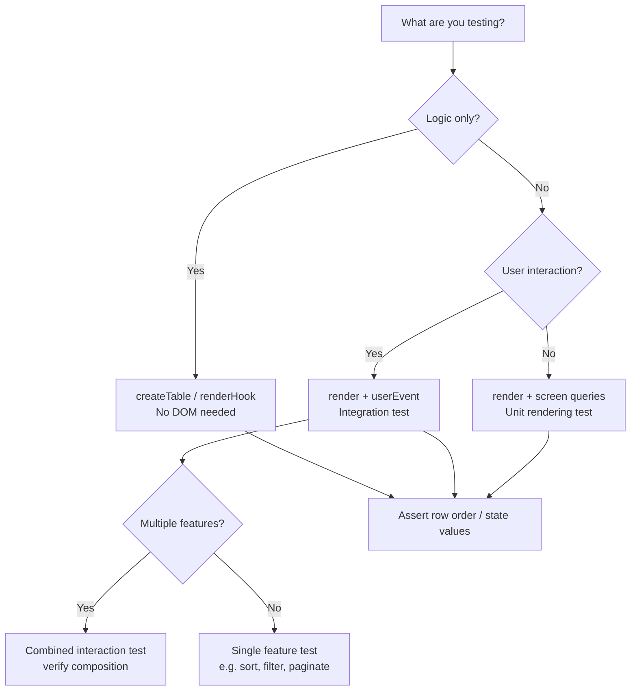

## Testing TanStack Table Interactions

Testing TanStack Table interactions involves verifying that user-driven behaviors — sorting, filtering, pagination, row selection, and expansion — produce the correct state changes and UI updates. Because TanStack Table is headless, tests focus on the logic layer (the table instance and its state) and the rendering layer (your own markup) separately or together.

---

### Core Testing Philosophy

TanStack Table separates state management from rendering. This means:

- The **table instance** (created via `useReactTable` or framework equivalent) holds and manages all state.
- Your **rendered markup** reflects that state.
- Tests can target either layer or both.

**Key Points:**
- Unit tests can target the table instance directly without rendering.
- Integration tests render the component and simulate user events.
- The headless architecture means you own the DOM, so you also own testability — no hidden internal components to pierce.

---

### Setup and Dependencies

```bash
npm install --save-dev @testing-library/react @testing-library/user-event vitest jsdom
# or with Jest
npm install --save-dev @testing-library/react @testing-library/user-event jest jest-environment-jsdom
```

A minimal Vitest config for DOM testing:

```ts
// vitest.config.ts
import { defineConfig } from 'vitest/config';

export default defineConfig({
  test: {
    environment: 'jsdom',
    globals: true,
    setupFiles: ['./src/test/setup.ts'],
  },
});
```

```ts
// src/test/setup.ts
import '@testing-library/jest-dom';
```

---

### The Table Component Under Test

All examples in this document test against this representative component:

```tsx
// DataTable.tsx
import {
  useReactTable,
  getCoreRowModel,
  getSortedRowModel,
  getFilteredRowModel,
  getPaginationRowModel,
  flexRender,
  type ColumnDef,
  type SortingState,
  type ColumnFiltersState,
} from '@tanstack/react-table';
import { useState } from 'react';

type Person = {
  id: number;
  name: string;
  age: number;
  status: 'active' | 'inactive';
};

const columns: ColumnDef<Person>[] = [
  {
    accessorKey: 'name',
    header: ({ column }) => (
      <button onClick={() => column.toggleSorting()}>
        Name {column.getIsSorted() === 'asc' ? '↑' : column.getIsSorted() === 'desc' ? '↓' : ''}
      </button>
    ),
  },
  {
    accessorKey: 'age',
    header: ({ column }) => (
      <button onClick={() => column.toggleSorting()}>
        Age {column.getIsSorted() === 'asc' ? '↑' : column.getIsSorted() === 'desc' ? '↓' : ''}
      </button>
    ),
  },
  { accessorKey: 'status', header: 'Status' },
];

export function DataTable({ data }: { data: Person[] }) {
  const [sorting, setSorting] = useState<SortingState>([]);
  const [columnFilters, setColumnFilters] = useState<ColumnFiltersState>([]);
  const [rowSelection, setRowSelection] = useState({});

  const table = useReactTable({
    data,
    columns,
    state: { sorting, columnFilters, rowSelection },
    onSortingChange: setSorting,
    onColumnFiltersChange: setColumnFilters,
    onRowSelectionChange: setRowSelection,
    getCoreRowModel: getCoreRowModel(),
    getSortedRowModel: getSortedRowModel(),
    getFilteredRowModel: getFilteredRowModel(),
    getPaginationRowModel: getPaginationRowModel(),
  });

  return (
    <div>
      <input
        placeholder="Filter by name"
        onChange={e =>
          table.getColumn('name')?.setFilterValue(e.target.value)
        }
        data-testid="name-filter"
      />
      <table>
        <thead>
          {table.getHeaderGroups().map(hg => (
            <tr key={hg.id}>
              {hg.headers.map(header => (
                <th key={header.id}>
                  {flexRender(header.column.columnDef.header, header.getContext())}
                </th>
              ))}
            </tr>
          ))}
        </thead>
        <tbody>
          {table.getRowModel().rows.map(row => (
            <tr
              key={row.id}
              data-testid="table-row"
              data-selected={row.getIsSelected()}
              onClick={() => row.toggleSelected()}
            >
              {row.getVisibleCells().map(cell => (
                <td key={cell.id}>
                  {flexRender(cell.column.columnDef.cell, cell.getContext())}
                </td>
              ))}
            </tr>
          ))}
        </tbody>
      </table>
      <div data-testid="pagination-controls">
        <button onClick={() => table.previousPage()} disabled={!table.getCanPreviousPage()}>
          Prev
        </button>
        <span data-testid="page-index">{table.getState().pagination.pageIndex + 1}</span>
        <button onClick={() => table.nextPage()} disabled={!table.getCanNextPage()}>
          Next
        </button>
      </div>
    </div>
  );
}
```

---

### Test Data Fixture

```ts
// fixtures/people.ts
export const people = [
  { id: 1, name: 'Alice', age: 30, status: 'active' as const },
  { id: 2, name: 'Bob',   age: 25, status: 'inactive' as const },
  { id: 3, name: 'Carol', age: 35, status: 'active' as const },
  { id: 4, name: 'Dave',  age: 28, status: 'active' as const },
  { id: 5, name: 'Eve',   age: 22, status: 'inactive' as const },
];
```

---

### Testing Sorting Interactions

Sorting is triggered by user clicks on column headers. Tests verify that the rendered row order changes accordingly.

```tsx
import { render, screen, within } from '@testing-library/react';
import userEvent from '@testing-library/user-event';
import { DataTable } from '../DataTable';
import { people } from '../fixtures/people';

describe('Sorting', () => {
  it('sorts rows ascending by name on first header click', async () => {
    const user = userEvent.setup();
    render(<DataTable data={people} />);

    await user.click(screen.getByRole('button', { name: /name/i }));

    const rows = screen.getAllByTestId('table-row');
    const firstCell = within(rows[0]).getAllByRole('cell')[0];
    const lastCell  = within(rows[rows.length - 1]).getAllByRole('cell')[0];

    expect(firstCell).toHaveTextContent('Alice');
    expect(lastCell).toHaveTextContent('Eve');
  });

  it('sorts rows descending by name on second header click', async () => {
    const user = userEvent.setup();
    render(<DataTable data={people} />);

    const nameBtn = screen.getByRole('button', { name: /name/i });
    await user.click(nameBtn); // asc
    await user.click(nameBtn); // desc

    const rows = screen.getAllByTestId('table-row');
    const firstCell = within(rows[0]).getAllByRole('cell')[0];
    expect(firstCell).toHaveTextContent('Eve');
  });

  it('clears sort on third click', async () => {
    const user = userEvent.setup();
    render(<DataTable data={people} />);

    const nameBtn = screen.getByRole('button', { name: /name/i });
    await user.click(nameBtn); // asc
    await user.click(nameBtn); // desc
    await user.click(nameBtn); // cleared (no sort indicator in button text)

    expect(nameBtn).toHaveTextContent('Name');
    // No ↑ or ↓ indicator
    expect(nameBtn.textContent).not.toMatch(/[↑↓]/);
  });

  it('sorts numerically by age', async () => {
    const user = userEvent.setup();
    render(<DataTable data={people} />);

    await user.click(screen.getByRole('button', { name: /age/i }));

    const rows = screen.getAllByTestId('table-row');
    const firstAgeCell = within(rows[0]).getAllByRole('cell')[1];
    expect(firstAgeCell).toHaveTextContent('22'); // Eve
  });
});
```

**Key Points:**
- Use `within()` to scope queries to a specific row — avoids false positives from other cells.
- `userEvent.setup()` is preferred over the legacy `userEvent.click()` direct call; it models pointer and keyboard events more accurately. [Inference: behavior matches Testing Library v14+ documentation; verify against your installed version.]
- TanStack Table's sort cycle (asc → desc → none) is configurable via `sortDescFirst` and `enableSortingRemoval`. Tests must match your configuration.

---

### Testing Column Filtering

```tsx
import { render, screen } from '@testing-library/react';
import userEvent from '@testing-library/user-event';
import { DataTable } from '../DataTable';
import { people } from '../fixtures/people';

describe('Column Filtering', () => {
  it('filters rows by name substring', async () => {
    const user = userEvent.setup();
    render(<DataTable data={people} />);

    await user.type(screen.getByTestId('name-filter'), 'ali');

    const rows = screen.getAllByTestId('table-row');
    expect(rows).toHaveLength(1);
    expect(rows[0]).toHaveTextContent('Alice');
  });

  it('shows no rows when filter matches nothing', async () => {
    const user = userEvent.setup();
    render(<DataTable data={people} />);

    await user.type(screen.getByTestId('name-filter'), 'zzz');

    expect(screen.queryAllByTestId('table-row')).toHaveLength(0);
  });

  it('restores all rows when filter is cleared', async () => {
    const user = userEvent.setup();
    render(<DataTable data={people} />);

    const input = screen.getByTestId('name-filter');
    await user.type(input, 'ali');
    await user.clear(input);

    expect(screen.getAllByTestId('table-row')).toHaveLength(people.length);
  });

  it('is case-insensitive by default', async () => {
    const user = userEvent.setup();
    render(<DataTable data={people} />);

    await user.type(screen.getByTestId('name-filter'), 'ALICE');

    expect(screen.getAllByTestId('table-row')).toHaveLength(1);
  });
});
```

**Key Points:**
- TanStack Table's built-in `includesString` filter function is case-insensitive by default. [Inference: based on published v8 documentation; verify against your version.]
- If using a custom `filterFn`, write dedicated unit tests for that function separately.

---

### Testing Pagination

```tsx
import { render, screen } from '@testing-library/react';
import userEvent from '@testing-library/user-event';
import { DataTable } from '../DataTable';

// Generate enough data to require multiple pages
const manyPeople = Array.from({ length: 25 }, (_, i) => ({
  id: i + 1,
  name: `Person ${i + 1}`,
  age: 20 + i,
  status: (i % 2 === 0 ? 'active' : 'inactive') as 'active' | 'inactive',
}));

describe('Pagination', () => {
  it('renders only the first page of rows initially', () => {
    render(<DataTable data={manyPeople} />);
    // Default pageSize is 10
    expect(screen.getAllByTestId('table-row')).toHaveLength(10);
  });

  it('advances to page 2 on Next click', async () => {
    const user = userEvent.setup();
    render(<DataTable data={manyPeople} />);

    await user.click(screen.getByRole('button', { name: /next/i }));

    expect(screen.getByTestId('page-index')).toHaveTextContent('2');
    expect(screen.getAllByTestId('table-row')).toHaveLength(10);
  });

  it('disables Prev button on first page', () => {
    render(<DataTable data={manyPeople} />);
    expect(screen.getByRole('button', { name: /prev/i })).toBeDisabled();
  });

  it('disables Next button on last page', async () => {
    const user = userEvent.setup();
    render(<DataTable data={manyPeople} />);

    // Navigate to last page (3 pages for 25 items at 10/page)
    await user.click(screen.getByRole('button', { name: /next/i }));
    await user.click(screen.getByRole('button', { name: /next/i }));

    expect(screen.getByRole('button', { name: /next/i })).toBeDisabled();
    expect(screen.getAllByTestId('table-row')).toHaveLength(5); // last page
  });

  it('returns to page 1 on Prev from page 2', async () => {
    const user = userEvent.setup();
    render(<DataTable data={manyPeople} />);

    await user.click(screen.getByRole('button', { name: /next/i }));
    await user.click(screen.getByRole('button', { name: /prev/i }));

    expect(screen.getByTestId('page-index')).toHaveTextContent('1');
  });
});
```

**Key Points:**
- Default `pageSize` for `getPaginationRowModel` is 10. If your component sets a custom initial `pageSize`, adjust test expectations accordingly.
- Pagination resets to page 0 when filters change — test this interaction explicitly if your component exposes it.

---

### Testing Row Selection

```tsx
import { render, screen } from '@testing-library/react';
import userEvent from '@testing-library/user-event';
import { DataTable } from '../DataTable';
import { people } from '../fixtures/people';

describe('Row Selection', () => {
  it('marks a row as selected on click', async () => {
    const user = userEvent.setup();
    render(<DataTable data={people} />);

    const rows = screen.getAllByTestId('table-row');
    await user.click(rows[0]);

    expect(rows[0]).toHaveAttribute('data-selected', 'true');
  });

  it('deselects a row on second click', async () => {
    const user = userEvent.setup();
    render(<DataTable data={people} />);

    const rows = screen.getAllByTestId('table-row');
    await user.click(rows[0]);
    await user.click(rows[0]);

    expect(rows[0]).toHaveAttribute('data-selected', 'false');
  });

  it('allows selecting multiple rows independently', async () => {
    const user = userEvent.setup();
    render(<DataTable data={people} />);

    const rows = screen.getAllByTestId('table-row');
    await user.click(rows[0]);
    await user.click(rows[2]);

    expect(rows[0]).toHaveAttribute('data-selected', 'true');
    expect(rows[1]).toHaveAttribute('data-selected', 'false');
    expect(rows[2]).toHaveAttribute('data-selected', 'true');
  });
});
```

#### Testing Selection with Checkboxes

If your implementation uses checkboxes rather than row clicks:

```tsx
it('selects a row via checkbox', async () => {
  const user = userEvent.setup();
  render(<DataTable data={people} />);

  const checkboxes = screen.getAllByRole('checkbox');
  // Index 0 is typically the "select all" checkbox; row checkboxes start at 1
  await user.click(checkboxes[1]);

  expect(checkboxes[1]).toBeChecked();
});

it('"select all" checkbox checks all rows', async () => {
  const user = userEvent.setup();
  render(<DataTable data={people} />);

  const checkboxes = screen.getAllByRole('checkbox');
  await user.click(checkboxes[0]); // header checkbox

  const rowCheckboxes = checkboxes.slice(1);
  rowCheckboxes.forEach(cb => expect(cb).toBeChecked());
});
```

---

### Testing Row Expansion

For tables with expandable rows using `getExpandedRowModel`:

```tsx
// Assumes your component renders a toggle button per row
// and an expanded detail section with data-testid="row-detail"

describe('Row Expansion', () => {
  it('expands a row on toggle click', async () => {
    const user = userEvent.setup();
    render(<DataTable data={people} />);

    const toggles = screen.getAllByRole('button', { name: /expand/i });
    await user.click(toggles[0]);

    expect(screen.getByTestId('row-detail')).toBeInTheDocument();
  });

  it('collapses an expanded row on second toggle click', async () => {
    const user = userEvent.setup();
    render(<DataTable data={people} />);

    const toggle = screen.getAllByRole('button', { name: /expand/i })[0];
    await user.click(toggle);
    await user.click(toggle);

    expect(screen.queryByTestId('row-detail')).not.toBeInTheDocument();
  });
});
```

---

### Testing Combined Interactions

Real usage often involves multiple features active simultaneously. These tests verify that interactions compose correctly.

```tsx
describe('Combined interactions', () => {
  it('filter + sort: filters first, then sorts the filtered set', async () => {
    const user = userEvent.setup();
    render(<DataTable data={people} />);

    await user.type(screen.getByTestId('name-filter'), 'a'); // Alice, Carol, Dave
    await user.click(screen.getByRole('button', { name: /name/i })); // sort asc

    const rows = screen.getAllByTestId('table-row');
    expect(within(rows[0]).getAllByRole('cell')[0]).toHaveTextContent('Alice');
    expect(within(rows[1]).getAllByRole('cell')[0]).toHaveTextContent('Carol');
    expect(within(rows[2]).getAllByRole('cell')[0]).toHaveTextContent('Dave');
  });

  it('filter resets pagination to page 1', async () => {
    const user = userEvent.setup();
    render(<DataTable data={manyPeople} />);

    await user.click(screen.getByRole('button', { name: /next/i }));
    expect(screen.getByTestId('page-index')).toHaveTextContent('2');

    await user.type(screen.getByTestId('name-filter'), 'Person 1');

    expect(screen.getByTestId('page-index')).toHaveTextContent('1');
  });
});
```

---

### Unit Testing the Table Instance Directly

For logic-heavy scenarios, you can test the table instance without rendering. This is faster and avoids DOM overhead.

```ts
import { createTable, getCoreRowModel, getSortedRowModel } from '@tanstack/table-core';

describe('Table instance — sorting logic', () => {
  it('sorts data by name ascending', () => {
    const table = createTable({
      data: people,
      columns: [
        { accessorKey: 'name', header: 'Name' },
        { accessorKey: 'age',  header: 'Age' },
      ],
      state: {
        sorting: [{ id: 'name', desc: false }],
      },
      onStateChange: () => {},
      getCoreRowModel: getCoreRowModel(),
      getSortedRowModel: getSortedRowModel(),
      renderFallbackValue: null,
    });

    const rows = table.getRowModel().rows;
    expect(rows[0].getValue('name')).toBe('Alice');
    expect(rows[rows.length - 1].getValue('name')).toBe('Eve');
  });
});
```

**Key Points:**
- `createTable` from `@tanstack/table-core` is the framework-agnostic constructor. [Inference: available in v8; verify the exact import path for your version.]
- This approach tests sorting, filtering, and pagination logic without React, making it faster and more deterministic.
- State passed to `createTable` is static; to test state transitions, call the table's updater functions and re-evaluate.

---

### Testing with `renderHook`

If your table logic is extracted into a custom hook, test it with `renderHook`:

```tsx
import { renderHook, act } from '@testing-library/react';
import { useDataTable } from '../hooks/useDataTable';
import { people } from '../fixtures/people';

describe('useDataTable hook', () => {
  it('exposes sorted rows after setSorting', () => {
    const { result } = renderHook(() => useDataTable({ data: people }));

    act(() => {
      result.current.setSorting([{ id: 'age', desc: false }]);
    });

    const rows = result.current.table.getRowModel().rows;
    expect(rows[0].getValue('age')).toBe(22); // Eve
  });
});
```

---

### Snapshot Testing Considerations

Snapshot tests can capture regression in table markup, but they are fragile for interactive tables.

**Key Points:**
- Avoid full-table snapshots — they break on any data or markup change.
- Prefer targeted snapshots: snapshot a single cell's content, a pagination control, or a header group.
- If using snapshots, use `toMatchInlineSnapshot` for small, reviewable targets rather than serialized files.

```tsx
it('renders the name header cell', () => {
  render(<DataTable data={people} />);
  const nameHeader = screen.getByRole('button', { name: /name/i });
  expect(nameHeader).toMatchInlineSnapshot(`
    <button>
      Name 
    </button>
  `);
});
```

---

### Accessibility Testing for Interactions

```tsx
import { axe, toHaveNoViolations } from 'jest-axe';

expect.extend(toHaveNoViolations);

it('has no accessibility violations after sorting', async () => {
  const user = userEvent.setup();
  const { container } = render(<DataTable data={people} />);

  await user.click(screen.getByRole('button', { name: /name/i }));

  const results = await axe(container);
  expect(results).toHaveNoViolations();
});
```

**Key Points:**
- Interactive tables must maintain correct ARIA roles (`grid`, `row`, `columnheader`, `gridcell`) after state changes.
- Sort direction should be communicated via `aria-sort` on `<th>` elements — TanStack Table does not add this automatically since you own the markup. [Inference: based on TanStack Table's headless design; your implementation is responsible for ARIA attributes.]

---

### Diagram: Interaction Testing Decision Flow



---

### Common Pitfalls

**`act()` warnings:** State updates from `userEvent` are wrapped in `act` automatically in Testing Library v14+. If using older versions or direct event dispatch, wrap updates manually.

**Stale `rows` references:** Always re-query `getAllByTestId('table-row')` after an interaction — do not cache the result before a click.

**Default page size:** Tests that assert row count must account for pagination being active. Disable pagination or use enough data to fill fewer than one page if you want to test filtering/sorting in isolation.

**Sort stability:** TanStack Table v8 uses a stable sort. [Inference: based on documentation; actual behavior may vary across versions.] Tests relying on tie-breaking order between equal values should be written carefully or avoided.

**Filter debouncing:** If your component debounces filter input, use `vi.useFakeTimers()` and `vi.advanceTimersByTime()` to control timing in tests.

```ts
vi.useFakeTimers();
await user.type(input, 'ali');
vi.advanceTimersByTime(300); // advance past debounce delay
vi.runAllTimers();
```

---

**Related Topics:**
- Testing TanStack Table column visibility toggling
- Testing controlled vs. uncontrolled table state
- Testing server-side sorting and filtering (async data)
- Testing virtualized rows with TanStack Virtual + Table
- Testing TanStack Table with Zustand or Jotai external state
- E2E testing table interactions with Playwright or Cypress
- Performance testing large datasets in TanStack Table
- Testing custom cell renderers and editor components