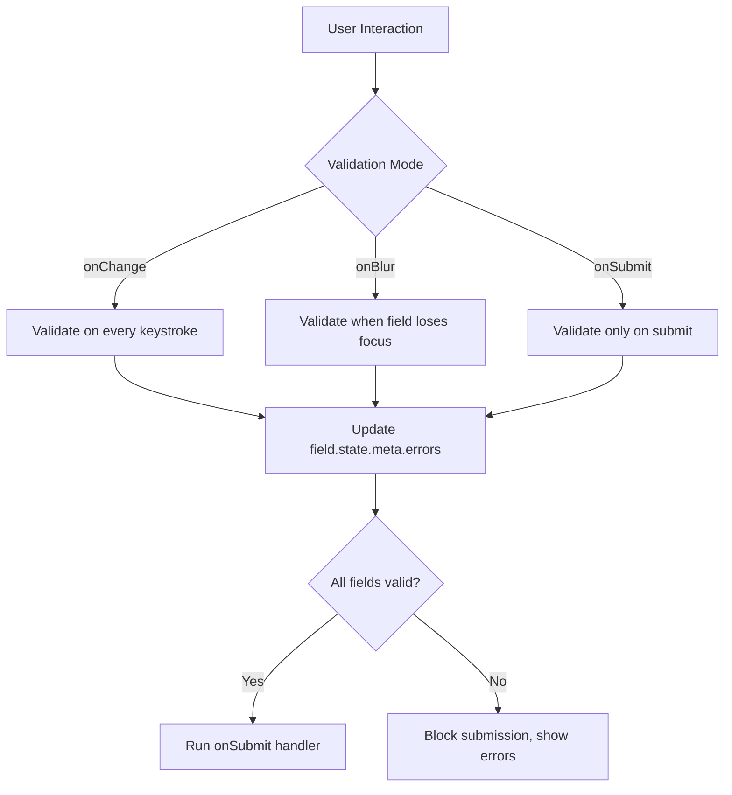
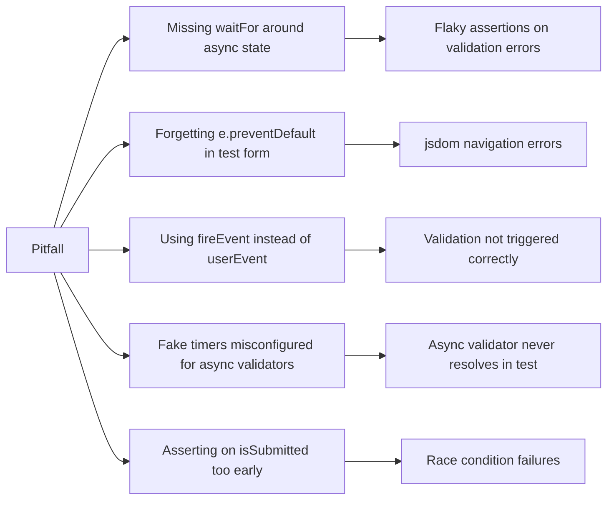

# Testing TanStack Form Submission and Validation

Testing form submission and validation logic in TanStack Form requires understanding how the library manages field state, validation lifecycles, and async flows. This guide covers unit and integration testing strategies for forms built with `@tanstack/react-form`.

---

### Setup and Dependencies

Before writing tests, install the necessary testing utilities alongside TanStack Form.

```bash
npm install --save-dev @testing-library/react @testing-library/user-event @testing-library/jest-dom vitest jsdom
```

A minimal Vitest config for React:

```ts
// vitest.config.ts
import { defineConfig } from 'vitest/config'
import react from '@vitejs/plugin-react'

export default defineConfig({
  plugins: [react()],
  test: {
    environment: 'jsdom',
    globals: true,
    setupFiles: ['./src/test/setup.ts'],
  },
})
```

```ts
// src/test/setup.ts
import '@testing-library/jest-dom'
```

---

### Understanding the Form Lifecycle Under Test

TanStack Form manages state internally via its `FormApi`. Validation runs at configurable points: `onChange`, `onBlur`, `onSubmit`, or `onMount`. Understanding when validation fires is critical for writing accurate assertions.



**Key Points:**
- `field.state.meta.errors` holds synchronous validation errors
- `field.state.meta.errorMap` holds errors keyed by validation event (`onChange`, `onBlur`, `onSubmit`)
- `form.state.isSubmitting` becomes `true` during async submission
- `form.state.isSubmitted` becomes `true` after a successful submit cycle completes

---

### A Reference Form Component

All test examples in this guide target this component.

```tsx
// ContactForm.tsx
import { useForm } from '@tanstack/react-form'
import { z } from 'zod'

const schema = z.object({
  name: z.string().min(2, 'Name must be at least 2 characters'),
  email: z.string().email('Invalid email address'),
  message: z.string().min(10, 'Message must be at least 10 characters'),
})

interface ContactFormProps {
  onSubmit: (values: { name: string; email: string; message: string }) => Promise<void>
}

export function ContactForm({ onSubmit }: ContactFormProps) {
  const form = useForm({
    defaultValues: { name: '', email: '', message: '' },
    onSubmit: async ({ value }) => {
      await onSubmit(value)
    },
    validators: {
      onChange: schema,
    },
  })

  return (
    <form
      onSubmit={(e) => {
        e.preventDefault()
        e.stopPropagation()
        form.handleSubmit()
      }}
    >
      <form.Field name="name">
        {(field) => (
          <div>
            <label htmlFor="name">Name</label>
            <input
              id="name"
              value={field.state.value}
              onChange={(e) => field.handleChange(e.target.value)}
              onBlur={field.handleBlur}
            />
            {field.state.meta.errors.length > 0 && (
              <span role="alert">{field.state.meta.errors[0]}</span>
            )}
          </div>
        )}
      </form.Field>

      <form.Field name="email">
        {(field) => (
          <div>
            <label htmlFor="email">Email</label>
            <input
              id="email"
              type="email"
              value={field.state.value}
              onChange={(e) => field.handleChange(e.target.value)}
              onBlur={field.handleBlur}
            />
            {field.state.meta.errors.length > 0 && (
              <span role="alert">{field.state.meta.errors[0]}</span>
            )}
          </div>
        )}
      </form.Field>

      <form.Field name="message">
        {(field) => (
          <div>
            <label htmlFor="message">Message</label>
            <textarea
              id="message"
              value={field.state.value}
              onChange={(e) => field.handleChange(e.target.value)}
              onBlur={field.handleBlur}
            />
            {field.state.meta.errors.length > 0 && (
              <span role="alert">{field.state.meta.errors[0]}</span>
            )}
          </div>
        )}
      </form.Field>

      <form.Subscribe selector={(state) => state.isSubmitting}>
        {(isSubmitting) => (
          <button type="submit" disabled={isSubmitting}>
            {isSubmitting ? 'Submitting...' : 'Submit'}
          </button>
        )}
      </form.Subscribe>
    </form>
  )
}
```

---

### Testing Successful Form Submission

The most fundamental test: filling all fields correctly and confirming the `onSubmit` callback receives the expected values.

```tsx
// ContactForm.test.tsx
import { render, screen, waitFor } from '@testing-library/react'
import userEvent from '@testing-library/user-event'
import { ContactForm } from './ContactForm'

describe('ContactForm — successful submission', () => {
  it('calls onSubmit with correct values when all fields are valid', async () => {
    const user = userEvent.setup()
    const mockSubmit = vi.fn().mockResolvedValue(undefined)

    render(<ContactForm onSubmit={mockSubmit} />)

    await user.type(screen.getByLabelText('Name'), 'Alice Smith')
    await user.type(screen.getByLabelText('Email'), 'alice@example.com')
    await user.type(screen.getByLabelText('Message'), 'Hello, this is a test message.')

    await user.click(screen.getByRole('button', { name: /submit/i }))

    await waitFor(() => {
      expect(mockSubmit).toHaveBeenCalledOnce()
      expect(mockSubmit).toHaveBeenCalledWith({
        name: 'Alice Smith',
        email: 'alice@example.com',
        message: 'Hello, this is a test message.',
      })
    })
  })
})
```

**Key Points:**
- `userEvent.setup()` is preferred over the legacy `userEvent` direct calls — it creates a session that properly simulates pointer and keyboard events
- `mockSubmit` is a `vi.fn()` returning a resolved Promise, matching the async signature expected by TanStack Form's `onSubmit`
- `waitFor` accounts for the async nature of form submission state transitions

---

### Testing Validation Error Display

#### Synchronous `onChange` Validation

```tsx
describe('ContactForm — onChange validation', () => {
  it('shows name validation error when name is too short', async () => {
    const user = userEvent.setup()
    const mockSubmit = vi.fn()

    render(<ContactForm onSubmit={mockSubmit} />)

    const nameInput = screen.getByLabelText('Name')
    await user.type(nameInput, 'A')

    await waitFor(() => {
      expect(screen.getByRole('alert')).toHaveTextContent(
        'Name must be at least 2 characters'
      )
    })
  })

  it('shows email validation error for invalid email format', async () => {
    const user = userEvent.setup()

    render(<ContactForm onSubmit={vi.fn()} />)

    await user.type(screen.getByLabelText('Email'), 'not-an-email')

    await waitFor(() => {
      expect(screen.getByRole('alert')).toHaveTextContent('Invalid email address')
    })
  })

  it('clears error when field value becomes valid', async () => {
    const user = userEvent.setup()

    render(<ContactForm onSubmit={vi.fn()} />)

    const nameInput = screen.getByLabelText('Name')
    await user.type(nameInput, 'A')

    await waitFor(() => {
      expect(screen.getByRole('alert')).toBeInTheDocument()
    })

    await user.clear(nameInput)
    await user.type(nameInput, 'Alice')

    await waitFor(() => {
      expect(screen.queryByRole('alert')).not.toBeInTheDocument()
    })
  })
})
```

#### `onBlur` Validation

When validation mode is `onBlur`, errors should appear only after the field loses focus — not during typing.

```tsx
// BlurValidatedForm.tsx (excerpt — uses onBlur validators)
const form = useForm({
  defaultValues: { email: '' },
  validators: {
    onBlur: z.object({ email: z.string().email('Invalid email') }),
  },
})
```

```tsx
describe('BlurValidatedForm', () => {
  it('does not show errors while typing, only after blur', async () => {
    const user = userEvent.setup()

    render(<BlurValidatedForm onSubmit={vi.fn()} />)

    const emailInput = screen.getByLabelText('Email')
    await user.type(emailInput, 'bad')

    // Error should not appear yet — field has not been blurred
    expect(screen.queryByRole('alert')).not.toBeInTheDocument()

    await user.tab() // triggers blur

    await waitFor(() => {
      expect(screen.getByRole('alert')).toHaveTextContent('Invalid email')
    })
  })
})
```

---

### Testing Submit-Time Validation Blocking

TanStack Form runs all validators on submit regardless of individual field states. This test confirms the `onSubmit` callback is not called when fields are invalid.

```tsx
describe('ContactForm — submit blocking', () => {
  it('does not call onSubmit when required fields are empty', async () => {
    const user = userEvent.setup()
    const mockSubmit = vi.fn()

    render(<ContactForm onSubmit={mockSubmit} />)

    await user.click(screen.getByRole('button', { name: /submit/i }))

    await waitFor(() => {
      expect(mockSubmit).not.toHaveBeenCalled()
    })
  })

  it('does not call onSubmit when only some fields are valid', async () => {
    const user = userEvent.setup()
    const mockSubmit = vi.fn()

    render(<ContactForm onSubmit={mockSubmit} />)

    await user.type(screen.getByLabelText('Name'), 'Alice')
    // email and message left empty

    await user.click(screen.getByRole('button', { name: /submit/i }))

    await waitFor(() => {
      expect(mockSubmit).not.toHaveBeenCalled()
    })
  })
})
```

---

### Testing Async Validation

Async validators are common for server-side uniqueness checks (e.g., checking if a username is already taken). TanStack Form supports `asyncDebounceMs` to limit the rate of async calls.

```tsx
// AsyncEmailForm.tsx (excerpt)
<form.Field
  name="email"
  asyncDebounceMs={300}
  validators={{
    onChangeAsync: async ({ value }) => {
      const taken = await checkEmailTaken(value)
      return taken ? 'Email already in use' : undefined
    },
  }}
>
```

```tsx
describe('AsyncEmailForm — async validation', () => {
  beforeEach(() => {
    vi.useFakeTimers()
  })

  afterEach(() => {
    vi.useRealTimers()
  })

  it('shows async error when email is already taken', async () => {
    const user = userEvent.setup({ advanceTimers: vi.advanceTimersByTime })
    const checkEmailTaken = vi.fn().mockResolvedValue(true)

    render(<AsyncEmailForm checkEmailTaken={checkEmailTaken} onSubmit={vi.fn()} />)

    await user.type(screen.getByLabelText('Email'), 'taken@example.com')

    // Advance timers past the debounce window
    await vi.advanceTimersByTimeAsync(400)

    await waitFor(() => {
      expect(screen.getByRole('alert')).toHaveTextContent('Email already in use')
    })
  })

  it('does not show error when email is available', async () => {
    const user = userEvent.setup({ advanceTimers: vi.advanceTimersByTime })
    const checkEmailTaken = vi.fn().mockResolvedValue(false)

    render(<AsyncEmailForm checkEmailTaken={checkEmailTaken} onSubmit={vi.fn()} />)

    await user.type(screen.getByLabelText('Email'), 'new@example.com')
    await vi.advanceTimersByTimeAsync(400)

    await waitFor(() => {
      expect(screen.queryByRole('alert')).not.toBeInTheDocument()
    })
  })
})
```

**Key Points:**
- Pass `advanceTimers: vi.advanceTimersByTime` to `userEvent.setup()` so fake timers cooperate with user-event's internal async scheduling
- `vi.advanceTimersByTimeAsync` is preferred over `vi.advanceTimersByTime` when the callbacks being advanced are themselves async [Inference: based on Vitest docs behavior; verify against your Vitest version]

---

### Testing `isSubmitting` and `isSubmitted` States

These state flags are critical for disabling submit buttons and showing loading indicators.

```tsx
describe('ContactForm — submission state', () => {
  it('disables the submit button during submission', async () => {
    const user = userEvent.setup()

    // Mock a slow submission
    const mockSubmit = vi.fn(
      () => new Promise((resolve) => setTimeout(resolve, 1000))
    )

    render(<ContactForm onSubmit={mockSubmit} />)

    await user.type(screen.getByLabelText('Name'), 'Alice Smith')
    await user.type(screen.getByLabelText('Email'), 'alice@example.com')
    await user.type(screen.getByLabelText('Message'), 'This is a test message longer than ten chars.')

    const submitButton = screen.getByRole('button', { name: /submit/i })
    await user.click(submitButton)

    // Button should be disabled immediately after click
    expect(submitButton).toBeDisabled()

    // Resolve the submission
    await waitFor(() => {
      expect(submitButton).not.toBeDisabled()
    })
  })

  it('shows submitting label while the form is being submitted', async () => {
    const user = userEvent.setup()
    vi.useFakeTimers()

    const mockSubmit = vi.fn(
      () => new Promise((resolve) => setTimeout(resolve, 500))
    )

    render(<ContactForm onSubmit={mockSubmit} />)

    await user.type(screen.getByLabelText('Name'), 'Alice')
    await user.type(screen.getByLabelText('Email'), 'alice@example.com')
    await user.type(screen.getByLabelText('Message'), 'Long enough message here.')

    await user.click(screen.getByRole('button', { name: /submit/i }))

    expect(screen.getByRole('button', { name: /submitting/i })).toBeInTheDocument()

    await vi.runAllTimersAsync()
    vi.useRealTimers()
  })
})
```

---

### Testing Field-Level vs Form-Level Errors

TanStack Form supports both field-level validators (scoped to individual fields) and form-level validators (holistic checks that may depend on multiple fields).

```tsx
// CrossFieldForm.tsx (excerpt) — password confirmation validation
const form = useForm({
  defaultValues: { password: '', confirmPassword: '' },
  validators: {
    onChange: ({ value }) => {
      if (value.password !== value.confirmPassword) {
        return 'Passwords do not match'
      }
      return undefined
    },
  },
})
```

```tsx
describe('CrossFieldForm — form-level validation', () => {
  it('shows form-level error when passwords do not match', async () => {
    const user = userEvent.setup()

    render(<CrossFieldForm onSubmit={vi.fn()} />)

    await user.type(screen.getByLabelText('Password'), 'secret123')
    await user.type(screen.getByLabelText('Confirm Password'), 'different')

    await waitFor(() => {
      expect(screen.getByText('Passwords do not match')).toBeInTheDocument()
    })
  })

  it('clears form-level error when passwords match', async () => {
    const user = userEvent.setup()

    render(<CrossFieldForm onSubmit={vi.fn()} />)

    await user.type(screen.getByLabelText('Password'), 'secret123')
    await user.type(screen.getByLabelText('Confirm Password'), 'different')

    await waitFor(() => {
      expect(screen.getByText('Passwords do not match')).toBeInTheDocument()
    })

    await user.clear(screen.getByLabelText('Confirm Password'))
    await user.type(screen.getByLabelText('Confirm Password'), 'secret123')

    await waitFor(() => {
      expect(screen.queryByText('Passwords do not match')).not.toBeInTheDocument()
    })
  })
})
```

---

### Testing Default Values and Reset Behavior

```tsx
describe('ContactForm — default values and reset', () => {
  it('renders with the correct default values', () => {
    render(<ContactForm onSubmit={vi.fn()} />)

    expect(screen.getByLabelText('Name')).toHaveValue('')
    expect(screen.getByLabelText('Email')).toHaveValue('')
    expect(screen.getByLabelText('Message')).toHaveValue('')
  })

  it('resets fields to default values after reset is triggered', async () => {
    const user = userEvent.setup()

    render(<ContactFormWithReset onSubmit={vi.fn()} />)

    await user.type(screen.getByLabelText('Name'), 'Alice')
    await user.click(screen.getByRole('button', { name: /reset/i }))

    await waitFor(() => {
      expect(screen.getByLabelText('Name')).toHaveValue('')
    })
  })
})
```

---

### Testing Forms with Dynamic Fields

Dynamic (array) fields require testing add, remove, and validation across variable-length field sets.

```tsx
// TagsForm.tsx (excerpt) — uses form.Field with mode="array"
<form.Field name="tags" mode="array">
  {(field) => (
    <>
      {field.state.value.map((_, i) => (
        <form.Field key={i} name={`tags[${i}]`}>
          {(subField) => (
            <input
              aria-label={`Tag ${i + 1}`}
              value={subField.state.value}
              onChange={(e) => subField.handleChange(e.target.value)}
            />
          )}
        </form.Field>
      ))}
      <button type="button" onClick={() => field.pushValue('')}>
        Add Tag
      </button>
    </>
  )}
</form.Field>
```

```tsx
describe('TagsForm — dynamic fields', () => {
  it('adds a new tag field when Add Tag is clicked', async () => {
    const user = userEvent.setup()

    render(<TagsForm onSubmit={vi.fn()} />)

    const initialInputs = screen.getAllByRole('textbox')
    await user.click(screen.getByRole('button', { name: /add tag/i }))

    await waitFor(() => {
      expect(screen.getAllByRole('textbox')).toHaveLength(initialInputs.length + 1)
    })
  })

  it('submits all tag values correctly', async () => {
    const user = userEvent.setup()
    const mockSubmit = vi.fn().mockResolvedValue(undefined)

    render(<TagsForm onSubmit={mockSubmit} />)

    await user.click(screen.getByRole('button', { name: /add tag/i }))
    await user.click(screen.getByRole('button', { name: /add tag/i }))

    const inputs = screen.getAllByRole('textbox')
    await user.type(inputs[0], 'react')
    await user.type(inputs[1], 'typescript')

    await user.click(screen.getByRole('button', { name: /submit/i }))

    await waitFor(() => {
      expect(mockSubmit).toHaveBeenCalledWith(
        expect.objectContaining({ tags: ['react', 'typescript'] })
      )
    })
  })
})
```

---

### Testing Error Handling from Server Responses

A common pattern is to display server-returned errors after a failed submission. TanStack Form supports this by setting field errors programmatically via `form.setFieldMeta` or through a server-side validation adapter.

```tsx
// ContactForm — server error handling variant
onSubmit: async ({ value, formApi }) => {
  try {
    await onSubmit(value)
  } catch (err: any) {
    if (err.field === 'email') {
      formApi.setFieldMeta('email', (meta) => ({
        ...meta,
        errors: [err.message],
        errorMap: { onServer: err.message },
      }))
    }
  }
}
```

```tsx
describe('ContactForm — server errors', () => {
  it('displays a server-returned field error after failed submission', async () => {
    const user = userEvent.setup()

    const mockSubmit = vi.fn().mockRejectedValue({
      field: 'email',
      message: 'This email is banned',
    })

    render(<ContactFormWithServerErrors onSubmit={mockSubmit} />)

    await user.type(screen.getByLabelText('Name'), 'Alice')
    await user.type(screen.getByLabelText('Email'), 'banned@example.com')
    await user.type(screen.getByLabelText('Message'), 'Test message long enough.')

    await user.click(screen.getByRole('button', { name: /submit/i }))

    await waitFor(() => {
      expect(screen.getByRole('alert')).toHaveTextContent('This email is banned')
    })
  })
})
```

---

### Testing Without Rendering — FormApi Directly

For pure validation logic, TanStack Form's `FormApi` can be instantiated and tested independently of React. This is useful for validating schema configurations in isolation. [Inference: API may vary across minor versions; consult official docs for the current FormApi constructor signature.]

```ts
import { FormApi } from '@tanstack/react-form'

describe('FormApi — direct validation', () => {
  it('validates that an empty name fails schema validation', async () => {
    const form = new FormApi({
      defaultValues: { name: '', email: '' },
      validators: {
        onChange: z.object({
          name: z.string().min(2, 'Too short'),
          email: z.string().email('Invalid'),
        }),
      },
    })

    form.mount()

    form.setFieldValue('name', 'A')
    form.validateField('name', 'change')

    const errors = form.getFieldMeta('name')?.errors ?? []
    expect(errors).toContain('Too short')
  })
})
```

**Key Points:**
- `form.mount()` initializes the form's internal subscriptions — required before operating on the `FormApi` outside React
- This approach is faster than rendering a component for pure validation logic tests
- Behavior may vary across TanStack Form versions; validate your `FormApi` usage against your installed version

---

### Common Pitfalls



| Pitfall | Symptom | Fix |
|---|---|---|
| Missing `await` on `user.type` | Assertions run before state updates | Always `await` user-event calls |
| `fireEvent.change` instead of `userEvent.type` | `onChange` validator not triggered | Use `userEvent` for realistic event simulation |
| Asserting before async validation resolves | Flaky tests | Wrap assertions in `waitFor` |
| Fake timers without `advanceTimers` in `userEvent.setup` | Debounced validators hang | Pass `advanceTimers` to `userEvent.setup` |
| Not mocking `onSubmit` as async | TanStack Form treats sync `onSubmit` differently | Always return a Promise from `onSubmit` mock |

---

### Structuring Test Files

A scalable organization pattern for form tests:

```
src/
  components/
    ContactForm/
      ContactForm.tsx
      ContactForm.test.tsx       ← Integration tests (RTL)
      ContactForm.stories.tsx    ← Storybook (manual testing)
  forms/
    validators/
      contactSchema.ts
      contactSchema.test.ts      ← Unit tests for Zod schema
  test/
    setup.ts
    utils/
      renderWithProviders.tsx    ← Shared render helper
```

A shared render utility for forms that require context providers:

```tsx
// test/utils/renderWithProviders.tsx
import { render } from '@testing-library/react'
import { QueryClient, QueryClientProvider } from '@tanstack/react-query'

export function renderWithProviders(ui: React.ReactElement) {
  const queryClient = new QueryClient({
    defaultOptions: { queries: { retry: false } },
  })

  return render(
    <QueryClientProvider client={queryClient}>{ui}</QueryClientProvider>
  )
}
```

---

**Related Topics:**

- Testing TanStack Form with `zodValidator` and `valibotValidator` adapters
- Testing nested object fields and complex default value structures
- Testing `form.Subscribe` — asserting on derived form state in tests
- Integration testing with TanStack Query — forms that read and write via `useMutation`
- Testing conditional field rendering based on other field values
- Accessibility testing for form error announcements (`aria-live`, `role="alert"`)
- End-to-end form testing with Playwright or Cypress