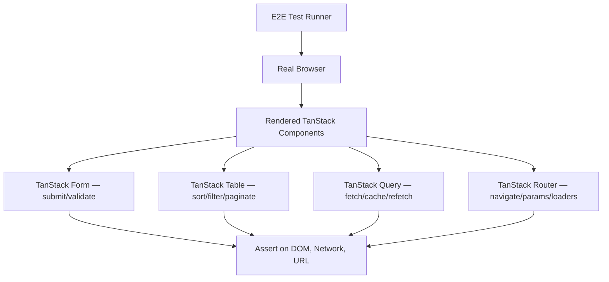
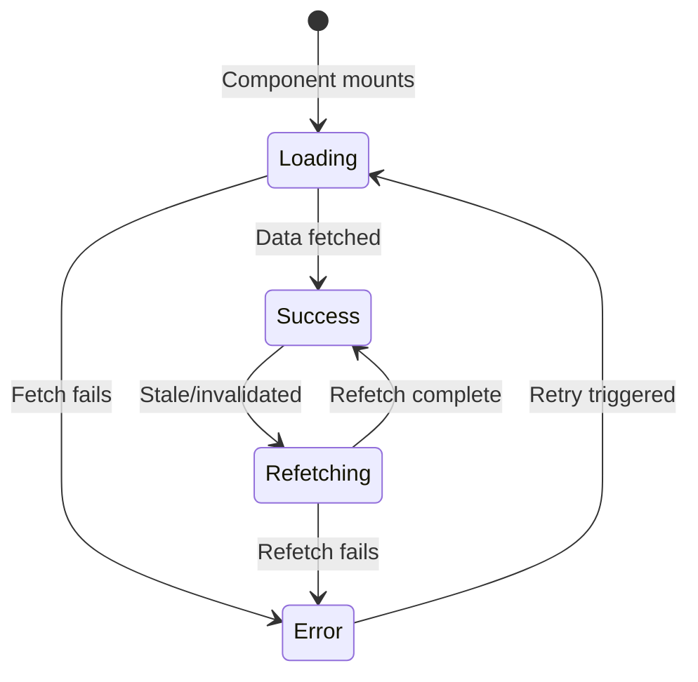
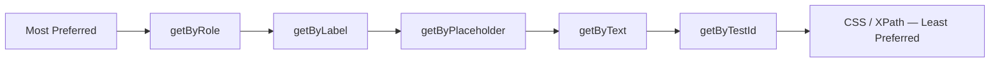

## End-to-End Testing Strategies with Playwright and Cypress

End-to-end (E2E) testing for TanStack-powered applications validates complete user workflows — form submissions, table interactions, query loading states, and navigation — against a real or near-real environment. This guide covers how to structure, write, and maintain E2E tests for TanStack Form, Table, Query, and Router using both Playwright and Cypress.

---

### Why E2E Testing for TanStack Applications

Unit and integration tests cover isolated component behavior. E2E tests verify that the full stack — routing, data fetching, validation, and UI rendering — works together correctly from the user's perspective.



**Key Points:**
- E2E tests catch regressions that unit tests miss: race conditions, hydration mismatches, router integration bugs, and network-dependent validation
- Both Playwright and Cypress operate against a running dev or preview server — they do not import component code directly
- TanStack's async patterns (queries, form submission, virtual scroll) require careful timing strategies in E2E tests

---

### Choosing Between Playwright and Cypress

| Dimension | Playwright | Cypress |
|---|---|---|
| Browser support | Chromium, Firefox, WebKit | Chrome, Edge, Firefox (no Safari/WebKit) |
| Architecture | Out-of-process, CDP/WebSocket | In-process, runs inside the browser |
| Parallelism | Built-in, per-worker isolation | Requires Cypress Cloud or manual sharding |
| Network interception | `page.route()` — full request control | `cy.intercept()` — broad but in-browser |
| Auto-waiting | Built-in on all actions and assertions | Built-in via command queue |
| TypeScript | First-class | First-class via `tsconfig` |
| Component testing | Experimental | Mature (`cy.mount`) |
| Trace/debug tooling | Trace viewer, video, screenshot | Time-travel debugger, dashboard |

[Inference: Feature parity between the two tools evolves rapidly; verify current capabilities against official docs before making a long-term tooling decision.]

---

### Project Setup

#### Playwright

```bash
npm init playwright@latest
```

```ts
// playwright.config.ts
import { defineConfig, devices } from '@playwright/test'

export default defineConfig({
  testDir: './e2e',
  fullyParallel: true,
  retries: process.env.CI ? 2 : 0,
  reporter: process.env.CI ? 'github' : 'html',
  use: {
    baseURL: 'http://localhost:5173',
    trace: 'on-first-retry',
    screenshot: 'only-on-failure',
  },
  projects: [
    { name: 'chromium', use: { ...devices['Desktop Chrome'] } },
    { name: 'firefox', use: { ...devices['Desktop Firefox'] } },
    { name: 'webkit', use: { ...devices['Desktop Safari'] } },
  ],
  webServer: {
    command: 'npm run dev',
    url: 'http://localhost:5173',
    reuseExistingServer: !process.env.CI,
  },
})
```

#### Cypress

```bash
npm install --save-dev cypress
npx cypress open
```

```ts
// cypress.config.ts
import { defineConfig } from 'cypress'

export default defineConfig({
  e2e: {
    baseUrl: 'http://localhost:5173',
    specPattern: 'cypress/e2e/**/*.cy.ts',
    supportFile: 'cypress/support/e2e.ts',
    video: false,
    screenshotOnRunFailure: true,
  },
})
```

---

### Directory Structure

A clean layout for both tools in a single project:

```
project-root/
  e2e/                          ← Playwright tests
    fixtures/
      users.json
    pages/                      ← Page Object Models
      ContactFormPage.ts
      DataTablePage.ts
    tests/
      form-submission.spec.ts
      table-interactions.spec.ts
      query-loading.spec.ts
  cypress/
    e2e/                        ← Cypress tests
      form-submission.cy.ts
      table-interactions.cy.ts
    fixtures/
      users.json
    support/
      commands.ts
      e2e.ts
    pages/                      ← Cypress Page Objects
      ContactFormPage.ts
```

---

### Page Object Model Pattern

The Page Object Model (POM) abstracts selectors and interactions behind reusable methods. For TanStack applications this is particularly valuable since dynamic UI patterns (virtual rows, async dropdowns, query-driven tables) tend to produce brittle raw selectors.

#### Playwright POM

```ts
// e2e/pages/ContactFormPage.ts
import { type Page, type Locator } from '@playwright/test'

export class ContactFormPage {
  readonly page: Page
  readonly nameInput: Locator
  readonly emailInput: Locator
  readonly messageInput: Locator
  readonly submitButton: Locator
  readonly alerts: Locator

  constructor(page: Page) {
    this.page = page
    this.nameInput = page.getByLabel('Name')
    this.emailInput = page.getByLabel('Email')
    this.messageInput = page.getByLabel('Message')
    this.submitButton = page.getByRole('button', { name: /submit/i })
    this.alerts = page.getByRole('alert')
  }

  async goto() {
    await this.page.goto('/contact')
  }

  async fillAndSubmit(values: {
    name: string
    email: string
    message: string
  }) {
    await this.nameInput.fill(values.name)
    await this.emailInput.fill(values.email)
    await this.messageInput.fill(values.message)
    await this.submitButton.click()
  }

  async getFirstAlertText() {
    return this.alerts.first().textContent()
  }
}
```

#### Cypress POM

```ts
// cypress/pages/ContactFormPage.ts
export class ContactFormPage {
  visit() {
    cy.visit('/contact')
    return this
  }

  fillName(value: string) {
    cy.findByLabelText('Name').type(value)
    return this
  }

  fillEmail(value: string) {
    cy.findByLabelText('Email').type(value)
    return this
  }

  fillMessage(value: string) {
    cy.findByLabelText('Message').type(value)
    return this
  }

  submit() {
    cy.findByRole('button', { name: /submit/i }).click()
    return this
  }

  assertAlert(text: string | RegExp) {
    cy.findByRole('alert').should('have.text', text)
    return this
  }
}
```

---

### Testing TanStack Form — Submission and Validation

#### Playwright

```ts
// e2e/tests/form-submission.spec.ts
import { test, expect } from '@playwright/test'
import { ContactFormPage } from '../pages/ContactFormPage'

test.describe('Contact Form', () => {
  let formPage: ContactFormPage

  test.beforeEach(async ({ page }) => {
    formPage = new ContactFormPage(page)
    await formPage.goto()
  })

  test('submits successfully with valid data', async ({ page }) => {
    await formPage.fillAndSubmit({
      name: 'Alice Smith',
      email: 'alice@example.com',
      message: 'This is a detailed test message.',
    })

    await expect(page.getByText('Thank you for your message')).toBeVisible()
  })

  test('shows validation errors on empty submit', async () => {
    await formPage.submitButton.click()

    await expect(formPage.alerts.first()).toBeVisible()
  })

  test('shows email format error', async () => {
    await formPage.emailInput.fill('not-valid')
    await formPage.emailInput.blur()

    await expect(
      formPage.page.getByText('Invalid email address')
    ).toBeVisible()
  })

  test('clears error when field becomes valid', async () => {
    await formPage.emailInput.fill('bad')
    await formPage.emailInput.blur()
    await expect(formPage.page.getByText('Invalid email address')).toBeVisible()

    await formPage.emailInput.fill('good@example.com')
    await formPage.emailInput.blur()
    await expect(formPage.page.getByText('Invalid email address')).not.toBeVisible()
  })
})
```

#### Cypress

```ts
// cypress/e2e/form-submission.cy.ts
import { ContactFormPage } from '../pages/ContactFormPage'

describe('Contact Form', () => {
  const formPage = new ContactFormPage()

  beforeEach(() => {
    formPage.visit()
  })

  it('submits successfully with valid data', () => {
    formPage
      .fillName('Alice Smith')
      .fillEmail('alice@example.com')
      .fillMessage('This is a detailed test message.')
      .submit()

    cy.findByText('Thank you for your message').should('be.visible')
  })

  it('shows validation errors on empty submit', () => {
    formPage.submit()
    cy.findByRole('alert').should('be.visible')
  })

  it('shows email format error after blur', () => {
    cy.findByLabelText('Email').type('not-valid').blur()
    cy.findByText('Invalid email address').should('be.visible')
  })
})
```

---

### Network Interception for Async Validation

Async validators that call an API (e.g., checking username availability) must be intercepted to keep tests deterministic.

#### Playwright — `page.route()`

```ts
test('shows error when username is taken', async ({ page }) => {
  await page.route('**/api/check-username', async (route) => {
    await route.fulfill({
      status: 200,
      contentType: 'application/json',
      body: JSON.stringify({ taken: true }),
    })
  })

  await page.goto('/register')
  await page.getByLabel('Username').fill('existinguser')
  // Wait for debounce + async validator
  await expect(page.getByText('Username already taken')).toBeVisible()
})

test('allows submission when username is available', async ({ page }) => {
  await page.route('**/api/check-username', async (route) => {
    await route.fulfill({
      status: 200,
      contentType: 'application/json',
      body: JSON.stringify({ taken: false }),
    })
  })

  await page.goto('/register')
  await page.getByLabel('Username').fill('newuser')
  await expect(page.getByText('Username already taken')).not.toBeVisible()
})
```

#### Cypress — `cy.intercept()`

```ts
it('shows error when username is taken', () => {
  cy.intercept('GET', '/api/check-username*', { taken: true }).as('checkUsername')
  cy.visit('/register')
  cy.findByLabelText('Username').type('existinguser')
  cy.wait('@checkUsername')
  cy.findByText('Username already taken').should('be.visible')
})
```

---

### Testing TanStack Table Interactions

#### Sorting

```ts
// Playwright
test('sorts by name column ascending then descending', async ({ page }) => {
  await page.goto('/users')

  const nameHeader = page.getByRole('columnheader', { name: 'Name' })
  await nameHeader.click()

  // First click — ascending
  const firstRow = page.getByRole('row').nth(1)
  await expect(firstRow).toContainText('Alice')

  await nameHeader.click()

  // Second click — descending
  await expect(firstRow).toContainText('Zara')
})
```

```ts
// Cypress
it('sorts by name column', () => {
  cy.visit('/users')

  cy.findByRole('columnheader', { name: 'Name' }).click()
  cy.findAllByRole('row').eq(1).should('contain.text', 'Alice')

  cy.findByRole('columnheader', { name: 'Name' }).click()
  cy.findAllByRole('row').eq(1).should('contain.text', 'Zara')
})
```

#### Filtering

```ts
// Playwright
test('filters table rows by search input', async ({ page }) => {
  await page.goto('/users')

  await page.getByPlaceholder('Search...').fill('alice')

  const rows = page.getByRole('row').filter({ hasNotText: 'Name' }) // exclude header
  await expect(rows).toHaveCount(1)
  await expect(rows.first()).toContainText('Alice')
})
```

#### Pagination

```ts
// Playwright
test('navigates to next page', async ({ page }) => {
  await page.goto('/users')

  const firstRowInitial = await page.getByRole('row').nth(1).textContent()

  await page.getByRole('button', { name: /next page/i }).click()

  const firstRowAfter = await page.getByRole('row').nth(1).textContent()
  expect(firstRowInitial).not.toBe(firstRowAfter)
})
```

#### Row Selection

```ts
// Playwright
test('selects rows and triggers bulk action', async ({ page }) => {
  await page.goto('/users')

  // Select first two rows
  await page.getByRole('row').nth(1).getByRole('checkbox').check()
  await page.getByRole('row').nth(2).getByRole('checkbox').check()

  await expect(page.getByText('2 rows selected')).toBeVisible()

  await page.getByRole('button', { name: /delete selected/i }).click()

  await expect(page.getByRole('dialog', { name: /confirm delete/i })).toBeVisible()
})
```

---

### Testing TanStack Query Loading and Error States

TanStack Query's async data flow produces distinct UI states — loading skeletons, populated data, and error messages — each of which warrants dedicated E2E coverage.



#### Playwright — Query Loading State

```ts
test('shows loading skeleton before data arrives', async ({ page }) => {
  // Delay the API response
  await page.route('**/api/users', async (route) => {
    await new Promise((r) => setTimeout(r, 800))
    await route.fulfill({
      status: 200,
      contentType: 'application/json',
      body: JSON.stringify([{ id: 1, name: 'Alice' }]),
    })
  })

  await page.goto('/users')

  // Assert skeleton is visible before data loads
  await expect(page.getByTestId('loading-skeleton')).toBeVisible()

  // Wait for data to appear
  await expect(page.getByText('Alice')).toBeVisible()
  await expect(page.getByTestId('loading-skeleton')).not.toBeVisible()
})
```

#### Playwright — Query Error State

```ts
test('shows error message when API fails', async ({ page }) => {
  await page.route('**/api/users', (route) =>
    route.fulfill({ status: 500, body: 'Internal Server Error' })
  )

  await page.goto('/users')

  await expect(page.getByRole('alert')).toContainText('Failed to load users')
  await expect(page.getByRole('button', { name: /retry/i })).toBeVisible()
})
```

#### Cypress — Query Refetch on Window Focus

```ts
it('refetches data when window regains focus', () => {
  cy.intercept('GET', '/api/users', { fixture: 'users.json' }).as('getUsers')
  cy.visit('/users')
  cy.wait('@getUsers')

  // Simulate losing and regaining focus
  cy.window().then((win) => {
    win.dispatchEvent(new Event('blur'))
    win.dispatchEvent(new Event('focus'))
  })

  cy.wait('@getUsers') // Should have been called a second time
})
```

---

### Testing TanStack Router Navigation

#### URL Parameter and Search Param Handling

```ts
// Playwright
test('navigates to user detail with correct ID param', async ({ page }) => {
  await page.goto('/users')

  await page.getByRole('link', { name: 'Alice Smith' }).click()

  await expect(page).toHaveURL(/\/users\/\d+/)
  await expect(page.getByRole('heading', { name: 'Alice Smith' })).toBeVisible()
})

test('preserves search params when filtering', async ({ page }) => {
  await page.goto('/users')

  await page.getByPlaceholder('Search...').fill('alice')

  await expect(page).toHaveURL(/search=alice/)
  await page.reload()

  // Filter should persist after reload via search param
  await expect(page.getByPlaceholder('Search...')).toHaveValue('alice')
})
```

#### Loader Data Rendering

```ts
// Playwright — TanStack Router loader populates page before render
test('renders loader-populated data without loading flash', async ({ page }) => {
  await page.goto('/dashboard')

  // With a router loader, data should be present on first render
  // No loading skeleton expected
  await expect(page.getByTestId('loading-skeleton')).not.toBeVisible()
  await expect(page.getByTestId('dashboard-content')).toBeVisible()
})
```

---

### Handling TanStack Virtual — Scroll-Based Tests

TanStack Virtual renders only items in the viewport. E2E tests must scroll to trigger rendering of off-screen items.

```ts
// Playwright
test('renders more rows as user scrolls down', async ({ page }) => {
  await page.goto('/virtual-list')

  const list = page.getByTestId('virtual-list')

  // Assert first items visible
  await expect(page.getByText('Item 1')).toBeVisible()
  await expect(page.getByText('Item 100')).not.toBeVisible()

  // Scroll to bottom
  await list.evaluate((el) => el.scrollTo({ top: el.scrollHeight }))

  // Items near the bottom should now be rendered
  await expect(page.getByText('Item 100')).toBeVisible()
})
```

```ts
// Cypress
it('renders virtual items as list scrolls', () => {
  cy.visit('/virtual-list')

  cy.findByText('Item 1').should('be.visible')
  cy.findByText('Item 100').should('not.exist')

  cy.findByTestId('virtual-list').scrollTo('bottom')

  cy.findByText('Item 100').should('be.visible')
})
```

---

### Custom Playwright Fixtures

Playwright fixtures are the idiomatic way to share authenticated state and pre-navigated page objects across tests.

```ts
// e2e/fixtures/app-fixtures.ts
import { test as base } from '@playwright/test'
import { ContactFormPage } from '../pages/ContactFormPage'
import { DataTablePage } from '../pages/DataTablePage'

type AppFixtures = {
  contactForm: ContactFormPage
  dataTable: DataTablePage
}

export const test = base.extend<AppFixtures>({
  contactForm: async ({ page }, use) => {
    const formPage = new ContactFormPage(page)
    await formPage.goto()
    await use(formPage)
  },
  dataTable: async ({ page }, use) => {
    const tablePage = new DataTablePage(page)
    await tablePage.goto()
    await use(tablePage)
  },
})

export { expect } from '@playwright/test'
```

```ts
// e2e/tests/form-with-fixture.spec.ts
import { test, expect } from '../fixtures/app-fixtures'

test('submits form via fixture', async ({ contactForm }) => {
  await contactForm.fillAndSubmit({
    name: 'Bob',
    email: 'bob@example.com',
    message: 'Testing with a fixture.',
  })
  await expect(contactForm.page.getByText('Thank you')).toBeVisible()
})
```

---

### Custom Cypress Commands

```ts
// cypress/support/commands.ts
import '@testing-library/cypress/add-commands'

Cypress.Commands.add('fillContactForm', (values: {
  name: string
  email: string
  message: string
}) => {
  cy.findByLabelText('Name').type(values.name)
  cy.findByLabelText('Email').type(values.email)
  cy.findByLabelText('Message').type(values.message)
})

Cypress.Commands.add('submitForm', () => {
  cy.findByRole('button', { name: /submit/i }).click()
})

// cypress/support/index.d.ts
declare namespace Cypress {
  interface Chainable {
    fillContactForm(values: { name: string; email: string; message: string }): void
    submitForm(): void
  }
}
```

```ts
// cypress/e2e/form-with-commands.cy.ts
it('uses custom commands for form submission', () => {
  cy.visit('/contact')
  cy.fillContactForm({
    name: 'Charlie',
    email: 'charlie@example.com',
    message: 'Test message body here.',
  })
  cy.submitForm()
  cy.findByText('Thank you').should('be.visible')
})
```

---

### Authentication Setup

Most real applications require authentication before E2E tests can exercise protected routes. Both tools support bypassing the login UI.

#### Playwright — `storageState`

```ts
// e2e/auth.setup.ts
import { test as setup } from '@playwright/test'

setup('authenticate', async ({ page }) => {
  await page.goto('/login')
  await page.getByLabel('Email').fill('test@example.com')
  await page.getByLabel('Password').fill('password')
  await page.getByRole('button', { name: /log in/i }).click()
  await page.waitForURL('/dashboard')

  // Save auth state for reuse across tests
  await page.context().storageState({ path: 'e2e/.auth/user.json' })
})
```

```ts
// playwright.config.ts — use saved auth state
projects: [
  {
    name: 'setup',
    testMatch: /auth\.setup\.ts/,
  },
  {
    name: 'authenticated',
    use: { storageState: 'e2e/.auth/user.json' },
    dependencies: ['setup'],
  },
]
```

#### Cypress — `cy.session()`

```ts
// cypress/support/commands.ts
Cypress.Commands.add('login', () => {
  cy.session('user', () => {
    cy.visit('/login')
    cy.findByLabelText('Email').type('test@example.com')
    cy.findByLabelText('Password').type('password')
    cy.findByRole('button', { name: /log in/i }).click()
    cy.url().should('include', '/dashboard')
  })
})
```

```ts
// cypress/e2e/protected-route.cy.ts
beforeEach(() => {
  cy.login()
})

it('accesses authenticated dashboard', () => {
  cy.visit('/dashboard')
  cy.findByRole('heading', { name: 'Dashboard' }).should('be.visible')
})
```

---

### CI Integration

#### GitHub Actions — Playwright

```yaml
# .github/workflows/playwright.yml
name: Playwright E2E

on: [push, pull_request]

jobs:
  e2e:
    runs-on: ubuntu-latest
    steps:
      - uses: actions/checkout@v4
      - uses: actions/setup-node@v4
        with:
          node-version: 20
      - run: npm ci
      - run: npx playwright install --with-deps
      - run: npm run build
      - run: npx playwright test
      - uses: actions/upload-artifact@v4
        if: failure()
        with:
          name: playwright-report
          path: playwright-report/
          retention-days: 7
```

#### GitHub Actions — Cypress

```yaml
# .github/workflows/cypress.yml
name: Cypress E2E

on: [push, pull_request]

jobs:
  e2e:
    runs-on: ubuntu-latest
    steps:
      - uses: actions/checkout@v4
      - uses: cypress-io/github-action@v6
        with:
          build: npm run build
          start: npm run preview
          wait-on: 'http://localhost:4173'
```

---

### Common Pitfalls and Mitigations

| Pitfall | Context | Mitigation |
|---|---|---|
| Asserting on virtualised rows that are not mounted | TanStack Virtual | Scroll container first, then assert |
| Race condition between route loader and assertions | TanStack Router | Wait for a stable DOM element before asserting |
| Flaky async validator timing | TanStack Form debounced validators | Intercept the API call and `wait` on its alias |
| Stale TanStack Query cache interfering between tests | Query cache persisting across navigations | Reset QueryClient between tests or use `cache: 'no-store'` in test env |
| Hard-coded `data-testid` coupling to implementation | All TanStack components | Prefer accessible role/label selectors; use `data-testid` sparingly |
| Paginated table assertions on wrong page | TanStack Table pagination | Explicitly assert current page indicator before row assertions |

---

### Selector Priority for TanStack UIs

Accessible selectors are more resilient to implementation changes than structural or `data-testid` selectors. Prefer them in this order:



**Key Points:**
- `getByRole('button', { name: /submit/i })` survives text copy changes better than `getByText('Submit')`
- TanStack Table renders semantic `<table>` structure — `columnheader`, `row`, and `cell` roles are reliably accessible
- For TanStack Form, wrapping every field with a `<label>` unlocks `getByLabel`, the most stable selector for form inputs

---

**Related Topics:**

- Visual regression testing with Playwright and Percy or Argos
- Mocking TanStack Query responses with MSW (Mock Service Worker) in E2E tests
- Testing optimistic updates — asserting UI changes before server confirmation
- Accessibility auditing in E2E tests with `axe-playwright` or `cypress-axe`
- Parallelising E2E test suites with Playwright sharding and Cypress Cloud
- Contract testing to reduce full E2E coverage surface area
- Testing TanStack Router's `beforeLoad` and `loader` error boundaries