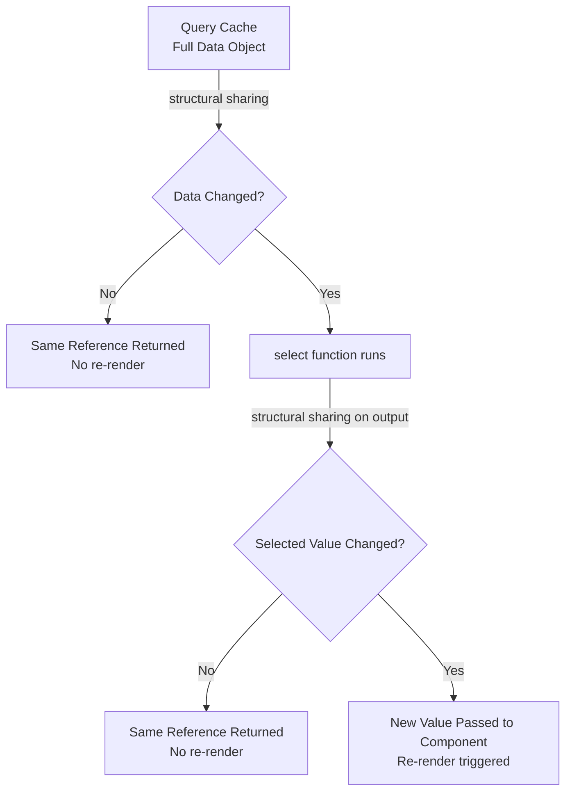

## Minimizing Re-renders with TanStack Query Selectors

TanStack Query's `select` option is one of the most powerful and underutilized tools for controlling component re-renders. By transforming or narrowing the data a component subscribes to, you can drastically reduce how often it updates — even when the underlying cache changes frequently.

---

### Why Re-renders Happen in TanStack Query

Every time a query's cached data changes, all components that subscribe to that query will re-render by default. This is expected behavior, but it becomes a performance problem when:

- A component only needs a small slice of a large dataset
- A component derives a computed value from raw data
- Multiple components share a query but need different projections of the same data

TanStack Query uses **structural sharing** by default, which already prevents re-renders when the data is deeply equal. However, if the reference to a sub-structure changes — even if the values are the same — a re-render will still be triggered. The `select` option addresses this at a finer level of granularity.

---

### The `select` Option

The `select` option is a transformation function applied to the resolved query data before it is returned to the component. The component only receives — and only re-renders for — the value that `select` returns.

```ts
useQuery({
  queryKey: ['users'],
  queryFn: fetchUsers,
  select: (data) => data.map((user) => user.name),
})
```

**Key Points**

- `select` runs after the query resolves and after structural sharing checks
- The result of `select` is itself structurally compared on each render
- If the selected value is referentially equal to the previous selected value, the component does **not** re-render
- `select` does not affect what is stored in the cache — the full data remains in the cache; only the component's view of it is narrowed

---

### Structural Sharing and Selector Stability

TanStack Query applies structural sharing to the output of `select` just as it does to raw query results. If the transformation produces a value that is deeply equal to the previous one, the same reference is returned and no re-render occurs.

**Example**

```ts
// This selector returns a primitive — always stable if the value hasn't changed
useQuery({
  queryKey: ['cart'],
  queryFn: fetchCart,
  select: (data) => data.totalItems,
})
```

Because `data.totalItems` is a number (a primitive), React's referential equality check passes trivially — the component only re-renders when `totalItems` actually changes, not when other cart properties change.

---

### Selecting Object Slices

When selecting an object rather than a primitive, structural sharing still protects you, but only if the object's shape and values haven't changed.

```ts
useQuery({
  queryKey: ['user', userId],
  queryFn: () => fetchUser(userId),
  select: (data) => ({
    fullName: `${data.firstName} ${data.lastName}`,
    avatar: data.avatarUrl,
  }),
})
```

**Key Points**

- If `firstName`, `lastName`, and `avatarUrl` are unchanged between fetches, the selector output will be structurally equal to the previous value
- TanStack Query's structural sharing will return the same reference, suppressing the re-render
- If any of those three fields change, the component re-renders — but fields like `data.email` or `data.preferences` changing will not trigger a re-render for this component

---

### Selector Stability: Avoiding Inline Functions

A common pitfall is defining the `select` function inline inside the component body. This creates a new function reference on every render, which — while it does not break correctness — may affect memoization behavior in certain scenarios.

**Problematic pattern**

```ts
// New function reference on every render
useQuery({
  queryKey: ['todos'],
  queryFn: fetchTodos,
  select: (data) => data.filter((todo) => !todo.completed), // ⚠️
})
```

**Preferred pattern — stable reference with `useCallback`**

```ts
const selectIncompleteTodos = useCallback(
  (data: Todo[]) => data.filter((todo) => !todo.completed),
  []
)

useQuery({
  queryKey: ['todos'],
  queryFn: fetchTodos,
  select: selectIncompleteTodos,
})
```

**Preferred pattern — module-level selector**

```ts
// Defined outside the component; reference is always stable
const selectIncompleteTodos = (data: Todo[]) =>
  data.filter((todo) => !todo.completed)

function TodoList() {
  const { data } = useQuery({
    queryKey: ['todos'],
    queryFn: fetchTodos,
    select: selectIncompleteTodos,
  })
  // ...
}
```

> [Inference] TanStack Query v5 may handle inline selectors more gracefully than earlier versions due to internal memoization improvements, but stabilizing the reference remains a recommended practice for predictability. Behavior may vary depending on version and React rendering mode.

---

### Using Selectors to Derive Computed Values

Selectors are ideal for computations that would otherwise require `useMemo` inside the component.

**Without selector — computation inside component**

```ts
function OrderSummary({ orderId }) {
  const { data: order } = useQuery({
    queryKey: ['order', orderId],
    queryFn: () => fetchOrder(orderId),
  })

  const total = useMemo(
    () => order?.items.reduce((sum, item) => sum + item.price * item.qty, 0),
    [order]
  )

  return <div>Total: {total}</div>
}
```

**With selector — computation moved into the query**

```ts
const selectOrderTotal = (order: Order) =>
  order.items.reduce((sum, item) => sum + item.price * item.qty, 0)

function OrderSummary({ orderId }) {
  const { data: total } = useQuery({
    queryKey: ['order', orderId],
    queryFn: () => fetchOrder(orderId),
    select: selectOrderTotal,
  })

  return <div>Total: {total}</div>
}
```

**Key Points**

- The computation now runs only when the query data changes, not on every render
- The component receives a primitive (`total`), guaranteeing no spurious re-renders
- The `useMemo` dependency management is eliminated

---

### Multiple Components, One Query, Different Selectors

A major advantage of `select` is that multiple components can subscribe to the same query key with different selectors, each independently controlling its own re-render boundary.

```ts
// Component A — only cares about the user's display name
function UserGreeting({ userId }) {
  const { data: name } = useQuery({
    queryKey: ['user', userId],
    queryFn: () => fetchUser(userId),
    select: (data) => data.displayName,
  })
  return <h1>Hello, {name}</h1>
}

// Component B — only cares about subscription status
function SubscriptionBadge({ userId }) {
  const { data: isPro } = useQuery({
    queryKey: ['user', userId],
    queryFn: () => fetchUser(userId),
    select: (data) => data.subscription === 'pro',
  })
  return isPro ? <ProBadge /> : null
}
```

**Key Points**

- Only one network request is made — the query is deduped by key
- `UserGreeting` re-renders only when `displayName` changes
- `SubscriptionBadge` re-renders only when the subscription tier changes
- Both components are fully isolated from changes to unrelated user fields

---

### Selecting Items from a List by ID

A common pattern is using a list query to power a detail view, selecting a single item without creating a separate query.

```ts
function TodoDetail({ todoId }: { todoId: number }) {
  const { data: todo } = useQuery({
    queryKey: ['todos'],
    queryFn: fetchTodos,
    select: (data) => data.find((todo) => todo.id === todoId),
  })

  if (!todo) return null
  return <div>{todo.title}</div>
}
```

**Key Points**

- The component re-renders only when the specific todo with `todoId` changes
- If other todos in the list are updated, this component remains unaffected
- This pattern is useful when individual item queries are not available or desirable

> [Inference] For large lists, this pattern may have a minor computational overhead per query refetch since `Array.find` runs on the full dataset. For most use cases this is negligible, but very large lists may benefit from a normalized cache approach instead.

---

### Combining `select` with `enabled` and Other Options

`select` composes cleanly with other `useQuery` options.

```ts
useQuery({
  queryKey: ['products', category],
  queryFn: () => fetchProducts(category),
  enabled: !!category,
  staleTime: 1000 * 60 * 5,
  select: (data) => data
    .filter((p) => p.inStock)
    .sort((a, b) => a.price - b.price),
})
```

The selector runs after the fetch completes and after structural sharing is applied to the raw result. The `enabled`, `staleTime`, and other options operate on the fetch lifecycle and do not interact with the selector logic.

---

### Selector Composition

For complex data models, selectors can be composed from smaller functions for reuse and testability.

```ts
const selectInStock = (products: Product[]) =>
  products.filter((p) => p.inStock)

const selectByPrice = (products: Product[]) =>
  [...products].sort((a, b) => a.price - b.price)

const selectCheapestInStock = (products: Product[]) =>
  selectByPrice(selectInStock(products))

useQuery({
  queryKey: ['products'],
  queryFn: fetchProducts,
  select: selectCheapestInStock,
})
```

Because these are plain functions, they are easily unit-tested in isolation without any Query infrastructure.

---

### Visualizing the Data Flow



---

### What `select` Does Not Do

- **Does not filter network requests.** The full data is always fetched and cached.
- **Does not replace query splitting.** If two features need entirely different data, separate query keys are more appropriate.
- **Does not affect `queryClient.getQueryData`.** The cache always holds the unselected, raw data.
- **Does not memoize across different selector references by default.** [Inference] Each unique `select` function reference may result in re-evaluation, though structural sharing on the output still suppresses re-renders when values are equal.

---

### TypeScript Considerations

The return type of `select` determines the type of `data` in the hook's return value. TypeScript infers this automatically.

```ts
// data is inferred as string[] — not User[]
const { data } = useQuery({
  queryKey: ['users'],
  queryFn: fetchUsers,           // returns Promise<User[]>
  select: (data) => data.map(u => u.email),  // returns string[]
})
```

For custom hooks, annotate the selector explicitly to preserve type safety.

```ts
function useUserEmails() {
  return useQuery<User[], Error, string[]>({
    queryKey: ['users'],
    queryFn: fetchUsers,
    select: (data) => data.map((u) => u.email),
  })
}
```

The three generic parameters are `<TData, TError, TSelect>` where `TSelect` is the type of the transformed output.

---

### Summary Table

| Scenario | Recommended Approach |
|---|---|
| Component needs one field from a large object | `select: (d) => d.fieldName` |
| Component needs a derived/computed value | Move computation into `select` |
| Multiple components share a query, different needs | Per-component `select` with stable references |
| Selector involves closures or dependencies | `useCallback` with dependency array |
| Reusable selector logic | Module-level function |
| Need full data in some components | Use `select` only in components that need a slice |

---

**Related Topics**

- Structural sharing internals — how TanStack Query compares data references
- `useCallback` and selector memoization patterns in React
- Normalizing cache data for fine-grained subscriptions
- `queryClient.getQueryData` vs. `select` — understanding the distinction
- Combining `select` with `placeholderData` for optimistic UI
- `useSuspenseQuery` and selector behavior in Suspense mode
- Custom hooks as selector wrappers — encapsulating query logic
- TanStack Query DevTools — inspecting cached vs. selected data