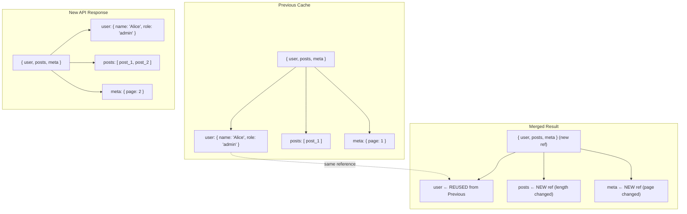

## Structural Sharing in Query Results

Structural sharing is a foundational optimization built into TanStack Query that silently prevents unnecessary re-renders by reusing object references from previous query results whenever the underlying data has not changed. Understanding it deeply explains why TanStack Query performs as well as it does — and why certain patterns work better than others.

---

### What Structural Sharing Means

When a query refetches and returns new data, TanStack Query does not simply replace the entire cached value with the new response. Instead, it performs a deep comparison between the previous result and the new result, then constructs a new object that:

- **Reuses references** from the previous result for any sub-tree that is deeply equal
- **Replaces references** only for sub-trees that have actually changed

The result is a new top-level reference (so React knows something may have changed) but with as many interior references preserved as possible.

**Key Points**

- Components subscribed to unchanged sub-trees do not re-render
- Selectors that return unchanged sub-trees return the same reference, suppressing re-renders
- The cache always holds the most recent full data, but with maximum reference reuse

---

### The Problem Structural Sharing Solves

Without structural sharing, every refetch — even one that returns identical data — would produce entirely new object references. Every subscribed component would re-render, and every `useMemo` or selector depending on any part of the data would invalidate.

**Example — without structural sharing**

```ts
// Fetch 1 result
const prev = { user: { name: 'Alice', role: 'admin' }, posts: [{ id: 1 }] }

// Fetch 2 result — identical data, but new JSON.parse() output
const next = { user: { name: 'Alice', role: 'admin' }, posts: [{ id: 1 }] }

prev === next          // false — different top-level reference
prev.user === next.user  // false — new reference even though values are equal
prev.posts === next.posts // false — same
```

Every component consuming `user` or `posts` would re-render, even though nothing changed.

**With structural sharing**

```ts
// TanStack Query merges prev and next
result.user === prev.user    // true — reference reused
result.posts === prev.posts  // true — reference reused
result === prev              // false — top-level reference is new (data came back)
```

Only components consuming data that genuinely changed will re-render.

---

### How the Algorithm Works

TanStack Query's structural sharing algorithm is a recursive deep-equality merge. The logic can be summarized as:

```
function structuralSharing(prev, next):
  if prev === next → return prev
  if type mismatch → return next
  if primitive → return next (primitives are compared by value elsewhere)
  if Array:
    if same length and all elements share recursively → return prev
    else → return new array with per-element sharing applied
  if Object:
    if same keys and all values share recursively → return prev
    else → return new object with per-value sharing applied
```

**Key Points**

- The algorithm is applied recursively through the entire data tree
- Arrays are compared element-by-element — a change to one element does not invalidate the reference to an unchanged element at a different index [Inference: behavior may vary depending on array mutation patterns]
- Objects are compared key-by-key — a new key or changed value produces a new object reference, but sibling keys that haven't changed may still return their previous references as nested values

---

### Visualizing Structural Sharing



---

### Structural Sharing and `select`

The `select` option benefits directly from structural sharing. Because `select` receives a value that already has maximum reference reuse applied, a selector that extracts an unchanged sub-tree will return the same reference it returned previously — and the component will not re-render.

```ts
useQuery({
  queryKey: ['org'],
  queryFn: fetchOrg,
  select: (data) => data.members,
})
```

If the refetch changes `data.settings` but not `data.members`, then:

- `data.members` has the same reference as before (structural sharing preserved it)
- The selector returns the same reference
- The component does not re-render

This is why `select` and structural sharing are complementary — structural sharing maximizes reference reuse in the cache, and `select` narrows which part of that cache a component observes.

---

### When Structural Sharing Cannot Help

There are patterns that defeat structural sharing, causing unnecessary re-renders even when the semantic data is unchanged.

#### New objects created during serialization

```ts
// API response is always re-parsed from JSON
// Dates deserialized as strings, then re-constructed as objects
queryFn: async () => {
  const data = await fetchEvents()
  return data.map(event => ({
    ...event,
    date: new Date(event.dateString), // new Date object every fetch
  }))
}
```

Because `new Date(...)` always produces a new object reference, structural sharing cannot match it to the previous result even if the date value is the same.

> [Inference] TanStack Query compares object references and plain value equality, but does not have special handling for `Date`, `Map`, `Set`, or other non-plain objects. Two `Date` objects with the same `.getTime()` value will not be considered equal by the structural sharing algorithm. Behavior may vary.

#### Randomly generated or unstable keys

```ts
queryFn: async () => {
  const data = await fetchItems()
  return data.map(item => ({
    ...item,
    _clientId: Math.random(), // always a new value
  }))
}
```

Any field that changes value on every fetch will cause its containing object's reference to be replaced, propagating reference changes upward through the tree.

#### Server-generated timestamps on unchanged records

```ts
// Server always returns updatedAt: <current time> even for unchanged records
{ id: 1, name: 'Alice', updatedAt: '2024-06-10T12:00:00Z' }
{ id: 1, name: 'Alice', updatedAt: '2024-06-10T12:00:01Z' } // next fetch
```

Even though `name` is unchanged, the `updatedAt` change causes a new object reference for the entire record.

---

### Disabling Structural Sharing

Structural sharing can be disabled per-query when needed — for example, when working with non-serializable data that cannot be structurally compared, or when the comparison overhead is measurably greater than the re-render cost for a specific query.

```ts
useQuery({
  queryKey: ['canvas-state'],
  queryFn: fetchCanvasState,
  structuralSharing: false,
})
```

**Key Points**

- When disabled, every refetch replaces the cached reference entirely, re-rendering all subscribers
- This is appropriate for data that is intentionally non-comparable (binary blobs, canvas state, WebGL buffers)
- Disabling it should be a deliberate, targeted choice — not a default

---

### Custom Structural Sharing Functions

TanStack Query v5 allows providing a custom structural sharing function, replacing the default algorithm for a specific query.

```ts
import { replaceEqualDeep } from '@tanstack/react-query'

useQuery({
  queryKey: ['events'],
  queryFn: fetchEvents,
  structuralSharing: (oldData, newData) => {
    // Custom merge: treat Date objects as equal if their time values match
    if (oldData instanceof Date && newData instanceof Date) {
      return oldData.getTime() === newData.getTime() ? oldData : newData
    }
    return replaceEqualDeep(oldData, newData)
  },
})
```

**Key Points**

- The function receives `(previousData, newData)` and must return the value to store
- `replaceEqualDeep` is TanStack Query's default implementation, exported for reuse in custom implementations
- This is the correct solution for `Date`, `Map`, `Set`, or domain-specific equality semantics

---

### `replaceEqualDeep` — The Default Implementation

TanStack Query exports `replaceEqualDeep` from `@tanstack/react-query`. It is the function that powers the default structural sharing behavior and can be used directly in testing or custom logic.

```ts
import { replaceEqualDeep } from '@tanstack/react-query'

const prev = { a: 1, b: { c: 2 } }
const next = { a: 1, b: { c: 2 } }

const result = replaceEqualDeep(prev, next)

result === prev        // true — top-level reference reused (all values equal)
result.b === prev.b    // true
```

```ts
const prev = { a: 1, b: { c: 2 } }
const next = { a: 1, b: { c: 3 } } // c changed

const result = replaceEqualDeep(prev, next)

result === prev        // false — top-level replaced (something changed)
result.b === prev.b    // false — b replaced (c changed)
result.a === prev.a    // true — primitive equality; a is still 1
```

**Output**

```
result: { a: 1, b: { c: 3 } }
// .a → same primitive value
// .b → new reference (c changed)
```

---

### Structural Sharing in `QueryClient` and Prefetching

Structural sharing applies not just to `useQuery` hook subscriptions but to the cache itself. When `prefetchQuery` resolves and stores data, or when `setQueryData` is called manually, TanStack Query applies structural sharing against the existing cached value.

```ts
queryClient.setQueryData(['user', 1], (oldData) => ({
  ...oldData,
  role: 'admin', // only this field changes
}))
```

After this call, components subscribed to `user.name`, `user.email`, or other unchanged fields will not re-render because those nested references remain stable in the cache.

> [Inference] The exact behavior of structural sharing during `setQueryData` depends on the version of TanStack Query and whether the updater function is used vs. a static value. Testing in your specific version is recommended.

---

### Structural Sharing vs. `notifyOnChangeProps`

`notifyOnChangeProps` is a separate mechanism that controls which properties of the `useQuery` return object (e.g., `data`, `isLoading`, `isFetching`) trigger a re-render. It operates at the hook level, not the data level.

| Mechanism | Operates On | Prevents Re-render When |
|---|---|---|
| Structural sharing | Cache data content | Data values are deeply equal |
| `notifyOnChangeProps` | Hook return object properties | Unobserved properties change (e.g., `isFetching`) |
| `select` | Subset of cache data | Selected slice is referentially equal |

These three mechanisms are complementary and stack together. A fully optimized query uses all three where appropriate.

```ts
useQuery({
  queryKey: ['user', userId],
  queryFn: () => fetchUser(userId),
  select: (data) => data.displayName,       // narrow the data slice
  notifyOnChangeProps: ['data'],            // ignore isFetching changes
  // structural sharing is always active by default
})
```

---

### Debugging Structural Sharing

TanStack Query DevTools does not directly expose which references were reused vs. replaced. The most effective debugging approaches are:

**Using `Object.is` in development**

```ts
select: (data) => {
  const result = data.items
  console.log('Same reference?', Object.is(result, previousRef))
  previousRef = result
  return result
}
```

**Using React DevTools Profiler**

The React Profiler highlights which components re-rendered and why. If a component re-renders with "Props changed" but its displayed values are identical, structural sharing may have been defeated by one of the patterns described above.

**Using `why-did-you-render`**

The `@welldone-software/why-did-you-render` library can be attached to components to log re-renders with prop diff output, making it straightforward to detect when a new object reference is causing an unnecessary render despite unchanged values.

---

### Performance Characteristics

> [Inference] The following observations are based on the algorithmic nature of structural sharing. Actual performance may vary based on data shape, size, JavaScript engine, and TanStack Query version.

- For small to medium objects (typical API responses), the overhead of structural sharing comparison is negligible compared to the cost of re-renders it prevents
- For very large, deeply nested objects (thousands of nodes), the comparison pass may itself become measurable — this is a scenario where `structuralSharing: false` combined with targeted `select` usage may outperform the default
- Arrays of primitives are compared quickly; arrays of objects require recursive descent and are proportionally more expensive to compare

---

**Related Topics**

- `replaceEqualDeep` source code walkthrough — understanding the algorithm in detail
- `notifyOnChangeProps` and tracked queries — complementary re-render control
- `select` option patterns — building on structural sharing guarantees
- Custom equality functions — domain-specific comparison strategies
- `setQueryData` immutability patterns — preserving structural sharing on manual updates
- Normalized caching approaches — alternative strategies for fine-grained subscriptions
- `Object.is` vs deep equality — understanding React's reconciliation assumptions
- TanStack Query DevTools — inspecting cache state and reference identity