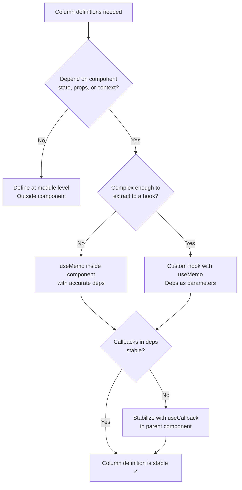

## Memoizing Column Definitions in TanStack Table

Column definitions are the most common source of unnecessary re-renders and table re-initialization in TanStack Table. Because column definitions are arrays of objects — often containing inline functions — they are almost always recreated on every parent component render unless explicitly stabilized. Understanding why this matters, and how to prevent it, is central to building performant tables.

---

### Why Column Definitions Cause Re-renders

TanStack Table's `useReactTable` hook accepts a `columns` array. Internally, the table instance compares incoming options to detect changes. When `columns` is a new array reference on every render, the table treats it as a configuration change and reprocesses accordingly.

In React, any value defined inside a component body is recreated on every render:

```ts
function MyTable() {
  // New array reference on every render
  const columns = [
    {
      accessorKey: 'name',
      header: 'Name',
    },
  ]

  const table = useReactTable({
    data,
    columns, // ← new reference every render
    getCoreRowModel: getCoreRowModel(),
  })
}
```

Every time `MyTable` re-renders — for any reason, including parent re-renders or unrelated state changes — `columns` is a brand new array. The table instance sees a new reference and reprocesses column structure, which cascades into re-renders of all column headers, cells, and derived state.

---

### The Three Stabilization Strategies

There are three primary approaches to stabilizing column definitions, each appropriate for different scenarios.

---

### Strategy 1 — Module-Level Definition (No Dependencies)

When column definitions do not depend on any component state, props, or context, the most reliable approach is to define them entirely outside the component, at module scope.

```ts
import { createColumnHelper, ColumnDef } from '@tanstack/react-table'

type User = {
  id: number
  name: string
  email: string
  role: string
}

const columnHelper = createColumnHelper<User>()

// Defined once at module level — reference never changes
const columns = [
  columnHelper.accessor('id', {
    header: 'ID',
    cell: (info) => info.getValue(),
  }),
  columnHelper.accessor('name', {
    header: 'Name',
    cell: (info) => info.getValue(),
  }),
  columnHelper.accessor('email', {
    header: 'Email',
  }),
  columnHelper.accessor('role', {
    header: 'Role',
  }),
]

function UserTable({ data }: { data: User[] }) {
  const table = useReactTable({
    data,
    columns, // ← stable reference always
    getCoreRowModel: getCoreRowModel(),
  })
  // ...
}
```

**Key Points**

- The `columns` reference is created once when the module loads and never changes
- No hook overhead — no `useMemo`, no dependency array management
- This is the preferred approach whenever columns are purely static
- `columnHelper` can also be defined at module level; it carries no runtime state

---

### Strategy 2 — `useMemo` (With Dependencies)

When column definitions depend on component-level values — translated strings, toggled features, callback props, or runtime configuration — `useMemo` is the appropriate tool.

```ts
function ProductTable({
  data,
  onEdit,
  onDelete,
  currency,
}: {
  data: Product[]
  onEdit: (id: number) => void
  onDelete: (id: number) => void
  currency: string
}) {
  const columns = useMemo<ColumnDef<Product>[]>(
    () => [
      {
        accessorKey: 'name',
        header: 'Product Name',
      },
      {
        accessorKey: 'price',
        header: `Price (${currency})`,
        cell: ({ getValue }) =>
          `${currency} ${(getValue() as number).toFixed(2)}`,
      },
      {
        id: 'actions',
        header: 'Actions',
        cell: ({ row }) => (
          <div>
            <button onClick={() => onEdit(row.original.id)}>Edit</button>
            <button onClick={() => onDelete(row.original.id)}>Delete</button>
          </div>
        ),
      },
    ],
    [currency, onEdit, onDelete]
  )

  const table = useReactTable({
    data,
    columns,
    getCoreRowModel: getCoreRowModel(),
  })
  // ...
}
```

**Key Points**

- `columns` is only recomputed when `currency`, `onEdit`, or `onDelete` change
- The dependency array must be accurate — omitting a dependency causes stale closures inside cell renderers
- If `onEdit` or `onDelete` are defined inline in the parent, they will be new references on every parent render, which defeats the memoization — see the callback stability section below

---

### Strategy 3 — Custom Hook Encapsulation

For complex tables with many columns, conditional columns, or reusable column sets, extracting column definitions into a custom hook improves organization and keeps the table component lean.

```ts
function useUserColumns(onEdit: (id: number) => void) {
  return useMemo<ColumnDef<User>[]>(
    () => [
      {
        accessorKey: 'name',
        header: 'Name',
      },
      {
        accessorKey: 'email',
        header: 'Email',
      },
      {
        id: 'actions',
        header: '',
        cell: ({ row }) => (
          <button onClick={() => onEdit(row.original.id)}>Edit</button>
        ),
      },
    ],
    [onEdit]
  )
}

function UserTable({ data, onEdit }: { data: User[]; onEdit: (id: number) => void }) {
  const columns = useUserColumns(onEdit)

  const table = useReactTable({
    data,
    columns,
    getCoreRowModel: getCoreRowModel(),
  })
  // ...
}
```

**Key Points**

- The hook owns the memoization logic — the table component has no knowledge of it
- The same hook can be reused across multiple table components
- Dependencies flow naturally as hook parameters
- The hook is independently testable

---

### Callback Stability — The Hidden Dependency Problem

A `useMemo` on `columns` is only as stable as its dependencies. The most common cause of memoization breakdown is unstable callback references passed as props.

**Problematic pattern — inline callbacks in parent**

```ts
function ParentPage() {
  // New function reference on every ParentPage render
  const handleEdit = (id: number) => {
    router.push(`/edit/${id}`)
  }

  return <UserTable data={users} onEdit={handleEdit} />
}
```

Every time `ParentPage` re-renders, `handleEdit` is a new reference. `UserTable`'s `useMemo` sees `onEdit` changed, recomputes `columns`, and the table reinitializes.

**Solution — stabilize callbacks with `useCallback`**

```ts
function ParentPage() {
  const handleEdit = useCallback((id: number) => {
    router.push(`/edit/${id}`)
  }, []) // router is stable; empty deps array is safe here

  return <UserTable data={users} onEdit={handleEdit} />
}
```

Now `handleEdit` has a stable reference across renders, `columns` memoization holds, and the table does not reinitialize.

> [Inference] Whether `router.push` is stable depends on the routing library. In Next.js App Router and React Router v6+, router methods are generally stable references. Verify for your specific library and version.

---

### Conditional Columns

A common requirement is showing or hiding columns based on user preferences or feature flags. This must be handled carefully to avoid defeating memoization.

**Problematic pattern — structural change on every render**

```ts
// columns array length changes, always a new structure
const columns = showAdminColumns
  ? [...baseColumns, adminColumn]
  : baseColumns
```

If `showAdminColumns` is derived from state that changes frequently, this creates a new array on every toggle — which is expected — but also risks creating a new array on unrelated renders if not memoized.

**Correct pattern — include the condition in `useMemo`**

```ts
const columns = useMemo<ColumnDef<User>[]>(
  () => [
    {
      accessorKey: 'name',
      header: 'Name',
    },
    {
      accessorKey: 'email',
      header: 'Email',
    },
    ...(showAdminColumns
      ? [
          {
            accessorKey: 'internalId',
            header: 'Internal ID',
          } satisfies ColumnDef<User>,
        ]
      : []),
  ],
  [showAdminColumns] // only recomputes when this flag changes
)
```

**Alternative — use column visibility instead**

TanStack Table's built-in column visibility state is often preferable to conditionally including/excluding columns from the definition array, because it avoids structural changes to the column definitions entirely.

```ts
// All columns always defined — visibility controlled separately
const [columnVisibility, setColumnVisibility] = useState({
  internalId: false,
})

const table = useReactTable({
  data,
  columns, // stable — no conditional columns
  state: { columnVisibility },
  onColumnVisibilityChange: setColumnVisibility,
  getCoreRowModel: getCoreRowModel(),
})
```

**Key Points**

- Column visibility toggling does not cause column definition recomputation
- The column definition array remains structurally stable
- This is the recommended approach for show/hide behavior in TanStack Table

---

### The `columnHelper` and Memoization

`createColumnHelper<T>()` returns a helper object with typed accessor methods. It carries no mutable state and is safe to define at module level or inside a `useMemo`. Its reference stability is irrelevant to memoization — what matters is the stability of the array it helps produce.

```ts
// Fine at module level
const columnHelper = createColumnHelper<User>()

// Also fine inside a custom hook — helper is lightweight
function useColumns() {
  const columnHelper = createColumnHelper<User>() // created each call, but cheap
  return useMemo(() => [
    columnHelper.accessor('name', { header: 'Name' }),
  ], [])
}
```

> [Inference] `createColumnHelper` is a factory that returns a plain object with methods. Creating it inside a hook on every render is not a performance concern, but placing it at module level is marginally cleaner.

---

### Cell Renderers and Inline JSX

Cell renderers that return JSX are particularly prone to reference instability because they are functions containing closures.

**Patterns ranked by stability**

```ts
// Least stable — new function and new JSX factory on every useMemo recompute
cell: ({ row }) => <ActionMenu id={row.original.id} onEdit={onEdit} />

// More stable — extract to a named component; React reconciles by component identity
const ActionCell = ({ id, onEdit }: { id: number; onEdit: (id: number) => void }) => (
  <ActionMenu id={id} onEdit={onEdit} />
)

// In column definition
cell: ({ row }) => <ActionCell id={row.original.id} onEdit={onEdit} />,
```

By extracting the cell renderer to a named component, React's reconciler can match it across renders by component type, enabling more granular re-render control via `React.memo`.

```ts
const ActionCell = React.memo(({ id, onEdit }: { id: number; onEdit: (id: number) => void }) => (
  <ActionMenu id={id} onEdit={onEdit} />
))
```

Now, even if the column definition is recomputed (due to a legitimate dependency change), individual `ActionCell` instances only re-render if their specific `id` or `onEdit` props change.

---

### Data Stability and Its Relationship to Column Memoization

Column definition stability alone is not sufficient for a fully optimized table. The `data` array must also be stable.

```ts
function UserTable() {
  // New array reference on every render — defeats table memoization
  const data = users.map(u => ({ ...u }))

  const table = useReactTable({ data, columns, ... })
}
```

```ts
// Correct — stable reference from server state or memoized transformation
const { data: users = [] } = useQuery({ queryKey: ['users'], queryFn: fetchUsers })

const data = useMemo(
  () => users.map(u => ({ ...u, displayName: `${u.first} ${u.last}` })),
  [users]
)
```

**Key Points**

- TanStack Query's structural sharing ensures `users` has a stable reference when data hasn't changed
- The `useMemo` on `data` transformation only recomputes when `users` itself changes
- Column memoization and data memoization work together — instability in either causes unnecessary table updates

---

### Decision Flowchart



---

### Summary Table

| Scenario | Strategy | Hook Used |
|---|---|---|
| Fully static columns | Module-level definition | None |
| Columns depend on props/state | `useMemo` in component | `useMemo` |
| Reusable or complex column sets | Custom hook | `useMemo` inside hook |
| Show/hide columns at runtime | Column visibility state | None (TanStack built-in) |
| Callbacks in cell renderers | Stabilize in parent | `useCallback` |
| Cell renderer components | Extract + `React.memo` | `React.memo` |

---

**Related Topics**

- `useReactTable` options stability — `data`, `getCoreRowModel`, and other option references
- Column visibility vs. conditional column definitions — choosing the right approach
- `React.memo` on cell renderer components — row-level re-render control
- TanStack Table virtualization with TanStack Virtual — interaction with column stability
- `getRowId` and row identity — preventing full table re-renders on data updates
- Derived column state with `useMemo` — sorting indicators, filter counts, aggregations
- TanStack Table with TanStack Query — coordinating data and column stability
- Structural sharing in TanStack Query — how stable data references flow into tables