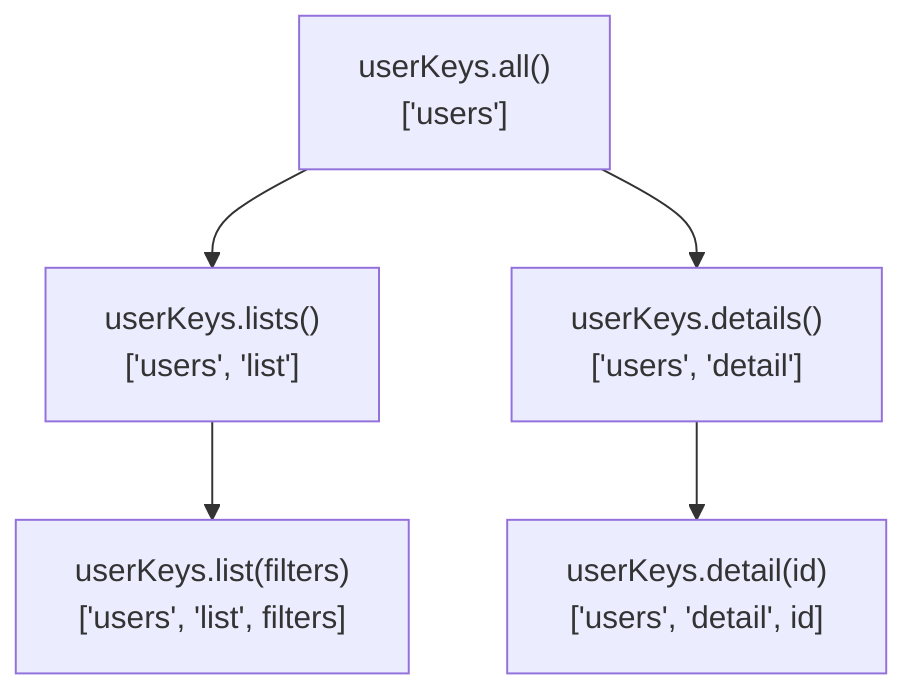

## Stable References for Query Keys

Query keys are the identity system of TanStack Query's cache. Every caching decision, deduplication check, refetch trigger, and invalidation target depends on the query key. Because TanStack Query serializes and compares keys by value rather than by reference, keys do not need to be referentially stable for correctness — but their instability has significant indirect consequences for performance that are easy to overlook.

---

### How TanStack Query Compares Query Keys

Query keys are compared using a deep equality check, not referential equality. This means two arrays that are different references but contain identical values are treated as the same key.

```ts
['users', { role: 'admin' }] === ['users', { role: 'admin' }] // false — different references
// But TanStack Query treats them as the same key — deep equality match
```

This design choice means the cache lookup itself is safe regardless of whether the key reference is stable. However, referential instability in query keys affects React's rendering pipeline in ways that are separate from the cache lookup.

---

### Why Reference Instability Still Matters

TanStack Query's `useQuery` hook takes `queryKey` as part of its options object. Internally, the hook uses the key to:

1. Subscribe to the correct cache entry
2. Detect when the key has changed (to fetch new data)
3. Determine when to unsubscribe from the old key and subscribe to a new one

The key change detection uses deep equality, so a new array reference with the same values does not trigger a refetch. However, the options object containing the key is evaluated on every render. If surrounding code reacts to the key reference rather than its value, instability can cause problems.

**More critically**, query key instability matters because of its effect on:

- `useEffect` dependencies that include query keys
- Callbacks or derived values that depend on keys
- Custom hooks that pass keys through as dependencies
- Coordinating keys between `useQuery` and `useMutation` invalidation

---

### The Core Problem — Inline Key Construction

The most common source of key instability is constructing array or object keys inline inside a component or custom hook.

```ts
function UserList({ role }: { role: string }) {
  const { data } = useQuery({
    queryKey: ['users', { role }], // new array on every render
    queryFn: () => fetchUsers(role),
  })
}
```

On every render of `UserList`, `['users', { role }]` produces a new array reference containing a new object reference. TanStack Query's deep equality check prevents spurious refetches, but any code that receives this key as a prop or dependency will see a new reference every time.

```ts
// This effect fires on every render because queryKey is a new reference
useEffect(() => {
  console.log('Key changed:', queryKey)
}, [queryKey]) // ← new reference every render even if values are identical
```

---

### Strategy 1 — Primitive Keys Where Possible

The simplest stabilization is to use primitive values rather than objects in query keys. Primitives satisfy React's referential equality check trivially.

```ts
// Unstable — object in key
queryKey: ['users', { role, page }]

// Stable — primitives only
queryKey: ['users', role, page]
```

**Key Points**

- `['users', 'admin', 1]` with the same string and number values will produce a consistent key that React hooks treat identically across renders
- Primitive-only keys are also easier to read, log, and invalidate
- Use object notation only when the semantic grouping of parameters genuinely aids clarity or when the key factory pattern (described below) is in use

---

### Strategy 2 — `useMemo` for Derived Keys

When a key must be constructed from multiple values or must include objects, `useMemo` stabilizes the reference.

```ts
function UserTable({ filters }: { filters: UserFilters }) {
  const queryKey = useMemo(
    () => ['users', filters.role, filters.department, filters.page],
    [filters.role, filters.department, filters.page]
  )

  const { data } = useQuery({
    queryKey,
    queryFn: () => fetchUsers(filters),
  })
}
```

**Output behavior**

- If `filters.role` changes, `queryKey` gets a new reference — correct, because the query should refetch
- If an unrelated parent state changes and `UserTable` re-renders with identical `filters`, `queryKey` returns the same reference — no spurious downstream effects

> [Inference] TanStack Query itself will not refetch due to key reference instability alone (it uses deep equality). The `useMemo` is primarily protective for `useEffect` dependencies, derived computations, and custom hooks that consume the key. Behavior of specific React versions and concurrent mode may vary.

---

### Strategy 3 — Query Key Factories

The query key factory pattern is the most scalable approach for applications with many related queries. It centralizes key construction into plain functions defined at module level, producing consistent, reusable, and testable keys.

```ts
// queryKeys.ts — defined at module level, outside any component
export const userKeys = {
  all: () => ['users'] as const,
  lists: () => [...userKeys.all(), 'list'] as const,
  list: (filters: UserFilters) =>
    [...userKeys.lists(), filters] as const,
  details: () => [...userKeys.all(), 'detail'] as const,
  detail: (id: number) => [...userKeys.details(), id] as const,
}
```

**Usage in components**

```ts
// List query
const { data: users } = useQuery({
  queryKey: userKeys.list({ role: 'admin', page: 1 }),
  queryFn: () => fetchUsers({ role: 'admin', page: 1 }),
})

// Detail query
const { data: user } = useQuery({
  queryKey: userKeys.detail(userId),
  queryFn: () => fetchUser(userId),
})
```

**Usage in mutations — consistent invalidation**

```ts
const mutation = useMutation({
  mutationFn: updateUser,
  onSuccess: (_, variables) => {
    // Invalidate the specific detail
    queryClient.invalidateQueries({ queryKey: userKeys.detail(variables.id) })
    // Invalidate all user lists
    queryClient.invalidateQueries({ queryKey: userKeys.lists() })
  },
})
```

**Key Points**

- The factory functions themselves are stable module-level references
- Keys are constructed consistently everywhere — no risk of typos or structural mismatches between `useQuery` and `invalidateQueries`
- The hierarchical structure enables prefix-based invalidation: invalidating `userKeys.all()` catches all user-related queries
- Keys are plain arrays, easily inspected in TanStack Query DevTools

---

### Key Hierarchy and Prefix Invalidation

The factory pattern's hierarchical structure enables targeted invalidation at any level of specificity.



```ts
// Invalidate only list queries — detail queries unaffected
queryClient.invalidateQueries({ queryKey: userKeys.lists() })

// Invalidate a specific detail — other details unaffected
queryClient.invalidateQueries({ queryKey: userKeys.detail(5) })

// Invalidate everything related to users
queryClient.invalidateQueries({ queryKey: userKeys.all() })
```

TanStack Query matches query keys by prefix when using `invalidateQueries`. Any cached key that starts with the provided prefix is invalidated. The factory hierarchy maps directly onto this prefix matching behavior.

---

### Strategy 4 — Stabilizing Object Keys with `useRef`

In cases where a complex object must be part of a query key and reconstructing it via `useMemo` is impractical, `useRef` can hold a stable reference that is only updated when the value actually changes.

```ts
function useStableKey<T>(value: T): T {
  const ref = useRef(value)

  if (!deepEqual(ref.current, value)) {
    ref.current = value
  }

  return ref.current
}

// Usage
function ReportTable({ config }: { config: ReportConfig }) {
  const stableConfig = useStableKey(config)

  const { data } = useQuery({
    queryKey: ['report', stableConfig],
    queryFn: () => fetchReport(stableConfig),
  })
}
```

**Key Points**

- `stableConfig` only gets a new reference when its deep value changes
- Requires a `deepEqual` implementation — options include `fast-deep-equal`, lodash `_.isEqual`, or TanStack Query's own `replaceEqualDeep`
- This pattern is a last resort; query key factories or primitive keys are preferable

> [Inference] This pattern introduces a custom deep equality dependency. The behavior of `useRef` in React concurrent mode under partial renders may produce subtle inconsistencies. Use with awareness of these edge cases.

---

### Query Keys in Custom Hooks

Custom hooks that accept query keys as parameters must handle stability carefully. If the caller passes an inline key, instability propagates into the hook.

**Fragile pattern — instability passes through**

```ts
function useFilteredUsers(role: string) {
  return useQuery({
    queryKey: ['users', { role }], // new object on every hook call
    queryFn: () => fetchUsers(role),
  })
}
```

**Stable pattern — key constructed inside the hook from primitives**

```ts
function useFilteredUsers(role: string) {
  return useQuery({
    queryKey: userKeys.list({ role }), // factory function, called with primitive
    queryFn: () => fetchUsers(role),
  })
}
```

Because `role` is a primitive string, React's equality check passes trivially. The factory function produces the same structure every time for the same input. TanStack Query's deep equality ensures no spurious refetches.

---

### Keys and `useEffect` Dependencies

A practical scenario where key stability matters outside of TanStack Query itself is synchronizing query keys with `useEffect`.

```ts
// Unstable key in effect deps — fires on every render
function SearchResults({ query }: { query: string }) {
  const queryKey = ['search', query] // new array every render

  useEffect(() => {
    analytics.track('search_viewed', { queryKey })
  }, [queryKey]) // fires every render — queryKey is always a new ref
}

// Stable key — effect fires only when query string changes
function SearchResults({ query }: { query: string }) {
  const queryKey = useMemo(() => ['search', query], [query])

  useEffect(() => {
    analytics.track('search_viewed', { queryKey })
  }, [queryKey]) // fires only when query changes
}
```

---

### Serialization and Key Constraints

TanStack Query serializes query keys for storage and hashing. Keys must be JSON-serializable.

**Valid key values**

```ts
['users']                              // strings
['users', 42]                          // numbers
['users', true]                        // booleans
['users', null]                        // null
['users', { role: 'admin', page: 1 }] // plain objects
['users', ['a', 'b']]                  // nested arrays
```

**Invalid key values**

```ts
['users', undefined]        // undefined is not serializable — [Unverified: behavior may vary by version]
['users', () => {}]         // functions are not serializable
['users', new Date()]       // class instances — serialized as {} losing all data
['users', Symbol('id')]     // symbols are not serializable
```

> [Inference] TanStack Query v5 may handle some edge cases differently than v4. For `undefined` values in keys, some versions silently drop them or treat them as a distinct value. Always test key serialization behavior for your specific version.

**Key Point** — if a key segment depends on data that may be `undefined` (such as a user ID before authentication resolves), use the `enabled` option rather than including `undefined` in the key.

```ts
useQuery({
  queryKey: userKeys.detail(userId!), // non-null assertion safe because of enabled
  queryFn: () => fetchUser(userId!),
  enabled: userId != null,           // query does not run until userId is defined
})
```

---

### `as const` and TypeScript Key Typing

The `as const` assertion on factory return values narrows the type to a readonly tuple, which improves TypeScript inference and prevents accidental mutation.

```ts
export const userKeys = {
  all: () => ['users'] as const,
  detail: (id: number) => ['users', 'detail', id] as const,
}

// Type of userKeys.detail(1) is readonly ['users', 'detail', number]
// Not string[] — preserves structural information for type checking
```

This is particularly useful when passing keys to `queryClient` methods, which accept `QueryKey` typed parameters.

---

### Comparison of Approaches

| Approach | Stability | Complexity | Best For |
|---|---|---|---|
| Primitive-only inline key | High (primitives) | None | Simple, flat keys |
| `useMemo` on key | High | Low | Keys with object segments |
| Query key factory | Highest | Low–Medium | Multi-query features, teams |
| `useStableKey` ref pattern | High | Medium | External/uncontrolled config objects |
| Module-level constant | Absolute | None | Keys with no dynamic segments |

---

**Related Topics**

- Query key factory patterns — advanced hierarchies and TypeScript integration
- `enabled` option and dependent queries — handling undefined key segments
- `invalidateQueries` prefix matching — leveraging key hierarchy for cache management
- `setQueryData` and key consistency — manual cache updates with factory keys
- `useQuery` vs `useSuspenseQuery` key behavior — stability considerations in Suspense mode
- Structural sharing and deep equality — how TanStack Query compares key and data values
- `queryClient.getQueriesData` — bulk cache reads using key prefixes
- Custom hooks as query wrappers — encapsulating key construction and stability