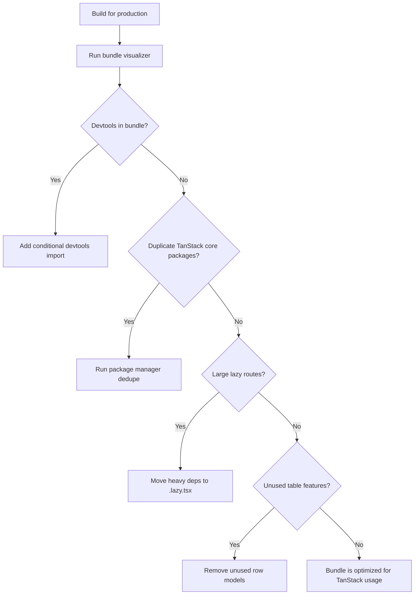

## Reducing Bundle Size Across TanStack Libraries

### Overview

TanStack libraries are designed with tree-shaking and modular imports in mind, but bundle size is not automatically minimized — it depends on how you import, configure, and consume each package. This topic covers actionable techniques applicable across TanStack Query, Router, Table, Form, Virtual, and related packages.

---

### Understanding TanStack Package Structure

TanStack libraries are published as ES modules with named exports, enabling tree-shaking in modern bundlers (Vite, Rollup, esbuild, webpack 5+). Each library separates its core (framework-agnostic) from its adapter (framework-specific).

| Package Layer | Example |
|---|---|
| Core | `@tanstack/query-core` |
| Adapter | `@tanstack/react-query` |
| Devtools | `@tanstack/react-query-devtools` |

[Inference] Importing only from adapter packages (e.g., `@tanstack/react-query`) re-exports from core, so you rarely need to import from core directly. Bundlers should tree-shake unused core exports, but this depends on the bundler's ability to analyze re-exports — behavior is not guaranteed across all configurations.

---

### Tree-Shaking: What It Requires

For tree-shaking to work effectively:

- The bundler must support ES module static analysis (Vite, Rollup, esbuild, webpack 5 with `"sideEffects": false`)
- Imports must be named, not namespace (`import { useQuery }` not `import * as TQ`)
- The package's `package.json` must declare `"sideEffects": false` — TanStack libraries generally do this

**Example — prefer named imports:**

```ts
// ✓ Tree-shakeable
import { useQuery, useMutation } from '@tanstack/react-query'

// ✗ Imports entire namespace, may defeat tree-shaking in some bundlers
import * as ReactQuery from '@tanstack/react-query'
```

---

### Devtools: Always Exclude from Production

Devtools packages are the most common source of avoidable bundle weight. They must be excluded from production builds explicitly — they are not automatically omitted.

```ts
// ✓ Conditionally import devtools
const ReactQueryDevtools =
  process.env.NODE_ENV === 'production'
    ? () => null
    : (await import('@tanstack/react-query-devtools')).ReactQueryDevtools
```

Or with lazy loading in React:

```tsx
import { lazy } from 'react'

const ReactQueryDevtools =
  process.env.NODE_ENV !== 'production'
    ? lazy(() =>
        import('@tanstack/react-query-devtools').then((m) => ({
          default: m.ReactQueryDevtools,
        }))
      )
    : () => null
```

[Inference] Bundlers that support dead code elimination (e.g., Vite with `define: { 'process.env.NODE_ENV': '"production"' }`) may eliminate the devtools branch at build time, but this should be verified via bundle analysis rather than assumed.

**Key Points**
- `@tanstack/react-query-devtools` is not small — it includes a full panel UI
- `@tanstack/router-devtools` similarly should not appear in production bundles
- Confirm exclusion with a bundle visualizer after every significant dependency update

---

### TanStack Query: Reducing Query Client Overhead

The `QueryClient` includes all cache management, retry logic, background refetch, and observer infrastructure. There is no supported partial build of `QueryClient` itself.

What you can control:

- **Do not import `QueryClient` in components.** Import it once at the app root and distribute via context.
- **Avoid importing from internal paths.** Internal paths (e.g., `@tanstack/query-core/build/...`) are not part of the public API and may break across minor versions. [Unverified — internal path stability is not documented as guaranteed.]

```ts
// ✓ Single QueryClient instance at app root
const queryClient = new QueryClient()

function App() {
  return (
    <QueryClientProvider client={queryClient}>
      <Router />
    </QueryClientProvider>
  )
}
```

---

### TanStack Router: Splitting Route Definitions

Route definitions themselves can contribute to bundle size if they eagerly import large components or utilities. Apply the `.lazy.ts` split covered in the previous topic, and additionally avoid importing heavy dependencies at the top of route files that run eagerly.

```ts
// posts.tsx — keep this lean
import { createFileRoute } from '@tanstack/react-router'
import { fetchPosts } from '../api/posts' // lightweight API call

export const Route = createFileRoute('/posts')({
  loader: () => fetchPosts(),
})

// posts.lazy.tsx — heavy deps go here
import { createLazyFileRoute } from '@tanstack/react-router'
import { DataGrid } from 'heavy-datagrid-library' // deferred

export const Route = createLazyFileRoute('/posts')({
  component: PostsPage,
})
```

**Key Points**
- Route loaders run eagerly; anything imported at the top of an eager route file is in the critical bundle
- Heavy UI dependencies (charting, editors, data grids) belong in `.lazy.tsx` files
- Search param validators (e.g., Zod schemas) used in `validateSearch` are eager — keep them lean or use lighter validators

---

### TanStack Table: Importing Only Used Features

`@tanstack/react-table` (and `@tanstack/table-core`) expose features as composable plugins via `createTable`. Not all features are used in every table instance.

Features such as sorting, filtering, grouping, and pagination are separate objects:

```ts
import {
  useReactTable,
  getCoreRowModel,
  getSortedRowModel,    // only if sorting is needed
  getFilteredRowModel,  // only if filtering is needed
  getPaginationRowModel // only if pagination is needed
} from '@tanstack/react-table'

const table = useReactTable({
  data,
  columns,
  getCoreRowModel: getCoreRowModel(),
  getSortedRowModel: getSortedRowModel(), // omit if unused
})
```

[Inference] Omitting unused row model functions should allow bundlers to tree-shake the corresponding feature logic, since each is a separate named export. Whether full elimination occurs depends on bundler configuration and the presence of side effects in the feature code — verify with bundle analysis.

---

### TanStack Virtual: Minimal Surface Area

`@tanstack/react-virtual` is one of the smaller TanStack packages. Its main cost is importing the virtualizer itself.

```ts
// Only import what you use
import { useVirtualizer } from '@tanstack/react-virtual'
// vs.
import { useWindowVirtualizer } from '@tanstack/react-virtual'
```

[Inference] Importing only one virtualizer variant should allow the other to be tree-shaken, but both are relatively small — this optimization has lower impact than devtools exclusion or route splitting.

---

### TanStack Form: Avoiding Validator Bloat

`@tanstack/react-form` supports multiple validation adapters. Each adapter is a separate package and should only be installed and imported if used.

```ts
// Only install and import the adapter you need
import { zodValidator } from '@tanstack/zod-form-adapter'
// OR
import { valibotValidator } from '@tanstack/valibot-form-adapter'
```

Avoid importing multiple validator adapters if only one is used. Zod itself is non-trivial in size; if bundle size is a constraint, consider `valibot` which is designed to be highly tree-shakeable. [Inference — comparative size depends on the version in use and the schemas defined; measure before concluding.]

---

### Shared Utilities: Avoiding Duplicate Dependencies

When multiple TanStack libraries are used together, they may share internal utilities. Package managers deduplicate these automatically in most cases, but lockfile fragmentation can cause duplicates.

```bash
# npm — deduplicate after installing multiple TanStack packages
npm dedupe

# pnpm
pnpm dedupe

# yarn
yarn dedupe
```

Check for duplicated TanStack core packages in bundle output:

```bash
npx vite-bundle-visualizer
# or
npx webpack-bundle-analyzer stats.json
```

Look for multiple instances of `@tanstack/query-core`, `@tanstack/store`, or `@tanstack/virtual-core` in the visualization. [Inference] Duplicate core packages are more likely in monorepo setups with mismatched version constraints — behavior varies by package manager and hoisting strategy.

---

### `@tanstack/store`: Incidental Inclusion

Several TanStack libraries depend on `@tanstack/store` internally (a fine-grained reactive store). You typically do not import it directly. However, if you are, ensure you are on the same version as the consuming library to avoid duplication.

[Inference] Mismatched `@tanstack/store` versions across TanStack packages in the same project may cause duplicate store code in the bundle. Aligning versions in `package.json` resolutions or overrides can mitigate this, though the actual deduplication outcome depends on the package manager.

---

### General Bundler Configuration

**Vite (recommended for TanStack projects):**

```ts
// vite.config.ts
import { defineConfig } from 'vite'

export default defineConfig({
  build: {
    target: 'esnext',        // enables modern syntax, smaller output
    minify: 'esbuild',       // fast and effective
    rollupOptions: {
      output: {
        manualChunks: {
          'tanstack-query': ['@tanstack/react-query'],
          'tanstack-router': ['@tanstack/react-router'],
          'tanstack-table': ['@tanstack/react-table'],
        }
      }
    }
  },
  define: {
    'process.env.NODE_ENV': JSON.stringify('production'), // enables dead code elimination
  }
})
```

[Inference] `manualChunks` for TanStack libraries creates vendor-style chunks that can be cached independently across deployments, reducing re-download cost for returning users. Whether this improves or degrades performance depends on total chunk count, user network conditions, and HTTP/2 multiplexing availability.

---

### Bundle Size Baseline: Approximate Reference

The following are rough, [Unverified] approximate minified+gzipped sizes based on community reports and prior analysis. Actual sizes vary by version, feature usage, and tree-shaking effectiveness. **Do not treat these as authoritative — measure your own bundle.**

| Package | Approx. min+gz |
|---|---|
| `@tanstack/react-query` | ~13–16 KB |
| `@tanstack/react-router` | ~35–50 KB |
| `@tanstack/react-table` | ~15–20 KB |
| `@tanstack/react-virtual` | ~3–5 KB |
| `@tanstack/react-form` | ~10–15 KB |
| `@tanstack/react-query-devtools` | ~50–80 KB |

[Unverified — these figures are approximations. Run `npx bundlephobia` or check bundlephobia.com for current measurements per version.]

---

### Measurement Workflow



---

**Related Topics**
- Bundle analysis tools: `vite-bundle-visualizer`, `rollup-plugin-visualizer`, `webpack-bundle-analyzer`
- `manualChunks` strategy for vendor splitting
- Package manager deduplication in monorepos (`pnpm`, `yarn`, `npm`)
- Comparing Zod vs. Valibot for form validation bundle cost
- HTTP/2 and chunk granularity tradeoffs
- `bundlephobia` for per-package size tracking
- TanStack Router lazy loading (covered in previous topic)
- Dynamic imports and `React.lazy` patterns outside TanStack Router