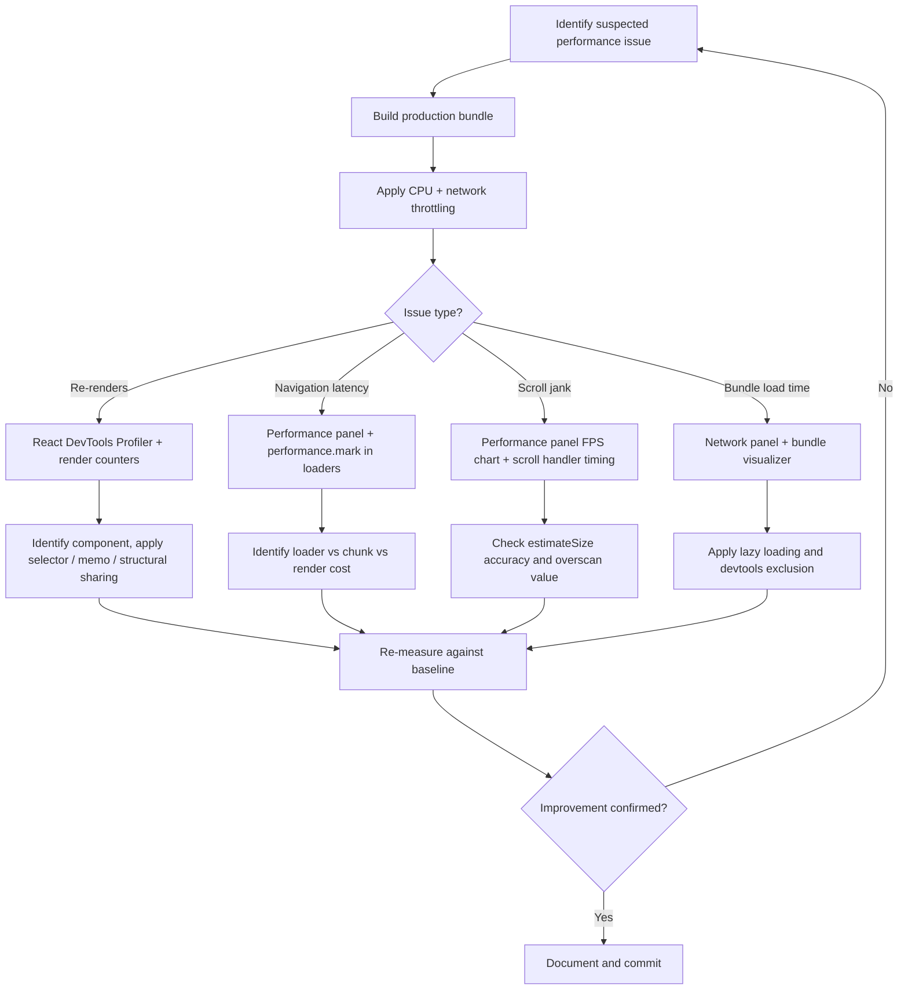

## Profiling and Measuring Performance

### Overview

Profiling TanStack applications requires combining browser-native tools, React-specific profiling, and library-level instrumentation. Measuring performance without tooling produces guesses rather than data. This topic covers how to observe, measure, and interpret performance across TanStack Query, Router, Table, Virtual, and Form.

---

### Establishing a Measurement Baseline

Before optimizing, establish reproducible measurements. Profiling in development mode is not representative — React runs additional checks, and TanStack libraries may include extra validation logic.

**Always profile:**
- A production build (`vite build` / `npm run build`)
- With the network throttled to a realistic profile (Fast 3G or custom)
- With CPU throttling applied in DevTools (4× or 6× slowdown simulates lower-end devices)
- Across multiple runs — single measurements have high variance

```bash
# Build for production before profiling
vite build
vite preview  # serve the production build locally
```

[Inference] Development builds can be 2–5× slower than production due to React's extra reconciliation checks and unminified code. Conclusions drawn from dev-mode profiling may not reflect production behavior — verify findings against a production build.

---

### Browser DevTools: Performance Panel

The Chrome (or Edge) Performance panel is the primary tool for measuring rendering, scripting, and layout costs.

**Recording a profile:**
1. Open DevTools → Performance tab
2. Enable CPU throttling (4×)
3. Click Record
4. Perform the interaction to measure (route navigation, table sort, query refetch)
5. Stop recording

**What to look for in TanStack applications:**

| Flame chart area | Relevance |
|---|---|
| Long tasks (>50ms) | Blocks main thread; user perceives jank |
| React reconciliation | Appears as `performConcurrentWorkOnRoot` |
| Query observer notifications | Appears as subscriber callbacks firing |
| Virtualizer scroll handler | High-frequency — should stay under 16ms per frame |
| Route transition | Loader + chunk fetch + render cascade |

---

### React DevTools Profiler

The React DevTools Profiler records component render timings and shows which components re-rendered and why.

**Setup:**
- Install the React DevTools browser extension
- Navigate to the Profiler tab
- Enable "Record why each component rendered" in settings

**Reading the output:**
- Each bar in the flame graph represents a render; width indicates duration
- Gray = did not render in this commit
- Color intensity = relative render duration
- "Why did this render?" shows prop/state/context changes

**Key Points**
- Components that render frequently with no visible change are candidates for memoization
- Context consumers re-render on every context value change — relevant to `QueryClientProvider` and router context
- [Inference] TanStack Query's internal observer system is designed to minimize unnecessary re-renders by comparing query result references, but whether a specific component avoids re-renders depends on selector usage and structural sharing configuration — behavior is not guaranteed

---

### TanStack Query: Measuring Render Frequency

A common performance issue in TanStack Query is components re-rendering more than expected on query updates.

**Diagnosis — add a render counter:**

```tsx
import { useRef } from 'react'

function PostList() {
  const renderCount = useRef(0)
  renderCount.current++

  const { data } = useQuery({ queryKey: ['posts'], queryFn: fetchPosts })

  return (
    <div>
      <small>Renders: {renderCount.current}</small>
      {data?.map(post => <PostItem key={post.id} post={post} />)}
    </div>
  )
}
```

**Diagnosis — use `why-did-you-render`:**

```bash
npm install @welldone-software/why-did-you-render --save-dev
```

```ts
// src/wdyr.ts — import before React in entry file
import React from 'react'
import whyDidYouRender from '@welldone-software/why-did-you-render'

if (process.env.NODE_ENV === 'development') {
  whyDidYouRender(React, {
    trackAllPureComponents: true,
  })
}
```

[Inference] `why-did-you-render` adds overhead and should only run in development. It may not correctly attribute re-renders caused by TanStack Query's internal state updates in all cases — treat output as a guide, not a definitive audit.

---

### TanStack Query: Structural Sharing

By default, TanStack Query uses structural sharing to preserve object identity for unchanged parts of query results. This means components selecting stable subsets of data may not re-render even when the broader query result updates.

```ts
const { data } = useQuery({
  queryKey: ['posts'],
  queryFn: fetchPosts,
  structuralSharing: true, // default
})
```

To measure its effect, disable it temporarily and compare render counts:

```ts
// Temporarily disable to measure baseline re-render rate
structuralSharing: false
```

[Inference] Disabling structural sharing will cause more frequent reference changes and likely more re-renders. This comparison quantifies how much work structural sharing is doing in a given component tree — actual impact depends on data shape and component subscription patterns.

---

### TanStack Query: `select` for Derived Data

The `select` option transforms query data before it reaches the component. This is measurable because it reduces the number of fields the component observes.

```ts
const { data: postTitles } = useQuery({
  queryKey: ['posts'],
  queryFn: fetchPosts,
  select: (data) => data.map(p => p.title), // component only sees titles
})
```

**Measuring the impact:**
- Without `select`: component re-renders whenever any field in any post changes
- With `select`: component re-renders only when titles change

Profile render frequency before and after adding `select` using the render counter technique above.

---

### TanStack Router: Measuring Navigation Performance

Route navigation cost = loader duration + lazy chunk fetch duration + render duration.

**Using the Performance panel:**
1. Start recording
2. Trigger navigation (click a `<Link>`)
3. Stop when the new route is rendered
4. In the Network panel, identify:
   - Chunk fetch timing (`.lazy` file request)
   - Loader fetch timing (API call initiated by `loader`)
   - Time-to-first-render of the new route component

**Using `performance.mark` in loaders:**

```ts
export const Route = createFileRoute('/posts')({
  loader: async () => {
    performance.mark('loader-start')
    const data = await fetchPosts()
    performance.mark('loader-end')
    performance.measure('posts-loader', 'loader-start', 'loader-end')
    return data
  },
})
```

Measurements appear in the Performance panel's Timings track and are accessible via:

```ts
performance.getEntriesByName('posts-loader')
```

---

### TanStack Router: `defaultPreload` Timing

If preloading is enabled, measure whether it reduces perceived navigation latency:

```ts
const router = createRouter({
  routeTree,
  defaultPreload: 'intent',
  defaultPreloadDelay: 100,
})
```

**Measurement approach:**
1. Record a Performance profile with preloading enabled
2. Hover a `<Link>` for >100ms, then click
3. Observe whether the chunk and loader were already resolved at click time
4. Compare against a profile with `defaultPreload: false`

[Inference] If the preload completes before the click, navigation should appear near-instant. Whether this holds depends on network speed and the `defaultPreloadDelay` value — on fast connections with short delays, preloading has the highest measurable impact.

---

### TanStack Table: Identifying Slow Renders

Large tables with many columns or rows are common sources of render bottlenecks.

**Measuring row model computation:**

```ts
const start = performance.now()
const table = useReactTable({
  data,
  columns,
  getCoreRowModel: getCoreRowModel(),
  getSortedRowModel: getSortedRowModel(),
})
console.log('table init:', performance.now() - start, 'ms')
```

[Inference] Row model computation runs on every render of the component containing `useReactTable`. With large datasets and multiple active features (sort + filter + group + pagination), this can become measurable — but actual cost depends on data size, column count, and active row models.

**Identifying unnecessary full re-renders:**

```tsx
const MemoizedRow = memo(({ row }: { row: Row<Data> }) => (
  <tr>
    {row.getVisibleCells().map(cell => (
      <td key={cell.id}>
        {flexRender(cell.column.columnDef.cell, cell.getContext())}
      </td>
    ))}
  </tr>
))
```

Profile before and after applying `memo` to rows. In the React Profiler, memoized rows should appear gray (did not render) when only unrelated rows change.

---

### TanStack Virtual: Scroll Performance

The virtualizer's scroll handler runs at scroll frequency — up to 60–120 times per second. Each invocation must complete within one frame (~8ms at 120Hz, ~16ms at 60Hz).

**Measuring with the Performance panel:**
1. Start recording
2. Scroll the virtualized list rapidly
3. Stop recording
4. Inspect the scroll event handlers in the flame chart
5. Identify any frames exceeding 16ms (shown in red in the FPS chart)

**Key metrics to watch:**

| Metric | Target |
|---|---|
| Scroll handler duration | < 5ms per frame |
| Layout thrashing | Zero forced reflows during scroll |
| Item render during scroll | Minimal — only new items entering view |

**Measuring item render frequency:**

```tsx
const itemRenderCount = useRef(0)

const rowVirtualizer = useVirtualizer({
  count: rows.length,
  getScrollElement: () => parentRef.current,
  estimateSize: () => 35,
})

{rowVirtualizer.getVirtualItems().map(virtualItem => {
  itemRenderCount.current++
  return <Row key={virtualItem.key} item={rows[virtualItem.index]} />
})}
```

[Inference] With correct `overscan` settings, the number of items rendered per scroll event should be small (typically 1–3 entering the viewport). If many items render per frame, `estimateSize` may be inaccurate, causing excessive recalculation — measure `estimateSize` accuracy against actual rendered heights.

---

### TanStack Form: Subscription Granularity

TanStack Form's field-level subscriptions mean only subscribed fields re-render on value change. Measuring whether this is working correctly:

```tsx
function NameField() {
  const renderCount = useRef(0)
  renderCount.current++

  return (
    <form.Field name="name">
      {(field) => (
        <div>
          <small>Field renders: {renderCount.current}</small>
          <input
            value={field.state.value}
            onChange={(e) => field.handleChange(e.target.value)}
          />
        </div>
      )}
    </form.Field>
  )
}
```

Type rapidly into one field and observe render counts on unrelated fields. [Inference] If unrelated fields are re-rendering on every keystroke, the form component tree may be structured in a way that bypasses field-level isolation — typically caused by shared state or context above the field level.

---

### Web Vitals in TanStack Applications

Core Web Vitals measure user-perceived performance. TanStack Router navigations affect some of these:

| Metric | TanStack relevance |
|---|---|
| LCP (Largest Contentful Paint) | Loader duration + component render time |
| INP (Interaction to Next Paint) | Table sort, form input, route transition responsiveness |
| CLS (Cumulative Layout Shift) | Pending components replacing layout space |

**Measuring with `web-vitals`:**

```ts
import { onLCP, onINP, onCLS } from 'web-vitals'

onLCP(console.log)
onINP(console.log)
onCLS(console.log)
```

[Inference] Slow loaders in TanStack Router directly increase LCP for data-dependent pages. Showing a `pendingComponent` during loading may improve perceived responsiveness but does not improve LCP if the largest content element is behind the loader.

---

### Profiling Workflow Summary



---

**Related Topics**
- `React.memo` and `useMemo` patterns for table row memoization
- `select` and structural sharing in TanStack Query
- `performance.mark` / `performance.measure` Web Performance API
- Core Web Vitals measurement and reporting
- `why-did-you-render` setup and interpretation
- Overscan tuning in TanStack Virtual
- Long task detection with `PerformanceObserver`
- Field-level vs. form-level subscriptions in TanStack Form