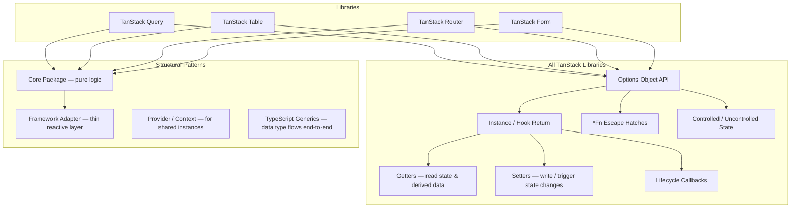

## Generic Patterns Used Across TanStack Libraries

TanStack libraries — Query, Table, Router, Form, Virtual, and others — share a set of architectural and API patterns that appear consistently across the ecosystem. Understanding these patterns at the generic level reduces the learning curve when moving between libraries and helps you reason about behavior, customization, and integration more effectively.

---

### The Headless Architecture Pattern

Every TanStack library is **headless**: it provides logic, state, and behavior with no opinion on markup, styling, or rendering framework.

**Key Points:**
- The library owns: state machines, derived computations, event handlers, and public API.
- You own: HTML structure, CSS, and how state maps to visual output.
- This separation means the same core package (`@tanstack/table-core`, `@tanstack/query-core`, etc.) powers all framework adapters.

```
┌─────────────────────────────────────────┐
│           Your Component                │
│  <table>, <div>, <ul>, any markup       │
└────────────────┬────────────────────────┘
                 │ calls / reads
┌────────────────▼────────────────────────┐
│        TanStack Instance / Hook         │
│  state, derived values, event handlers  │
└────────────────┬────────────────────────┘
                 │ framework-agnostic core
┌────────────────▼────────────────────────┐
│          @tanstack/*-core               │
│  pure logic, no DOM, no JSX             │
└─────────────────────────────────────────┘
```

---

### Core / Adapter Split

Each TanStack library ships a framework-agnostic core and thin framework adapters.

```
@tanstack/query-core       ← pure logic
@tanstack/react-query      ← React adapter
@tanstack/vue-query        ← Vue adapter
@tanstack/solid-query      ← Solid adapter
@tanstack/svelte-query     ← Svelte adapter

@tanstack/table-core       ← pure logic
@tanstack/react-table      ← React adapter

@tanstack/router-core      ← pure logic (internal)
@tanstack/react-router     ← React adapter
```

**Key Points:**
- Framework adapters are typically thin wrappers that subscribe the framework's reactivity system to the core instance.
- Unit tests can target `*-core` packages directly without mounting a framework component.
- [Inference] If a bug is reproducible using `*-core` alone, it is a core bug rather than an adapter bug — useful when filing issues.

---

### The Options Object Pattern

All TanStack libraries accept a single, large options object as their primary configuration surface. There are no positional arguments of significance.

```ts
// TanStack Query
const query = useQuery({
  queryKey: ['user', id],
  queryFn: fetchUser,
  staleTime: 1000 * 60,
  enabled: !!id,
});

// TanStack Table
const table = useReactTable({
  data,
  columns,
  getCoreRowModel: getCoreRowModel(),
  state: { sorting },
  onSortingChange: setSorting,
});

// TanStack Router
const route = createRoute({
  getParentRoute: () => rootRoute,
  path: '/users/$id',
  loader: ({ params }) => fetchUser(params.id),
});

// TanStack Form
const form = useForm({
  defaultValues: { name: '', email: '' },
  onSubmit: async ({ value }) => save(value),
});
```

**Key Points:**
- Options objects are typed end-to-end — TypeScript narrows valid keys and value types based on other options you provide.
- Options are often composable: you can extract subsets into variables and spread them in.
- Runtime validation of options is generally not performed; type errors are the primary guardrail.

---

### The Instance Pattern

Every TanStack library returns a **stateful instance** (or a hook that wraps one). All interaction happens through that instance's methods and properties.

```ts
// Query instance
const { data, isLoading, refetch, error } = useQuery({ ... });

// Table instance
const table = useReactTable({ ... });
table.getRowModel();
table.getState();
table.setSorting([...]);

// Router instance
const router = createRouter({ routeTree });
router.navigate({ to: '/users/$id', params: { id: '1' } });

// Form instance
const form = useForm({ ... });
form.handleSubmit();
form.getFieldValue('name');
```

**Key Points:**
- The instance is the stable reference; you do not call library functions directly after initialization.
- Methods on the instance are stable references in React [Inference: based on documented behavior; verify with your version], meaning they are safe to use in dependency arrays.
- The instance exposes both **state readers** (getters) and **state writers** (setters/handlers).

---

### Controlled and Uncontrolled State

TanStack libraries support both controlled and uncontrolled state for most features. This pattern appears in Table, Form, Router, and Query.

#### Uncontrolled (internal state)

The library owns the state internally. You provide no external `state` or `on*Change` props.

```ts
// Table — uncontrolled sorting
const table = useReactTable({
  data,
  columns,
  getCoreRowModel: getCoreRowModel(),
  getSortedRowModel: getSortedRowModel(),
  // no state.sorting, no onSortingChange
});
```

#### Controlled (external state)

You own the state via `useState` (or a store), pass it in, and receive updates via callbacks.

```ts
const [sorting, setSorting] = useState<SortingState>([]);

const table = useReactTable({
  data,
  columns,
  state: { sorting },
  onSortingChange: setSorting,
  getCoreRowModel: getCoreRowModel(),
  getSortedRowModel: getSortedRowModel(),
});
```

#### The `on*Change` Updater Function Pattern

TanStack callbacks use the React `setState`-compatible updater signature — they receive either a new value or a function that takes the previous value:

```ts
onSortingChange: setSorting,
// equivalent to:
onSortingChange: (updaterOrValue) => {
  setSorting(updaterOrValue);
}
```

This means you can intercept and transform state updates:

```ts
onSortingChange: (updater) => {
  const newValue = typeof updater === 'function' ? updater(sorting) : updater;
  analytics.track('sort_changed', newValue);
  setSorting(newValue);
},
```

**Key Points:**
- The updater pattern is consistent across TanStack Table, Form, and Router's search params API.
- You can partially control state: control some features (e.g., sorting) while leaving others uncontrolled (e.g., column visibility).

---

### The Feature Model (Plug-in Row Models / Middleware)

TanStack Table exposes this pattern most explicitly, but the underlying idea — **opt-in feature activation** — appears across all libraries.

```ts
// You opt in to each feature by passing its row model
const table = useReactTable({
  getCoreRowModel: getCoreRowModel(),      // required baseline
  getSortedRowModel: getSortedRowModel(),  // opt in: sorting
  getFilteredRowModel: getFilteredRowModel(), // opt in: filtering
  getPaginationRowModel: getPaginationRowModel(), // opt in: pagination
  getGroupedRowModel: getGroupedRowModel(),       // opt in: grouping
});
```

The same opt-in philosophy appears elsewhere:

```ts
// TanStack Query — opt in to features via options
useQuery({
  queryKey: [...],
  queryFn: fetchData,
  refetchOnWindowFocus: true,   // opt in
  refetchInterval: 5000,        // opt in
  placeholderData: keepPreviousData, // opt in
});

// TanStack Router — opt in to search param validation
const route = createRoute({
  validateSearch: (search) => mySchema.parse(search), // opt in
});
```

**Key Points:**
- Features that are not opted into do not run and do not incur their processing cost.
- This makes bundle size and runtime cost proportional to what you actually use.

---

### The `*Fn` Escape Hatch Pattern

Every TanStack library exposes `*Fn` options that let you replace internal algorithms with custom implementations.

```ts
// Table — custom sort function
{
  accessorKey: 'name',
  sortingFn: (rowA, rowB, columnId) => {
    return rowA.getValue(columnId).localeCompare(rowB.getValue(columnId), 'fil');
  },
}

// Table — custom filter function
{
  accessorKey: 'status',
  filterFn: (row, columnId, filterValue) => {
    return filterValue.includes(row.getValue(columnId));
  },
}

// Query — custom retry function
useQuery({
  queryKey: [...],
  queryFn: fetch,
  retryDelay: (attemptIndex) => Math.min(1000 * 2 ** attemptIndex, 30000),
});

// Form — custom validator
useForm({
  validators: {
    onChange: ({ value }) => value.name.length < 2 ? 'Too short' : undefined,
  },
});
```

**Key Points:**
- `*Fn` options are the primary extension points. They let you keep TanStack's state management while replacing only the algorithm you need to override.
- Named built-in functions are registered on the library's utility objects (e.g., `sortingFns`, `filterFns`) and can be referenced by string key.

```ts
// Using a built-in by name
{ accessorKey: 'name', sortingFn: 'alphanumeric' }

// Registering a custom function globally (Table)
declare module '@tanstack/react-table' {
  interface SortingFns {
    localeSort: SortingFn<unknown>;
  }
}
```

---

### Selector and Derived Data Pattern

TanStack libraries compute derived state lazily and expose it through getter methods or selector functions, avoiding unnecessary recalculation.

```ts
// Table — derived row data
table.getRowModel().rows         // rows after all pipeline transformations
table.getFilteredRowModel().rows // rows after filtering only
table.getSortedRowModel().rows   // rows after sorting only
table.getCoreRowModel().rows     // raw rows, no transformations

// Query — derived booleans
const { isLoading, isFetching, isError, isSuccess, isPending } = useQuery({...});

// Query — selector to derive a subset of data
const count = useQuery({
  queryKey: ['todos'],
  queryFn: fetchTodos,
  select: (data) => data.filter(t => !t.done).length,
});
```

**Key Points:**
- In TanStack Query, `select` transforms data after fetching. The cache stores the original response; the `select` result is computed per-subscriber. [Inference: based on documented behavior; may vary across versions.]
- This means two components can subscribe to the same query key with different `select` functions, each receiving different derived values without triggering separate network requests.

---

### The Query/State Key Pattern

TanStack Query and TanStack Router both use **array keys** as stable identifiers for cache entries and route state.

```ts
// Query keys
['todos']                          // collection
['todos', { status: 'active' }]    // filtered collection
['todo', 42]                       // single item
['user', userId, 'posts']          // nested resource

// Router search param state (validated, typed)
const route = createRoute({
  validateSearch: z.object({
    page: z.number().default(1),
    query: z.string().optional(),
  }),
});
```

**Key Points:**
- Query keys are serialized for comparison. Objects within keys are compared by value, not reference. [Inference: based on TanStack Query documentation.]
- Key arrays are hierarchical: `queryClient.invalidateQueries({ queryKey: ['todos'] })` invalidates all queries whose key starts with `'todos'`.
- The same philosophy appears in Router's search params: structured, typed, and composable rather than raw strings.

---

### The Context / Provider Pattern

All TanStack React adapters use React Context to provide instances to the component tree.

```tsx
// TanStack Query
import { QueryClient, QueryClientProvider } from '@tanstack/react-query';

const queryClient = new QueryClient();

function App() {
  return (
    <QueryClientProvider client={queryClient}>
      <MyApp />
    </QueryClientProvider>
  );
}

// TanStack Router
import { RouterProvider, createRouter } from '@tanstack/react-router';

const router = createRouter({ routeTree });

function App() {
  return <RouterProvider router={router} />;
}

// TanStack Table — no global provider needed
// The table instance is local to the component that creates it
```

**Key Points:**
- `QueryClient` is intentionally created outside the component tree so it persists across re-renders.
- TanStack Table does not require a provider because the table instance is scoped to a single component subtree by design.
- In testing, wrap components with the appropriate provider or pass a test-scoped client instance.

---

### TypeScript Generics Pattern

TanStack libraries are designed generics-first. The data type flows through the entire API, providing end-to-end type safety.

```ts
// Table — TData flows from data through columns to cell renderers
type User = { id: number; name: string; role: string };

const columns: ColumnDef<User>[] = [
  {
    accessorKey: 'name',
    cell: ({ row }) => row.original.name, // row.original is typed as User
  },
];

const table = useReactTable<User>({ data, columns, ... });
// table.getRowModel().rows[0].original is User

// Query — TData and TError flow through
const { data } = useQuery<User[], ApiError>({
  queryKey: ['users'],
  queryFn: fetchUsers,
});
// data is User[] | undefined

// Router — params and search are typed from route definition
const { userId } = useParams({ from: '/users/$userId' });
// userId is string (inferred from route path)
```

**Key Points:**
- Generics are inferred where possible. Explicit annotation is only required when inference is insufficient (e.g., when `queryFn` return type is ambiguous).
- TypeScript errors surface at the options object level, often pointing to mismatches between `data` type, `columns` type, and `state` type.

---

### The Lifecycle Callback Pattern

TanStack libraries expose lifecycle hooks for side effects at key moments.

```ts
// TanStack Query
useQuery({
  queryKey: ['data'],
  queryFn: fetch,
  // deprecated in v5 — prefer useEffect on data/error
  // onSuccess, onError, onSettled removed from useQuery in v5
});

// Mutation lifecycle (still present)
useMutation({
  mutationFn: saveData,
  onMutate: (variables) => { /* optimistic update */ },
  onSuccess: (data, variables, context) => { /* invalidate queries */ },
  onError: (error, variables, context) => { /* rollback */ },
  onSettled: (data, error) => { /* always runs */ },
});

// TanStack Form
useForm({
  onSubmit: async ({ value, formApi }) => { /* submit */ },
  onSubmitInvalid: ({ value, formApi }) => { /* handle invalid */ },
});

// TanStack Router
const route = createRoute({
  beforeLoad: async ({ context, location }) => { /* auth check */ },
  loader: async ({ params }) => { /* data loading */ },
  onError: (error) => { /* handle loader error */ },
});
```

**Key Points:**
- Lifecycle callbacks follow a consistent ordering: `before*` → main operation → `on*` callbacks (`onSuccess`, `onError`, `onSettled`).
- In TanStack Query v5, `onSuccess`/`onError`/`onSettled` were removed from `useQuery` to avoid confusing per-component side effects. [Unverified — verify against your installed version before relying on this.]

---

### The Lazy Initialization / `create*` Pattern

TanStack libraries often provide `create*` factory functions for constructing instances outside React's render cycle.

```ts
// Router
const router = createRouter({ routeTree });
const rootRoute = createRootRoute({ component: Root });
const userRoute = createRoute({ ... });

// Table (framework-agnostic)
import { createTable } from '@tanstack/table-core';
const table = createTable({ data, columns, ... });

// Query
const queryClient = new QueryClient({ defaultOptions: { ... } });
// created once, outside component tree
```

**Key Points:**
- `create*` functions exist outside React, making them usable in tests, server environments, and non-React contexts.
- Instances created with `create*` do not re-create on re-render, unlike instances created inline in a component body.

---

### Diagram: Shared Patterns Across TanStack Libraries



---

### Comparing Pattern Appearances Across Libraries

| Pattern | Query | Table | Router | Form |
|---|---|---|---|---|
| Options object | `useQuery({})` | `useReactTable({})` | `createRoute({})` | `useForm({})` |
| Controlled state | `enabled`, `staleTime` | `state` + `on*Change` | search params | `defaultValues` |
| `*Fn` escape hatch | `queryFn`, `retryDelay` | `sortingFn`, `filterFn` | `loader`, `beforeLoad` | validators |
| Lifecycle callbacks | `onSuccess`, `onError` | — | `beforeLoad`, `onError` | `onSubmit` |
| Core / adapter split | `query-core` | `table-core` | `router-core` | `form-core` |
| TypeScript generics | `useQuery<TData, TError>` | `ColumnDef<TData>` | typed params/search | typed `defaultValues` |
| Provider pattern | `QueryClientProvider` | none (local) | `RouterProvider` | none (local) |

---

**Related Topics:**
- Comparing TanStack Query v4 vs v5 API changes
- Writing framework-agnostic logic with `*-core` packages
- Integrating TanStack libraries with Zustand or Jotai
- Building a unified `create*` factory for testing across libraries
- TypeScript module augmentation for custom `*Fn` registrations
- Server-side rendering patterns shared across TanStack libraries
- Migrating a codebase to use TanStack Router alongside TanStack Query