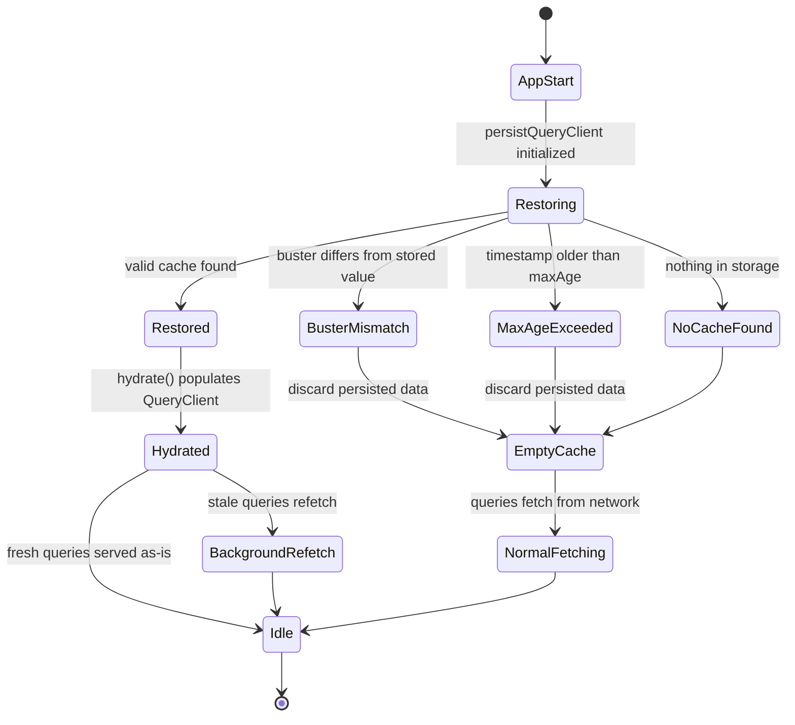

## Cache Persistence with persistQueryClient

### Overview

`persistQueryClient` is a TanStack Query utility that saves the contents of a `QueryClient`'s cache to a durable storage medium and restores it on subsequent application loads. This allows an application to render previously-fetched data immediately on startup rather than showing a loading state, while TanStack Query revalidates that data in the background according to normal staleness rules.

The core package is `@tanstack/query-persist-client-core`, with framework-specific bindings such as `@tanstack/react-query-persist-client` for React. Persistence works alongside — not instead of — TanStack Query's normal in-memory cache; the persisted copy is a serialized snapshot that gets rehydrated into the live `QueryClient` cache.

### Why Persist the Cache

**Key Points**
- Avoids blank/loading screens on app reload by restoring previously fetched data instantly
- Improves perceived performance, particularly valuable for mobile and offline-capable apps
- Reduces redundant network requests immediately after a reload, since restored data is still considered fresh or stale according to its original `dataUpdatedAt` timestamp
- Commonly paired with offline-first architectures, though persistence itself is not the same as offline mutation queuing (that is handled separately by TanStack Query's `onlineManager` and mutation persistence)

### Core Concepts

Persistence in TanStack Query revolves around three pieces:

1. **A Persister** — an object implementing `persistClient`, `restoreClient`, and `removeClient` methods, responsible for actually writing to and reading from storage.
2. **`persistQueryClient`** — the function that wires a `QueryClient` instance to a persister, subscribing to cache changes and triggering saves.
3. **Dehydration/Hydration** — the underlying serialization mechanism (`dehydrate`/`hydrate`) that converts the in-memory cache into a plain, storable JSON-compatible object and back.

### The Persister Interface

A persister must conform to this shape:

```ts
interface Persister {
  persistClient(persistedClient: PersistedClient): Promisable<void>
  restoreClient(): Promisable<PersistedClient | undefined>
  removeClient(): Promisable<void>
}
```

`PersistedClient` bundles the dehydrated cache state along with a `timestamp` and a `buster` string (explained below).

TanStack provides ready-made persister creators so most applications never need to implement this interface manually.

### Built-in Persisters

#### createSyncStoragePersister

For synchronous storage APIs like `localStorage` or `sessionStorage`, available via `@tanstack/query-sync-storage-persister`.

```ts
import { createSyncStoragePersister } from '@tanstack/query-sync-storage-persister'

const persister = createSyncStoragePersister({
  storage: window.localStorage,
})
```

#### createAsyncStoragePersister

For asynchronous storage engines such as IndexedDB wrappers (e.g., `idb-keyval`) or React Native's `AsyncStorage`, available via `@tanstack/query-async-storage-persister`.

```ts
import { createAsyncStoragePersister } from '@tanstack/query-async-storage-persister'
import { get, set, del } from 'idb-keyval'

const persister = createAsyncStoragePersister({
  storage: {
    getItem: get,
    setItem: set,
    removeItem: del,
  },
})
```

[Inference] IndexedDB-based persisters are generally preferred over `localStorage` for larger caches because `localStorage` has a small storage quota (typically ~5MB) and is synchronous, which can block the main thread on large writes.

### Wiring Up persistQueryClient

The core function connects the `QueryClient` to a persister:

```ts
import { QueryClient } from '@tanstack/query-core'
import { persistQueryClient } from '@tanstack/query-persist-client-core'
import { createSyncStoragePersister } from '@tanstack/query-sync-storage-persister'

const queryClient = new QueryClient({
  defaultOptions: {
    queries: {
      gcTime: 1000 * 60 * 60 * 24, // 24 hours
    },
  },
})

const persister = createSyncStoragePersister({
  storage: window.localStorage,
})

persistQueryClient({
  queryClient,
  persister,
  maxAge: 1000 * 60 * 60 * 24, // 24 hours
})
```

Note the alignment between `gcTime` and `maxAge`: a query cannot be persisted longer than its garbage collection time allows it to remain in memory, so `gcTime` should generally be set equal to or greater than `maxAge`.

### React Integration: PersistQueryClientProvider

For React applications, `@tanstack/react-query-persist-client` exposes a provider component that combines `QueryClientProvider` with persistence setup, handling restoration timing and suspense/hydration boundaries automatically.

```tsx
import { QueryClient } from '@tanstack/react-query'
import { PersistQueryClientProvider } from '@tanstack/react-query-persist-client'
import { createSyncStoragePersister } from '@tanstack/query-sync-storage-persister'

const queryClient = new QueryClient({
  defaultOptions: {
    queries: {
      gcTime: 1000 * 60 * 60 * 24,
      staleTime: 1000 * 60, // 1 minute
    },
  },
})

const persister = createSyncStoragePersister({
  storage: window.localStorage,
})

function App() {
  return (
    <PersistQueryClientProvider
      client={queryClient}
      persistOptions={{ persister }}
    >
      <RestOfApp />
    </PersistQueryClientProvider>
  )
}
```

`PersistQueryClientProvider` also emits an `onSuccess` callback once restoration completes, useful for delaying certain UI states until hydration finishes.

### Configuration Options

| Option | Purpose |
|---|---|
| `persister` | The storage adapter implementing the Persister interface |
| `maxAge` | Maximum age (ms) a persisted cache is considered valid; defaults to 24 hours |
| `buster` | A string used for cache-busting; changing it invalidates all persisted data |
| `dehydrateOptions` | Passed through to `dehydrate()`, controls which queries/mutations get persisted |
| `hydrateOptions` | Passed through to `hydrate()` on restoration |

### Filtering What Gets Persisted

Not all cached data is safe or desirable to persist — sensitive data, extremely large payloads, or highly volatile queries may be excluded using `dehydrateOptions.shouldDehydrateQuery`:

```ts
persistQueryClient({
  queryClient,
  persister,
  dehydrateOptions: {
    shouldDehydrateQuery: (query) => {
      // only persist queries tagged as persistable
      return query.queryKey[0] !== 'sensitive-data'
    },
  },
})
```

By default, only **successful** queries are dehydrated; queries in an error or pending state are excluded, since restoring an error state on load is rarely desirable.

### Handling Data Structure Changes with buster

When the shape of persisted data changes (e.g., after a schema migration, or an API contract change), old cached data may be structurally incompatible with the new client code. The `buster` option handles this by comparing a stored version string on restore and discarding the entire cache if it doesn't match:

```ts
persistQueryClient({
  queryClient,
  persister,
  buster: 'v2', // bump this string on breaking changes
})
```

This is a coarse invalidation mechanism — it clears the whole persisted cache rather than allowing partial migrations.

### Removing the Persisted Cache

The `persistQueryClient` function returns an unsubscribe function that also exposes cleanup behavior; explicit removal is otherwise handled through the persister:

```ts
await persister.removeClient()
```

This is commonly triggered on user logout to avoid leaking one user's cached data into another user's session on a shared device.

### Restoration and Timing Considerations

**Key Points**
- Restoration is asynchronous even for `createSyncStoragePersister`, since `persistQueryClient` wraps the whole flow in promises to accommodate both sync and async persisters uniformly
- There is a brief window between app mount and cache restoration; UI that depends on cached data should account for this, typically by using the provided `onSuccess`/restoration-complete signal rather than assuming data is present on first render
- [Inference] In highly latency-sensitive UIs, delaying the initial render until restoration completes (rather than flashing an empty state and then repainting) is often preferable, though this trades off against time-to-first-paint

### Interaction with staleTime and gcTime

Restored queries retain their original `dataUpdatedAt`. TanStack Query evaluates staleness the same way for restored data as for data fetched during the current session:

$$\text{isStale} = (\text{now} - \text{dataUpdatedAt}) > \text{staleTime}$$

If the persisted data is older than `staleTime`, an active `useQuery` observer will trigger a background refetch immediately upon mount. If it's within `staleTime`, the restored data is served without refetching until it becomes stale.

### Persistence Flow Diagram

<svg xmlns="http://www.w3.org/2000/svg" viewBox="0 0 900 460">
  <text x="450" y="30" text-anchor="middle" font-size="18" font-weight="bold" fill="#1a1a2e">persistQueryClient Data Flow (svg_diagram)</text>

  <rect x="40" y="70" width="220" height="70" rx="8" fill="#e0f2fe" stroke="#0369a1" stroke-width="2" />
  <text x="150" y="100" text-anchor="middle" font-size="14" fill="#0c4a6e">QueryClient</text>
  <text x="150" y="120" text-anchor="middle" font-size="12" fill="#0c4a6e">In-memory cache</text>

  <rect x="340" y="70" width="220" height="70" rx="8" fill="#fef3c7" stroke="#b45309" stroke-width="2" />
  <text x="450" y="100" text-anchor="middle" font-size="14" fill="#78350f">dehydrate()</text>
  <text x="450" y="120" text-anchor="middle" font-size="12" fill="#78350f">Serialize to plain object</text>

  <rect x="640" y="70" width="220" height="70" rx="8" fill="#dcfce7" stroke="#15803d" stroke-width="2" />
  <text x="750" y="100" text-anchor="middle" font-size="14" fill="#14532d">Persister.persistClient</text>
  <text x="750" y="120" text-anchor="middle" font-size="12" fill="#14532d">Write to storage</text>

  <rect x="640" y="220" width="220" height="70" rx="8" fill="#dcfce7" stroke="#15803d" stroke-width="2" />
  <text x="750" y="250" text-anchor="middle" font-size="14" fill="#14532d">Storage Medium</text>
  <text x="750" y="270" text-anchor="middle" font-size="12" fill="#14532d">localStorage / IndexedDB</text>

  <rect x="340" y="220" width="220" height="70" rx="8" fill="#fef3c7" stroke="#b45309" stroke-width="2" />
  <text x="450" y="250" text-anchor="middle" font-size="14" fill="#78350f">Persister.restoreClient</text>
  <text x="450" y="270" text-anchor="middle" font-size="12" fill="#78350f">Read from storage</text>

  <rect x="40" y="220" width="220" height="70" rx="8" fill="#e0f2fe" stroke="#0369a1" stroke-width="2" />
  <text x="150" y="250" text-anchor="middle" font-size="14" fill="#0c4a6e">hydrate()</text>
  <text x="150" y="270" text-anchor="middle" font-size="12" fill="#0c4a6e">Rebuild cache entries</text>

  <rect x="40" y="360" width="820" height="70" rx="8" fill="#ede9fe" stroke="#6d28d9" stroke-width="2" />
  <text x="450" y="390" text-anchor="middle" font-size="14" fill="#4c1d95">QueryClient cache repopulated on app start</text>
  <text x="450" y="410" text-anchor="middle" font-size="12" fill="#4c1d95">Stale queries background-refetch per staleTime rules</text>

  <line x1="260" y1="105" x2="340" y2="105" stroke="#374151" stroke-width="2" marker-end="url(#arrow1)" />
  <line x1="560" y1="105" x2="640" y2="105" stroke="#374151" stroke-width="2" marker-end="url(#arrow1)" />
  <line x1="750" y1="140" x2="750" y2="220" stroke="#374151" stroke-width="2" marker-end="url(#arrow1)" />
  <line x1="640" y1="255" x2="560" y2="255" stroke="#374151" stroke-width="2" marker-end="url(#arrow1)" />
  <line x1="340" y1="255" x2="260" y2="255" stroke="#374151" stroke-width="2" marker-end="url(#arrow1)" />
  <line x1="150" y1="290" x2="150" y2="330" stroke="#374151" stroke-width="2" marker-end="url(#arrow1)" />
  <line x1="150" y1="330" x2="450" y2="360" stroke="#374151" stroke-width="2" marker-end="url(#arrow1)" />

  </svg>

### Lifecycle State Machine



### Combining with Persisted Mutations (Offline Support)

While `persistQueryClient` focuses on query cache data, TanStack Query separately supports persisting the **mutation cache** for offline-first patterns, using `mutationCache` configuration combined with `resumePausedMutations()`. This allows mutations issued while offline to be queued, persisted, and replayed once connectivity returns, working in tandem with the `onlineManager`.

```ts
const queryClient = new QueryClient({
  defaultOptions: {
    mutations: {
      gcTime: 1000 * 60 * 60 * 24,
    },
  },
})

persistQueryClient({
  queryClient,
  persister,
})

// on app start, after restoration:
await queryClient.resumePausedMutations()
```

[Unverified] The exact API surface for mutation persistence (e.g., whether `resumePausedMutations` requires manual invocation versus being automatic in a given TanStack Query version) has shifted across major versions; consult the changelog for the specific version in use.

### Security and Data Sensitivity Considerations

**Key Points**
- Persisted cache data sits in browser storage in plaintext by default (both `localStorage` and IndexedDB); this is inspectable via browser dev tools and accessible to any script running in the same origin
- Sensitive data (tokens, PII, financial figures) should either be excluded via `shouldDehydrateQuery` or encrypted before persistence using a custom persister wrapper
- On shared or public devices, persisted caches should be cleared on logout via `persister.removeClient()`
- [Inference] Because `localStorage` is synchronous and not sandboxed per-tab in the same way as some other APIs, extremely large persisted payloads may cause perceptible jank during write operations, favoring async storage engines for bigger datasets

### Common Pitfalls

**Key Points**
- Setting `gcTime` lower than `maxAge` causes queries to be garbage-collected from memory before they can be persisted, silently reducing what's actually saved
- Forgetting to bump `buster` after changing query key structures or response shapes can lead to hydration errors or stale/incompatible data being served
- Persisting extremely large caches (e.g., large lists or media-heavy responses) into `localStorage` can hit browser storage quotas, causing `persistClient` to throw
- Not filtering out error-state or highly sensitive queries before persistence
- Assuming restoration is synchronous and reading cache state immediately on render before hydration completes

### Practical Example: Full Setup with Filtering and Busting

```tsx
import { QueryClient } from '@tanstack/react-query'
import { PersistQueryClientProvider } from '@tanstack/react-query-persist-client'
import { createSyncStoragePersister } from '@tanstack/query-sync-storage-persister'

const CACHE_VERSION = 'v3'

const queryClient = new QueryClient({
  defaultOptions: {
    queries: {
      staleTime: 1000 * 60 * 5,       // 5 minutes
      gcTime: 1000 * 60 * 60 * 24,    // 24 hours
    },
  },
})

const persister = createSyncStoragePersister({
  storage: window.localStorage,
  key: 'MY_APP_QUERY_CACHE',
})

function App() {
  return (
    <PersistQueryClientProvider
      client={queryClient}
      persistOptions={{
        persister,
        maxAge: 1000 * 60 * 60 * 24,
        buster: CACHE_VERSION,
        dehydrateOptions: {
          shouldDehydrateQuery: (query) =>
            query.state.status === 'success' &&
            query.queryKey[0] !== 'authToken',
        },
      }}
      onSuccess={() => {
        console.log('Cache restored from storage')
      }}
    >
      <RestOfApp />
    </PersistQueryClientProvider>
  )
}
```

**Output**

On first load with no prior cache: application fetches normally, and successful, non-excluded queries are written to `localStorage` under the key `MY_APP_QUERY_CACHE` as they resolve.

On subsequent loads within 24 hours and matching `buster: 'v3'`: cached data renders immediately; any query older than 5 minutes (`staleTime`) triggers a silent background refetch.

### Conclusion

`persistQueryClient` bridges TanStack Query's in-memory cache with durable browser storage, enabling instant data availability across page reloads without sacrificing the staleness and revalidation model that makes TanStack Query's caching reliable. Proper configuration hinges on aligning `gcTime` and `maxAge`, deliberately filtering sensitive or unstable queries out of persistence, and using `buster` to guard against schema drift. Combined with mutation persistence and the `onlineManager`, it forms a foundation for robust offline-capable applications, though actual behavior around timing and mutation resumption should be verified against the specific TanStack Query version in use.

**Related Topics**
- Offline mutation queuing with `onlineManager` and `resumePausedMutations`
- Server-Side Rendering hydration vs. client-side persistence hydration
- Custom persister implementation for encrypted storage
- Query key structuring for safer persistence filtering
- `dehydrate`/`hydrate` API deep dive
- Storage quota management strategies for large caches
- Testing persisted cache behavior across app versions