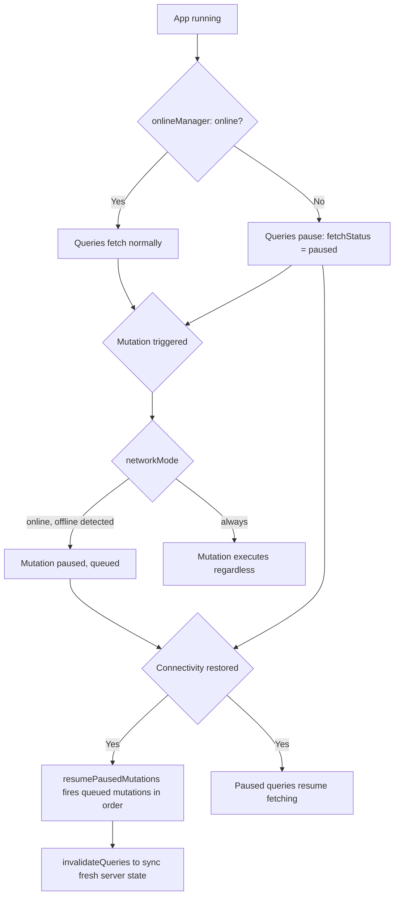

## Offline Support Strategies

### Overview

Offline support in TanStack Query refers to a collection of coordinated mechanisms that allow an application to continue functioning — reading cached data and queuing writes — when network connectivity is unavailable, and to reconcile state automatically once connectivity returns. This is not a single feature but an integration of several subsystems: the `onlineManager`, `networkMode` query/mutation settings, cache persistence, and paused-mutation resumption.

Unlike a full offline-first framework, TanStack Query does not provide a local-first data store or conflict-resolution engine out of the box. It provides the primitives — network state detection, request pausing, retry orchestration, and cache durability — from which an offline-capable UX can be built.

### Core Building Blocks

**Key Points**
- `onlineManager` — tracks browser/network connectivity and exposes a subscribable online/offline state
- `networkMode` — a per-query/mutation setting controlling whether an operation should execute, pause, or fail when offline
- `persistQueryClient` — persists the query cache to durable storage so cached data survives reloads while offline
- Paused mutation queue — mutations attempted while offline are held ("paused") rather than immediately failing, and can be resumed later
- `focusManager` — related but distinct; governs refetch-on-window-focus behavior, which interacts with reconnect behavior

### The onlineManager

`onlineManager` is TanStack Query's abstraction over the browser's `navigator.onLine` and `online`/`offline` events. It decouples the library's internal notion of connectivity from the raw browser API, allowing custom detection logic (useful in React Native, Electron, or environments where `navigator.onLine` is unreliable).

```ts
import { onlineManager } from '@tanstack/react-query'

// Default behavior uses window online/offline events already.
// Override with custom logic, e.g. for React Native:
onlineManager.setEventListener((setOnline) => {
  const eventSubscription = NetInfo.addEventListener((state) => {
    setOnline(!!state.isConnected)
  })
  return eventSubscription
})
```

You can also manually query or set online status:

```ts
onlineManager.isOnline() // boolean
onlineManager.setOnline(false) // force offline mode, e.g. for testing
```

[Inference] `navigator.onLine` only reflects whether the device has a network interface active, not whether that network actually reaches the internet — so relying solely on the browser default can produce false positives (device shows "online" while actually unable to reach the server). Custom connectivity checks (e.g., a lightweight ping) may be more reliable in production offline-detection scenarios.

### networkMode: Controlling Fetch Behavior

`networkMode` determines how queries and mutations behave relative to connectivity state. It accepts three values:

| Mode | Behavior |
|---|---|
| `'online'` (default) | Queries/mutations only execute when online; if offline, they are paused (`fetchStatus: 'paused'`) rather than failing |
| `'always'` | Executes regardless of connectivity — useful for requests that don't depend on the network (e.g., reading from a local cache API, AsyncStorage, or a service worker cache) |
| `'offlineFirst'` | Executes the fetch once regardless of connectivity, but subsequent retries respect online status — designed for scenarios like service-worker-backed requests that may succeed even while `navigator.onLine` reports false |

```ts
useQuery({
  queryKey: ['todos'],
  queryFn: fetchTodos,
  networkMode: 'offlineFirst',
})
```

Set globally via `defaultOptions`:

```ts
const queryClient = new QueryClient({
  defaultOptions: {
    queries: { networkMode: 'online' },
    mutations: { networkMode: 'online' },
  },
})
```

### Query Status vs. Fetch Status While Offline

A critical distinction for building offline UI: `status` (`pending` / `error` / `success`) reflects data availability, while `fetchStatus` (`fetching` / `paused` / `idle`) reflects the current network activity. A query can be `status: 'success'` (serving cached data) while `fetchStatus: 'paused'` (waiting for connectivity to refetch).

```tsx
function TodoList() {
  const { data, status, fetchStatus } = useQuery({
    queryKey: ['todos'],
    queryFn: fetchTodos,
  })

  if (status === 'pending') return <span>Loading...</span>
  if (status === 'error') return <span>Error loading todos</span>

  return (
    \<div\>
      {fetchStatus === 'paused' && <Banner>You're offline — showing cached data</Banner>}
      <TodoItems data={data} />
    \</div\>
  )
}
```

### Mutations While Offline: Pausing and Resuming

By default (`networkMode: 'online'`), a mutation triggered while offline enters a paused state instead of immediately erroring. It waits until connectivity resumes, then automatically fires.

```ts
const mutation = useMutation({
  mutationFn: updateTodo,
  networkMode: 'online',
  onMutate: async (variables) => {
    // optimistic update logic
  },
})
```

Paused mutations exist only in memory by default — they do **not** survive a page reload unless the mutation cache is also persisted. For durability across reloads, combine with `persistQueryClient` and explicitly resume paused mutations on startup:

```ts
import { QueryClient } from '@tanstack/react-query'
import { persistQueryClient } from '@tanstack/react-query-persist-client'

const queryClient = new QueryClient()

persistQueryClient({
  queryClient,
  persister,
})

queryClient.resumePausedMutations()
```

[Unverified] The precise defaults around whether paused mutations are automatically resumed on reconnect versus requiring an explicit `resumePausedMutations()` call have varied across TanStack Query major versions; verify against the changelog for the version in use.

### Mutation Ordering and the mutationCache

When multiple mutations are queued while offline, they resume in the order they were originally dispatched, preserving sequential consistency (important for dependent writes, e.g., "create record" before "update record"). The `MutationCache`'s `onMutate`, `onSuccess`, and `onSettled` callbacks fire in that same order during resumption.

```ts
const queryClient = new QueryClient({
  mutationCache: new MutationCache({
    onSuccess: (data, variables, context, mutation) => {
      // runs once per resumed mutation, in original order
    },
  }),
})
```

### Combining Persistence with Offline Mutations

A robust offline-first setup typically layers:

1. `persistQueryClient` for query cache durability
2. `networkMode: 'online'` (default) so mutations pause rather than fail
3. `resumePausedMutations()` invoked after cache restoration completes
4. `onlineManager` custom detection if the platform's default connectivity signal is unreliable

```ts
persistQueryClient({
  queryClient,
  persister,
  maxAge: 1000 * 60 * 60 * 24,
}).then(() => {
  queryClient.resumePausedMutations().then(() => {
    queryClient.invalidateQueries()
  })
})
```

Calling `invalidateQueries()` after resuming mutations ensures that any queries whose underlying data changed as a result of queued mutations are refetched with fresh server state, avoiding stale reads.

### Retry Behavior and Offline Interaction

TanStack Query's retry logic is aware of network status: if a request fails due to connectivity loss, retries are paused rather than exhausted, and resume once `onlineManager` reports online again. This is distinct from application-level retry configuration (`retry`, `retryDelay`), which governs behavior for genuine request failures (e.g., HTTP 500) as opposed to network unavailability.

$$\text{retryDelay}(attempt) = \min(1000 \times 2^{attempt}, 30000)$$

This is the default exponential backoff formula TanStack Query uses for retries, capped at 30 seconds, though it is configurable via the `retryDelay` option.

### Offline State Flow



### Visual: Layered Offline Architecture

<svg xmlns="http://www.w3.org/2000/svg" viewBox="0 0 900 420">
  <text x="450" y="30" text-anchor="middle" font-size="18" font-weight="bold" fill="#1a1a2e">Offline Support Layers (svg_diagram)</text>

  <rect x="60" y="60" width="780" height="70" rx="8" fill="#e0f2fe" stroke="#0369a1" stroke-width="2" />
  <text x="450" y="90" text-anchor="middle" font-size="14" fill="#0c4a6e">UI Layer</text>
  <text x="450" y="110" text-anchor="middle" font-size="12" fill="#0c4a6e">Reads status/fetchStatus, shows offline banners, optimistic UI</text>

  <rect x="60" y="150" width="780" height="70" rx="8" fill="#fef3c7" stroke="#b45309" stroke-width="2" />
  <text x="450" y="180" text-anchor="middle" font-size="14" fill="#78350f">Query &amp; Mutation Layer</text>
  <text x="450" y="200" text-anchor="middle" font-size="12" fill="#78350f">networkMode governs execution vs pausing; retry/backoff logic</text>

  <rect x="60" y="240" width="780" height="70" rx="8" fill="#dcfce7" stroke="#15803d" stroke-width="2" />
  <text x="450" y="270" text-anchor="middle" font-size="14" fill="#14532d">Connectivity Layer</text>
  <text x="450" y="290" text-anchor="middle" font-size="12" fill="#14532d">onlineManager tracks connection state, triggers resume events</text>

  <rect x="60" y="330" width="780" height="70" rx="8" fill="#ede9fe" stroke="#6d28d9" stroke-width="2" />
  <text x="450" y="360" text-anchor="middle" font-size="14" fill="#4c1d95">Persistence Layer</text>
  <text x="450" y="380" text-anchor="middle" font-size="12" fill="#4c1d95">persistQueryClient durably stores cache across reloads</text>

  <line x1="450" y1="130" x2="450" y2="150" stroke="#374151" stroke-width="2" marker-end="url(#arrowOA)" />
  <line x1="450" y1="220" x2="450" y2="240" stroke="#374151" stroke-width="2" marker-end="url(#arrowOA)" />
  <line x1="450" y1="310" x2="450" y2="330" stroke="#374151" stroke-width="2" marker-end="url(#arrowOA)" />

  </svg>

### Optimistic Updates as an Offline UX Technique

While not exclusive to offline scenarios, optimistic updates are especially important for perceived responsiveness when connectivity is degraded or absent — the UI reflects the intended end state immediately, and rolls back only if the eventually-resumed mutation fails.

```ts
const queryClient = useQueryClient()

const mutation = useMutation({
  mutationFn: updateTodo,
  onMutate: async (newTodo) => {
    await queryClient.cancelQueries({ queryKey: ['todos'] })
    const previousTodos = queryClient.getQueryData(['todos'])
    queryClient.setQueryData(['todos'], (old) =>
      old.map((t) => (t.id === newTodo.id ? newTodo : t))
    )
    return { previousTodos }
  },
  onError: (err, newTodo, context) => {
    queryClient.setQueryData(['todos'], context.previousTodos)
  },
  onSettled: () => {
    queryClient.invalidateQueries({ queryKey: ['todos'] })
  },
})
```

When a mutation is paused offline, the optimistic state set in `onMutate` remains visible in the UI for the entire duration the app is offline, since `onSettled`/`onError` won't fire until the mutation actually resolves after resumption.

### Service Workers and offlineFirst

Applications using a service worker with a cache-first or stale-while-revalidate strategy (e.g., via Workbox) often pair well with `networkMode: 'offlineFirst'`, since the actual `fetch()` call may succeed by hitting the service worker's cache even when `navigator.onLine` is false. In this architecture, TanStack Query's retry/backoff still applies for genuine failures, but the initial attempt isn't blocked purely on the browser's online flag.

[Speculation] Because service worker cache strategies and `networkMode` are configured independently, teams sometimes end up with a redundant double-caching layer (service worker cache + TanStack Query cache); whether this is beneficial or merely duplicative likely depends on the specific data volatility and payload sizes involved, which isn't something that can be generalized without profiling a given application.

### Detecting and Communicating Offline State to Users

**Key Points**
- Subscribe to `onlineManager` directly for a global offline indicator independent of any specific query:

```tsx
import { onlineManager } from '@tanstack/react-query'
import { useSyncExternalStore } from 'react'

function useIsOnline() {
  return useSyncExternalStore(
    (callback) => onlineManager.subscribe(callback),
    () => onlineManager.isOnline()
  )
}
```

- Surface paused mutation counts to users so they understand pending sync work exists:

```ts
const isMutating = useIsMutating()
const pausedCount = queryClient
  .getMutationCache()
  .getAll()
  .filter((m) => m.state.isPaused).length
```

### Common Pitfalls

**Key Points**
- Assuming `networkMode: 'online'` will cause offline requests to error — by default they pause silently, which can look like the app is "hanging" if there's no UI indicator for `fetchStatus: 'paused'`
- Forgetting that paused mutations are in-memory only unless mutation persistence and `resumePausedMutations()` are explicitly wired up, causing queued writes to be lost on refresh
- Relying exclusively on `navigator.onLine`, which can report inaccurate connectivity in captive-portal or limited-connectivity scenarios
- Not calling `invalidateQueries()` after mutation resumption, leaving related queries showing pre-mutation optimistic state indefinitely
- Mixing `networkMode: 'always'` into mutations that genuinely require server confirmation, defeating the purpose of pause-and-resume semantics

### Conclusion

Offline support in TanStack Query is achieved by composing several independently configurable systems — `onlineManager` for connectivity awareness, `networkMode` for controlling pause-versus-execute behavior, cache persistence for surviving reloads, and paused mutation resumption for durable write queuing. None of these alone constitutes "offline support"; a production-grade offline experience requires deliberately wiring them together, along with UI feedback that distinguishes cached-but-stale data from genuinely fresh data. Because this spans multiple TanStack Query subsystems and often interacts with platform-specific connectivity APIs and service worker strategies, implementation details should be validated against the specific TanStack Query version and target platform.

**Related Topics**
- Cache persistence with `persistQueryClient` (foundational prerequisite)
- Optimistic updates and rollback patterns in depth
- Custom `onlineManager` implementations for React Native / Electron
- Retry and exponential backoff configuration
- Service worker caching strategies alongside TanStack Query
- Conflict resolution strategies for queued offline mutations
- `focusManager` and refetch-on-reconnect behavior