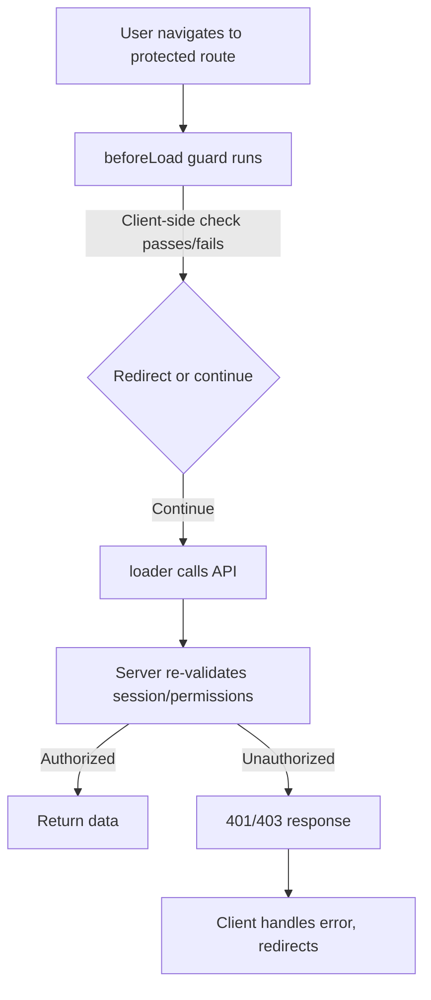

## Security Considerations for Route Guards

### Overview

Route guards in TanStack Router (`beforeLoad`, `loader` context checks, and route-level redirects) run primarily on the client by default, even when used with TanStack Start for server-side rendering. Treating a route guard as a genuine security boundary rather than a UX/navigation-flow control is a common and serious mistake. This section covers the threat model, common pitfalls, and mitigations.

### The Core Threat Model

**Key Points**

- Client-side JavaScript is fully visible and modifiable by the end user. Any `beforeLoad` check written in client-only code can be bypassed by disabling JavaScript, editing browser state, or calling underlying APIs/loaders directly.
- A route guard that only prevents *rendering* of a component does not prevent *data fetching* if the loader itself doesn't independently verify authorization.
- [Confirmed] TanStack Router's `beforeLoad` executes before a route's `loader`, and its returned context is merged into the context available to that route's `loader` and children. This makes it a good place to centralize auth checks that other loaders can depend on, but it does not make those checks server-enforced by itself in a client-only SPA deployment.
- [Inference] The security guarantee of a `beforeLoad` check depends entirely on *where* the underlying data or mutation it guards is fetched from. If the loader calls an API that itself checks authorization server-side, the guard is a UX enhancement layered on top of real enforcement. If the loader trusts the client-side guard and the backend does not re-check, the guard is the *only* protection, and it is trivially bypassable.

### Client-Side-Only Guards Are Not Security

**Example**

```tsx
// INSECURE if this is the only check
export const Route = createFileRoute('/admin')({
  beforeLoad: ({ context }) => {
    if (!context.auth.isAdmin) {
      throw redirect({ to: '/login' })
    }
  },
  loader: () => fetchAdminData(), // if fetchAdminData() doesn't also check auth server-side, it's exposed
})
```

Here, `beforeLoad` stops the router from rendering the `/admin` route in the normal navigation flow. But:

- A user can call `fetchAdminData()`'s underlying endpoint directly (via `curl`, browser devtools, or a modified build) and receive the data regardless of the guard.
- If `fetchAdminData` is bundled client-side and hits a REST/GraphQL endpoint, that endpoint is the actual trust boundary — not the route.

**Mitigation**: Every guard must be backed by equivalent server-side authorization on the actual data/mutation endpoints. The route guard's job is UX (redirecting, avoiding flash-of-unauthorized-content, avoiding wasted requests) — not access control.

### Guarding at the Right Layer



**Key Points**

- [Confirmed] The real authorization boundary is the server endpoint (REST handler, GraphQL resolver, TanStack Start server function, database row-level policy, etc.), not the router.
- [Inference] In a TanStack Start app, server functions (`createServerFn`) run on the server and can be a legitimate enforcement point, since their code never ships to the client — but this only holds if the server function itself checks auth/session state rather than trusting a flag passed from the client.
- Never pass a boolean like `isAdmin` from the client into a server function and trust it as authorization; always re-derive permissions server-side from a verified session/token.

### Session and Token Handling in Guards

**Key Points**

- Storing auth tokens in `localStorage`/`sessionStorage` and reading them in `beforeLoad` is common but exposes tokens to XSS. If any dependency or injected script can run arbitrary JS, it can exfiltrate the token.
- [Inference] Preferring httpOnly, secure, `SameSite`-configured cookies for session tokens is generally safer than JS-readable storage, since `beforeLoad` (running in the browser) cannot and should not need direct token access if the server validates the cookie on each request.
- If route context includes auth state populated on the server (e.g., from a root `beforeLoad` that calls a server function to validate a cookie-based session on each SSR request), that state is more trustworthy for the *initial* render but must still be re-validated on the server for subsequent client-side mutations, since the client-side auth context can become stale or be tampered with in memory (e.g., via devtools) after hydration.

```tsx
// Root-level guard populating context from a server-validated session
export const Route = createRootRoute({
  beforeLoad: async () => {
    const session = await getSessionServerFn() // server function reads httpOnly cookie
    return { session }
  },
})
```

**[Inference]** This pattern is stronger than reading a client-stored token because `getSessionServerFn` executes server-side and can validate the cookie against a session store or verify a signed/JWT token's signature, rather than trusting an unverifiable client value.

### Common Vulnerabilities in Route Guard Implementations

**Key Points**

- **Race conditions on auth state**: If `context.auth` is populated asynchronously (e.g., from a client-side `useEffect` or a slow token refresh) and the guard checks it before it's populated, a brief render of protected content — or an incorrect redirect — can occur. Guards should `await` the resolution of auth state in `beforeLoad` rather than reading a possibly-stale synchronous value.
- **Redirect loops and open redirects**: Guards that redirect unauthenticated users to `/login?redirect=<url>` and then redirect back after login must validate that the `redirect` target is an internal, relative path. Passing an attacker-controlled absolute URL through unchecked creates an open-redirect vulnerability usable in phishing.
- **Trusting route params/search params for authorization**: e.g., `/orgs/$orgId/settings` guarded only by checking that the user is logged in, without verifying the user actually belongs to `$orgId`, is an IDOR (Insecure Direct Object Reference)-style flaw. The guard must check resource-level ownership/membership, not just authentication.
- **Guard bypass via direct loader/link prefetching**: TanStack Router's `<Link preload>` and programmatic `router.preloadRoute()` can trigger a route's `loader` (and, per current router versions, `beforeLoad`) ahead of navigation. [Unverified] Depending on the exact version and configuration, ensure preloading does not cause a guarded loader's side effects (e.g., data fetching that only should occur for authorized users) to run before the guard logic completes — verify against the version-specific docs, since preload/guard interaction details can change across releases.

### Open Redirect Mitigation Example

```tsx
function isSafeRedirect(target: string): boolean {
  // Only allow relative, same-origin paths
  return target.startsWith('/') && !target.startsWith('//')
}

export const Route = createFileRoute('/login')({
  validateSearch: (search) => ({
    redirect: typeof search.redirect === 'string' ? search.redirect : '/',
  }),
  beforeLoad: ({ search }) => {
    if (!isSafeRedirect(search.redirect)) {
      throw redirect({ to: '/' })
    }
  },
})
```

### Defense in Depth Diagram

<svg xmlns="http://www.w3.org/2000/svg" viewBox="0 0 720 380" font-family="sans-serif">
  <text x="360" y="30" text-anchor="middle" font-size="18" font-weight="bold" fill="#1a1a1a">Route Guard Defense in Depth (svg_diagram)</text>

  <rect x="40" y="60" width="640" height="70" rx="8" fill="#e8f0fe" stroke="#3b6fd6" stroke-width="1.5" />
  <text x="360" y="88" text-anchor="middle" font-size="14" font-weight="bold" fill="#1a3a6b">Layer 1: Route Guard (beforeLoad)</text>
  <text x="360" y="110" text-anchor="middle" font-size="12" fill="#333">UX-level: redirects, avoids flash of protected UI, prevents wasted client work</text>

  <rect x="40" y="150" width="640" height="70" rx="8" fill="#fff4e5" stroke="#d68a1f" stroke-width="1.5" />
  <text x="360" y="178" text-anchor="middle" font-size="14" font-weight="bold" fill="#6b4a10">Layer 2: Server Function / API Authorization</text>
  <text x="360" y="200" text-anchor="middle" font-size="12" fill="#333">Re-validates session, checks resource ownership, independent of client state</text>

  <rect x="40" y="240" width="640" height="70" rx="8" fill="#e6f7ec" stroke="#2f9e52" stroke-width="1.5" />
  <text x="360" y="268" text-anchor="middle" font-size="14" font-weight="bold" fill="#155a2c">Layer 3: Database / Row-Level Security</text>
  <text x="360" y="290" text-anchor="middle" font-size="12" fill="#333">Last-resort enforcement even if application-layer checks are misconfigured</text>

  <line x1="360" y1="130" x2="360" y2="150" stroke="#888" stroke-width="2" marker-end="url(#arrow)" />
  <line x1="360" y1="220" x2="360" y2="240" stroke="#888" stroke-width="2" marker-end="url(#arrow)" />

  <text x="360" y="345" text-anchor="middle" font-size="12" font-style="italic" fill="#555">Each layer assumes the previous layer can fail or be bypassed</text>
</svg>

### Guarding Nested and Layout Routes

**Key Points**

- [Confirmed] Because `beforeLoad` context merges down through nested routes, placing an auth check on a parent/layout route (e.g., `/_authenticated`) applies it to all child routes without repeating the check, which reduces the chance of an individual route being accidentally left unguarded.
- [Inference] This pattern (a pathless layout route like `_authenticated.tsx` wrapping protected children) reduces *human error* risk — forgetting to add a guard to a new route — but it does not change the underlying requirement that the actual data access still be server-enforced.
- A single missed guard on one route in a large route tree is a common real-world source of exposed data; centralizing guards at layout boundaries is a mitigation for this specific mistake class, not a substitute for server-side checks.

```tsx
// routes/_authenticated.tsx — applies to all child routes automatically
export const Route = createFileRoute('/_authenticated')({
  beforeLoad: async ({ context, location }) => {
    if (!context.session) {
      throw redirect({
        to: '/login',
        search: { redirect: location.href },
      })
    }
  },
})
```

### Role/Permission-Based Guards

**Key Points**

- Role checks (`isAdmin`, `hasPermission('billing:write')`) in `beforeLoad` should read from context populated by a server-validated session, not from a client-editable value like a JWT payload decoded client-side without signature verification against a trusted key on that request.
- [Inference] If a JWT is decoded client-side purely for UI purposes (e.g., "show admin nav link"), that's acceptable as a UX decision, but any actual admin action must still be authorized server-side, because a client-decoded, unverified JWT claim can be forged if the token itself isn't cryptographically validated somewhere in the request path.
- Permission checks that vary per-resource (e.g., "can edit *this* document") cannot be fully resolved in a route-level guard without a data fetch, since the guard typically doesn't have the specific resource loaded yet. Common approaches: perform a lightweight permission-check request in `beforeLoad`, or defer the check to the `loader`/mutation and handle denial via an error boundary.

### Handling Guard Failures Gracefully

**Key Points**

- Throwing a `redirect()` from `beforeLoad` is the standard mechanism; ensure it's actually `throw`n (not returned), since TanStack Router relies on the thrown redirect being caught internally.
- For API/server errors surfaced through a guard's async check (e.g., network failure while validating a session), distinguish "definitely unauthorized" from "couldn't verify" — treating a transient network error as an auth failure can cause confusing forced logouts; [Speculation] some implementations choose to fail closed (treat unverifiable as unauthorized) for genuinely sensitive routes and fail open with a retry/loading state for less sensitive ones, but this is an application-specific risk tradeoff rather than a documented library default.

### Testing Route Guard Security

**Key Points**

- Test guards by simulating the *server-side* rejection path, not just the client redirect: call the underlying endpoint directly (bypassing the router entirely) with an invalid/missing session and confirm a 401/403, independent of any UI behavior.
- Test preload/prefetch behavior explicitly to confirm guarded loaders don't leak data on hover-triggered prefetch before authorization is confirmed.
- Test the open-redirect path by attempting to pass external URLs through any `redirect` search param.

### Related Topics

- Server Functions security model in TanStack Start (`createServerFn` trust boundaries)
- CSRF considerations for mutations triggered from guarded routes
- Session/cookie configuration (`httpOnly`, `SameSite`, `Secure` flags) in TanStack Start deployments
- Row-level security patterns for multi-tenant data access
- Error boundaries and `notFoundComponent`/`errorComponent` for authorization failure UX
- Rate limiting and abuse prevention on server functions guarded by route-level checks