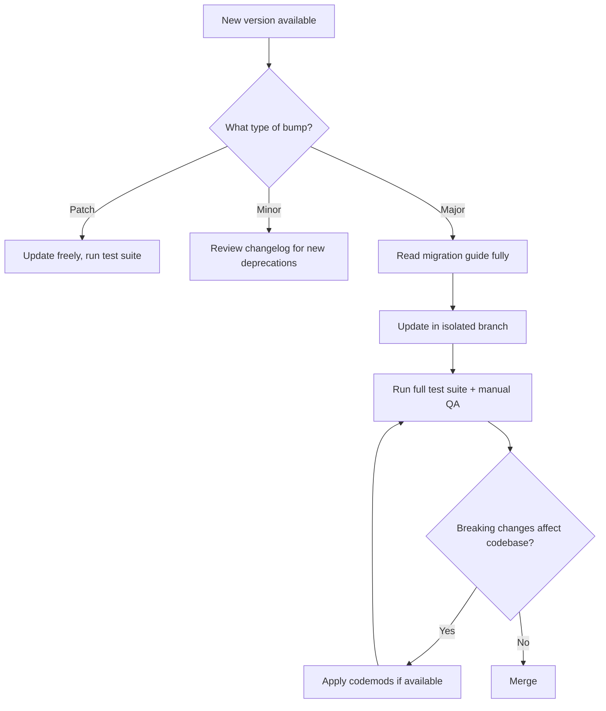

## Keeping Libraries Up to Date

### Overview

TanStack maintains a family of independently versioned packages (Router, Query, Table, Form, Virtual, Start, Store, Ranger, and others), each following its own release cadence. Keeping them current involves understanding semantic versioning practices across the ecosystem, coordinating upgrades between interdependent packages, and managing the migration process safely.

### Versioning Scheme

**Key Points**

- [Confirmed] TanStack packages follow semantic versioning (SemVer): `MAJOR.MINOR.PATCH`. Patch releases contain bug fixes, minor releases add backward-compatible features, and major releases may include breaking changes.
- [Confirmed] Packages are published independently to npm under the `@tanstack/*` scope (e.g., `@tanstack/react-query`, `@tanstack/react-router`, `@tanstack/react-table`), meaning a major version bump in one package does not necessarily correspond to a major bump in another, even within the same ecosystem "generation" (v4, v5, etc.).
- [Inference] Because each package versions independently, checking a single package's version number is not sufficient to infer the version of a related package (e.g., `@tanstack/react-query` v5 does not imply `@tanstack/react-table` is also on v5); always check each package's own changelog.

### Checking for Updates

```bash
# View outdated packages against package.json ranges
npm outdated

# View outdated packages ignoring semver range constraints
npx npm-check-updates

# For a specific package
npm view @tanstack/react-query versions --json
```

**Key Points**

- `npm outdated` respects the version ranges already declared in `package.json` (e.g., `^5.0.0`) and will only flag updates within or just outside that range as relevant depending on the range type.
- Tools like `npm-check-updates` (`ncu`) show the latest available version regardless of the current range, which is useful for spotting major version jumps that `npm outdated` alone might present less prominently.

### Update Strategy by Change Type



**Key Points**

- **Patch updates** (`5.1.2` → `5.1.3`): [Inference] Generally low-risk since they should only contain bug fixes per SemVer convention, but "should" is a convention the maintainers follow, not an absolute guarantee — regressions in patch releases do occasionally happen in any actively developed library.
- **Minor updates** (`5.1.0` → `5.2.0`): New features and possibly newly-introduced-but-non-breaking deprecation warnings. Worth skimming the changelog even though breaking changes aren't expected, since new deprecation warnings can signal upcoming major-version work.
- **Major updates** (`4.x` → `5.x`): Require reading the official migration guide. TanStack projects (Query, Router, Table, Form) have historically published dedicated migration guides for major version transitions.

### Example: Reviewing a Changelog Before Upgrading

**Example**

```bash
# Check the changelog/release notes for a specific version
npm view @tanstack/react-query@5.60.0

# Or view release notes on GitHub releases page for the package's repo
```

Practical checklist when a major version is released:

1. Read the migration guide in the official docs (not just the GitHub release notes, which are often terser).
2. Search the guide for "breaking" and "removed" to quickly locate API surface changes.
3. Check whether a codemod exists for the package (TanStack has provided codemods for some major migrations, e.g., certain Router and Query transitions) — [Unverified] codemod availability varies by package and by specific version transition, so check the package's own migration docs rather than assuming one exists.
4. Identify which of your currently-used APIs are affected by searching your codebase for the deprecated/renamed symbols.

### Coordinating Interdependent Package Upgrades

**Key Points**

- Framework adapter packages (e.g., `@tanstack/react-query`, `@tanstack/vue-query`, `@tanstack/solid-query`) wrap a shared core (`@tanstack/query-core`) and are typically released together for a given major/minor version, but patch timing can differ slightly between adapters.
- [Inference] When upgrading a framework adapter package, it's advisable to let the package manager resolve the matching core version via the adapter's own `peerDependencies`/`dependencies` declaration rather than manually pinning the core package to an arbitrary version, since mismatched core/adapter versions are a common source of subtle bugs.
- Monorepo setups using tools like `pnpm`, workspaces, or Nx should upgrade TanStack packages consistently across all workspace packages that consume them to avoid duplicate/mismatched versions in the dependency tree, which can cause issues like multiple Query Client instances or context mismatches in React.

### Lockfile and Dependency Range Considerations

**Key Points**

- Using caret ranges (`^5.0.0`) in `package.json` allows automatic minor/patch updates on `npm install`/`yarn install` but blocks automatic major version jumps — this is standard SemVer range behavior, not TanStack-specific.
- Committing the lockfile (`package-lock.json`, `pnpm-lock.yaml`, `yarn.lock`) ensures reproducible installs across environments and CI; failing to commit it can cause "works on my machine" version drift issues where different environments silently resolve different transitive versions.
- [Inference] For libraries under active development with frequent releases (which has historically been the case for several TanStack packages), pinning exact versions (no `^` or `~`) in `package.json` and upgrading deliberately via a dedicated PR can reduce the chance of an unreviewed automatic update introducing a regression, at the cost of not automatically receiving patch-level bug fixes.

### Automating Update Checks

**Example**

Using Dependabot (`.github/dependabot.yml`):

```yaml
version: 2
updates:
  - package-ecosystem: "npm"
    directory: "/"
    schedule:
      interval: "weekly"
    groups:
      tanstack:
        patterns:
          - "@tanstack/*"
```

**Key Points**

- Grouping `@tanstack/*` packages in a single Dependabot/Renovate group (as shown above) causes related packages to be proposed for update together in one PR rather than as many separate PRs, which is useful given how interrelated some packages are (e.g., adapter + core).
- [Inference] Configuring the automation to open PRs rather than auto-merge is generally preferable for major version bumps specifically, given the higher likelihood of required code changes; auto-merge is more reasonable to enable for patch-only updates if the test suite is trusted to catch regressions.

### Reading Release Notes Effectively

**Key Points**

- TanStack packages publish releases on GitHub with changelogs generated from commit history (often via conventional commits/changesets tooling); look for sections or labels like `feat`, `fix`, `BREAKING CHANGE`.
- [Unverified] The exact release note format and tooling (e.g., whether Changesets is used) can differ slightly between packages and has changed over time for some packages, so don't assume a rigid universal format — check the specific package's repository conventions.
- Cross-reference the version you're jumping from and to if skipping several versions (e.g., going from `4.2.0` directly to `5.3.0`), since intermediate breaking changes across several minor/major releases can compound; reading only the final version's changelog may miss changes introduced in between.

### Testing After an Upgrade

**Key Points**

- Run the full automated test suite (unit, integration, and end-to-end if available) after any upgrade, not just for major versions, since unexpected regressions in minor/patch releases, while against SemVer convention, are not impossible.
- For UI-heavy libraries like Table, Form, and Virtual, include manual visual/interaction QA in addition to automated tests, since rendering and interaction subtleties (e.g., virtualization scroll behavior, focus management in forms) are not always fully captured by typical unit tests.
- For Router and Query specifically, pay particular attention to caching/loader behavior changes between versions, since subtle changes in cache key generation, `staleTime` defaults, or loader execution timing can cause behavior differences that don't throw errors but do change UX (e.g., stale data displayed longer than expected).

### Deprecation Warnings

**Key Points**

- TanStack packages commonly emit console deprecation warnings ahead of removing an API in a future major version, giving advance notice before the breaking removal.
- [Inference] Treating deprecation warnings as actionable technical debt items (e.g., filing a ticket to address them) rather than ignoring them reduces the effort required at major-version-upgrade time, since the corresponding migration work can be spread out incrementally instead of batched into a single large migration.
- Enabling `--all-deprecations` style verbose logging (framework/runtime-dependent) or reviewing browser/Node console output during development and CI test runs helps surface these warnings that might otherwise be missed in normal usage.

### Staying Informed of New Releases

**Key Points**

- Following the official TanStack GitHub repositories' "Releases" pages (or subscribing via GitHub's release notification/watch feature) surfaces new versions as they're published.
- The TanStack Discord and the official blog/documentation site have historically been used by maintainers to announce significant releases and roadmap updates. [Unverified] The current primary announcement channel may vary; confirm on the official tanstack.com site for the most current community/announcement links.
- Following the primary maintainer(s) and the `@tanstack` organization on relevant social platforms is another common way teams track upcoming breaking changes before they land.

### Related Topics

- Migration guides: TanStack Query v4 → v5, Router v0 → v1, Table v7 → v8
- Monorepo dependency management strategies (pnpm workspaces, Nx, Turborepo)
- Automated dependency update tooling comparison (Dependabot vs. Renovate)
- Writing regression tests specifically to catch upgrade-related breakage
- Deprecation-driven refactoring workflows
- Evaluating whether to adopt a new major version immediately vs. deferring