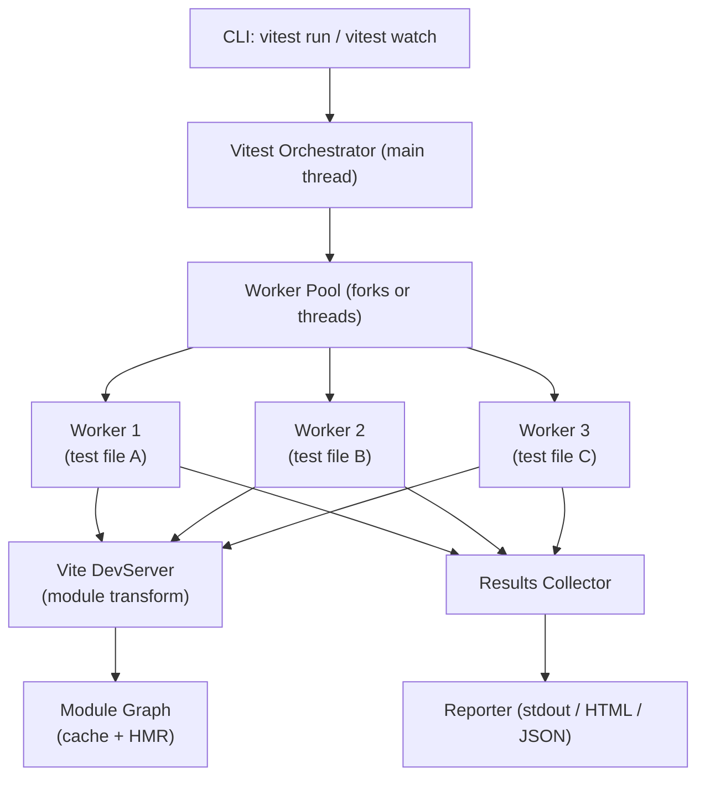
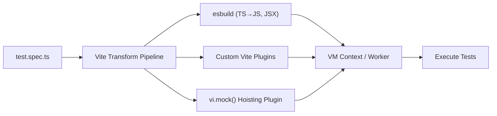
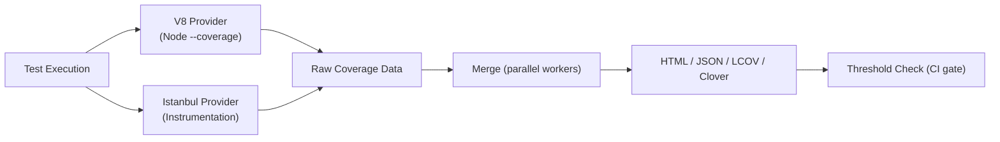

# Vitest Complete Guide

> **Version anchor:** This guide is written for **Vitest 4.x** (latest stable as of mid-2026, with Vitest 5 in planning). All code examples have been verified against the public Vitest 4.1 API surface. Features marked `[Vitest 4+]` require version 4 or later.

---

## 1. Introduction

### What Vitest Is

Vitest is a next-generation unit test framework built natively on top of Vite. It was created to solve a specific friction point: the disconnect between the toolchain you use to build your application (Vite) and the toolchain you use to test it (typically Jest + Babel + separate config). Vitest eliminates that gap by reusing your Vite configuration — plugins, aliases, transforms, and all — directly inside the test runner.

In practical terms, Vitest is:

- A test runner (schedules, collects, and executes tests)
- An assertion library (powered by [Chai](https://www.chaijs.com/), augmented with Jest-compatible matchers)
- A mocking framework (`vi.*` APIs for functions, modules, timers, and globals)
- A coverage orchestrator (V8 and Istanbul providers)
- A benchmarking harness (`bench()` API)
- A browser testing platform (stable Browser Mode with Playwright/WebdriverIO since v4)

### Why Vitest Was Created

The problem pre-Vitest: most frontend projects use Vite for development, but tests ran through Jest, which uses Babel and its own module resolution. Every time you added a Vite plugin (e.g., SVG imports, CSS Modules, path aliases), you also had to replicate that transform in your Jest config via `transform`, `moduleNameMapper`, or a custom setup. This divergence was a constant source of subtle bugs and "works in app, fails in test" confusion.

Vitest's answer: **share one configuration**. The same `vite.config.ts` that powers your dev server also powers your tests. Plugins apply once, aliases resolve identically, and environment parity becomes a first-class concern rather than an afterthought.

### Design Philosophy

Three core principles drive Vitest's design:

1. **Vite-native**: Tests execute in the same module pipeline as your application, not a separate one.
2. **ESM-first**: Native ECMAScript Modules are the default, not a bolt-on. CommonJS interop is supported but not the primary path.
3. **Developer experience**: Fast cold starts, instant watch-mode re-runs via Vite HMR, a beautiful UI (`@vitest/ui`), and IDE integration via the VS Code extension.

### Vitest vs Jest

|Dimension|Vitest 4|Jest 30|
|---|---|---|
|Module system|ESM-native, CJS supported|CJS-native, ESM experimental (`--experimental-vm-modules`)|
|Configuration|Extends `vite.config.ts`|Separate `jest.config.{js,ts}`|
|TypeScript|Zero-config via esbuild|Requires `ts-jest` or Babel transform|
|Transform|Vite pipeline (plugins reused)|`transform` map (duplicated)|
|Startup speed|Fast (esbuild, caching)|Slower cold start|
|Watch mode|HMR-aware, affected-file reruns|Full suite or pattern-matched|
|Mocking API|`vi.*` (Jest-compatible surface)|`jest.*`|
|Browser testing|Stable Browser Mode (v4)|jsdom/happy-dom only|
|Snapshot format|Compatible with Jest snapshots|Jest format|
|Coverage|V8 (fast) + Istanbul|Istanbul (+ experimental V8)|
|Ecosystem maturity|Younger, rapidly growing|Mature, stable, widely adopted|
|Angular support|Via Angular CLI adapter|Official default until Angular 21|

> **Note:** Angular 21 (released late 2025) officially adopted Vitest as its default test runner, replacing the Web Test Runner exploration.

The most significant practical difference in 2026 is ESM handling. Jest still requires `--experimental-vm-modules` for native ESM and marks `jest.unstable_mockModule` as work-in-progress. Vitest treats ESM as the baseline.

### Vitest vs Mocha

Mocha is a test runner without assertions or mocking — you compose it with Chai and Sinon. Vitest ships all three as an integrated whole. Mocha has better support for arbitrary Node.js environments and no Vite dependency. If your project is a pure Node.js library not using Vite, Mocha remains a legitimate choice. For any Vite-based project, Vitest's integrated experience wins.

### Vitest vs Jasmine

Jasmine predates ESM, TypeScript generics, and the async/await era. Its API surface is similar (`describe`, `it`, `expect`), but it ships with no ESM support, relies on its own async handling primitives, and has fallen behind in the TypeScript experience. Jasmine is still common in Angular projects migrating from the v14 era.

### Vitest vs Node Test Runner

Node's built-in `node:test` module (stable since Node 20) is useful for library authors who want zero dependencies. It lacks: snapshot testing, a mocking framework, coverage, watch mode, and a plugin ecosystem. Vitest covers all of these. Use Node Test Runner only when external test dependencies are genuinely prohibited (e.g., publishing a minimalist npm package with no devDependencies).

### Vitest vs Playwright Test

This is an architectural question, not a competition. Playwright Test is an _end-to-end_ framework that drives real browsers through a network. Vitest (even in Browser Mode) is a _unit/component_ testing framework. Use both:

- **Vitest**: unit tests, component tests, integration tests (with mocked network/DB)
- **Playwright Test**: full user journey tests, multi-page flows, production-like E2E

Vitest Browser Mode blurs the boundary — it runs real browsers for component-level tests — but it is not a replacement for multi-page E2E flows.

### When to Use Vitest

- Any project already using Vite (React, Vue, Svelte, SolidJS, vanilla)
- Greenfield TypeScript projects
- Teams migrating from Jest who want a lighter configuration overhead
- Projects that need both Node-side and browser-side unit tests in one runner
- Teams wanting visual component tests alongside unit tests (Browser Mode)

### When Not to Use Vitest

- Projects with no Vite dependency and strong requirement to avoid it (pure Node libraries where binary size or dependency count matters)
- Environments where the Vite plugin system conflicts with existing build tooling (rare, but possible in monorepos with very custom Webpack setups)
- When you need deeply mature Jest-specific ecosystem tooling that has not been ported (rare as of 2026)

---

## 2. Architecture

### Relationship with Vite

Vitest is a separate package (`vitest`) but it is architecturally a Vite _plugin_ + _orchestrator_. When Vitest starts:

1. It creates a Vite DevServer internally (or reuses an existing one in `--ui` mode).
2. It applies your `vite.config.ts` — all plugins, resolve aliases, define constants, CSS handling — before any test file is transformed.
3. Test files are requested through this Vite pipeline, just like a browser would request them, but Vitest intercepts the module graph to collect `describe`/`it` blocks instead of rendering to the DOM.

This means: if `import logo from './logo.svg?url'` works in your app, it works in your tests automatically. No `moduleNameMapper`.

### ESM-First Architecture

Vitest uses Vite's `ssrLoadModule`, which resolves modules as ESM by default. When you write:

```ts
import { add } from './math'
```

Vitest processes that through the same esbuild-based pipeline Vite uses for TypeScript and JSX. There is no separate Babel step. CommonJS modules are interoperable through Vite's CJS-to-ESM transform.

Static `import` hoisting means `vi.mock()` calls are hoisted to the top of the file by a Vite transform plugin, replicating Jest's module-mock hoisting behavior in pure ESM.

### Test Execution Model



Each worker is an isolated environment. By default, Vitest uses **VM threads** (Node.js `worker_threads` with a VM context). The main thread orchestrates file discovery, watches for changes, collects results, and drives reporters.

### Worker Pools

Vitest supports three pool strategies, configurable via `pool`:

|Pool|Mechanism|Isolation|Speed|Use Case|
|---|---|---|---|---|
|`vmThreads` (default)|`worker_threads` + Node VM|Module-level (re-instantiated per file)|Fast|Most projects|
|`threads`|`worker_threads`|Process-level (separate JS context)|Moderate|When VM isolation causes issues|
|`forks`|`child_process.fork`|Full process|Slowest, most isolated|Native modules, C++ addons|
|`vmForks`|`child_process.fork` + VM|Full process + VM|Slow|Edge cases|

The default `vmThreads` pool is the best balance: thread-level parallelism with per-file module isolation, meaning one file cannot leak module state to another.

### Dependency Graph

Vitest tracks the Vite module graph. When a file changes in watch mode, Vitest:

1. Asks the Vite DevServer which modules are affected (direct and transitive importers).
2. Re-runs only test files whose dependency graph was touched.
3. Invalidates the module cache for the changed modules.

This is why watch-mode reruns can be nearly instant for isolated utility changes — only the 2-3 files that directly import the changed module are re-executed.

### Module Transformation



The `vi.mock()` hoisting plugin transforms:

```ts
// Your source code (written order)
import { fetchUser } from './api'
vi.mock('./api')
```

Into the equivalent of:

```ts
// Hoisted execution order
vi.mock('./api')
import { fetchUser } from './api'  // now receives the mocked version
```

This is a static AST transform, not runtime magic. It runs before the file executes.

### HMR Integration

In `--watch` mode, Vitest subscribes to Vite's HMR events. File changes propagate through the module graph exactly as they do in a browser dev session. The difference: instead of triggering a component re-render, they trigger a test re-run for the affected test files.

### Caching Strategy

Vitest relies on Vite's transform cache (typically in `node_modules/.vite`). On subsequent runs:

- Unchanged files are served from cache without re-transformation.
- Only files with changed mtimes or hashes are re-transformed.

Coverage instrumentation is additive: V8 uses runtime coverage hooks (no transform needed); Istanbul injects instrumentation at transform time, which _does_ invalidate the transform cache.

### Snapshot System

Snapshots are stored in `__snapshots__/` directories adjacent to test files. Inline snapshots are embedded directly in the test source. Vitest uses a `pretty-format` fork (compatible with Jest's snapshot format) to serialize values. Snapshot diffing is handled per-worker and reconciled by the orchestrator before writing to disk.

### Coverage Architecture



V8 coverage uses Node's built-in V8 coverage engine, which is fast but may report different branch counts than Istanbul for certain patterns (e.g., optional chaining). Istanbul instruments source at transform time, producing more granular branch data at the cost of transform overhead.

---

## 3. Installation

### Core Installation

Vitest requires **Node.js ≥ 18** and **Vite ≥ 5** (Vite 6/7 are fully supported).

```bash
# npm
npm install -D vitest

# pnpm
pnpm add -D vitest

# yarn
yarn add -D vitest

# bun
bun add -D vitest
```

Add a test script to `package.json`:

```json
{
  "scripts": {
    "test": "vitest",
    "test:run": "vitest run",
    "test:coverage": "vitest run --coverage",
    "test:ui": "vitest --ui"
  }
}
```

### JavaScript (Vanilla)

```bash
npm install -D vitest
```

`vite.config.js`:

```js
import { defineConfig } from 'vitest/config'

export default defineConfig({
  test: {
    // options here
  },
})
```

### TypeScript

No extra packages needed — esbuild handles TypeScript natively.

```bash
npm install -D vitest
```

`vitest.config.ts`:

```ts
import { defineConfig } from 'vitest/config'

export default defineConfig({
  test: {
    globals: true,
    environment: 'node',
  },
})
```

Create `tsconfig.json` (or extend your existing one):

```json
{
  "compilerOptions": {
    "types": ["vitest/globals"]
  }
}
```

> **Note:** The `types: ["vitest/globals"]` entry is only needed when `globals: true` is set in Vitest config, so that TypeScript recognizes `describe`, `it`, `expect`, etc. without explicit imports.

### React

```bash
npm install -D vitest @vitejs/plugin-react jsdom @testing-library/react @testing-library/jest-dom @testing-library/user-event
```

`vitest.config.ts`:

```ts
import { defineConfig } from 'vitest/config'
import react from '@vitejs/plugin-react'

export default defineConfig({
  plugins: [react()],
  test: {
    globals: true,
    environment: 'jsdom',
    setupFiles: ['./src/test-setup.ts'],
  },
})
```

`src/test-setup.ts`:

```ts
import '@testing-library/jest-dom'
```

Example test:

```tsx
// src/components/Button.test.tsx
import { render, screen } from '@testing-library/react'
import userEvent from '@testing-library/user-event'
import { describe, it, expect } from 'vitest'
import { Button } from './Button'

describe('Button', () => {
  it('calls onClick when clicked', async () => {
    const user = userEvent.setup()
    const handleClick = vi.fn()
    render(<Button onClick={handleClick}>Click me</Button>)
    await user.click(screen.getByRole('button'))
    expect(handleClick).toHaveBeenCalledOnce()
  })
})
```

### Vue

```bash
npm install -D vitest @vitejs/plugin-vue jsdom @vue/test-utils
```

`vitest.config.ts`:

```ts
import { defineConfig } from 'vitest/config'
import vue from '@vitejs/plugin-vue'

export default defineConfig({
  plugins: [vue()],
  test: {
    globals: true,
    environment: 'jsdom',
  },
})
```

### Svelte

```bash
npm install -D vitest @sveltejs/vite-plugin-svelte svelte jsdom @testing-library/svelte
```

`vitest.config.ts`:

```ts
import { defineConfig } from 'vitest/config'
import { svelte } from '@sveltejs/vite-plugin-svelte'

export default defineConfig({
  plugins: [svelte({ hot: !process.env.VITEST })],
  test: {
    globals: true,
    environment: 'jsdom',
  },
})
```

### Solid

```bash
npm install -D vitest vite-plugin-solid solid-js jsdom @solidjs/testing-library
```

`vitest.config.ts`:

```ts
import { defineConfig } from 'vitest/config'
import solidPlugin from 'vite-plugin-solid'

export default defineConfig({
  plugins: [solidPlugin()],
  test: {
    globals: true,
    environment: 'jsdom',
    transformMode: { web: [/\.[jt]sx?$/] },
  },
})
```

### Node.js

```bash
npm install -D vitest
```

`vitest.config.ts`:

```ts
import { defineConfig } from 'vitest/config'

export default defineConfig({
  test: {
    environment: 'node', // default
    globals: false, // explicit imports preferred in Node context
  },
})
```

### Monorepos

#### PNPM Workspaces

`pnpm-workspace.yaml`:

```yaml
packages:
  - 'packages/*'
  - 'apps/*'
```

Root `vitest.config.ts`:

```ts
import { defineConfig } from 'vitest/config'

export default defineConfig({
  test: {
    projects: [
      'packages/*/vitest.config.ts',
      'apps/*/vitest.config.ts',
    ],
  },
})
```

Each package has its own `vitest.config.ts` that can override environment, setup files, etc.

#### Turborepo

`turbo.json`:

```json
{
  "pipeline": {
    "test": {
      "dependsOn": ["^build"],
      "outputs": ["coverage/**"],
      "cache": true
    }
  }
}
```

Each package `package.json`:

```json
{
  "scripts": {
    "test": "vitest run",
    "test:coverage": "vitest run --coverage"
  }
}
```

Turborepo caches test outputs by default when inputs haven't changed. Pair with `reporter: 'junit'` to preserve artifacts.

#### Nx

```bash
nx add @nx/vite
```

`project.json`:

```json
{
  "targets": {
    "test": {
      "executor": "@nx/vite:test",
      "options": {
        "config": "vitest.config.ts"
      }
    }
  }
}
```

---

## 4. Configuration

### defineConfig

Use `defineConfig` from `vitest/config` (not `vite`) when your config file is a standalone Vitest config without a Vite plugin setup:

```ts
import { defineConfig } from 'vitest/config'

export default defineConfig({
  test: { /* ... */ },
})
```

When your project already uses Vite, merge configurations:

```ts
// vite.config.ts — covers both app build AND tests
import { defineConfig } from 'vite'
import react from '@vitejs/plugin-react'
import type { UserConfig } from 'vitest/config'

export default defineConfig({
  plugins: [react()],
  test: {
    globals: true,
    environment: 'jsdom',
  } satisfies UserConfig['test'],
})
```

You can also split configs with `mergeConfig`:

```ts
import { defineConfig, mergeConfig } from 'vitest/config'
import viteConfig from './vite.config'

export default mergeConfig(
  viteConfig,
  defineConfig({
    test: {
      environment: 'jsdom',
      setupFiles: ['./src/test-setup.ts'],
    },
  })
)
```

### test field — Complete Reference

```ts
import { defineConfig } from 'vitest/config'

export default defineConfig({
  test: {
    // === File Discovery ===
    include: ['**/*.{test,spec}.{js,mjs,cjs,ts,mts,cts,jsx,tsx}'],
    exclude: [
      '**/node_modules/**',
      '**/dist/**',
      '**/.{idea,git,cache,output,temp}/**',
    ],
    // Extra patterns to watch (not test files themselves)
    watchExclude: ['**/node_modules/**', '**/dist/**'],

    // === Globals ===
    // Makes describe, it, expect, vi, etc. available without imports
    globals: false, // prefer explicit imports for clarity

    // === Environment ===
    environment: 'node', // 'node' | 'jsdom' | 'happy-dom' | 'edge-runtime'
    environmentOptions: {
      jsdom: {
        resources: 'usable',
      },
    },
    // Per-file environment overrides via docblock comments
    // /** @vitest-environment jsdom */

    // === Setup ===
    setupFiles: ['./src/test-setup.ts'],
    globalSetup: ['./src/global-setup.ts'], // runs once in main thread

    // === Parallelism ===
    pool: 'vmThreads', // 'vmThreads' | 'threads' | 'forks' | 'vmForks'
    poolOptions: {
      vmThreads: {
        maxThreads: 4,
        minThreads: 1,
        useAtomics: false,
      },
      forks: {
        maxForks: 4,
        minForks: 1,
      },
    },
    // Max concurrent test FILES
    maxConcurrency: 5,
    // Disable parallelism (useful for debugging)
    singleThread: false,
    singleFork: false,

    // === Mock Lifecycle ===
    clearMocks: false,    // clear mock.calls, mock.instances between tests
    resetMocks: false,    // reset mock implementation between tests
    restoreMocks: false,  // restore vi.spyOn spies between tests

    // === Snapshots ===
    snapshotOptions: {
      expand: false,
      snapshotFormat: {
        printBasicPrototype: false,
      },
    },
    resolveSnapshotPath: (testPath, snapExtension) =>
      testPath.replace('/src/', '/src/__snapshots__/') + snapExtension,
    updateSnapshot: 'new', // 'all' | 'new' | 'none'

    // === Reporters ===
    reporters: ['default'],
    // Multiple reporters:
    // reporters: [['default', { summary: true }], 'junit', 'html']
    outputFile: {
      junit: './test-results/junit.xml',
      html: './test-results/index.html',
    },

    // === Coverage ===
    coverage: {
      enabled: false, // enable with --coverage flag or true
      provider: 'v8', // 'v8' | 'istanbul'
      include: ['src/**'],
      exclude: ['**/*.d.ts', '**/__tests__/**'],
      thresholds: {
        lines: 80,
        functions: 80,
        branches: 75,
        statements: 80,
      },
      reporter: ['text', 'html', 'lcov'],
      reportsDirectory: './coverage',
      all: false, // include uncovered files in report
    },

    // === Timeouts ===
    testTimeout: 5000,
    hookTimeout: 10000,

    // === Retry ===
    retry: 0, // retry failed tests N times

    // === Watch ===
    // watch is enabled by default with `vitest` (no `run`)

    // === Sequence ===
    sequence: {
      shuffle: false, // randomize test order
      seed: Date.now(),
      concurrent: false,
      hooks: 'parallel', // 'parallel' | 'stack'
    },

    // === Benchmark ===
    benchmark: {
      include: ['**/*.bench.{js,ts}'],
      reporter: 'default',
    },

    // === Filtering ===
    testNamePattern: undefined, // regex to filter by test name

    // === Projects (workspace mode) ===
    // projects: ['packages/*/vitest.config.ts'],

    // === Misc ===
    logHeapUsage: false,
    allowOnly: !process.env.CI, // fail CI if test.only is left in code
    passWithNoTests: false,
    bail: 0, // abort after N failures (0 = run all)
    isolate: true, // isolate modules between test files
    silent: false,
    hideSkippedTests: false,
    diff: undefined, // custom diff algorithm
  },
})
```

### setupFiles

`setupFiles` runs **inside each worker**, before any test file, in the context of the test environment. Use it to:

- Import custom matchers (`@testing-library/jest-dom`)
- Set global mock defaults
- Configure `fetch` polyfills

```ts
// src/test-setup.ts
import '@testing-library/jest-dom'
import { vi } from 'vitest'
import { server } from './mocks/server'

// Start MSW server
beforeAll(() => server.listen({ onUnhandledRequest: 'error' }))
afterEach(() => server.resetHandlers())
afterAll(() => server.close())

// Global fetch mock baseline
vi.stubGlobal('ResizeObserver', vi.fn().mockImplementation(() => ({
  observe: vi.fn(),
  unobserve: vi.fn(),
  disconnect: vi.fn(),
})))
```

`globalSetup` runs once in the **main thread** before workers start. Use it for things like starting a database, spinning up a test server, or seeding fixtures:

```ts
// src/global-setup.ts
import { startTestDatabase } from './test-db'

let db: Awaited<ReturnType<typeof startTestDatabase>>

export async function setup() {
  db = await startTestDatabase()
  process.env.DATABASE_URL = db.connectionString
}

export async function teardown() {
  await db.stop()
}
```

### globals

When `globals: true`, you can use `describe`, `it`, `test`, `expect`, `vi`, `beforeEach`, etc. without importing them:

```ts
// With globals: false (recommended for TypeScript projects)
import { describe, it, expect, vi } from 'vitest'

// With globals: true
describe('my test', () => { /* ... */ })
```

**Recommendation:** Use explicit imports. They are better for TypeScript IntelliSense, tree-shaking, and grep-ability. `globals: true` exists mainly for Jest migration compatibility.

### environment

The `environment` option controls what browser APIs are available:

|Environment|Description|Package|
|---|---|---|
|`node`|Default. No browser APIs. Pure Node.js globals.|Built-in|
|`jsdom`|Full DOM simulation via jsdom. Slower, more complete.|`jsdom`|
|`happy-dom`|Faster, less complete DOM. Missing some edge cases.|`happy-dom`|
|`edge-runtime`|Vercel Edge Runtime globals.|`@edge-runtime/vm`|

Per-file override via docblock:

```ts
/**
 * @vitest-environment jsdom
 */
import { describe, it, expect } from 'vitest'

it('uses browser APIs', () => {
  expect(document.title).toBe('')
})
```

### pool and poolOptions

```ts
// Maximum parallelism (good for CI with many cores):
pool: 'vmThreads',
poolOptions: {
  vmThreads: {
    maxThreads: 8,
  },
},

// Safer for native modules (sqlite3, canvas, etc.):
pool: 'forks',
poolOptions: {
  forks: {
    maxForks: 4,
  },
},
```

### reporters

```ts
// Single reporter
reporters: ['default']

// Multiple reporters (e.g., for CI artifacts)
reporters: [
  ['default', { summary: true }],
  'junit',
  'html',
  'json',
]

// Custom reporter
reporters: [
  new MyCustomReporter(),
  'default',
]
```

Built-in reporters: `default`, `verbose`, `dot`, `junit`, `json`, `html`, `tap`, `tap-flat`, `hanging-process`.

### coverage — Deep Dive

```ts
coverage: {
  provider: 'v8',          // faster, uses V8 native coverage
  // provider: 'istanbul', // more accurate branch coverage

  enabled: true,

  // Files to instrument
  include: ['src/**/*.{ts,tsx,js,jsx}'],
  exclude: [
    '**/*.d.ts',
    '**/*.config.ts',
    '**/index.ts',         // barrel files often skew coverage
    '**/__tests__/**',
    '**/__mocks__/**',
    '**/test-utils/**',
  ],

  thresholds: {
    lines: 80,
    functions: 80,
    branches: 75,
    statements: 80,
    // Per-file thresholds:
    perFile: true,
    // Specific file thresholds:
    // 'src/critical-module.ts': { lines: 100 },
  },

  reporter: [
    'text',    // console summary
    'html',    // visual report
    'lcov',    // for Codecov / Coveralls
    'json',    // machine-readable
    'cobertura', // Azure DevOps / Jenkins
  ],

  reportsDirectory: './coverage',
  all: true, // show uncovered files (important for true coverage picture)
  clean: true, // clean coverage directory before run
  cleanOnRerun: true,
}
```

### projects (Workspace Mode)

Workspace mode lets you run tests across multiple configurations in a single `vitest` invocation:

```ts
// vitest.config.ts (root)
import { defineConfig } from 'vitest/config'

export default defineConfig({
  test: {
    projects: [
      // Inline project definition
      {
        test: {
          name: 'unit',
          environment: 'node',
          include: ['src/**/*.unit.test.ts'],
        },
      },
      {
        test: {
          name: 'components',
          environment: 'jsdom',
          include: ['src/**/*.component.test.tsx'],
          setupFiles: ['./src/test-setup.ts'],
        },
      },
      // Reference external configs
      'packages/*/vitest.config.ts',
    ],
  },
})
```

Run a specific project: `vitest --project unit`

### browser mode [Vitest 4+]

```ts
// Requires: npm install -D @vitest/browser-playwright playwright
import { defineConfig } from 'vitest/config'
import { playwright } from '@vitest/browser-playwright'

export default defineConfig({
  test: {
    browser: {
      enabled: true,
      provider: playwright(),
      instances: [
        {
          browser: 'chromium',
        },
        {
          browser: 'firefox',
        },
      ],
      headless: true,
      viewport: { width: 1280, height: 720 },
      trace: 'on-first-retry',
    },
  },
})
```

### mockReset / clearMocks / restoreMocks

These three options are frequently confused:

|Option|Effect|Use When|
|---|---|---|
|`clearMocks`|Clears `mock.calls`, `mock.instances`, `mock.results`|You want fresh call tracking each test|
|`resetMocks`|Clears calls + resets implementation to `vi.fn()` (no-op)|You want no accidental cross-test mock behavior|
|`restoreMocks`|Restores `vi.spyOn` spies to original implementation|You use spies and always want originals restored|

**Recommendation for most projects:**

```ts
clearMocks: true,
resetMocks: true,
restoreMocks: true,
```

This maximizes test isolation. If you need persistent mock state across tests, set them explicitly in the test or `beforeEach`.

### sequence

```ts
sequence: {
  shuffle: process.env.CI === 'true', // shuffle in CI to catch ordering dependencies
  seed: 42, // reproducible shuffle for debugging
  concurrent: false,
  hooks: 'parallel', // run beforeAll/afterAll hooks in parallel for describe blocks
}
```

---

## 5. Core Testing API

### describe

`describe` groups related tests and creates a scope for setup/teardown hooks:

```ts
import { describe, it, expect } from 'vitest'

describe('UserService', () => {
  describe('findById', () => {
    it('returns the user when found', async () => {
      // ...
    })

    it('throws NotFoundError when user does not exist', async () => {
      // ...
    })
  })

  describe('create', () => {
    it('saves the user and returns it', async () => {
      // ...
    })
  })
})
```

`describe.only` / `describe.skip` / `describe.todo` follow the same semantics as `test.*`.

`describe.concurrent` marks all tests inside as concurrent:

```ts
describe.concurrent('parallel API calls', () => {
  it('fetches users', async () => { /* ... */ })
  it('fetches products', async () => { /* ... */ })
  // Both run in parallel
})
```

`describe.each` parameterizes an entire suite:

```ts
describe.each([
  { env: 'development', baseUrl: 'http://localhost:3000' },
  { env: 'staging',     baseUrl: 'https://staging.example.com' },
])('$env environment', ({ baseUrl }) => {
  it('responds to health check', async () => {
    const res = await fetch(`${baseUrl}/health`)
    expect(res.ok).toBe(true)
  })
})
```

### it / test

`it` and `test` are aliases. Both accept:

- `(name, fn, timeout?)` — basic form
- `(name, options, fn)` — with options object (`{ timeout, retry, concurrent }`)

```ts
import { it, test } from 'vitest'

// Basic
it('adds two numbers', () => {
  expect(1 + 1).toBe(2)
})

// With timeout override
it('fetches remote data', async () => {
  const data = await fetchData()
  expect(data).toBeDefined()
}, 10_000)

// With options
test('retries on flaky assertion', async () => {
  const result = await flakyOperation()
  expect(result).toBe('success')
}, { retry: 3, timeout: 5000 })
```

### test.concurrent

Marks a test to run in parallel with other concurrent tests in the same `describe`:

```ts
describe('independent operations', () => {
  test.concurrent('operation A', async () => {
    await operationA()
  })
  test.concurrent('operation B', async () => {
    await operationB()
  })
  // A and B run in parallel; non-concurrent tests still run sequentially
})
```

**When to use:** Tests that are genuinely independent and have no shared mutable state. Avoid concurrent tests that touch the same mock, the same file system path, or the same database rows.

### test.skip

```ts
test.skip('not implemented yet', () => {
  // Will be reported as skipped, not failed
})

// Conditional skip
test.skipIf(process.env.CI === 'true')('local-only test', () => {
  // runs locally, skipped in CI
})

// Run only if condition is true
test.runIf(process.platform === 'darwin')('macOS-only', () => {
  // ...
})
```

### test.only

```ts
test.only('focus on this test during development', () => {
  // Only this (and other .only tests) will run
})
```

**Warning:** Never commit `.only` to production. Use `allowOnly: !process.env.CI` in your config to make CI fail if `.only` is present.

### test.todo

```ts
test.todo('implement password reset flow')
// Reported separately; does not fail the suite
```

### test.fails

```ts
test.fails('this is a known bug', () => {
  // If this test PASSES, the suite FAILS (inverted expectation)
  // Useful for tracking expected failures without skipping them
  expect(buggyFunction()).toBe('correct')
})
```

### test.each

The most powerful form of parameterized testing:

```ts
// Array of arrays
test.each([
  [1, 2, 3],
  [0, 0, 0],
  [-1, 1, 0],
])('add(%i, %i) === %i', (a, b, expected) => {
  expect(add(a, b)).toBe(expected)
})

// Array of objects (template literal names)
test.each([
  { input: 'hello', expected: 'HELLO' },
  { input: 'world', expected: 'WORLD' },
  { input: '', expected: '' },
])('toUpperCase("$input") === "$expected"', ({ input, expected }) => {
  expect(input.toUpperCase()).toBe(expected)
})

// Tagged template literal form
test.each`
  a    | b    | expected
  ${1} | ${1} | ${2}
  ${2} | ${3} | ${5}
`('$a + $b = $expected', ({ a, b, expected }) => {
  expect(a + b).toBe(expected)
})
```

**When not to use `test.each`:** When the test logic differs substantially between cases. Cramming fundamentally different scenarios into one parameterized test hurts readability and makes failures harder to diagnose. Prefer separate named tests for meaningfully different behaviors.

### beforeEach / afterEach / beforeAll / afterAll

```ts
import { describe, it, expect, beforeEach, afterEach, beforeAll, afterAll, vi } from 'vitest'

describe('DatabaseRepository', () => {
  let repo: UserRepository
  let db: TestDatabase

  beforeAll(async () => {
    // Expensive setup once per suite
    db = await TestDatabase.create()
  })

  afterAll(async () => {
    // Cleanup once
    await db.destroy()
  })

  beforeEach(async () => {
    // Fast per-test setup
    await db.seed()
    repo = new UserRepository(db.connection)
  })

  afterEach(async () => {
    // Cleanup per-test
    await db.truncate()
    vi.clearAllMocks()
  })

  it('finds user by id', async () => {
    const user = await repo.findById(1)
    expect(user).toMatchObject({ id: 1, name: 'Alice' })
  })
})
```

**Scope rules:**

- `beforeAll`/`afterAll` run once per `describe` block they are defined in.
- `beforeEach`/`afterEach` run before/after each `it`/`test` inside their `describe` (and nested `describe` blocks).
- Outer `beforeEach` runs before inner `beforeEach`.

### Dynamic Tests

Generate tests at runtime (use sparingly — static tests are more predictable):

```ts
const routes = ['/home', '/about', '/contact', '/products']

describe('Route rendering', () => {
  for (const route of routes) {
    it(`renders ${route} without crashing`, async () => {
      const { container } = render(<App initialRoute={route} />)
      expect(container).not.toBeEmptyDOMElement()
    })
  }
})
```

**Pitfall:** Dynamic tests generated from async data require careful handling — you cannot `await` inside the `describe` callback itself. Generate the test data synchronously or use `test.each` with pre-fetched data.

```ts
// WRONG
describe('dynamic from API', async () => { // describe callback cannot be async
  const items = await fetchItems()
  // ...
})

// RIGHT
const items = await fetchItems() // top-level await in ESM
describe('dynamic from API', () => {
  test.each(items)('item $id', (item) => { /* ... */ })
})
```

---

## 6. Assertions

Vitest's `expect` API is built on [Chai](https://www.chaijs.com/) with a layer of Jest-compatible matchers on top. Almost all Jest matchers work identically in Vitest.

### Equality

```ts
// Strict equality (===)
expect(1 + 1).toBe(2)
expect('hello').toBe('hello')

// Deep equality (recursive)
expect({ a: 1, b: { c: 2 } }).toEqual({ a: 1, b: { c: 2 } })
expect([1, 2, 3]).toEqual([1, 2, 3])

// Strict deep equality (checks object types too)
// toStrictEqual fails for { a: undefined } vs {}
expect({ a: 1 }).toStrictEqual({ a: 1 })

// Not equal
expect(1).not.toBe(2)
expect({ a: 1 }).not.toBe({ a: 1 }) // different reference!
```

### Identity and Nullability

```ts
expect(null).toBeNull()
expect(undefined).toBeUndefined()
expect(42).toBeDefined()
expect(null).not.toBeDefined()

// Type checks
expect(null).toBeNull()
expect(undefined).toBeUndefined()
expect({}).toBeDefined()
```

### Truthiness

```ts
expect(true).toBeTruthy()
expect(1).toBeTruthy()
expect('non-empty').toBeTruthy()

expect(false).toBeFalsy()
expect(0).toBeFalsy()
expect('').toBeFalsy()
expect(null).toBeFalsy()
expect(undefined).toBeFalsy()
```

### Numbers

```ts
expect(5).toBeGreaterThan(4)
expect(5).toBeGreaterThanOrEqual(5)
expect(3).toBeLessThan(4)
expect(3).toBeLessThanOrEqual(3)

// Floating-point comparison
expect(0.1 + 0.2).toBeCloseTo(0.3)
expect(0.1 + 0.2).toBeCloseTo(0.3, 5) // 5 decimal places

// NaN
expect(NaN).toBeNaN()
expect(42).not.toBeNaN()

// Infinity
expect(Infinity).toBe(Infinity)
expect(Number.isFinite(42)).toBe(true)
```

### Strings

```ts
expect('hello world').toContain('world')
expect('hello world').not.toContain('xyz')

expect('hello').toMatch(/^hel/)
expect('hello world').toMatch('world')

expect('hello').toHaveLength(5)

// toMatchInlineSnapshot for strings (see Snapshot section)
```

### Arrays

```ts
const arr = [1, 2, 3, 4, 5]

expect(arr).toContain(3)
expect(arr).not.toContain(99)

expect(arr).toHaveLength(5)

expect(arr).toEqual(expect.arrayContaining([2, 4]))
// arrayContaining: actual must contain all elements in the expected array

expect([1, 2]).not.toEqual(expect.arrayContaining([1, 2, 3]))

// Check first/last element
expect(arr[0]).toBe(1)
expect(arr.at(-1)).toBe(5)
```

### Objects

```ts
const user = { id: 1, name: 'Alice', role: 'admin', createdAt: new Date() }

// Partial match
expect(user).toMatchObject({ id: 1, name: 'Alice' })

// Has property
expect(user).toHaveProperty('role')
expect(user).toHaveProperty('role', 'admin')
expect(user).toHaveProperty(['nested', 'path'], value) // nested path

// Keys
expect(Object.keys(user)).toEqual(
  expect.arrayContaining(['id', 'name', 'role'])
)
```

### Errors

```ts
// Synchronous error
expect(() => JSON.parse('invalid')).toThrow()
expect(() => JSON.parse('invalid')).toThrow(SyntaxError)
expect(() => JSON.parse('invalid')).toThrow('JSON')
expect(() => JSON.parse('invalid')).toThrow(/JSON/)

// Custom error class
class ValidationError extends Error {
  constructor(public field: string, message: string) {
    super(message)
    this.name = 'ValidationError'
  }
}

expect(() => validate({})).toThrow(ValidationError)
expect(() => validate({})).toThrow(expect.objectContaining({
  name: 'ValidationError',
  field: 'email',
}))
```

### Promises and Async Assertions

```ts
// Resolves
await expect(Promise.resolve(42)).resolves.toBe(42)
await expect(fetchUser(1)).resolves.toMatchObject({ id: 1 })

// Rejects
await expect(Promise.reject(new Error('oops'))).rejects.toThrow('oops')
await expect(fetchUser(-1)).rejects.toThrow(NotFoundError)

// IMPORTANT: always await expect(...).resolves/rejects
// Without await, a rejected promise won't fail the test!
```

### Mock Assertions

```ts
const mockFn = vi.fn()

// Called
expect(mockFn).toHaveBeenCalled()
expect(mockFn).not.toHaveBeenCalled()

// Called N times
expect(mockFn).toHaveBeenCalledTimes(3)
expect(mockFn).toHaveBeenCalledOnce()

// Called with arguments
expect(mockFn).toHaveBeenCalledWith('arg1', 'arg2')
expect(mockFn).toHaveBeenLastCalledWith('last-arg')
expect(mockFn).toHaveBeenNthCalledWith(2, 'second-call-arg')

// Return value
expect(mockFn).toHaveReturnedWith('value')
expect(mockFn).toHaveReturnedTimes(2)
expect(mockFn).toHaveLastReturnedWith('last-value')

// Introspect calls
expect(mockFn.mock.calls).toHaveLength(2)
expect(mockFn.mock.calls[0]).toEqual(['first', 'call'])
expect(mockFn.mock.results[0]).toEqual({ type: 'return', value: 'x' })
```

### Snapshot Assertions

```ts
// File snapshot
expect(component).toMatchSnapshot()

// Inline snapshot (stored in test file)
expect(user).toMatchInlineSnapshot(`
  {
    "id": 1,
    "name": "Alice",
  }
`)

// Conditional update: vitest --update-snapshots
```

### Custom Assertions (expect.extend)

```ts
// Define custom matchers
expect.extend({
  toBeWithinRange(received: number, floor: number, ceiling: number) {
    const pass = received >= floor && received <= ceiling
    return {
      pass,
      message: () =>
        pass
          ? `expected ${received} not to be within ${floor}–${ceiling}`
          : `expected ${received} to be within ${floor}–${ceiling}`,
    }
  },
})

// Usage
expect(15).toBeWithinRange(10, 20)
expect(5).not.toBeWithinRange(10, 20)

// TypeScript: augment the Matchers interface
declare module 'vitest' {
  interface Matchers<R> {
    toBeWithinRange(floor: number, ceiling: number): R
  }
}
```

### Asymmetric Matchers

Asymmetric matchers are used inside equality checks when you only care about part of the value:

```ts
expect(user).toEqual({
  id: expect.any(Number),
  name: expect.any(String),
  email: expect.stringContaining('@'),
  createdAt: expect.any(Date),
  tags: expect.arrayContaining(['admin']),
  metadata: expect.objectContaining({ version: 1 }),
})

// expect.not.* negation
expect(user).toEqual({
  role: expect.not.stringContaining('superadmin'),
})
```

### expect.schemaMatching [Vitest 4+]

Validate against Standard Schema v1 libraries (Zod, Valibot, ArkType):

```ts
import { z } from 'zod'

const UserSchema = z.object({
  id: z.number(),
  email: z.string().email(),
})

expect(response.body).toEqual(
  expect.schemaMatching(UserSchema)
)
```

### expect.assert [Vitest 4+]

For type narrowing in tests:

```ts
type Response = { status: 'ok'; data: User } | { status: 'error'; message: string }

const response: Response = await apiCall()
expect.assert(response.status === 'ok')
// TypeScript now knows response is { status: 'ok'; data: User }
expect(response.data.email).toContain('@')
```

---

## 7. Mocking

Mocking in Vitest is handled through the `vi` object. The API surface is intentionally similar to `jest.*`, making migration straightforward.

### vi object — Overview

```ts
import { vi } from 'vitest'
// or, with globals: true, vi is available globally
```

`vi` is the central mocking namespace. Key categories:

|Category|APIs|
|---|---|
|Mock functions|`vi.fn`, `vi.spyOn`|
|Module mocking|`vi.mock`, `vi.doMock`, `vi.unmock`, `vi.importActual`, `vi.importMock`|
|Global/env mocking|`vi.stubGlobal`, `vi.stubEnv`, `vi.unstubAllGlobals`, `vi.unstubAllEnvs`|
|Timers|`vi.useFakeTimers`, `vi.useRealTimers`, `vi.advanceTimersByTime`, etc.|
|Utilities|`vi.mocked`, `vi.clearAllMocks`, `vi.resetAllMocks`, `vi.restoreAllMocks`|

### vi.fn

Creates a mock function (a "spy that starts empty"):

```ts
const mockAdd = vi.fn()

// Default: returns undefined
mockAdd(1, 2) // undefined

// Set return value
mockAdd.mockReturnValue(42)
mockAdd(1, 2) // 42

// Set return value once (consumed on first call)
mockAdd.mockReturnValueOnce(10).mockReturnValueOnce(20)
mockAdd() // 10
mockAdd() // 20
mockAdd() // 42 (falls back to mockReturnValue)

// Implementation
const mockFetch = vi.fn().mockResolvedValue({ ok: true, json: () => ({ id: 1 }) })

// Complex implementations
const mockTransform = vi.fn((input: string) => input.toUpperCase())

// Typed mock
const mockSave = vi.fn<[User], Promise<User>>()
mockSave.mockResolvedValue({ id: 1, name: 'Alice' })

// mockThrow (added in Vitest 4.1)
const mockFail = vi.fn().mockThrow(new Error('DB error'))
const mockFailOnce = vi.fn().mockThrowOnce(new Error('First call fails'))
```

### vi.spyOn

Wraps an existing function with mock capabilities while keeping the original implementation (unless you override it):

```ts
import { vi, expect } from 'vitest'
import * as mathModule from './math'

// Spy on a method (original still runs)
const spy = vi.spyOn(mathModule, 'add')

mathModule.add(1, 2) // 3 (original runs)
expect(spy).toHaveBeenCalledWith(1, 2)

// Override implementation
spy.mockImplementation((a, b) => a * b)
mathModule.add(2, 3) // 6 (mock runs instead)

// Restore original
spy.mockRestore()
mathModule.add(1, 2) // 3 (original again)
```

Spying on class methods:

```ts
class UserService {
  async findById(id: number): Promise<User> {
    return db.query('SELECT * FROM users WHERE id = ?', [id])
  }
}

const service = new UserService()
const spy = vi.spyOn(service, 'findById')
spy.mockResolvedValue({ id: 1, name: 'Alice' })

await service.findById(1) // returns mocked user
expect(spy).toHaveBeenCalledWith(1)
```

### vi.mock — Module Mocking

`vi.mock` replaces an entire module with a mock. It is **hoisted** to the top of the file by Vitest's transform.

```ts
// Automatic mock: all exports become vi.fn()
vi.mock('./userService')

// Factory mock: define exactly what the module exports
vi.mock('./userService', () => ({
  UserService: vi.fn().mockImplementation(() => ({
    findById: vi.fn().mockResolvedValue({ id: 1, name: 'Alice' }),
    create: vi.fn(),
  })),
  getUserById: vi.fn().mockResolvedValue({ id: 1 }),
}))

// Mocking default export
vi.mock('./config', () => ({
  default: {
    apiUrl: 'https://test.example.com',
    timeout: 1000,
  },
}))
```

#### ESM Module Mocking

Vitest supports ESM mocking natively without any flags. The hoisting plugin handles the `import`/`vi.mock` ordering:

```ts
import { describe, it, expect, vi } from 'vitest'
import { fetchUser } from './api' // will receive mocked version

vi.mock('./api', () => ({
  fetchUser: vi.fn().mockResolvedValue({ id: 1, name: 'Test User' }),
}))

describe('Component', () => {
  it('renders user from API', async () => {
    const user = await fetchUser(1)
    expect(user.name).toBe('Test User')
    expect(fetchUser).toHaveBeenCalledWith(1)
  })
})
```

#### Factory with importActual

When you want to mock only part of a module:

```ts
vi.mock('./analytics', async (importActual) => {
  const actual = await importActual<typeof import('./analytics')>()
  return {
    ...actual,
    // Override only the track function
    track: vi.fn(),
    // Everything else (constants, types, other functions) remains real
  }
})
```

### vi.doMock

`vi.mock` is hoisted — it runs before any imports. `vi.doMock` is NOT hoisted, so it respects execution order. Use it when you need to conditionally mock or mock after some setup:

```ts
it('mocks based on test condition', async () => {
  vi.doMock('./feature-flags', () => ({
    isEnabled: () => true,
  }))

  // Must re-import after doMock
  const { FeatureComponent } = await import('./FeatureComponent')
  const { container } = render(<FeatureComponent />)
  expect(container).toHaveTextContent('New Feature')

  vi.doUnmock('./feature-flags')
})
```

### vi.unmock

Reverses a `vi.mock` call (useful in `afterEach` or when you need the real implementation for one test):

```ts
vi.mock('./database')

describe('with mock DB', () => {
  it('uses mocked database', () => { /* ... */ })
})

// For integration tests, temporarily unmock:
describe('integration', () => {
  beforeEach(() => vi.unmock('./database'))
  afterEach(() => vi.mock('./database'))

  it('uses real database', async () => { /* ... */ })
})
```

### vi.importActual

Import the real implementation inside a mock factory or test:

```ts
const realModule = await vi.importActual<typeof import('./utils')>('./utils')
```

### vi.importMock

Import a fully auto-mocked version of a module (all exports are `vi.fn()`):

```ts
const mockModule = await vi.importMock<typeof import('./utils')>('./utils')
// All exports are vi.fn()
```

### vi.stubGlobal

Mock global objects like `window`, `navigator`, `fetch`, `ResizeObserver`:

```ts
// Mock fetch globally
const mockFetch = vi.fn().mockResolvedValue(
  new Response(JSON.stringify({ id: 1 }), { status: 200 })
)
vi.stubGlobal('fetch', mockFetch)

// Mock window.location
vi.stubGlobal('location', {
  href: 'https://example.com',
  pathname: '/',
  search: '',
  assign: vi.fn(),
  reload: vi.fn(),
})

// Clean up
vi.unstubAllGlobals()
```

### vi.stubEnv

```ts
vi.stubEnv('NODE_ENV', 'production')
vi.stubEnv('API_URL', 'https://prod.example.com')

// Test production behavior
expect(getApiUrl()).toBe('https://prod.example.com')

// Restore all env stubs
vi.unstubAllEnvs()
```

### vi.mocked

Type-safe cast of a mocked module (for TypeScript):

```ts
import { fetchUser } from './api'
vi.mock('./api')

// fetchUser is typed as the real function, not a mock
// vi.mocked() gives you the mock type with .mockResolvedValue etc.
vi.mocked(fetchUser).mockResolvedValue({ id: 1, name: 'Alice' })

// Equivalent shorthand (TypeScript infers mock type)
;(fetchUser as ReturnType<typeof vi.fn>).mockResolvedValue(...)
```

### Partial Mocks

```ts
vi.mock('./services/userService', async (importActual) => {
  const mod = await importActual<typeof import('./services/userService')>()
  return {
    ...mod,
    // Only override what you need
    sendEmail: vi.fn().mockResolvedValue({ messageId: 'test-123' }),
  }
})
```

### Class Mocking

```ts
// Mock a class constructor and its methods
vi.mock('./PaymentProcessor', () => {
  const MockPaymentProcessor = vi.fn().mockImplementation(() => ({
    charge: vi.fn().mockResolvedValue({ success: true, transactionId: 'txn_123' }),
    refund: vi.fn().mockResolvedValue({ success: true }),
    getBalance: vi.fn().mockResolvedValue(500),
  }))
  return { PaymentProcessor: MockPaymentProcessor }
})

// In test
const processor = new PaymentProcessor()
const result = await processor.charge(100)
expect(result.success).toBe(true)
expect(PaymentProcessor).toHaveBeenCalledOnce()
```

### Singleton Mocking

Singletons are one of the trickier mocking scenarios. The key is ensuring the module cache is cleared:

```ts
// database.ts — a singleton
let instance: Database | null = null
export function getDatabase(): Database {
  if (!instance) instance = new Database()
  return instance
}

// In test
vi.mock('./database', () => {
  const mockDb = {
    query: vi.fn(),
    transaction: vi.fn(),
  }
  return {
    getDatabase: vi.fn(() => mockDb),
  }
})
```

### API Mocking with MSW

For HTTP-layer mocking, [Mock Service Worker (MSW)](https://mswjs.io/) is the preferred approach. It intercepts actual `fetch` calls, providing environment parity:

```ts
// src/mocks/handlers.ts
import { http, HttpResponse } from 'msw'

export const handlers = [
  http.get('/api/users/:id', ({ params }) => {
    return HttpResponse.json({
      id: Number(params.id),
      name: 'Test User',
    })
  }),

  http.post('/api/users', async ({ request }) => {
    const body = await request.json()
    return HttpResponse.json({ id: 42, ...body }, { status: 201 })
  }),
]

// src/mocks/server.ts
import { setupServer } from 'msw/node'
import { handlers } from './handlers'

export const server = setupServer(...handlers)

// src/test-setup.ts
import { server } from './mocks/server'

beforeAll(() => server.listen({ onUnhandledRequest: 'error' }))
afterEach(() => server.resetHandlers())
afterAll(() => server.close())

// In tests: override handlers for specific scenarios
server.use(
  http.get('/api/users/999', () =>
    HttpResponse.json({ message: 'Not found' }, { status: 404 })
  )
)
```

### Repository Pattern Mocking

```ts
// UserRepository interface
interface IUserRepository {
  findById(id: number): Promise<User | null>
  findAll(): Promise<User[]>
  save(user: Omit<User, 'id'>): Promise<User>
  delete(id: number): Promise<void>
}

// Mock factory
function createMockUserRepository(): jest.Mocked<IUserRepository> {
  return {
    findById: vi.fn(),
    findAll: vi.fn(),
    save: vi.fn(),
    delete: vi.fn(),
  }
}

// In test
describe('UserService', () => {
  let service: UserService
  let repo: ReturnType<typeof createMockUserRepository>

  beforeEach(() => {
    repo = createMockUserRepository()
    service = new UserService(repo) // dependency injection
  })

  it('finds user and enriches with metadata', async () => {
    repo.findById.mockResolvedValue({ id: 1, name: 'Alice', email: 'alice@example.com' })

    const user = await service.getUserProfile(1)

    expect(repo.findById).toHaveBeenCalledWith(1)
    expect(user).toMatchObject({ name: 'Alice', profileComplete: true })
  })
})
```

### Dependency Injection Strategies

The most testable code uses **constructor injection** or **parameter injection**:

```ts
// ✅ Easy to test — dependencies injected
class OrderService {
  constructor(
    private readonly orderRepo: IOrderRepository,
    private readonly paymentGateway: IPaymentGateway,
    private readonly emailService: IEmailService,
  ) {}

  async placeOrder(order: CreateOrderDto): Promise<Order> {
    const saved = await this.orderRepo.save(order)
    await this.paymentGateway.charge(saved.total)
    await this.emailService.sendConfirmation(saved)
    return saved
  }
}

// Test
const mockRepo = { save: vi.fn().mockResolvedValue({ id: 1, ...order }) }
const mockPayment = { charge: vi.fn().mockResolvedValue({ success: true }) }
const mockEmail = { sendConfirmation: vi.fn().mockResolvedValue(undefined) }

const service = new OrderService(mockRepo, mockPayment, mockEmail)
```

---

## 8. Async Testing

### Promises

Always `return` or `await` async assertions. A forgotten `await` on a `.rejects` assertion means a rejected promise never causes the test to fail.

```ts
// ✅ Correct — awaited
it('rejects invalid input', async () => {
  await expect(processInput(null)).rejects.toThrow('Invalid input')
})

// ❌ Bug — no await, test passes even if the rejection doesn't happen
it('rejects invalid input', () => {
  expect(processInput(null)).rejects.toThrow('Invalid input') // WRONG
})
```

### async/await

```ts
it('fetches and transforms user data', async () => {
  const user = await userService.getProfile(1)

  expect(user).toMatchObject({
    id: 1,
    displayName: 'Alice Smith',
    avatarUrl: expect.stringMatching(/^https:/),
  })
})
```

### Callbacks

For legacy callback-based APIs, wrap in a Promise:

```ts
it('reads file asynchronously', () => {
  return new Promise<void>((resolve, reject) => {
    fs.readFile('./test.txt', 'utf8', (err, data) => {
      if (err) return reject(err)
      try {
        expect(data).toContain('expected content')
        resolve()
      } catch (e) {
        reject(e)
      }
    })
  })
})

// Or use the `done` callback (legacy pattern, avoid in new code)
it('uses done callback', (done) => {
  legacyOperation((err, result) => {
    if (err) return done(err)
    expect(result).toBe('expected')
    done()
  })
})
```

### fetch

```ts
// With MSW (preferred — see Mocking section)
it('loads user from API', async () => {
  const response = await fetch('/api/users/1')
  const user = await response.json()
  expect(user.name).toBe('Test User') // MSW handler returns this
})

// With vi.stubGlobal for simple cases
vi.stubGlobal('fetch', vi.fn().mockResolvedValue({
  ok: true,
  status: 200,
  json: () => Promise.resolve({ id: 1, name: 'Alice' }),
}))
```

### Timeout Management

```ts
// Override per test
it('slow operation', async () => {
  const result = await verySlowOperation()
  expect(result).toBeDefined()
}, 30_000) // 30-second timeout

// Global default
// vitest.config.ts: testTimeout: 10000

// Hook timeout
// vitest.config.ts: hookTimeout: 30000

// Dynamic timeout based on environment
const TIMEOUT = process.env.CI ? 15_000 : 5_000
it('network operation', async () => { /* ... */ }, TIMEOUT)
```

### Retry for Flaky Tests

```ts
// Retry up to 3 times on failure
test('eventually consistent operation', async () => {
  const result = await checkEventualConsistency()
  expect(result.status).toBe('ready')
}, { retry: 3 })

// Global retry (use sparingly — masks real flakiness)
// vitest.config.ts: retry: 1
```

### Race Conditions

Testing race-condition-sensitive code often requires fake timers (see Section 9) or careful use of `Promise.all`:

```ts
it('handles concurrent requests without data corruption', async () => {
  const userService = new UserService(db)

  const [user1, user2] = await Promise.all([
    userService.updateEmail(1, 'alice@new.com'),
    userService.updateEmail(1, 'alice@other.com'),
  ])

  // Both should succeed; final state should be one of the two emails
  const finalUser = await userService.findById(1)
  expect(['alice@new.com', 'alice@other.com']).toContain(finalUser.email)
})
```

### Polling / Eventually

For assertions that need to wait for async state changes, use `vi.waitFor`:

```ts
import { vi } from 'vitest'

it('eventually shows loaded state', async () => {
  render(<AsyncComponent />)

  // Polls until assertion passes or times out
  await vi.waitFor(() => {
    expect(screen.getByText('Loaded!')).toBeInTheDocument()
  }, { timeout: 3000, interval: 100 })
})

// waitForExpect from @testing-library/jest-dom is also widely used
// but vi.waitFor is the Vitest-native equivalent
```

### detect-async-leaks [Vitest 4.1+]

New in 4.1, `--detect-async-leaks` (or `detectAsyncLeaks: true` in config) warns when async operations started in one test leak into another:

```ts
it('starts async but does not await', () => {
  // This setTimeout callback will fire after the test ends
  // With detectAsyncLeaks, Vitest warns about this
  setTimeout(() => {
    mutateSharedState()
  }, 100)
})
```

---

## 9. Fake Timers

Fake timers replace JavaScript's timer globals (`setTimeout`, `setInterval`, `clearTimeout`, etc.) and optionally `Date` with synchronously-controllable implementations.

### vi.useFakeTimers

```ts
import { vi, beforeEach, afterEach, describe, it, expect } from 'vitest'

describe('debounce', () => {
  beforeEach(() => {
    vi.useFakeTimers()
  })

  afterEach(() => {
    vi.useRealTimers()
  })

  it('delays execution', () => {
    const fn = vi.fn()
    const debounced = debounce(fn, 300)

    debounced()
    debounced()
    debounced()

    expect(fn).not.toHaveBeenCalled()

    vi.advanceTimersByTime(300)

    expect(fn).toHaveBeenCalledOnce()
  })
})
```

### Controlling Time

```ts
// Advance by milliseconds
vi.advanceTimersByTime(1000) // 1 second

// Await async callbacks triggered by time advance
await vi.advanceTimersByTimeAsync(1000)

// Run all pending timers
vi.runAllTimers()

// Run only currently pending timers (not ones queued by other timers)
vi.runOnlyPendingTimers()
await vi.runOnlyPendingTimersAsync()

// Jump to after all timers
vi.runAllTicks() // microtasks only
vi.runAllTimersAsync() // includes async callbacks
```

### Date Mocking

```ts
vi.useFakeTimers()

// Set a fixed "now"
vi.setSystemTime(new Date('2024-01-15T12:00:00.000Z'))

expect(new Date()).toEqual(new Date('2024-01-15T12:00:00.000Z'))
expect(Date.now()).toBe(new Date('2024-01-15T12:00:00.000Z').getTime())

// Advance time and check Date
vi.advanceTimersByTime(60_000) // 1 minute
expect(new Date().getMinutes()).toBe(1)
```

### Timezone Testing

```ts
// For timezone-sensitive code, stub the Date object
// or use a library like @date-fns/tz in tests
// Vitest itself does not control system timezone directly

// Test timezone-dependent formatting:
vi.setSystemTime(new Date('2024-06-15T10:00:00.000Z'))
const formatted = formatDateTime(Date.now(), 'America/New_York')
expect(formatted).toBe('Jun 15, 2024, 6:00 AM')
```

### Debounce Testing

```ts
it('debounce — only fires after silence period', () => {
  vi.useFakeTimers()
  const handler = vi.fn()
  const debouncedHandler = debounce(handler, 500)

  // Rapid calls
  debouncedHandler('a')
  vi.advanceTimersByTime(100)
  debouncedHandler('b')
  vi.advanceTimersByTime(100)
  debouncedHandler('c')

  // Silence for less than debounce period
  vi.advanceTimersByTime(400)
  expect(handler).not.toHaveBeenCalled()

  // Silence exceeds debounce period
  vi.advanceTimersByTime(100)
  expect(handler).toHaveBeenCalledOnce()
  expect(handler).toHaveBeenCalledWith('c')

  vi.useRealTimers()
})
```

### Throttle Testing

```ts
it('throttle — fires at most once per interval', () => {
  vi.useFakeTimers()
  const fn = vi.fn()
  const throttled = throttle(fn, 1000)

  throttled('first')  // fires immediately
  throttled('second') // ignored (within throttle window)
  vi.advanceTimersByTime(500)
  throttled('third')  // ignored (still within window)
  vi.advanceTimersByTime(500)
  throttled('fourth') // fires (new throttle window)

  expect(fn).toHaveBeenCalledTimes(2)
  expect(fn).toHaveBeenNthCalledWith(1, 'first')
  expect(fn).toHaveBeenNthCalledWith(2, 'fourth')

  vi.useRealTimers()
})
```

### Scheduler / Animation Timing

```ts
it('requestAnimationFrame callback is called', async () => {
  vi.useFakeTimers()

  const callback = vi.fn()
  requestAnimationFrame(callback)

  // rAF callbacks fire on the next "frame"
  await vi.runAllTimersAsync()

  expect(callback).toHaveBeenCalled()
  vi.useRealTimers()
})
```

---

## 10. Snapshot Testing

Snapshots capture the serialized output of a value and store it for future comparison. They are powerful for component output and configuration objects, but dangerously easy to abuse.

### File Snapshots

```ts
it('renders correctly', () => {
  const { container } = render(<UserCard user={{ id: 1, name: 'Alice' }} />)
  expect(container.firstChild).toMatchSnapshot()
})
```

First run: creates `__snapshots__/UserCard.test.tsx.snap`:

```
// Vitest Snapshot v1, https://vitest.dev/guide/snapshot.html

exports[`renders correctly 1`] = `
<div
  class="user-card"
>
  <h2>
    Alice
  </h2>
</div>
`;
```

Subsequent runs: compare against stored snapshot. Update with `vitest --update-snapshots` (`-u`).

### Inline Snapshots

Stored directly in the test file — better for small, readable values:

```ts
it('formats currency', () => {
  expect(formatCurrency(1234.56, 'USD')).toMatchInlineSnapshot(`"$1,234.56"`)
})

it('returns user summary', () => {
  expect(getUserSummary({ id: 1, name: 'Alice', role: 'admin' }))
    .toMatchInlineSnapshot(`
      {
        "displayName": "Alice",
        "isAdmin": true,
      }
    `)
})
```

### Updating Snapshots

```bash
# Update all snapshots
vitest --update-snapshots
vitest -u

# Update specific file
vitest --update-snapshots src/components/UserCard

# CI: never auto-update snapshots
# In vitest.config.ts: updateSnapshot: 'none' when process.env.CI
```

### Snapshot Serializers

Custom serializers control how objects are printed in snapshots:

```ts
// vitest.config.ts
import type { SnapshotSerializer } from 'vitest'

const dateSerializer: SnapshotSerializer = {
  test: (val) => val instanceof Date,
  print: (val) => `Date(${(val as Date).toISOString()})`,
}

export default defineConfig({
  test: {
    snapshotSerializers: [
      '@emotion/jest/serializer', // example
      // or custom:
    ],
  },
})
```

### React Snapshots

With `@testing-library/react`, prefer querying specific elements over snapshotting the entire container:

```tsx
// ✅ Specific, readable
it('shows user name', () => {
  const { getByRole } = render(<UserCard user={{ name: 'Alice' }} />)
  expect(getByRole('heading').textContent).toBe('Alice')
})

// ⚠️ Use sparingly — fragile to unrelated HTML changes
it('matches snapshot', () => {
  const { container } = render(<UserCard user={{ name: 'Alice' }} />)
  expect(container).toMatchSnapshot()
})
```

### Snapshot Best Practices

1. **Prefer inline snapshots for small values.** File snapshots are best for large serialized objects or component trees that are too big for inline.
2. **Review snapshot diffs carefully.** An updated snapshot that looks "fine" might mask a real regression. Always review the diff before committing.
3. **Never snapshot random or time-dependent values.** Dates, UUIDs, and random numbers must be mocked before snapshotting.
4. **Keep snapshots small.** A 200-line snapshot diff is useless in a PR review.
5. **Snapshot configuration objects.** This is a good use case — configuration object shape rarely changes unintentionally.

### Snapshot Anti-Patterns

```ts
// ❌ Snapshots entire page output — too fragile
expect(document.body).toMatchSnapshot()

// ❌ Snapshots timestamp
expect({ createdAt: new Date() }).toMatchSnapshot() // fails every run

// ✅ Mock the timestamp, then snapshot
vi.setSystemTime(new Date('2024-01-01'))
expect({ createdAt: new Date() }).toMatchSnapshot()

// ❌ Using snapshot as a substitute for intent
// This passes but tells you nothing about the actual behavior
expect(someComplexObject).toMatchSnapshot()

// ✅ Assert specific behavior
expect(someComplexObject.status).toBe('active')
expect(someComplexObject.permissions).toContain('read')
```

---

## 11. Code Coverage

Coverage tells you which lines, branches, functions, and statements were executed during your test run. It is a proxy for test quality, not a guarantee of it.

### Installing Coverage Providers

```bash
# V8 provider (fast, built into Node, no transform needed)
npm install -D @vitest/coverage-v8

# Istanbul provider (more accurate branch coverage)
npm install -D @vitest/coverage-istanbul
```

### Running Coverage

```bash
vitest run --coverage
vitest run --coverage --coverage.provider=istanbul
```

### V8 Provider

V8 uses Node's native coverage instrumentation:

```ts
coverage: {
  provider: 'v8',
  // V8-specific option
  ignoreEmptyLines: true,
}
```

**Advantages:** No transform overhead (no cache invalidation), very fast, no extra dependencies. **Limitation:** Branch counting may differ from Istanbul for patterns like optional chaining (`?.`), nullish coalescing (`??`), and some TypeScript patterns.

### Istanbul Provider

Istanbul instruments source at transform time (Babel-compatible):

```ts
coverage: {
  provider: 'istanbul',
  // Istanbul-specific options
  include: ['src/**'],
}
```

**Advantages:** Industry standard, more accurate branch data, well-understood by most CI tools. **Limitation:** Adds transform overhead, can invalidate Vite's transform cache.

### Understanding Coverage Types

|Type|Measures|Example|
|---|---|---|
|**Line**|Lines executed|`const x = 1` covered|
|**Statement**|Individual statements|Two statements on one line|
|**Branch**|Each branch of conditionals|`if/else`, ternary, `&&`, `\|`|
|**Function**|Functions called|Arrow functions, methods|

```ts
function getDiscount(user: User): number {
  // Line coverage: was this line run?
  if (user.isPremium) {          // Branch: true and false branches
    return user.loyaltyYears > 5  // Branch: true and false branches
      ? 0.25                      // Statement: was this returned?
      : 0.15                      // Statement: was this returned?
  }
  return 0
}
```

To achieve 100% branch coverage on this function, you need tests for:

- `isPremium = true && loyaltyYears > 5`
- `isPremium = true && loyaltyYears ≤ 5`
- `isPremium = false`

### Thresholds and CI Enforcement

```ts
coverage: {
  thresholds: {
    lines: 80,
    functions: 80,
    branches: 75,
    statements: 80,

    // Fail CI if coverage drops below these thresholds
    // Vitest exits with code 1 when thresholds are not met
  },
}
```

In CI, run: `vitest run --coverage` — the process exit code communicates threshold results.

### Interpreting Coverage Reports

The HTML report (`coverage/index.html`) shows:

- Red: uncovered code
- Yellow: partially covered branches
- Green: fully covered

**A high coverage number is not the same as good tests.** A test that calls `add(1, 2)` and just `expect(result).toBeDefined()` will cover the function but assert nothing meaningful.

### Coverage Performance Considerations

- V8 adds minimal overhead (5-15% slower test runs)
- Istanbul adds 20-40% overhead due to transform instrumentation
- With `all: true`, Vitest instruments even files not imported by tests (needed for a true picture)
- Run coverage in CI, not in watch mode (slows feedback loop)

```ts
// Exclude coverage from watch mode, only run in vitest run
coverage: {
  enabled: process.env.CI === 'true', // only in CI
}
```

### Ignoring Code from Coverage

```ts
/* istanbul ignore next */
function devOnlyHelper() {
  console.log('debug info')
}

/* c8 ignore next */  // for V8 provider
function legacyCode() { /* ... */ }

// Ignore entire file via comment or config
coverage: {
  exclude: [
    '**/*.stories.tsx',
    '**/test-utils/**',
    'src/generated/**', // auto-generated code
  ],
}
```

---

## 12. TypeScript Integration

Vitest handles TypeScript via esbuild — zero config, no `ts-jest`, no Babel. esbuild strips types without type-checking (fast), so type errors do not fail tests by default.

### Zero-Config TypeScript

```ts
// Works out of the box
import { describe, it, expect } from 'vitest'

interface User {
  id: number
  name: string
  email: string
}

function formatUser(user: User): string {
  return `${user.name} <${user.email}>`
}

describe('formatUser', () => {
  it('formats user correctly', () => {
    const user: User = { id: 1, name: 'Alice', email: 'alice@example.com' }
    expect(formatUser(user)).toBe('Alice <alice@example.com>')
  })
})
```

### tsconfig Setup

```json
// tsconfig.json
{
  "compilerOptions": {
    "target": "ES2022",
    "module": "ESNext",
    "moduleResolution": "Bundler",
    "strict": true,
    "types": ["vitest/globals"],  // only if globals: true in config
    "paths": {
      "@/*": ["./src/*"]
    }
  },
  "include": ["src", "tests"],
  "exclude": ["node_modules", "dist"]
}
```

For separate test tsconfig (common in large projects):

```json
// tsconfig.test.json
{
  "extends": "./tsconfig.json",
  "compilerOptions": {
    "types": ["vitest/globals", "@testing-library/jest-dom"]
  },
  "include": ["src", "tests", "vitest.config.ts"]
}
```

### Running Type-Check Alongside Tests

esbuild skips type-checking. Add a separate step for full type safety:

```json
// package.json
{
  "scripts": {
    "test": "vitest",
    "test:types": "tsc --noEmit",
    "test:all": "vitest run && tsc --noEmit"
  }
}
```

In CI, run both. Type errors in application code should be caught by `tsc`, not by Vitest.

### Generic Testing

```ts
// Testing generic functions requires type-level testing too
function first<T>(arr: T[]): T | undefined {
  return arr[0]
}

describe('first<T>', () => {
  it('returns first element for string array', () => {
    const result = first(['a', 'b', 'c'])
    expect(result).toBe('a')

    // TypeScript infers result as string | undefined
    if (result !== undefined) {
      const upper: string = result.toUpperCase() // compiles fine
      expect(upper).toBe('A')
    }
  })

  it('returns undefined for empty array', () => {
    expect(first([])).toBeUndefined()
  })
})
```

### Utility Types in Tests

```ts
import type { Mocked } from 'vitest'

interface EmailService {
  send(to: string, subject: string, body: string): Promise<void>
  verify(email: string): Promise<boolean>
}

// Mocked<T> gives you the interface with all methods as vi.fn()
function createMockEmailService(): Mocked<EmailService> {
  return {
    send: vi.fn(),
    verify: vi.fn(),
  }
}

const emailService = createMockEmailService()
emailService.send.mockResolvedValue(undefined) // fully typed
emailService.verify.mockResolvedValue(true)    // fully typed
```

### Type-Safe Mocks

```ts
import { vi } from 'vitest'

// Mock a function with explicit type parameters
const mockFetch = vi.fn<Parameters<typeof fetch>, ReturnType<typeof fetch>>()

// Or use the newer generic syntax
const mockCallback = vi.fn<(event: MouseEvent) => void>()

// Class mock with preserved types
class DatabaseClient {
  async findUser(id: number): Promise<User> { /* ... */ return {} as User }
  async saveUser(user: Omit<User, 'id'>): Promise<User> { /* ... */ return {} as User }
}

const mockDb = {
  findUser: vi.fn<DatabaseClient['findUser']>(),
  saveUser: vi.fn<DatabaseClient['saveUser']>(),
}

mockDb.findUser.mockResolvedValue({ id: 1, name: 'Alice', email: 'alice@example.com' })
```

### Declaration Testing (type-level assertions)

For library authors, you may want to test that TypeScript infers types correctly. Use `expectTypeOf`:

```ts
import { expectTypeOf } from 'vitest'

function identity<T>(value: T): T { return value }

it('identity preserves type', () => {
  expectTypeOf(identity(42)).toBeNumber()
  expectTypeOf(identity('hello')).toBeString()
  expectTypeOf(identity({ a: 1 })).toMatchTypeOf<{ a: number }>()
})

// assertType throws at runtime if types don't match
import { assertType } from 'vitest'

const result = identity('hello')
assertType<string>(result) // passes
// assertType<number>(result) // TypeScript error at compile time
```

### Strict Mode Patterns

```ts
// With strict: true, handle null/undefined explicitly in tests
it('handles null user gracefully', () => {
  const user: User | null = null
  expect(() => formatUser(user!)).toThrow() // using ! to bypass TS in test
  // or better: design the function to handle null
})

// Avoid casting with `as any` — use specific assertions instead
it('parses unknown API response', () => {
  const raw: unknown = await fetchRawData()
  // ✅ Parse and validate first
  const parsed = UserSchema.parse(raw)
  expect(parsed.email).toContain('@')
  // ❌ Don't do this
  // expect((raw as any).email).toContain('@')
})
```

### Advanced Patterns: Conditional Type Testing

```ts
// Test conditional type resolution
type IsString<T> = T extends string ? true : false

expectTypeOf<IsString<string>>().toEqualTypeOf<true>()
expectTypeOf<IsString<number>>().toEqualTypeOf<false>()

// Test discriminated union narrowing
type Action =
  | { type: 'INCREMENT'; amount: number }
  | { type: 'RESET' }

function reduce(state: number, action: Action): number {
  switch (action.type) {
    case 'INCREMENT': return state + action.amount
    case 'RESET': return 0
  }
}

it('handles INCREMENT action', () => {
  // TypeScript narrows action.amount to number here
  const result = reduce(5, { type: 'INCREMENT', amount: 3 })
  expect(result).toBe(8)
})
```

---

## 13. React Testing

### Setup

```bash
npm install -D vitest @vitejs/plugin-react jsdom \
  @testing-library/react @testing-library/user-event \
  @testing-library/jest-dom
```

```ts
// vitest.config.ts
import { defineConfig } from 'vitest/config'
import react from '@vitejs/plugin-react'

export default defineConfig({
  plugins: [react()],
  test: {
    globals: true,
    environment: 'jsdom',
    setupFiles: ['./src/test-setup.ts'],
  },
})

// src/test-setup.ts
import '@testing-library/jest-dom'
```

### Rendering Components

```tsx
import { render, screen, cleanup } from '@testing-library/react'
import { afterEach, describe, it, expect } from 'vitest'

// RTL automatically cleans up after each test when globals: true
afterEach(() => cleanup())

describe('ProductCard', () => {
  const product = {
    id: 1,
    name: 'Wireless Headphones',
    price: 79.99,
    inStock: true,
  }

  it('displays product name and price', () => {
    render(<ProductCard product={product} />)

    expect(screen.getByRole('heading', { name: /wireless headphones/i }))
      .toBeInTheDocument()
    expect(screen.getByText('$79.99')).toBeInTheDocument()
  })

  it('shows out-of-stock badge when unavailable', () => {
    render(<ProductCard product={{ ...product, inStock: false }} />)

    expect(screen.getByText(/out of stock/i)).toBeInTheDocument()
    expect(screen.queryByRole('button', { name: /add to cart/i }))
      .not.toBeInTheDocument()
  })
})
```

### User Interactions

Prefer `@testing-library/user-event` over `fireEvent` — it simulates real browser events including focus, blur, and keyboard sequences:

```tsx
import userEvent from '@testing-library/user-event'

describe('SearchInput', () => {
  it('filters results as user types', async () => {
    const user = userEvent.setup()
    const onSearch = vi.fn()

    render(<SearchInput onSearch={onSearch} />)

    const input = screen.getByRole('searchbox')
    await user.type(input, 'react')

    expect(onSearch).toHaveBeenCalledWith('react')
  })

  it('clears input when clear button clicked', async () => {
    const user = userEvent.setup()
    render(<SearchInput defaultValue="react" />)

    await user.click(screen.getByRole('button', { name: /clear/i }))

    expect(screen.getByRole('searchbox')).toHaveValue('')
  })

  it('submits on Enter key', async () => {
    const user = userEvent.setup()
    const onSubmit = vi.fn()
    render(<SearchInput onSubmit={onSubmit} />)

    await user.type(screen.getByRole('searchbox'), 'react{Enter}')

    expect(onSubmit).toHaveBeenCalledWith('react')
  })
})
```

### Hooks Testing (renderHook)

```tsx
import { renderHook, act } from '@testing-library/react'

// Custom hook
function useCounter(initial = 0) {
  const [count, setCount] = useState(initial)
  const increment = useCallback(() => setCount((c) => c + 1), [])
  const decrement = useCallback(() => setCount((c) => c - 1), [])
  const reset = useCallback(() => setCount(initial), [initial])
  return { count, increment, decrement, reset }
}

describe('useCounter', () => {
  it('initializes with default value', () => {
    const { result } = renderHook(() => useCounter())
    expect(result.current.count).toBe(0)
  })

  it('increments count', () => {
    const { result } = renderHook(() => useCounter(5))

    act(() => {
      result.current.increment()
      result.current.increment()
    })

    expect(result.current.count).toBe(7)
  })

  it('resets to initial value', () => {
    const { result } = renderHook(() => useCounter(10))

    act(() => {
      result.current.increment()
      result.current.reset()
    })

    expect(result.current.count).toBe(10)
  })
})
```

### Context Testing

```tsx
// Provide context wrapper in renderHook / render
const ThemeWrapper = ({ children }: { children: React.ReactNode }) => (
  <ThemeProvider theme="dark">
    <AuthProvider user={{ id: 1, role: 'admin' }}>
      {children}
    </AuthProvider>
  </ThemeProvider>
)

const { result } = renderHook(() => useTheme(), { wrapper: ThemeWrapper })
expect(result.current.theme).toBe('dark')

// Or create a custom render helper
function renderWithProviders(
  ui: React.ReactElement,
  { user = defaultUser, theme = 'light' } = {}
) {
  return render(
    <ThemeProvider theme={theme}>
      <AuthProvider user={user}>{ui}</AuthProvider>
    </ThemeProvider>
  )
}

// In tests:
renderWithProviders(<AdminPanel />, { user: adminUser })
```

### React Router Testing

```tsx
import { MemoryRouter, Route, Routes } from 'react-router-dom'

function renderWithRouter(ui: React.ReactElement, { initialEntries = ['/'] } = {}) {
  return render(
    <MemoryRouter initialEntries={initialEntries}>
      {ui}
    </MemoryRouter>
  )
}

it('navigates to product detail', async () => {
  const user = userEvent.setup()

  renderWithRouter(
    <Routes>
      <Route path="/" element={<ProductList />} />
      <Route path="/products/:id" element={<ProductDetail />} />
    </Routes>
  )

  await user.click(screen.getByRole('link', { name: /wireless headphones/i }))

  expect(screen.getByRole('heading', { name: /wireless headphones/i }))
    .toBeInTheDocument()
})
```

### Suspense Testing

```tsx
it('shows loading state then content', async () => {
  render(
    <Suspense fallback={<div>Loading...</div>}>
      <AsyncUserProfile userId={1} />
    </Suspense>
  )

  expect(screen.getByText('Loading...')).toBeInTheDocument()

  // Wait for Suspense to resolve
  await screen.findByText('Alice Smith')

  expect(screen.queryByText('Loading...')).not.toBeInTheDocument()
  expect(screen.getByText('alice@example.com')).toBeInTheDocument()
})
```

### Error Boundary Testing

```tsx
// Suppress React error boundary console errors in tests
const spy = vi.spyOn(console, 'error').mockImplementation(() => {})

afterEach(() => {
  spy.mockRestore()
})

it('shows error fallback when component throws', () => {
  const BrokenComponent = () => {
    throw new Error('Component crashed')
  }

  render(
    <ErrorBoundary fallback={<div>Something went wrong</div>}>
      <BrokenComponent />
    </ErrorBoundary>
  )

  expect(screen.getByText('Something went wrong')).toBeInTheDocument()
})
```

### React Query Testing

```tsx
import { QueryClient, QueryClientProvider } from '@tanstack/react-query'

function createTestQueryClient() {
  return new QueryClient({
    defaultOptions: {
      queries: {
        retry: false,       // don't retry in tests
        gcTime: 0,          // don't cache between tests
        staleTime: 0,
      },
    },
  })
}

function renderWithQuery(ui: React.ReactElement) {
  const queryClient = createTestQueryClient()
  return {
    ...render(
      <QueryClientProvider client={queryClient}>
        {ui}
      </QueryClientProvider>
    ),
    queryClient,
  }
}

it('loads and displays user data', async () => {
  // MSW handles the fetch mock
  renderWithQuery(<UserProfile userId={1} />)

  expect(screen.getByText(/loading/i)).toBeInTheDocument()

  const heading = await screen.findByRole('heading', { name: 'Alice' })
  expect(heading).toBeInTheDocument()
})
```

### Zustand Testing

```tsx
import { create } from 'zustand'

// Reset store between tests
beforeEach(() => {
  useCartStore.getState().reset()
})

it('adds item to cart', () => {
  const { result } = renderHook(() => useCartStore())

  act(() => {
    result.current.addItem({ id: 1, name: 'Widget', price: 9.99, quantity: 1 })
  })

  expect(result.current.items).toHaveLength(1)
  expect(result.current.total).toBeCloseTo(9.99)
})
```

### Redux Testing

```tsx
import { configureStore } from '@reduxjs/toolkit'
import { Provider } from 'react-redux'

function renderWithStore(ui: React.ReactElement, preloadedState = {}) {
  const store = configureStore({
    reducer: { cart: cartReducer, user: userReducer },
    preloadedState,
  })

  return {
    ...render(<Provider store={store}>{ui}</Provider>),
    store,
  }
}

it('shows cart item count from store', () => {
  renderWithStore(<CartIcon />, {
    cart: { items: [{ id: 1 }, { id: 2 }] },
  })

  expect(screen.getByText('2')).toBeInTheDocument()
})
```

### Next.js Integration

Next.js requires special handling for App Router, server components, and `next/navigation`:

```ts
// vitest.config.ts for Next.js
import { defineConfig } from 'vitest/config'
import react from '@vitejs/plugin-react'
import path from 'path'

export default defineConfig({
  plugins: [react()],
  test: {
    environment: 'jsdom',
    setupFiles: ['./src/test-setup.ts'],
    alias: {
      '@': path.resolve(__dirname, './src'),
    },
  },
  resolve: {
    alias: {
      '@': path.resolve(__dirname, './src'),
    },
  },
})
```

Mock Next.js modules:

```ts
vi.mock('next/navigation', () => ({
  useRouter: () => ({
    push: vi.fn(),
    replace: vi.fn(),
    back: vi.fn(),
    prefetch: vi.fn(),
  }),
  usePathname: () => '/current-path',
  useSearchParams: () => new URLSearchParams(),
}))

vi.mock('next/image', () => ({
  default: ({ src, alt, ...props }: any) => ,
}))

vi.mock('next/link', () => ({
  default: ({ href, children, ...props }: any) => (
    <a href={href} {...props}>{children}</a>
  ),
}))
```

---

## 14. Vue Testing

### Setup

```bash
npm install -D vitest @vitejs/plugin-vue jsdom @vue/test-utils
```

```ts
// vitest.config.ts
import { defineConfig } from 'vitest/config'
import vue from '@vitejs/plugin-vue'

export default defineConfig({
  plugins: [vue()],
  test: {
    globals: true,
    environment: 'jsdom',
  },
})
```

### Component Testing with Vue Test Utils

```ts
import { mount, shallowMount } from '@vue/test-utils'
import { describe, it, expect, vi } from 'vitest'
import UserCard from './UserCard.vue'

describe('UserCard', () => {
  const user = { id: 1, name: 'Alice', role: 'admin' }

  it('renders user name', () => {
    const wrapper = mount(UserCard, { props: { user } })
    expect(wrapper.text()).toContain('Alice')
  })

  it('emits delete event when delete button clicked', async () => {
    const wrapper = mount(UserCard, { props: { user } })
    await wrapper.find('[data-testid="delete-btn"]').trigger('click')

    expect(wrapper.emitted('delete')).toBeTruthy()
    expect(wrapper.emitted('delete')![0]).toEqual([user.id])
  })

  it('shows admin badge for admin users', () => {
    const wrapper = mount(UserCard, { props: { user } })
    expect(wrapper.find('.badge-admin').exists()).toBe(true)
  })
})
```

### Composition API Testing

```ts
// composables/useSearch.ts
import { ref, computed } from 'vue'

export function useSearch<T>(items: T[], key: keyof T) {
  const query = ref('')
  const results = computed(() =>
    query.value
      ? items.filter((item) =>
          String(item[key]).toLowerCase().includes(query.value.toLowerCase())
        )
      : items
  )
  return { query, results }
}

// useSearch.test.ts
import { describe, it, expect } from 'vitest'
import { useSearch } from './useSearch'

describe('useSearch', () => {
  const items = [
    { id: 1, name: 'Apple' },
    { id: 2, name: 'Banana' },
    { id: 3, name: 'Apricot' },
  ]

  it('returns all items when query is empty', () => {
    const { results } = useSearch(items, 'name')
    expect(results.value).toHaveLength(3)
  })

  it('filters items by query', () => {
    const { query, results } = useSearch(items, 'name')
    query.value = 'ap'
    expect(results.value).toHaveLength(2)
    expect(results.value.map((i) => i.name)).toEqual(['Apple', 'Apricot'])
  })
})
```

### Pinia Testing

```ts
import { setActivePinia, createPinia } from 'pinia'
import { useCartStore } from './cartStore'

beforeEach(() => {
  setActivePinia(createPinia())
})

describe('cartStore', () => {
  it('adds items and calculates total', () => {
    const cart = useCartStore()

    cart.addItem({ id: 1, name: 'Widget', price: 10.00 })
    cart.addItem({ id: 2, name: 'Gadget', price: 25.00 })

    expect(cart.items).toHaveLength(2)
    expect(cart.total).toBe(35.00)
  })

  it('removes item from cart', () => {
    const cart = useCartStore()
    cart.addItem({ id: 1, name: 'Widget', price: 10.00 })
    cart.removeItem(1)

    expect(cart.items).toHaveLength(0)
  })
})
```

### Vue Router Testing

```ts
import { mount } from '@vue/test-utils'
import { createRouter, createMemoryHistory } from 'vue-router'
import App from './App.vue'
import routes from './router/routes'

const router = createRouter({
  history: createMemoryHistory(),
  routes,
})

it('navigates to about page', async () => {
  const wrapper = mount(App, { global: { plugins: [router] } })

  await router.push('/about')
  await router.isReady()

  expect(wrapper.html()).toContain('About')
})
```

### Composables with Provide/Inject

```ts
import { mount } from '@vue/test-utils'

it('receives injected value via composable', () => {
  const wrapper = mount(ConsumerComponent, {
    global: {
      provide: {
        'user-service': mockUserService,
        'feature-flags': { darkMode: true },
      },
    },
  })
  expect(wrapper.find('.dark-mode-indicator').exists()).toBe(true)
})
```

### Nuxt Integration

For Nuxt 3, use `@nuxt/test-utils`:

```bash
npm install -D @nuxt/test-utils
```

```ts
import { setup, $fetch } from '@nuxt/test-utils'

describe('Nuxt app', async () => {
  await setup({ rootDir: fileURLToPath(new URL('./', import.meta.url)) })

  it('renders index page', async () => {
    const html = await $fetch('/')
    expect(html).toContain('<h1>Welcome</h1>')
  })
})
```

---

## 15. Svelte Testing

### Setup

```bash
npm install -D vitest @sveltejs/vite-plugin-svelte svelte jsdom \
  @testing-library/svelte @testing-library/jest-dom
```

```ts
// vitest.config.ts
import { defineConfig } from 'vitest/config'
import { svelte } from '@sveltejs/vite-plugin-svelte'

export default defineConfig({
  plugins: [svelte({ hot: !process.env.VITEST })],
  test: {
    globals: true,
    environment: 'jsdom',
    setupFiles: ['./src/test-setup.ts'],
  },
})
```

The `hot: !process.env.VITEST` option disables HMR in the plugin during test runs to prevent issues.

### Component Testing

```ts
import { render, fireEvent, screen } from '@testing-library/svelte'
import { describe, it, expect, vi } from 'vitest'
import Counter from './Counter.svelte'

describe('Counter', () => {
  it('starts at zero', () => {
    render(Counter)
    expect(screen.getByText('Count: 0')).toBeInTheDocument()
  })

  it('increments on button click', async () => {
    render(Counter)
    await fireEvent.click(screen.getByRole('button', { name: /increment/i }))
    expect(screen.getByText('Count: 1')).toBeInTheDocument()
  })

  it('accepts initial count prop', () => {
    render(Counter, { props: { initialCount: 10 } })
    expect(screen.getByText('Count: 10')).toBeInTheDocument()
  })
})
```

### Svelte Stores

```ts
import { get } from 'svelte/store'
import { cartStore } from './cartStore'

beforeEach(() => {
  cartStore.set({ items: [], total: 0 })
})

it('adds item to cart', () => {
  cartStore.addItem({ id: 1, name: 'Widget', price: 9.99 })

  const state = get(cartStore)
  expect(state.items).toHaveLength(1)
  expect(state.total).toBeCloseTo(9.99)
})

it('store updates trigger reactive renders', async () => {
  const { rerender } = render(CartSummary)
  expect(screen.getByText('0 items')).toBeInTheDocument()

  cartStore.addItem({ id: 1, name: 'Widget', price: 9.99 })
  await tick() // Svelte's DOM update cycle

  expect(screen.getByText('1 item')).toBeInTheDocument()
})
```

### Svelte Actions

```ts
import { render } from '@testing-library/svelte'
import ActionTest from './ActionTest.svelte'

// ActionTest.svelte uses: <div use:tooltip={{ text: 'Hello' }}>

it('tooltip action adds aria-label', () => {
  const { container } = render(ActionTest)
  const el = container.querySelector('[use-tooltip]')
  expect(el?.getAttribute('aria-label')).toBe('Hello')
})
```

### SvelteKit Integration

SvelteKit routes require a special test setup. Use `@sveltejs/kit/vite` in the plugin chain and mock `$app/*` modules:

```ts
vi.mock('$app/navigation', () => ({
  goto: vi.fn(),
  invalidate: vi.fn(),
}))

vi.mock('$app/stores', () => ({
  page: readable({ url: new URL('http://localhost/'), params: {} }),
  navigating: readable(null),
  updated: readable(false),
}))
```

---

## 16. SolidJS Testing

### Setup

```bash
npm install -D vitest vite-plugin-solid solid-js jsdom @solidjs/testing-library
```

```ts
// vitest.config.ts
import { defineConfig } from 'vitest/config'
import solidPlugin from 'vite-plugin-solid'

export default defineConfig({
  plugins: [solidPlugin()],
  test: {
    globals: true,
    environment: 'jsdom',
    transformMode: { web: [/\.[jt]sx?$/] },
    deps: { optimizer: { web: { include: ['solid-js'] } } },
  },
})
```

### Signals and Components

```tsx
import { render, screen, fireEvent } from '@solidjs/testing-library'
import { describe, it, expect } from 'vitest'
import { Counter } from './Counter'

describe('Counter', () => {
  it('increments signal on click', () => {
    render(() => <Counter />)

    expect(screen.getByText('Count: 0')).toBeInTheDocument()

    fireEvent.click(screen.getByRole('button'))

    expect(screen.getByText('Count: 1')).toBeInTheDocument()
  })
})
```

### Testing createSignal Directly

```ts
import { createSignal, createEffect } from 'solid-js'
import { createRoot } from 'solid-js/reactive'

it('signal updates trigger effects', () => {
  createRoot((dispose) => {
    const [count, setCount] = createSignal(0)
    const effectSpy = vi.fn()

    createEffect(() => {
      effectSpy(count())
    })

    setCount(1)
    setCount(5)

    expect(effectSpy).toHaveBeenCalledTimes(3) // initial + 2 updates
    expect(effectSpy).toHaveBeenLastCalledWith(5)

    dispose()
  })
})
```

### Stores

```ts
import { createStore, produce } from 'solid-js/store'
import { createRoot } from 'solid-js/reactive'

it('store updates trigger reactivity', () => {
  createRoot((dispose) => {
    const [state, setState] = createStore({
      todos: [{ id: 1, text: 'Buy milk', done: false }],
    })

    setState('todos', 0, 'done', true)

    expect(state.todos[0].done).toBe(true)

    setState(produce((s) => {
      s.todos.push({ id: 2, text: 'Walk dog', done: false })
    }))

    expect(state.todos).toHaveLength(2)

    dispose()
  })
})
```

### Resources (Async Data)

```tsx
import { createResource, Suspense } from 'solid-js'
import { render, screen, waitFor } from '@solidjs/testing-library'

it('loads resource data', async () => {
  const fetchUser = vi.fn().mockResolvedValue({ id: 1, name: 'Alice' })

  const ProfileComponent = () => {
    const [user] = createResource(() => fetchUser(1))
    return (
      <Suspense fallback={<p>Loading...</p>}>
        <p>{user()?.name}</p>
      </Suspense>
    )
  }

  render(() => <ProfileComponent />)

  expect(screen.getByText('Loading...')).toBeInTheDocument()

  await waitFor(() => {
    expect(screen.getByText('Alice')).toBeInTheDocument()
  })
})
```

---

## 17. Node.js Testing

Vitest works equally well for server-side and CLI code.

### Filesystem Testing

```ts
import { describe, it, expect, beforeEach, afterEach } from 'vitest'
import { promises as fs } from 'node:fs'
import { join } from 'node:path'
import { tmpdir } from 'node:os'
import { parseConfigFile } from './config-parser'

describe('parseConfigFile', () => {
  let tmpDir: string

  beforeEach(async () => {
    tmpDir = await fs.mkdtemp(join(tmpdir(), 'vitest-test-'))
  })

  afterEach(async () => {
    await fs.rm(tmpDir, { recursive: true })
  })

  it('parses valid JSON config', async () => {
    const configPath = join(tmpDir, 'app.config.json')
    await fs.writeFile(configPath, JSON.stringify({ port: 3000, debug: true }))

    const config = await parseConfigFile(configPath)

    expect(config.port).toBe(3000)
    expect(config.debug).toBe(true)
  })

  it('throws on missing config file', async () => {
    const missingPath = join(tmpDir, 'nonexistent.json')
    await expect(parseConfigFile(missingPath)).rejects.toThrow(/ENOENT/)
  })
})
```

### Process and Environment Testing

```ts
it('reads port from environment', () => {
  vi.stubEnv('PORT', '8080')

  const { getPort } = await import('./server-config')
  expect(getPort()).toBe(8080)

  vi.unstubAllEnvs()
})

it('exits with code 1 on fatal error', () => {
  const mockExit = vi.spyOn(process, 'exit').mockImplementation(() => {
    throw new Error('process.exit called')
  })

  expect(() => handleFatalError(new Error('DB connection failed')))
    .toThrow('process.exit called')

  expect(mockExit).toHaveBeenCalledWith(1)

  mockExit.mockRestore()
})
```

### CLI Testing

```ts
import { execSync, spawn } from 'node:child_process'
import { describe, it, expect } from 'vitest'

describe('CLI tool', () => {
  it('shows help text', () => {
    const output = execSync('node ./bin/cli.js --help', { encoding: 'utf-8' })
    expect(output).toContain('Usage:')
    expect(output).toContain('--output')
  })

  it('processes file and outputs result', async () => {
    const result = await new Promise<string>((resolve, reject) => {
      let output = ''
      const proc = spawn('node', ['./bin/cli.js', './fixtures/input.csv'])
      proc.stdout.on('data', (chunk) => (output += chunk))
      proc.on('close', (code) => {
        if (code === 0) resolve(output)
        else reject(new Error(`Process exited with code ${code}`))
      })
    })

    expect(result).toContain('Processed 3 records')
  })
})
```

### Express Testing

```ts
import request from 'supertest'
import { describe, it, expect, beforeAll, afterAll } from 'vitest'
import { app } from './app'
import { db } from './db'

describe('GET /api/users', () => {
  beforeAll(async () => {
    await db.migrate.latest()
    await db.seed.run()
  })

  afterAll(async () => {
    await db.destroy()
  })

  it('returns list of users', async () => {
    const res = await request(app)
      .get('/api/users')
      .set('Authorization', `Bearer ${testToken}`)

    expect(res.status).toBe(200)
    expect(res.body).toEqual(
      expect.arrayContaining([
        expect.objectContaining({ id: expect.any(Number), name: expect.any(String) }),
      ])
    )
  })

  it('returns 401 without token', async () => {
    const res = await request(app).get('/api/users')
    expect(res.status).toBe(401)
  })

  it('filters by role query param', async () => {
    const res = await request(app)
      .get('/api/users?role=admin')
      .set('Authorization', `Bearer ${testToken}`)

    expect(res.body).toHaveLength(1)
    expect(res.body[0].role).toBe('admin')
  })
})
```

### Fastify Testing

```ts
import Fastify from 'fastify'
import { describe, it, expect, beforeEach } from 'vitest'
import { userRoutes } from './routes/users'

describe('User routes', () => {
  let app: ReturnType<typeof Fastify>

  beforeEach(async () => {
    app = Fastify()
    await app.register(userRoutes)
    await app.ready()
  })

  afterEach(() => app.close())

  it('GET /users returns all users', async () => {
    const res = await app.inject({
      method: 'GET',
      url: '/users',
    })

    expect(res.statusCode).toBe(200)
    expect(res.json()).toBeInstanceOf(Array)
  })

  it('POST /users creates a user', async () => {
    const res = await app.inject({
      method: 'POST',
      url: '/users',
      payload: { name: 'Alice', email: 'alice@example.com' },
    })

    expect(res.statusCode).toBe(201)
    expect(res.json()).toMatchObject({ name: 'Alice' })
  })
})
```

### NestJS Testing

```ts
import { Test } from '@nestjs/testing'
import { describe, it, expect, beforeEach } from 'vitest'
import { UsersService } from './users.service'
import { UsersController } from './users.controller'
import { getRepositoryToken } from '@nestjs/typeorm'
import { User } from './user.entity'

describe('UsersController', () => {
  let controller: UsersController
  let service: UsersService

  const mockUsersRepository = {
    find: vi.fn(),
    findOne: vi.fn(),
    save: vi.fn(),
    delete: vi.fn(),
  }

  beforeEach(async () => {
    const module = await Test.createTestingModule({
      controllers: [UsersController],
      providers: [
        UsersService,
        {
          provide: getRepositoryToken(User),
          useValue: mockUsersRepository,
        },
      ],
    }).compile()

    controller = module.get(UsersController)
    service = module.get(UsersService)
  })

  it('findAll returns array of users', async () => {
    const users = [{ id: 1, name: 'Alice' }, { id: 2, name: 'Bob' }]
    mockUsersRepository.find.mockResolvedValue(users)

    const result = await controller.findAll()

    expect(result).toEqual(users)
    expect(mockUsersRepository.find).toHaveBeenCalledOnce()
  })
})
```

### Hono Testing

```ts
import { Hono } from 'hono'
import { describe, it, expect } from 'vitest'
import { usersRouter } from './routes/users'

describe('Hono users router', () => {
  const app = new Hono()
  app.route('/users', usersRouter)

  it('GET /users responds 200', async () => {
    const res = await app.request('/users')
    expect(res.status).toBe(200)
  })
})
```

### Database Testing — Prisma

```ts
import { PrismaClient } from '@prisma/client'
import { mockDeep, mockReset, DeepMockProxy } from 'vitest-mock-extended'
import { prismaMock } from './singleton'

// singleton.ts
import { vi } from 'vitest'
vi.mock('./client', () => ({ default: mockDeep<PrismaClient>() }))

// user.service.test.ts
describe('UserService with Prisma mock', () => {
  beforeEach(() => {
    mockReset(prismaMock)
  })

  it('creates user in database', async () => {
    const input = { name: 'Alice', email: 'alice@example.com' }
    const created = { id: 1, ...input, createdAt: new Date() }

    prismaMock.user.create.mockResolvedValue(created)

    const service = new UserService(prismaMock)
    const result = await service.create(input)

    expect(result).toEqual(created)
    expect(prismaMock.user.create).toHaveBeenCalledWith({ data: input })
  })
})
```

### Redis Testing

```ts
// Use a real Redis test instance (fast with Docker) or mock ioredis
vi.mock('ioredis', () => {
  const mockRedis = {
    get: vi.fn(),
    set: vi.fn(),
    del: vi.fn(),
    expire: vi.fn(),
    quit: vi.fn(),
  }
  return { default: vi.fn(() => mockRedis) }
})

import Redis from 'ioredis'

describe('CacheService', () => {
  it('returns cached value on hit', async () => {
    const redis = new Redis()
    vi.mocked(redis.get).mockResolvedValue(JSON.stringify({ id: 1, name: 'Alice' }))

    const cache = new CacheService(redis)
    const result = await cache.get('user:1')

    expect(result).toEqual({ id: 1, name: 'Alice' })
    expect(redis.get).toHaveBeenCalledWith('user:1')
  })
})
```

---

## 18. Browser Testing

Vitest Browser Mode (stable since v4) runs tests inside real browsers instead of jsdom/happy-dom, eliminating an entire category of "works in test but breaks in browser" bugs.

### When to Use Browser Mode

Use Browser Mode when:

- Testing DOM APIs that jsdom doesn't implement (Intersection Observer, ResizeObserver, CSS transitions, Web Animations API)
- Testing Web Components
- Testing canvas/WebGL code
- Testing clipboard, file drag-and-drop, or media APIs
- Visual regression testing

Do NOT use Browser Mode when:

- Your tests only test pure logic, utilities, or services — Node mode is faster
- You're testing server-side code

### Setup

```bash
npm install -D @vitest/browser-playwright playwright
npx playwright install chromium
```

```ts
// vitest.config.ts
import { defineConfig } from 'vitest/config'
import { playwright } from '@vitest/browser-playwright'

export default defineConfig({
  test: {
    browser: {
      enabled: true,
      provider: playwright(),
      instances: [{ browser: 'chromium' }],
      headless: true,
    },
  },
})
```

### Writing Browser Tests

```ts
import { describe, it, expect } from 'vitest'
import { page, userEvent } from 'vitest/browser'
import { render } from '@testing-library/react' // works in browser context too

describe('IntersectionObserver-dependent component', () => {
  it('lazy loads content when scrolled into view', async () => {
    render(<LazyImage src="/image.jpg" alt="Lazy image" />)

    const img = page.getByRole('img')

    // Real IntersectionObserver fires in actual browser
    await img.scrollIntoViewIfNeeded()
    await expect.element(img).toBeVisible()
    await expect.element(img).toHaveAttribute('src', '/image.jpg')
  })
})
```

### Visual Regression Testing [Vitest 4+]

```ts
import { expect, test } from 'vitest'
import { page } from 'vitest/browser'

test('hero section visual appearance', async () => {
  // Navigate to or render the component
  await page.goto('/') // for full page
  // or render a component with Testing Library

  await expect(page.getByTestId('hero')).toMatchScreenshot('hero-section')
})

// On first run: creates reference screenshot
// Subsequent runs: compares pixel-by-pixel
// Update: vitest run --update-snapshots
```

### Playwright Traces [Vitest 4+]

```ts
// vitest.config.ts
browser: {
  trace: 'on-first-retry', // 'off' | 'on' | 'on-first-retry' | 'retain-on-failure'
}
```

Traces record every network request, DOM snapshot, and user action. View with Playwright Trace Viewer:

```bash
npx playwright show-trace ./test-results/trace.zip
```

### Frame Locators [Vitest 4+]

```ts
import { page } from 'vitest/browser'

test('interacts with content inside iframe', async () => {
  render(<EmbeddedWidget />)

  const frame = page.frameLocator(page.getByTestId('widget-iframe'))

  await frame.getByRole('button', { name: 'Accept' }).click()
  await expect.element(frame.getByText('Accepted')).toBeVisible()
})
```

### Provider Comparison

|Provider|Package|Browsers|Notes|
|---|---|---|---|
|Playwright|`@vitest/browser-playwright`|Chromium, Firefox, WebKit|Best DX, Trace Viewer support|
|WebdriverIO|`@vitest/browser-webdriverio`|Chrome, Firefox, Safari|Real device testing|
|Preview|`@vitest/browser-preview`|Chromium only|Fastest, no Playwright install|

### Multi-Browser Testing

```ts
browser: {
  instances: [
    { browser: 'chromium' },
    { browser: 'firefox' },
    { browser: 'webkit' },  // Safari engine
  ],
}
```

Run: `vitest run --browser.name=firefox` to target a specific browser.

### Performance Implications

Browser Mode is 5–10x slower than jsdom for equivalent tests due to process spawning and real browser lifecycle. Recommendations:

1. Use two projects in workspace mode — `node` for unit tests, `browser` for component/integration tests.
2. Keep browser test suites small and focused on browser-specific behavior.
3. Run browser tests as a separate CI stage (parallel, not blocking fast unit tests).

```ts
// Dual-project setup
test: {
  projects: [
    {
      test: {
        name: 'unit',
        environment: 'node',
        include: ['src/**/*.unit.test.ts'],
      },
    },
    {
      test: {
        name: 'browser',
        include: ['src/**/*.browser.test.tsx'],
        browser: {
          enabled: true,
          provider: playwright(),
          instances: [{ browser: 'chromium' }],
        },
      },
    },
  ],
}
```

---

## 19. Advanced Mocking Patterns

### Test Doubles Taxonomy

|Double|Definition|When to Use|
|---|---|---|
|**Dummy**|Object passed but not used|Satisfying parameter lists|
|**Stub**|Returns canned data, no assertions|Controlling indirect inputs|
|**Spy**|Records calls, optional delegation|Verifying side effects without replacing|
|**Mock**|Pre-programmed with expectations|Verifying interactions are correct|
|**Fake**|Working implementation, simpler|In-memory DB, fake email server|

### Service Layer Mocking

```ts
// Domain: payment processing
interface PaymentGateway {
  charge(amount: number, currency: string, source: string): Promise<ChargeResult>
  refund(chargeId: string, amount?: number): Promise<RefundResult>
}

// Fake implementation (stateful, no external calls)
class FakePaymentGateway implements PaymentGateway {
  private charges: Map<string, { amount: number; status: 'succeeded' | 'failed' }> = new Map()
  private shouldFail = false

  simulateFailure() { this.shouldFail = true }

  async charge(amount: number, _currency: string, _source: string): Promise<ChargeResult> {
    if (this.shouldFail) {
      return { success: false, error: 'Card declined' }
    }
    const id = `ch_${Math.random().toString(36).slice(2)}`
    this.charges.set(id, { amount, status: 'succeeded' })
    return { success: true, chargeId: id, amount }
  }

  async refund(chargeId: string, amount?: number): Promise<RefundResult> {
    const charge = this.charges.get(chargeId)
    if (!charge) return { success: false, error: 'Charge not found' }
    return { success: true, refundId: `re_${chargeId}`, amount: amount ?? charge.amount }
  }
}

// Test using the fake
describe('OrderService — payment flow', () => {
  let gateway: FakePaymentGateway
  let service: OrderService

  beforeEach(() => {
    gateway = new FakePaymentGateway()
    service = new OrderService(gateway, mockOrderRepo)
  })

  it('charges customer on order placement', async () => {
    const order = await service.placeOrder({ items: [{ id: 1, quantity: 2 }] })
    expect(order.paymentStatus).toBe('paid')
  })

  it('handles payment failure gracefully', async () => {
    gateway.simulateFailure()
    await expect(service.placeOrder({ items: [{ id: 1, quantity: 2 }] }))
      .rejects.toThrow('Payment failed')
  })

  it('issues refund on cancellation', async () => {
    const order = await service.placeOrder({ items: [{ id: 1, quantity: 2 }] })
    await service.cancelOrder(order.id)
    expect(order.status).toBe('cancelled')
  })
})
```

### Hexagonal Architecture Testing

In hexagonal (ports & adapters) architecture, the core domain has no external dependencies. All I/O goes through ports (interfaces). Tests use adapters:

```ts
// Port (interface — lives in domain)
interface UserRepository {
  findById(id: UserId): Promise<User | null>
  save(user: User): Promise<User>
}

// In-memory adapter for tests
class InMemoryUserRepository implements UserRepository {
  private store = new Map<string, User>()

  async findById(id: UserId): Promise<User | null> {
    return this.store.get(id.value) ?? null
  }

  async save(user: User): Promise<User> {
    this.store.set(user.id.value, user)
    return user
  }

  // Test helpers
  seed(users: User[]) {
    users.forEach((u) => this.store.set(u.id.value, u))
  }

  all(): User[] {
    return Array.from(this.store.values())
  }
}

// Test — zero mocking framework, pure fake
describe('RegisterUserUseCase', () => {
  let userRepo: InMemoryUserRepository
  let useCase: RegisterUserUseCase

  beforeEach(() => {
    userRepo = new InMemoryUserRepository()
    useCase = new RegisterUserUseCase(userRepo, new FakeEmailService())
  })

  it('saves user and returns it', async () => {
    const command = { email: 'alice@example.com', password: 'Password123!' }
    const user = await useCase.execute(command)

    expect(user.email.value).toBe('alice@example.com')
    expect(userRepo.all()).toHaveLength(1)
  })
})
```

### Contract Testing

Contract tests verify that a service consumer and provider agree on an interface:

```ts
// Consumer: defines what it expects from the provider
describe('UserService API contract', () => {
  it('GET /api/users/:id returns expected shape', async () => {
    const res = await fetch('/api/users/1')
    const body = await res.json()

    // Contract assertion — must match provider's actual response
    expect(body).toMatchObject({
      id: expect.any(Number),
      name: expect.any(String),
      email: expect.stringContaining('@'),
    })
  })
})
```

### Dependency Inversion for Testability

```ts
// ❌ Hard to test — direct dependency on concrete class
class ReportService {
  private mailer = new NodeMailerService() // concrete

  async sendReport(userId: number) {
    const user = await db.query('SELECT * FROM users WHERE id = ?', [userId])
    await this.mailer.send(user.email, 'Report', 'Your report is ready')
  }
}

// ✅ Testable — depends on interfaces
class ReportService {
  constructor(
    private readonly userRepo: IUserRepository,  // interface
    private readonly emailService: IEmailService, // interface
  ) {}

  async sendReport(userId: number) {
    const user = await this.userRepo.findById(userId)
    if (!user) throw new Error('User not found')
    await this.emailService.send(user.email, 'Report', 'Your report is ready')
  }
}
```

---

## 20. Monorepo Testing

### Workspace Projects Configuration

```ts
// vitest.config.ts (root)
import { defineConfig } from 'vitest/config'

export default defineConfig({
  test: {
    projects: [
      // Glob pattern
      'packages/*/vitest.config.ts',
      'apps/*/vitest.config.ts',

      // Inline definitions for specific needs
      {
        test: {
          name: 'e2e',
          include: ['e2e/**/*.test.ts'],
          environment: 'node',
          testTimeout: 30_000,
        },
      },
    ],
    // Root-level coverage across all projects
    coverage: {
      include: ['packages/*/src/**', 'apps/*/src/**'],
      exclude: ['**/node_modules/**'],
    },
  },
})
```

### Shared Configuration

```ts
// packages/vitest-shared/vitest.base.ts
import { defineConfig } from 'vitest/config'

export const baseConfig = defineConfig({
  test: {
    globals: true,
    clearMocks: true,
    resetMocks: true,
    restoreMocks: true,
    reporters: process.env.CI ? ['junit', 'default'] : ['default'],
    coverage: {
      provider: 'v8',
      reporter: ['text', 'html', 'lcov'],
    },
  },
})

// packages/ui/vitest.config.ts
import { mergeConfig } from 'vitest/config'
import react from '@vitejs/plugin-react'
import { baseConfig } from '../vitest-shared/vitest.base'

export default mergeConfig(baseConfig, {
  plugins: [react()],
  test: {
    name: 'ui',
    environment: 'jsdom',
    setupFiles: ['./src/test-setup.ts'],
  },
})
```

### Package Isolation

Each package should declare its own dependencies. Shared test utilities should be a dedicated internal package:

```
monorepo/
├── packages/
│   ├── core/
│   ├── ui/
│   ├── api/
│   └── test-utils/         ← shared mocks, factories, helpers
│       ├── factories/
│       │   ├── user.factory.ts
│       │   └── product.factory.ts
│       ├── mocks/
│       │   └── server.ts   (MSW)
│       └── index.ts
```

```ts
// packages/test-utils/factories/user.factory.ts
import type { User } from '@myapp/core'

let idCounter = 1

export function createUser(overrides: Partial<User> = {}): User {
  return {
    id: idCounter++,
    name: 'Test User',
    email: `user${idCounter}@example.com`,
    role: 'user',
    createdAt: new Date('2024-01-01'),
    ...overrides,
  }
}

// Usage in any package:
import { createUser } from '@myapp/test-utils'
const adminUser = createUser({ role: 'admin', name: 'Admin User' })
```

### CI Optimization

```yaml
# .github/workflows/test.yml
jobs:
  test:
    strategy:
      matrix:
        package: [core, ui, api]
    steps:
      - uses: actions/checkout@v4
      - uses: pnpm/action-setup@v4
      - run: pnpm install
      - run: pnpm --filter @myapp/${{ matrix.package }} test:ci

  coverage:
    needs: test
    steps:
      - run: pnpm vitest run --coverage
      - uses: codecov/codecov-action@v4
```

### Turborepo with Vitest

```json
// turbo.json
{
  "pipeline": {
    "test": {
      "dependsOn": ["^build"],
      "inputs": ["src/**", "tests/**", "vitest.config.ts"],
      "outputs": ["coverage/**", "test-results/**"],
      "cache": true
    },
    "test:coverage": {
      "dependsOn": ["^build"],
      "outputs": ["coverage/**"],
      "cache": false
    }
  }
}
```

Turborepo caches test runs based on inputs. If nothing changed in `src/` or tests, the cached run result is used. Use `cache: false` for coverage to always get fresh coverage data.

---

## 21. CI/CD Integration

### GitHub Actions

```yaml
# .github/workflows/test.yml
name: Test

on:
  push:
    branches: [main, develop]
  pull_request:
    branches: [main]

jobs:
  test:
    runs-on: ubuntu-latest
    timeout-minutes: 15

    strategy:
      matrix:
        node-version: [20, 22]

    steps:
      - uses: actions/checkout@v4

      - uses: pnpm/action-setup@v4
        with:
          version: 9

      - uses: actions/setup-node@v4
        with:
          node-version: ${{ matrix.node-version }}
          cache: pnpm

      - run: pnpm install --frozen-lockfile

      - name: Run tests
        run: pnpm vitest run --reporter=junit --reporter=default
        env:
          CI: true

      - name: Run coverage
        run: pnpm vitest run --coverage
        env:
          CI: true

      - name: Upload test results
        uses: actions/upload-artifact@v4
        if: always()
        with:
          name: test-results-${{ matrix.node-version }}
          path: test-results/junit.xml

      - name: Upload coverage
        uses: codecov/codecov-action@v4
        with:
          files: ./coverage/lcov.info
          fail_ci_if_error: true
```

### Sharding for Parallel Execution

```yaml
jobs:
  test:
    strategy:
      matrix:
        shard: [1, 2, 3, 4]
    steps:
      - run: vitest run --shard=${{ matrix.shard }}/4
```

### GitLab CI

```yaml
# .gitlab-ci.yml
test:
  image: node:22-alpine
  stage: test
  script:
    - npm ci
    - npm run test:ci
  artifacts:
    reports:
      junit: test-results/junit.xml
      coverage_report:
        coverage_format: cobertura
        path: coverage/cobertura-coverage.xml
    paths:
      - coverage/
    expire_in: 1 week
  coverage: '/All files[^|]*\|[^|]*\s+([\d\.]+)/'
```

### Azure DevOps

```yaml
# azure-pipelines.yml
trigger:
  - main

pool:
  vmImage: ubuntu-latest

steps:
  - task: NodeTool@0
    inputs:
      versionSpec: '22.x'

  - script: npm ci
    displayName: Install dependencies

  - script: npx vitest run --reporter=junit
    displayName: Run tests
    env:
      CI: true

  - task: PublishTestResults@2
    inputs:
      testResultsFormat: JUnit
      testResultsFiles: '**/junit.xml'
    condition: always()

  - script: npx vitest run --coverage
    displayName: Coverage

  - task: PublishCodeCoverageResults@1
    inputs:
      codeCoverageTool: Cobertura
      summaryFileLocation: '$(System.DefaultWorkingDirectory)/coverage/cobertura-coverage.xml'
```

### Docker

```dockerfile
# Dockerfile.test
FROM node:22-alpine

WORKDIR /app

COPY package*.json pnpm-lock.yaml ./
RUN npm install -g pnpm && pnpm install --frozen-lockfile

COPY . .

# For Browser Mode tests
RUN npx playwright install --with-deps chromium

CMD ["pnpm", "vitest", "run"]
```

```yaml
# docker-compose.test.yml
services:
  test:
    build:
      context: .
      dockerfile: Dockerfile.test
    environment:
      - CI=true
      - DATABASE_URL=postgresql://postgres:password@db:5432/testdb
    depends_on:
      db:
        condition: service_healthy

  db:
    image: postgres:16-alpine
    environment:
      POSTGRES_PASSWORD: password
      POSTGRES_DB: testdb
    healthcheck:
      test: ["CMD-SHELL", "pg_isready -U postgres"]
      interval: 5s
      timeout: 5s
      retries: 5
```

### CircleCI

```yaml
# .circleci/config.yml
version: 2.1

jobs:
  test:
    docker:
      - image: cimg/node:22.0
    steps:
      - checkout
      - restore_cache:
          keys:
            - v1-deps-{{ checksum "package-lock.json" }}
      - run: npm ci
      - save_cache:
          paths:
            - node_modules
          key: v1-deps-{{ checksum "package-lock.json" }}
      - run:
          name: Run tests
          command: npx vitest run --reporter=junit
          environment:
            CI: true
      - store_test_results:
          path: test-results
      - store_artifacts:
          path: coverage

workflows:
  test:
    jobs:
      - test
```

### Coverage Reporting

```ts
// vitest.config.ts — CI-optimized coverage config
coverage: {
  provider: 'v8',
  reporter: [
    'text',       // console
    'lcov',       // Codecov, Coveralls
    'cobertura',  // Azure DevOps, Jenkins
    'html',       // artifact upload
  ],
  thresholds: {
    lines: 80,
    branches: 75,
    functions: 80,
    statements: 80,
  },
  // Fail CI on threshold violation
  // (Vitest exits 1 automatically)
},
```

---

## 22. Performance Optimization

### Worker Tuning

```ts
poolOptions: {
  vmThreads: {
    // Rule of thumb: number of CPU cores - 1
    maxThreads: Math.max(1, (os.cpus().length ?? 4) - 1),
    minThreads: 1,
    // useAtomics: true can improve performance in some environments
    useAtomics: process.env.CI === 'true',
  },
},
```

### Memory Optimization

Large test suites can exhaust heap memory. Strategies:

```ts
// 1. Increase Node heap
// package.json
"test": "node --max-old-space-size=4096 ./node_modules/.bin/vitest run"

// 2. Use forks pool for complete memory isolation (slower but no leaks)
pool: 'forks',

// 3. Log heap usage to identify offenders
logHeapUsage: true,
```

### Test Isolation Performance

Isolation (the default `isolate: true`) re-instantiates modules for each file. This is safe but adds overhead:

```ts
// For pure unit test suites with no module-level side effects,
// disabling isolation can cut run time significantly
isolate: false, // Use only if you're certain no module-level state leaks
```

### Sharding

Split your test suite across multiple CI machines:

```bash
# Machine 1 of 4
vitest run --shard=1/4

# Machine 2 of 4
vitest run --shard=2/4
```

Combine with GitHub Actions matrix to halve CI time for large suites.

### Selective Execution

```bash
# Run only changed files (in watch mode, automatic)
vitest --changed

# Run files matching a pattern
vitest run src/components

# Run only a specific test
vitest run --testNamePattern="formats currency"

# Run specific project in workspace
vitest run --project unit
```

### Profiling Slow Tests

```bash
# Show timing for each test file
vitest run --reporter=verbose

# Use the UI to sort by duration
vitest --ui
```

Identify the slowest tests and ask:

- Is the test doing real I/O it should be mocking?
- Is there a heavy `beforeAll` that should be mocked differently?
- Is the test waiting for timers that should use `vi.useFakeTimers`?

### Caching

Vite's transform cache significantly speeds up subsequent runs:

```ts
// Don't clear the Vite cache in CI unless necessary
// node_modules/.vite is the transform cache — commit this to cache in CI
```

GitHub Actions cache:

```yaml
- uses: actions/cache@v4
  with:
    path: node_modules/.vite
    key: vite-cache-${{ hashFiles('**/package-lock.json') }}
```

---

## 23. Debugging

### VS Code Integration

Install the official **Vitest** VS Code extension (`vitest.explorer`). It provides:

- Run/debug individual tests from the editor gutter
- Test Explorer sidebar with pass/fail indicators
- Inline coverage display
- "Debug Test" button for browser tests [Vitest 4+]

`.vscode/launch.json` for manual debug configuration:

```json
{
  "version": "0.2.0",
  "configurations": [
    {
      "type": "node",
      "request": "launch",
      "name": "Debug Vitest Tests",
      "program": "${workspaceFolder}/node_modules/vitest/vitest.mjs",
      "args": ["--inspect-wait", "--no-file-parallelism"],
      "autoAttachChildProcesses": true,
      "smartStep": true,
      "console": "integratedTerminal",
      "internalConsoleOptions": "neverOpen"
    }
  ]
}
```

### Chrome DevTools

```bash
# Start Vitest in inspect mode (pauses until debugger attaches)
vitest run --inspect-wait

# Then open chrome://inspect in Chrome
# Click "inspect" under Remote Target
```

### Breakpoints in Test Files

With the VS Code extension or `--inspect-wait`, `debugger` statements work:

```ts
it('complex state transition', () => {
  const state = createInitialState()
  const result = processEvent(state, { type: 'SUBMIT' })

  debugger // execution pauses here with DevTools attached

  expect(result.status).toBe('submitted')
})
```

### Source Maps

Vitest enables source maps by default. Stack traces point to your TypeScript source, not compiled JS. If you see `.mjs` or compiled paths in stack traces, ensure:

```ts
// vitest.config.ts
test: {
  // sourceMap option is generally not needed — enabled by default
}
```

### Debugging Flaky Tests

Flaky tests typically fall into these categories:

**1. Timing dependencies:**

```ts
// ❌ Flaky — depends on real time
await new Promise((r) => setTimeout(r, 100))
expect(element).toBeVisible()

// ✅ Stable — use waitFor or fake timers
await waitFor(() => expect(element).toBeVisible())
```

**2. Test ordering dependencies:**

```ts
// Run in random order to expose ordering bugs
vitest.config.ts: sequence: { shuffle: true }
```

**3. Shared mutable state:**

```ts
// ❌ Module-level state mutated by tests
const cache = new Map() // shared across tests!

// ✅ Reset in beforeEach
beforeEach(() => cache.clear())
// or: isolate: true (default)
```

**4. Unresolved promises leaking:**

```ts
// Use --detect-async-leaks (Vitest 4.1+) to catch these
```

**Debugging approach:**

```bash
# Run just the flaky test file many times
for i in $(seq 1 20); do vitest run path/to/flaky.test.ts; done

# Or use the retry option to observe how often it fails
test('suspect test', async () => { ... }, { retry: 10 })
```

### Memory Leak Detection

```ts
// logHeapUsage: true in config shows heap after each test file
// Steadily climbing heap = memory leak between files

// Common culprit: module-level subscriptions not cleaned up
let subscription: Subscription

beforeEach(() => {
  subscription = store.subscribe(handler)
})

afterEach(() => {
  subscription.unsubscribe() // ← critical
})
```

---

## 24. Migration Guides

### Jest → Vitest

This is the most common migration. The API surface is intentionally compatible.

#### Step 1: Install Vitest

```bash
npm install -D vitest
npm uninstall jest @types/jest babel-jest jest-environment-jsdom
# Keep: @testing-library/* packages
```

#### Step 2: Update Config

```ts
// vitest.config.ts (new file)
import { defineConfig } from 'vitest/config'
import react from '@vitejs/plugin-react'

export default defineConfig({
  plugins: [react()], // if applicable
  test: {
    globals: true,           // matches Jest's global API
    environment: 'jsdom',    // matches Jest's default testEnvironment
    setupFiles: ['./jest.setup.ts'], // reuse existing setup file!
  },
})
```

#### Step 3: Update package.json

```json
{
  "scripts": {
    "test": "vitest",
    "test:run": "vitest run"
  }
}
```

#### Step 4: Replace Imports (optional with globals: true)

```ts
// Before (Jest — no imports needed)
describe('...', () => { ... })

// After (Vitest with globals: false — preferred)
import { describe, it, expect, vi, beforeEach } from 'vitest'
```

#### API Compatibility Table

|Jest|Vitest|Notes|
|---|---|---|
|`jest.fn()`|`vi.fn()`|Identical|
|`jest.spyOn()`|`vi.spyOn()`|Identical|
|`jest.mock()`|`vi.mock()`|Identical|
|`jest.unmock()`|`vi.unmock()`|Identical|
|`jest.resetAllMocks()`|`vi.resetAllMocks()`|Identical|
|`jest.useFakeTimers()`|`vi.useFakeTimers()`|Identical|
|`jest.runAllTimers()`|`vi.runAllTimers()`|Identical|
|`jest.requireActual()`|`vi.importActual()`|Async in Vitest|
|`jest.setTimeout()`|Not available|Use `testTimeout` config or per-test option|
|`jest.retryTimes()`|`retry` per-test option||
|`jest.unstable_mockModule()`|`vi.mock()` (stable ESM)|No unstable prefix needed|
|`expect.extend()`|`expect.extend()`|Identical|

#### Codemods

```bash
# Auto-convert jest.* to vi.* using jscodeshift
npx @vitest/codemod jest-to-vitest --path=src
```

#### Common Migration Pitfalls

```ts
// ❌ jest.requireActual returns synchronously
const actual = jest.requireActual('./utils')

// ✅ vi.importActual is async (must be awaited inside factory)
vi.mock('./utils', async (importActual) => {
  const actual = await importActual()
  return { ...actual, specificFn: vi.fn() }
})
```

```ts
// ❌ jest.config.js moduleNameMapper
moduleNameMapper: {
  '^@/(.*)$': '<rootDir>/src/$1',
}

// ✅ vitest.config.ts resolve.alias
resolve: {
  alias: { '@': '/src' }
}
```

### Mocha → Vitest

```bash
npm uninstall mocha chai sinon
npm install -D vitest
```

Key differences:

- `assert.equal` → `expect(x).toBe(y)` or keep chai's `assert` (Vitest exports it)
- `sinon.stub()` → `vi.fn()` / `vi.spyOn()`
- `.mocharc.json` → `vitest.config.ts`
- `--require` hooks → `setupFiles`

```ts
// Mocha
import assert from 'assert'
import sinon from 'sinon'
const stub = sinon.stub(service, 'fetch').returns(mockData)
assert.strictEqual(result.id, 1)

// Vitest
import { expect, vi } from 'vitest'
const spy = vi.spyOn(service, 'fetch').mockReturnValue(mockData)
expect(result.id).toBe(1)
```

### Jasmine → Vitest

Jasmine's API (`describe`, `it`, `expect`, `spyOn`) maps closely:

```ts
// Jasmine
spyOn(obj, 'method').and.returnValue('mock')
expect(obj.method).toHaveBeenCalled()

// Vitest
vi.spyOn(obj, 'method').mockReturnValue('mock')
expect(vi.mocked(obj.method)).toHaveBeenCalled()
```

### Node Test Runner → Vitest

```ts
// Node test runner
import { test, describe } from 'node:test'
import assert from 'node:assert'

test('adds numbers', () => {
  assert.strictEqual(1 + 1, 2)
})

// Vitest
import { it, expect } from 'vitest'

it('adds numbers', () => {
  expect(1 + 1).toBe(2)
})
```

---

## 25. Best Practices

### Test Organization

Use a consistent file structure. Two common patterns:

**Co-location (recommended for most projects):**

```
src/
  components/
    UserCard/
      UserCard.tsx
      UserCard.test.tsx      ← co-located
      UserCard.stories.tsx
  services/
    UserService.ts
    UserService.test.ts
```

**Separate test directory:**

```
src/
  components/UserCard.tsx
  services/UserService.ts
tests/
  unit/
    services/UserService.test.ts
  integration/
    api/users.test.ts
```

Co-location is generally preferred: tests stay with their source, imports are shorter, and it's obvious when a file has no tests.

### Naming Conventions

```ts
// Test file naming: <name>.test.ts or <name>.spec.ts
// For browser tests: <name>.browser.test.ts
// For unit tests: <name>.unit.test.ts (when mixed)

// Describe block: class name, function name, or component name
describe('UserService', () => {
  describe('findById', () => {  // ← method name
    // Test names: should/does/returns/throws/renders/shows
    it('returns the user when found', async () => { ... })
    it('throws NotFoundError for unknown ids', async () => { ... })
    it('throws ValidationError for negative ids', async () => { ... })
  })
})
```

### The Arrange–Act–Assert Pattern

```ts
it('deactivates user account', async () => {
  // Arrange
  const user = createUser({ status: 'active' })
  await userRepo.save(user)
  const service = new UserService(userRepo, emailService)

  // Act
  await service.deactivate(user.id)

  // Assert
  const updated = await userRepo.findById(user.id)
  expect(updated?.status).toBe('inactive')
  expect(vi.mocked(emailService.send)).toHaveBeenCalledWith(
    user.email,
    expect.stringContaining('deactivated')
  )
})
```

### Test Isolation

Every test must be able to run in any order and produce the same result. Isolation checklist:

- [ ] No shared mutable module-level variables between tests
- [ ] Mocks reset between tests (`clearMocks: true` or explicit `vi.clearAllMocks()`)
- [ ] Database seeded/truncated in `beforeEach`/`afterEach`
- [ ] File system operations use temp directories (cleaned in `afterEach`)
- [ ] Environment variables restored after stub (`vi.unstubAllEnvs()`)
- [ ] Global DOM state reset (RTL's `cleanup()` handles this)

### Deterministic Tests

```ts
// ❌ Non-deterministic — UUID changes every run
expect(result.id).toBeDefined()

// ✅ Mock the UUID generator
vi.stubGlobal('crypto', {
  randomUUID: vi.fn().mockReturnValue('00000000-0000-0000-0000-000000000001'),
})
expect(result.id).toBe('00000000-0000-0000-0000-000000000001')

// ❌ Non-deterministic — current date
expect(result.createdAt).toBeInstanceOf(Date)

// ✅ Fixed date
vi.setSystemTime(new Date('2024-01-15'))
expect(result.createdAt).toEqual(new Date('2024-01-15'))
```

### Avoiding Flaky Tests

1. **No `setTimeout` without fake timers.** Real timers make tests time-dependent.
2. **No reliance on execution order.** Each test is independent.
3. **Use `waitFor` or `findBy*` instead of arbitrary delays.**
4. **Mock all randomness** (Math.random, crypto.randomUUID, Date.now).
5. **No network calls without MSW or stubbing.**
6. **Enable `--detect-async-leaks` in CI.**

### Balancing Mocks vs Integration Tests

The **Testing Trophy** (Kent C. Dodds) for frontend:

```
         /\
        /E2E\         — few, expensive
       /------\
      / Integr-\      — moderate, important
     /----------\
    / Component  \    — many
   /--------------\
  /  Static (types)\  — very many, free
```

The **Testing Pyramid** for backend:

```
      /\
     /E2E\           — few
    /------\
   / Integration\    — moderate
  /--------------\
 /   Unit Tests   \  — many
```

Guidelines:

- Mock external systems (payment gateways, email providers, databases in unit tests).
- Use real implementations for internal modules when practical.
- Avoid mocking modules you own — test them together.
- Prefer integration tests at the service boundary over individual class unit tests.

### Readability Over Coverage

A test that reads like documentation is more valuable than one that merely achieves a coverage number:

```ts
// ❌ Unclear intent
it('works', () => {
  const x = process({ type: 'A', val: 5 })
  expect(x.r).toBe(10)
})

// ✅ Self-documenting
it('doubles the value for type-A events', () => {
  const event = { type: 'A', value: 5 }
  const result = process(event)
  expect(result.result).toBe(10)
})
```

### Testing Philosophy

1. **Test behavior, not implementation.** Tests should verify what a module does, not how it does it internally. Refactoring internals should not break tests.
2. **Test at the right level.** Don't unit test every private function. Test the public API.
3. **One logical assertion per test.** Multiple `expect` calls are fine, but each test should cover one scenario.
4. **Tests are documentation.** A new developer should understand what the code does by reading the tests.
5. **Don't test the framework.** Don't test that React renders a div when you call render. Test your logic.

---

## 26. Common Pitfalls

### 1. Hidden Mocks — Forgotten `vi.mock` in Earlier Test

**Problem:** A `vi.mock` in one test file can affect another if module isolation is off, or if you misplace the mock.

```ts
// file-a.test.ts
vi.mock('./logger') // leaks if isolate: false

// file-b.test.ts — logger is unexpectedly mocked
import { logger } from './logger'
logger.info('something') // silently swallowed by mock
```

**Fix:** Never disable `isolate` unless you understand the implications. Always use `restoreMocks: true`.

---

### 2. Shared State Between Tests

**Problem:** Module-level state persists across tests in the same file.

```ts
// cache.ts
export const cache = new Map<string, unknown>() // ← shared

// cache.test.ts
it('stores a value', () => {
  cache.set('key', 'value')
  expect(cache.get('key')).toBe('value')
})

it('is empty by default', () => {
  // FAILS: 'key' is still in cache from previous test
  expect(cache.size).toBe(0)
})
```

**Fix:**

```ts
beforeEach(() => cache.clear())
```

---

### 3. Missing `await` on Async Assertions

**Problem:** Forgetting `await` on `.resolves`/`.rejects` means the assertion runs but its result is ignored if the Promise rejects after the test ends.

```ts
// ❌ DANGEROUS — test always passes!
it('rejects', () => {
  expect(fetchUser(-1)).rejects.toThrow() // no await
})

// ✅ Safe
it('rejects', async () => {
  await expect(fetchUser(-1)).rejects.toThrow()
})
```

**Fix:** ESLint rule `vitest/valid-expect` catches this.

---

### 4. Improper Cleanup

**Problem:** Not restoring mocks, stubbed globals, or fake timers pollutes subsequent tests.

```ts
// ❌ timer left in fake mode
it('uses fake timers', () => {
  vi.useFakeTimers()
  // ... but never calls vi.useRealTimers()
})

// Next test is now in fake-timer mode unexpectedly
```

**Fix:**

```ts
afterEach(() => {
  vi.useRealTimers()
  vi.unstubAllGlobals()
  vi.unstubAllEnvs()
})
// Or configure globally:
// restoreMocks: true, clearMocks: true, resetMocks: true
```

---

### 5. Snapshot Abuse

**Problem:** Using snapshots for everything creates massive, meaningless diffs that nobody reviews.

```ts
// ❌ 800-line snapshot of entire page HTML
expect(document.body).toMatchSnapshot()
```

**Fix:** Snapshot only stable, small, meaningful structures. For complex UI, use specific RTL queries.

---

### 6. Over-Mocking

**Problem:** Mocking internal modules you own creates tests that are tightly coupled to implementation details. Refactoring internals breaks tests even when behavior is preserved.

```ts
// ❌ Mocking your own utility
vi.mock('./utils/formatDate')
vi.mocked(formatDate).mockReturnValue('2024-01-01')

// ✅ Use real utility (it's your code!)
// or mock at the Date boundary
vi.setSystemTime(new Date('2024-01-01'))
```

**Guideline:** Mock at system boundaries (external APIs, databases, file system). Use real implementations for your own utilities.

---

### 7. Slow Tests — Real Network/IO

**Problem:** Tests that make real HTTP or database calls are slow, flaky, and environment-dependent.

```ts
// ❌ Real fetch call in test
it('loads users', async () => {
  const users = await fetchFromRealAPI('/api/users')
  expect(users).toBeDefined()
})
```

**Fix:** Use MSW for HTTP, in-memory fakes for databases.

---

### 8. ESM Mocking Issues

**Problem:** Some patterns from CommonJS mocking don't translate to ESM.

```ts
// ❌ Cannot mock named export after import in ESM
import { add } from './math'
vi.mock('./math')
// 'add' is already bound — this doesn't work as expected

// ✅ Use factory pattern — vi.mock is hoisted
vi.mock('./math', () => ({ add: vi.fn().mockReturnValue(42) }))
import { add } from './math' // receives mocked version
```

---

### 9. Browser Environment Mistakes

**Problem:** Using jsdom APIs that don't exist (or differ) from real browsers.

```ts
// jsdom doesn't implement:
// - window.matchMedia
// - ResizeObserver (no-op)
// - Intersection Observer (limited)
// - CSS custom properties in computed styles
// - Web Animations API
```

**Fix for jsdom limitations:**

```ts
// Mock missing APIs in setupFiles
vi.stubGlobal('matchMedia', vi.fn().mockImplementation((query) => ({
  matches: false,
  media: query,
  onchange: null,
  addListener: vi.fn(),
  removeListener: vi.fn(),
  addEventListener: vi.fn(),
  removeEventListener: vi.fn(),
  dispatchEvent: vi.fn(),
})))
```

Or switch to Browser Mode for tests that genuinely need real browser APIs.

---

### 10. `allowOnly` Not Set in CI

**Problem:** A developer accidentally commits `test.only` and CI still passes all other tests.

**Fix:**

```ts
// vitest.config.ts
allowOnly: !process.env.CI,
// CI sets CI=true, so allowOnly=false, meaning test.only causes CI failure
```

---

### 11. Not Mocking `Date` Before Snapshot

```ts
// ❌ Snapshot changes every run
expect(createEvent()).toMatchSnapshot()
// createEvent() returns { id: uuid(), createdAt: new Date() }

// ✅ Fixed time and UUID
vi.setSystemTime(new Date('2024-01-01'))
vi.stubGlobal('crypto', { randomUUID: () => 'fixed-uuid' })
expect(createEvent()).toMatchSnapshot() // stable
```

---

## 27. Enterprise Patterns

### Large-Scale Test Architecture

In a codebase with 1,000+ test files, structure becomes critical.

**Layer separation:**

```
tests/
  unit/               ← isolated, fast, no I/O (< 1ms each)
  integration/        ← real DB, mocked external APIs (1-100ms)
  component/          ← RTL/VTU tests, jsdom (5-50ms)
  browser/            ← Browser Mode, real browser (100ms+)
  contract/           ← API shape contracts
  e2e/                ← Playwright (1s+)
```

Run layers separately in CI for fast feedback:

```yaml
# Stage 1 (< 2 min): unit + component
vitest run --project unit --project component

# Stage 2 (< 10 min): integration + browser
vitest run --project integration --project browser

# Stage 3 (< 30 min): e2e (separate Playwright job)
```

### Quality Gates

```ts
// vitest.config.ts
coverage: {
  thresholds: {
    lines: 85,
    branches: 80,
    functions: 85,
    statements: 85,
    perFile: true,       // fail if any single file drops below
  },
},
```

Enforce quality gates in pull request CI:

- Coverage must not decrease from main branch
- No `test.only` in submitted code
- All new files must have corresponding test files (enforced by custom CI script)

### Micro-Frontend Testing

Each micro-frontend is an independent package with its own test suite:

```ts
// Each MFE: vitest.config.ts
test: {
  name: 'checkout-mfe',
  environment: 'jsdom',
  // Shared base config from internal package
}

// Root workspace config
projects: ['apps/*/vitest.config.ts']
```

Contract tests between MFEs verify shared event bus message shapes and shared state formats.

### Design System / Component Library Testing

```ts
// For every component: visual + behavioral + accessibility
describe('Button component', () => {
  // Behavioral
  it('calls onClick when clicked', ...)
  it('is disabled when disabled prop is true', ...)

  // Accessibility
  it('has correct aria attributes', () => {
    render(<Button loading>Loading</Button>)
    expect(screen.getByRole('button')).toHaveAttribute('aria-busy', 'true')
  })

  // Visual (Browser Mode with toMatchScreenshot)
  it('matches visual snapshot — default variant', async () => {
    render(<Button>Click me</Button>)
    await expect(page.getByRole('button')).toMatchScreenshot('button-default')
  })
})
```

### Regulated Environments (Fintech, Healthcare)

In regulated environments (SOC2, HIPAA, PCI DSS), testing strategy requires documentation:

1. **Test coverage reports** committed as CI artifacts (prove coverage to auditors)
2. **Test result history** stored in JUNIT XML for compliance trails
3. **Immutable test runs** — test output hashed and stored (prevents retroactive test modification)
4. **Mutation testing** with `@vitest/mutation-testing` or Stryker to prove test quality beyond coverage metrics

```ts
// CI pipeline: store immutable test evidence
- run: vitest run --reporter=junit --reporter=json
- run: sha256sum test-results/junit.xml > test-results/junit.xml.sha256
- uses: actions/upload-artifact@v4
  with:
    name: test-evidence-${{ github.sha }}
    path: test-results/
    retention-days: 365
```

### Governance Patterns

- Enforce test file presence for every source file via a custom script
- Block merges if coverage drops below threshold (enforced by CI exit code)
- Require test plan for new features in PR description template
- Regular test quality reviews (identifying slow, flaky, or duplicate tests)

---

## 28. Vitest API Reference

### vi.* — Complete Reference

```ts
// === Mock Functions ===
vi.fn()                                  // create mock function
vi.fn<Args, Return>()                    // typed mock
vi.fn().mockReturnValue(val)             // set permanent return value
vi.fn().mockReturnValueOnce(val)         // return value once
vi.fn().mockResolvedValue(val)           // async: resolve with val
vi.fn().mockRejectedValue(err)           // async: reject with err
vi.fn().mockImplementation(fn)           // custom implementation
vi.fn().mockImplementationOnce(fn)       // implementation once
vi.fn().mockThrow(err)                   // throw error when called [4.1+]
vi.fn().mockThrowOnce(err)               // throw once [4.1+]

// === Spies ===
vi.spyOn(obj, 'method')                  // spy on existing method
vi.spyOn(obj, 'property', 'get')         // spy on getter
vi.spyOn(obj, 'property', 'set')         // spy on setter

// === Module Mocking ===
vi.mock(path)                            // auto-mock module
vi.mock(path, factory)                   // factory mock
vi.doMock(path, factory)                 // non-hoisted mock
vi.unmock(path)                          // undo vi.mock
vi.importActual<T>(path)                 // import real module
vi.importMock<T>(path)                   // import auto-mocked module

// === Global/Env Stubs ===
vi.stubGlobal(name, value)               // mock window.X / globalThis.X
vi.unstubAllGlobals()                    // restore all global stubs
vi.stubEnv(name, value)                  // mock process.env.X
vi.unstubAllEnvs()                       // restore all env stubs

// === Mock Management ===
vi.mocked(fn)                            // type-safe cast to MockedFunction
vi.clearAllMocks()                       // clear calls/instances on all mocks
vi.resetAllMocks()                       // clear + reset implementations
vi.restoreAllMocks()                     // restore all spyOn spies

// === Fake Timers ===
vi.useFakeTimers(config?)                // enable fake timers
vi.useRealTimers()                       // disable fake timers
vi.setSystemTime(date)                   // set Date.now()
vi.advanceTimersByTime(ms)               // advance time
vi.advanceTimersByTimeAsync(ms)          // advance time (async callbacks)
vi.runAllTimers()                        // run all pending timers
vi.runAllTimersAsync()                   // run all (async)
vi.runOnlyPendingTimers()                // run currently pending only
vi.runOnlyPendingTimersAsync()           // run pending (async)
vi.getTimerCount()                       // number of pending timers

// === Async Utilities ===
vi.waitFor(fn, options?)                 // poll until assertion passes
vi.waitUntil(fn, options?)               // poll until fn returns truthy

// === Dynamic Import ===
vi.dynamicImportSettled()                // wait for dynamic imports to settle

// === Misc ===
vi.hoisted(fn)                           // run code at top of file (hoisted)
```

### expect.* — Complete Reference

```ts
// === Equality ===
expect(x).toBe(y)                        // strict equality (===)
expect(x).toEqual(y)                     // deep equality
expect(x).toStrictEqual(y)               // strict deep (checks class, undefined)
expect(x).not.toBe(y)                    // negation (works with all)

// === Truthiness ===
expect(x).toBeTruthy()
expect(x).toBeFalsy()
expect(x).toBeNull()
expect(x).toBeUndefined()
expect(x).toBeDefined()
expect(x).toBeNaN()

// === Numbers ===
expect(n).toBeGreaterThan(n)
expect(n).toBeGreaterThanOrEqual(n)
expect(n).toBeLessThan(n)
expect(n).toBeLessThanOrEqual(n)
expect(n).toBeCloseTo(n, precision?)

// === Strings ===
expect(s).toContain(str)
expect(s).toMatch(regex|str)
expect(s).toHaveLength(n)
expect(s).toStartWith(str)
expect(s).toEndWith(str)

// === Arrays ===
expect(arr).toContain(item)
expect(arr).toContainEqual(obj)
expect(arr).toHaveLength(n)
expect(arr).toEqual(expect.arrayContaining([...]))

// === Objects ===
expect(obj).toMatchObject(partial)
expect(obj).toHaveProperty(path, value?)

// === Errors ===
expect(fn).toThrow()
expect(fn).toThrow(Error)
expect(fn).toThrow('message')
expect(fn).toThrow(/regex/)
expect(fn).toThrowError(...)

// === Promises ===
await expect(promise).resolves.toBe(x)
await expect(promise).rejects.toThrow(...)

// === Mocks ===
expect(fn).toHaveBeenCalled()
expect(fn).toHaveBeenCalledTimes(n)
expect(fn).toHaveBeenCalledWith(...args)
expect(fn).toHaveBeenLastCalledWith(...args)
expect(fn).toHaveBeenNthCalledWith(n, ...args)
expect(fn).toHaveBeenCalledOnce()
expect(fn).toHaveReturnedWith(val)
expect(fn).toHaveLastReturnedWith(val)
expect(fn).toHaveReturnedTimes(n)

// === Snapshots ===
expect(x).toMatchSnapshot(name?)
expect(x).toMatchInlineSnapshot(str?)
expect(x).toMatchFileSnapshot(path)

// === Asymmetric Matchers ===
expect.any(Constructor)
expect.anything()
expect.arrayContaining([...])
expect.objectContaining({...})
expect.stringContaining(str)
expect.stringMatching(regex|str)
expect.not.any(...)
expect.not.arrayContaining(...)

// === Vitest 4 Additions ===
expect.schemaMatching(schema)           // Standard Schema v1
expect.assert(condition)                // type-narrowing assert

// === Extensions ===
expect.extend({ customMatcher })
expect.addSnapshotSerializer(serializer)
```

### test.* / describe.* Reference

```ts
test(name, fn, timeout?)
test(name, options, fn)
test.only(...)
test.skip(...)
test.todo(name)
test.fails(...)
test.each(table)(name, fn)
test.concurrent(...)
test.skipIf(condition)(...)
test.runIf(condition)(...)
test.extend(fixtures)               // fixture-based tests

describe(name, fn)
describe.only(...)
describe.skip(...)
describe.todo(name)
describe.each(table)(name, fn)
describe.concurrent(...)
describe.shuffle(...)               // randomize test order in suite
```

### Configuration Quick Reference

```ts
{
  test: {
    include, exclude, watchExclude,
    globals, environment, environmentOptions,
    setupFiles, globalSetup,
    pool, poolOptions, maxConcurrency, singleThread, singleFork,
    clearMocks, resetMocks, restoreMocks,
    snapshotOptions, resolveSnapshotPath, updateSnapshot,
    reporters, outputFile,
    coverage,
    testTimeout, hookTimeout,
    retry,
    sequence,
    logHeapUsage, allowOnly, passWithNoTests, bail,
    isolate, silent, hideSkippedTests,
    projects,
    browser,
    benchmark,
    typecheck,
  }
}
```

### CLI Commands

```bash
vitest                          # watch mode
vitest run                      # single run, no watch
vitest run --coverage           # with coverage
vitest --ui                     # open browser UI
vitest bench                    # benchmark mode
vitest list                     # list all tests (static, no execution) [4.1+]

# Filtering
vitest run src/utils            # pattern match file path
vitest run --testNamePattern "adds" # match test names
vitest run --project unit       # specific workspace project
vitest run --shard=1/4          # shard for parallel CI

# Config
vitest --config vitest.config.ts
vitest --reporter junit
vitest --reporter verbose

# Debug
vitest run --inspect            # enable Node inspector
vitest run --inspect-wait       # pause until debugger attaches
vitest run --no-file-parallelism # single-file execution (easier debugging)

# Snapshots
vitest run --update-snapshots   # update all snapshots
vitest run -u                   # shorthand

# Watch mode
vitest --watch                  # explicit watch mode
vitest --changed                # only run tests for changed files
vitest --changed HEAD~1         # changed since last commit

# Browser
vitest --browser.name=firefox
vitest --browser.headless=false # show browser window
vitest --browser.trace=on       # enable Playwright traces

# Async leaks
vitest run --detect-async-leaks  # [4.1+]
```

---

## 29. Real-World Case Studies

### Case Study 1: React SaaS Application

**Context:** A project management SaaS with React frontend, React Query for server state, and Zustand for local state.

**Test strategy:**

- Unit tests for utility functions and custom hooks
- Integration tests for full components with MSW
- E2E for critical flows (Playwright, separate suite)

**Project structure:**

```
src/
  hooks/
    useProjects.ts
    useProjects.test.ts
  components/
    ProjectBoard/
      ProjectBoard.tsx
      ProjectBoard.test.tsx
  lib/
    utils/
      date.ts
      date.test.ts
  mocks/
    handlers/
      projects.ts
      users.ts
    server.ts
```

**Hook test:**

```ts
// useProjects.test.ts
import { renderHook, waitFor } from '@testing-library/react'
import { createTestQueryClient } from '@/test-utils/queryClient'
import { QueryClientProvider } from '@tanstack/react-query'
import { useProjects } from './useProjects'

const wrapper = ({ children }: { children: React.ReactNode }) => (
  <QueryClientProvider client={createTestQueryClient()}>
    {children}
  </QueryClientProvider>
)

describe('useProjects', () => {
  it('fetches and returns projects list', async () => {
    const { result } = renderHook(() => useProjects(), { wrapper })

    await waitFor(() => expect(result.current.isSuccess).toBe(true))

    expect(result.current.data).toHaveLength(3) // MSW returns 3 projects
    expect(result.current.data![0]).toMatchObject({
      id: expect.any(Number),
      name: expect.any(String),
      status: expect.stringMatching(/^(active|archived|draft)$/),
    })
  })

  it('handles API error gracefully', async () => {
    server.use(
      http.get('/api/projects', () => HttpResponse.json({ error: 'Forbidden' }, { status: 403 }))
    )

    const { result } = renderHook(() => useProjects(), { wrapper })

    await waitFor(() => expect(result.current.isError).toBe(true))
    expect(result.current.error).toMatchObject({ status: 403 })
  })
})
```

**Component integration test:**

```tsx
// ProjectBoard.test.tsx
describe('ProjectBoard', () => {
  it('renders project cards from API data', async () => {
    renderWithProviders(<ProjectBoard />)

    // Loading state
    expect(screen.getByText(/loading/i)).toBeInTheDocument()

    // Data loaded
    const cards = await screen.findAllByRole('article')
    expect(cards).toHaveLength(3)
  })

  it('filters projects by status', async () => {
    const user = userEvent.setup()
    renderWithProviders(<ProjectBoard />)

    await screen.findAllByRole('article')

    await user.click(screen.getByRole('button', { name: /archived/i }))

    const cards = screen.getAllByRole('article')
    expect(cards).toHaveLength(1) // MSW returns 1 archived
  })

  it('creates new project via modal', async () => {
    const user = userEvent.setup()
    renderWithProviders(<ProjectBoard />)

    await user.click(screen.getByRole('button', { name: /new project/i }))

    await user.type(screen.getByLabelText(/project name/i), 'Test Project')
    await user.click(screen.getByRole('button', { name: /create/i }))

    expect(await screen.findByText('Test Project')).toBeInTheDocument()
  })
})
```

### Case Study 2: Node.js API (Fastify + Prisma)

**Strategy:** Unit test service layer with Prisma mock, integration test routes with `app.inject()`.

```ts
// users.service.test.ts
import { mockDeep } from 'vitest-mock-extended'
import { PrismaClient } from '@prisma/client'
import { UserService } from './users.service'

const db = mockDeep<PrismaClient>()
const service = new UserService(db)

beforeEach(() => {
  vi.resetAllMocks() // ← reset mockDeep between tests
})

describe('UserService.findById', () => {
  it('returns user when found', async () => {
    const user = { id: 1, email: 'alice@example.com', name: 'Alice', createdAt: new Date() }
    db.user.findUnique.mockResolvedValue(user)

    const result = await service.findById(1)

    expect(result).toEqual(user)
    expect(db.user.findUnique).toHaveBeenCalledWith({ where: { id: 1 } })
  })

  it('throws NotFoundError when user does not exist', async () => {
    db.user.findUnique.mockResolvedValue(null)
    await expect(service.findById(999)).rejects.toThrow(NotFoundError)
  })
})

// users.routes.test.ts
import { buildApp } from '../app'

describe('GET /api/users/:id', () => {
  let app: Awaited<ReturnType<typeof buildApp>>

  beforeAll(async () => {
    app = await buildApp({ db: testDb }) // inject test DB
  })
  afterAll(() => app.close())

  it('returns 200 with user data', async () => {
    await testDb.user.create({ data: { id: 1, email: 'alice@example.com', name: 'Alice' } })

    const res = await app.inject({ method: 'GET', url: '/api/users/1' })

    expect(res.statusCode).toBe(200)
    expect(res.json()).toMatchObject({ id: 1, email: 'alice@example.com' })
  })

  it('returns 404 for missing user', async () => {
    const res = await app.inject({ method: 'GET', url: '/api/users/9999' })
    expect(res.statusCode).toBe(404)
  })
})
```

### Case Study 3: Full-Stack (Next.js + tRPC)

```ts
// Testing tRPC procedures
import { createInnerTRPCContext } from './trpc'
import { appRouter } from './router'

describe('user.getById tRPC procedure', () => {
  it('returns user for authenticated caller', async () => {
    const ctx = createInnerTRPCContext({
      session: { user: { id: 1, role: 'user' } },
      db: testDb,
    })
    const caller = appRouter.createCaller(ctx)

    const user = await caller.user.getById({ id: 1 })

    expect(user).toMatchObject({ id: 1 })
  })

  it('throws UNAUTHORIZED for unauthenticated caller', async () => {
    const ctx = createInnerTRPCContext({ session: null, db: testDb })
    const caller = appRouter.createCaller(ctx)

    await expect(caller.user.getById({ id: 1 }))
      .rejects.toMatchObject({ code: 'UNAUTHORIZED' })
  })
})
```

### Case Study 4: Design System — Component Library

```ts
// Button.test.tsx — full component test suite
import { axe, toHaveNoViolations } from 'jest-axe'
expect.extend(toHaveNoViolations)

describe('Button', () => {
  // --- Rendering ---
  it.each([
    ['primary', 'btn-primary'],
    ['secondary', 'btn-secondary'],
    ['danger', 'btn-danger'],
  ])('applies %s variant class', (variant, expectedClass) => {
    const { container } = render(<Button variant={variant as any}>Click</Button>)
    expect(container.firstChild).toHaveClass(expectedClass)
  })

  // --- Behavior ---
  it('calls onClick once when clicked', async () => {
    const user = userEvent.setup()
    const onClick = vi.fn()
    render(<Button onClick={onClick}>Click</Button>)
    await user.click(screen.getByRole('button'))
    expect(onClick).toHaveBeenCalledOnce()
  })

  it('does not call onClick when disabled', async () => {
    const user = userEvent.setup()
    const onClick = vi.fn()
    render(<Button disabled onClick={onClick}>Click</Button>)
    await user.click(screen.getByRole('button'))
    expect(onClick).not.toHaveBeenCalled()
  })

  // --- Accessibility ---
  it('has no accessibility violations', async () => {
    const { container } = render(<Button>Click me</Button>)
    const results = await axe(container)
    expect(results).toHaveNoViolations()
  })

  it('loading button has aria-busy', () => {
    render(<Button loading>Saving...</Button>)
    expect(screen.getByRole('button')).toHaveAttribute('aria-busy', 'true')
  })

  // --- Visual (Browser Mode) ---
  it('matches screenshot — primary variant', async () => {
    render(<Button variant="primary">Click me</Button>)
    await expect(page.getByRole('button')).toMatchScreenshot('button-primary')
  })
})
```

---

## 30. Vitest Cheat Sheet

### Most-Used CLI Commands

```bash
vitest                    # watch mode (default for dev)
vitest run                # single run (for CI)
vitest run --coverage     # with coverage
vitest --ui               # browser UI
vitest run -u             # update snapshots
vitest run --project unit # specific project
vitest run --shard=1/4    # shard for parallel CI
vitest run --inspect-wait # debug mode
vitest run --changed      # only changed files
vitest list               # list tests without running [4.1+]
```

### Most-Used Assertions

```ts
// Equality
expect(x).toBe(y)                    // ===
expect(x).toEqual(y)                 // deep equal
expect(x).toMatchObject({ a: 1 })    // partial match

// Truthiness
expect(x).toBeTruthy() / .toBeFalsy()
expect(x).toBeNull() / .toBeUndefined() / .toBeDefined()

// Strings / Arrays
expect(s).toContain('str')
expect(arr).toHaveLength(3)
expect(arr).toContain(item)

// Errors
expect(() => fn()).toThrow('message')
await expect(promise).rejects.toThrow()

// Mocks
expect(fn).toHaveBeenCalled()
expect(fn).toHaveBeenCalledWith(arg1, arg2)
expect(fn).toHaveBeenCalledOnce()
expect(fn).toHaveBeenCalledTimes(n)

// Async
await expect(p).resolves.toBe(x)
await expect(p).rejects.toThrow()

// DOM (with @testing-library/jest-dom)
expect(el).toBeInTheDocument()
expect(el).toBeVisible()
expect(el).toHaveTextContent('text')
expect(el).toHaveValue('value')
expect(el).toBeDisabled()
```

### Most-Used Mocking APIs

```ts
// Mock functions
const fn = vi.fn()
fn.mockReturnValue(val)
fn.mockResolvedValue(val)         // async
fn.mockRejectedValue(err)         // async error
fn.mockImplementation((a) => a)
fn.mockImplementationOnce(...)

// Spies
vi.spyOn(obj, 'method')
vi.spyOn(obj, 'method').mockReturnValue(val)

// Module mocks (HOISTED)
vi.mock('./module')
vi.mock('./module', () => ({ fn: vi.fn() }))
vi.mock('./module', async (importActual) => {
  const real = await importActual()
  return { ...real, fn: vi.fn() }
})

// Global / env
vi.stubGlobal('fetch', mockFetch)
vi.stubEnv('API_URL', 'https://test.com')

// Type-safe cast
vi.mocked(importedFn).mockResolvedValue(...)

// Cleanup
vi.clearAllMocks()     // clear calls
vi.resetAllMocks()     // clear + reset implementation
vi.restoreAllMocks()   // restore spies
vi.unstubAllGlobals()
vi.unstubAllEnvs()

// Timers
vi.useFakeTimers()
vi.advanceTimersByTime(1000)
vi.runAllTimers()
vi.useRealTimers()
vi.setSystemTime(new Date('2024-01-01'))
```

### Configuration Quick Reference

```ts
// vitest.config.ts
import { defineConfig } from 'vitest/config'

export default defineConfig({
  test: {
    // Environment
    globals: true,                    // no imports needed
    environment: 'jsdom',             // 'node' | 'jsdom' | 'happy-dom'
    setupFiles: ['./src/test-setup.ts'],

    // Mock lifecycle (recommended)
    clearMocks: true,
    resetMocks: true,
    restoreMocks: true,

    // Performance
    pool: 'vmThreads',                // default; 'forks' for native modules

    // Safety
    allowOnly: !process.env.CI,       // block test.only in CI

    // Coverage
    coverage: {
      provider: 'v8',
      include: ['src/**'],
      reporter: ['text', 'html', 'lcov'],
      thresholds: { lines: 80, branches: 75 },
    },

    // CI
    reporters: process.env.CI ? ['junit', 'default'] : ['default'],
  },
})
```

### Troubleshooting Quick Reference

|Symptom|Likely Cause|Fix|
|---|---|---|
|`Cannot find module`|Missing alias or path|Add `resolve.alias` to config|
|Mock not applied|Missing `await` on `vi.mock` factory|Use synchronous factory or `vi.doMock`|
|Test passes but shouldn't|Missing `await` on `.rejects`|Add `await` before `expect`|
|Snapshots fail in CI|Non-deterministic values|Mock `Date`, UUID, random|
|Tests slow|Real I/O|Mock with MSW, in-memory DB|
|`test.only` breaks CI|Left in code|Set `allowOnly: !process.env.CI`|
|Browser API missing|jsdom limitation|Use Browser Mode or stub|
|ESM mock not working|Import before mock|Use factory; hoisting handles order|
|Flaky tests|Async leaks / shared state|`--detect-async-leaks`, `clearMocks: true`|
|Coverage not showing all files|`all: false`|Set `coverage.all: true`|
|Fake timer stuck|Not calling `useRealTimers`|Call in `afterEach`|
|Type errors in test|Missing `vitest/globals` type|Add to `tsconfig.json` `types`|
|`vi is not defined`|`globals: false` + no import|Import `vi` from `vitest`|
|Stack trace shows `.mjs`|Source maps off|Should be on by default; check esbuild|
|Coverage threshold fails|Tests don't cover branch|Write missing tests or exclude via comment|

---

_Guide version: Vitest 4.1.x · Last updated: June 2026_

_For the latest API changes and release notes, always consult [vitest.dev](https://vitest.dev/) and the [GitHub changelog](https://github.com/vitest-dev/vitest/releases)._