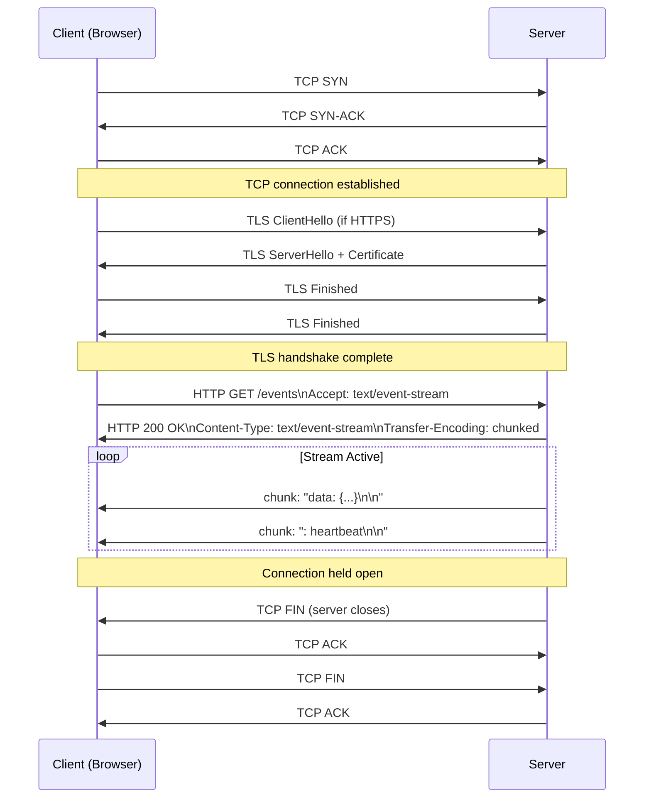
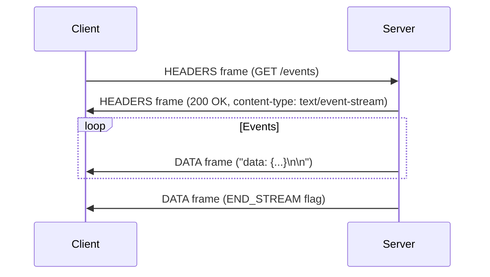
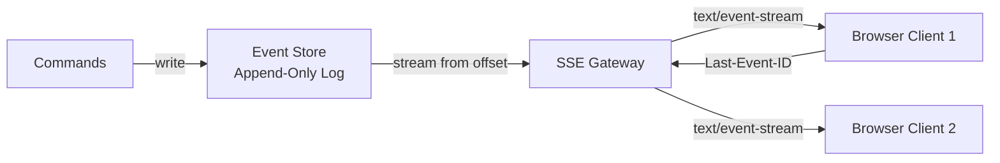
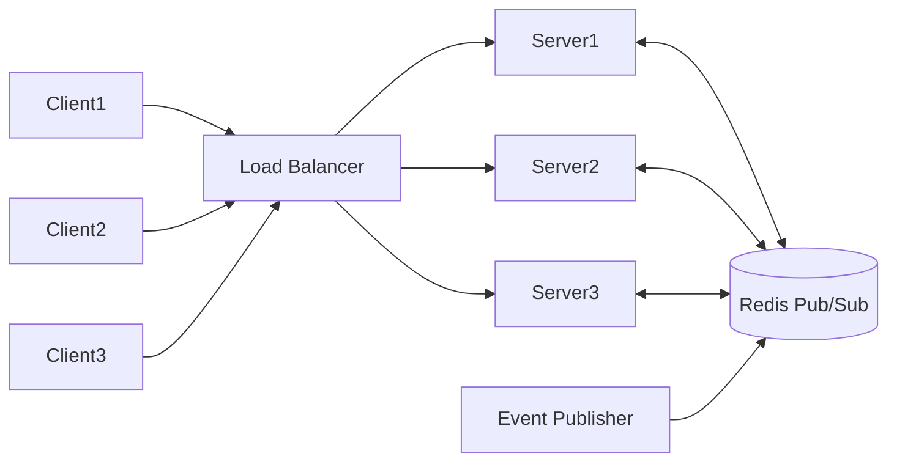
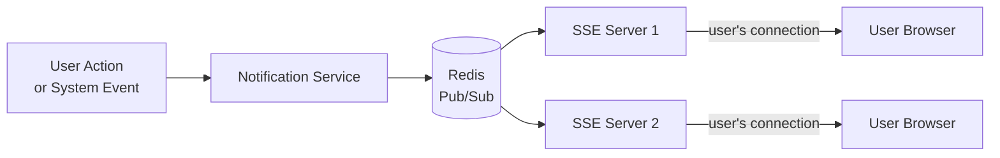
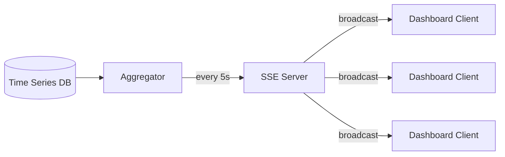
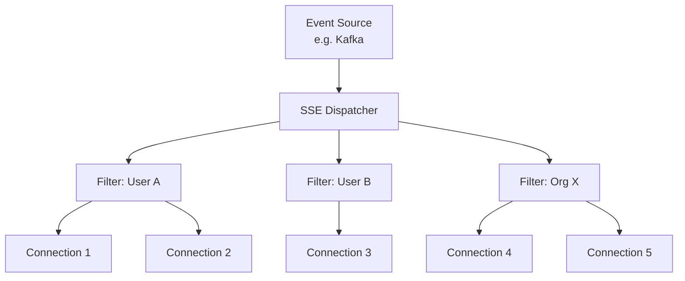

# Server-Sent Events (SSE): A Production-Grade Reference Manual

> **Document Status:** Comprehensive technical reference. All behavioral claims about browser implementations, proxy behavior, and framework internals are labeled per the author's epistemic policy: `[Inference]` = logically reasoned from specifications or source code but not independently benchmarked; `[Unverified]` = not confirmed against a primary source in this authoring session. Code examples are illustrative and should be validated against current framework versions before production deployment. LLM behavior claims carry an additional disclaimer that behavior is not guaranteed.

---

## Table of Contents

1. [Cover: What Is SSE](#1-cover-what-is-sse)
2. [Core Concepts](#2-core-concepts)
3. [Protocol Specification](#3-protocol-specification)
4. [Wire-Level Behavior](#4-wire-level-behavior)
5. [Browser API: EventSource](#5-browser-api-eventsource)
6. [Reconnection Mechanics](#6-reconnection-mechanics)
7. [Event Ordering and Delivery Guarantees](#7-event-ordering-and-delivery-guarantees)
8. [Server Implementation](#8-server-implementation)
9. [Reverse Proxies](#9-reverse-proxies)
10. [Load Balancing and Horizontal Scaling](#10-load-balancing-and-horizontal-scaling)
11. [Infrastructure Concerns](#11-infrastructure-concerns)
12. [Authentication](#12-authentication)
13. [Security](#13-security)
14. [Performance Engineering](#14-performance-engineering)
15. [Production Patterns](#15-production-patterns)
16. [SSE and AI Applications](#16-sse-and-ai-applications)
17. [Advanced Patterns](#17-advanced-patterns)
18. [Observability](#18-observability)
19. [Debugging](#19-debugging)
20. [Browser Compatibility](#20-browser-compatibility)
21. [Technology Comparison](#21-technology-comparison)
22. [Common Pitfalls (50+)](#22-common-pitfalls)
23. [Best Practices Checklist](#23-best-practices-checklist)
24. [FAQ (100+ Questions)](#24-faq)
25. [Conclusion](#25-conclusion)

---

# 1. Cover: What Is SSE

## 1.1 Definition

**Server-Sent Events (SSE)** is a server-push technology enabling a server to transmit a unidirectional, real-time stream of text-based events to a browser (or any HTTP client) over a single, long-lived HTTP connection. The client opens a connection; the server holds it open and writes a sequence of text frames formatted according to the `text/event-stream` MIME type. The connection is not closed after a response — it remains open for the lifetime of the stream.

SSE is defined by the **WHATWG HTML Living Standard**, specifically in the section *"Server-sent events"*, which specifies both the wire format and the `EventSource` browser API.

## 1.2 Purpose

SSE exists to fill a specific architectural niche: **one-way, low-latency, server-initiated data delivery to browser clients with minimal client-side complexity and built-in resilience**.

Primary use cases include:

- Real-time notifications (system alerts, in-app notifications)
- Live data feeds (stock prices, sensor telemetry, sports scores)
- Streaming AI/LLM token output (OpenAI, Anthropic, etc.)
- CI/CD and build log streaming
- Progress reporting for long-running server tasks
- Live dashboard metric updates
- Chat message delivery (read path only)

## 1.3 History and Standardization

| Year | Event |
|------|-------|
| ~2004 | Opera engineer Ian Hickson proposed `text/event-stream` format |
| 2006 | Early drafts incorporated into WHATWG HTML5 work |
| 2009 | Opera 9 shipped the first browser `EventSource` implementation |
| 2011 | W3C published Working Draft of SSE specification |
| 2013–14 | Chrome, Firefox, Safari all shipped `EventSource` |
| 2015 | SSE merged into the WHATWG HTML Living Standard |
| 2020 | Microsoft Edge (Chromium-based) shipped full `EventSource` support |
| Present | SSE is part of the WHATWG HTML Living Standard (not a separate W3C spec) |

The specification lives at: `https://html.spec.whatwg.org/multipage/server-sent-events.html`

## 1.4 Relationship to HTTP Streaming

SSE is a **specialization of HTTP streaming**. HTTP has always supported streaming responses — a server can begin writing a response body and continue writing indefinitely without closing the connection. SSE defines a structured text protocol layered on top of this capability, adding:

- A defined line-oriented frame format (`field: value\n`)
- Standardized field names (`data`, `event`, `id`, `retry`)
- A double-newline message delimiter
- A browser-native API (`EventSource`) to consume streams
- Automatic client reconnection with `Last-Event-ID` resumption

Plain HTTP streaming (sometimes called "chunked streaming") is the transport layer. SSE is the application protocol.

## 1.5 Relationship to HTML5

SSE was conceived as part of the HTML5 initiative, which explicitly aimed to reduce reliance on browser plugins (Flash, Java applets) for real-time web functionality. The `EventSource` interface is defined inside the HTML specification — not in a separate network specification — because the working group considered it a browser application-level feature rather than a transport primitive.

## 1.6 Why SSE Was Introduced

Before SSE, achieving real-time data delivery required:

- **Short polling**: Repeated `setInterval`-driven AJAX requests wasting server resources and incurring constant latency overhead.
- **Long polling**: Holding an HTTP connection until data was available, then closing and immediately reopening — complex to implement reliably.
- **Flash/Java plugins**: `XMLSocket`, Comet patterns via hidden iframes — non-standard, brittle, plugin-dependent.
- **Hacks** like multipart/x-mixed-replace (Firefox only, non-standard).

SSE replaced all of these for the unidirectional case with a native, standardized, simple API. WebSockets were introduced at the same time for the bidirectional case.

---

# 2. Core Concepts

## 2.1 Event Streams

An **event stream** is an unbounded HTTP response body consisting of a sequence of text-encoded events. Each event is a discrete message with optional metadata (type, ID, retry hint) and one or more data lines. The stream has no predetermined end — the server writes events as they occur, and the connection stays alive until either party closes it.

```
[HTTP Response Headers]
Content-Type: text/event-stream

[Body — never terminates until connection closes]
event: heartbeat\n
data: {}\n
\n
event: notification\n
id: 42\n
data: {"user":"alice","message":"Hello"}\n
\n
... (continues indefinitely)
```

## 2.2 Text-Based Streaming Protocol

SSE is strictly a **UTF-8 text protocol**. Binary data is not natively supported — binary payloads must be Base64-encoded (or otherwise text-encoded) before transmission. Each line in the stream is a key-value pair separated by a colon and optional space:

```
field: value\n
```

An empty line (`\n`) signals the end of one event and the beginning of the next.

## 2.3 One-Way Communication Model

SSE enforces strict **server-to-client unidirectionality**. After the initial HTTP request, the client cannot send data on the same connection. If the client needs to send data to the server, it uses a separate HTTP request (e.g., a REST `POST`). This constraint is intentional: it maps to a large class of real applications where the server is the source of truth and clients are observers, and it eliminates the complexity of bidirectional state management.

## 2.4 Push Architecture

SSE implements the **push model**: the server decides when to send data and at what rate. The client is passive after connection establishment. This contrasts with the pull model (polling) where the client initiates every data fetch. In push architectures, event latency is bounded primarily by server processing time and network RTT — not by a polling interval.

## 2.5 Long-Lived HTTP Connections

SSE connections are designed to persist for extended durations — minutes to hours. This requires servers to handle **connection state** differently than for typical short-lived REST requests:

- Memory must be allocated per connection for the duration of the stream.
- File descriptors remain open.
- Application-level heartbeats are typically required to prevent intermediate timeout by proxies or NAT devices.
- Server frameworks must be async or use thread-per-connection models to avoid blocking.

## 2.6 Streaming Responses

The server writes response data incrementally without buffering the entire body. In HTTP/1.1, this is enabled via `Transfer-Encoding: chunked`. In HTTP/2 and HTTP/3, framing is handled at the protocol layer and chunked encoding is not used — streaming is native.

A critical implementation requirement: the server must **flush** the output buffer after each event. Many HTTP frameworks buffer response writes for throughput efficiency. Without an explicit flush, events accumulate in a kernel or framework buffer and are not delivered until the buffer fills or a timer fires.

## 2.7 Browser-Managed Reconnection

The `EventSource` API implements automatic reconnection. If the connection drops, the browser:

1. Waits for a reconnection delay (default: 3 seconds, or the last `retry:` value from the server).
2. Sends a new HTTP request to the same URL.
3. Includes a `Last-Event-ID` header if the stream had previously sent an `id:` field.

This behavior is part of the specification and is handled transparently by the browser. The application does not need to implement reconnection logic.

## 2.8 Event Dispatching

The browser parses the event stream and dispatches `MessageEvent` objects on the `EventSource` instance. Events without an `event:` field are dispatched as `message` events. Events with a named `event:` field (e.g., `event: notification`) are dispatched as custom events and must be listened for explicitly:

```javascript
source.addEventListener('notification', handler);
```

## 2.9 Event IDs

The `id:` field assigns an identifier to an event. The browser stores the last received ID as the "last event ID". On reconnection, the browser sends `Last-Event-ID: <value>` in the request headers, enabling the server to resume the stream from a known position. IDs are arbitrary strings; a common pattern uses monotonically increasing integers or UUIDs.

## 2.10 Retry Intervals

The `retry:` field (integer milliseconds) instructs the browser to use a specific reconnection delay. This overrides the default (typically 3000ms). The server can dynamically adjust retry intervals — for example, exponentially increasing them under load:

```text
retry: 10000
data: server under load, backing off
```

---

## 2.11 SSE vs. Competing Technologies

### Polling

**Short polling** sends a new HTTP request every N seconds regardless of whether new data exists. It has a defined minimum latency floor equal to the polling interval, generates constant server load even during idle periods, and creates N duplicate TCP connections per client per minute. SSE is strictly superior for real-time delivery when the server has data to push, with lower latency and dramatically lower request overhead.

**Long polling** holds the HTTP connection open until the server has data to send, then closes it and the client immediately reconnects. It approximates SSE behavior but is significantly more complex: each event requires a full HTTP round-trip (connection establishment, TLS handshake, headers). Under high event frequency it degenerates to short polling. SSE avoids all per-event HTTP overhead after connection establishment.

### AJAX Refresh

A client-side pattern that uses `setInterval` + `XMLHttpRequest` or `fetch` to periodically replace DOM content. Functionally equivalent to short polling with added DOM manipulation. Not a server-push mechanism.

### Streaming HTTP (Raw)

Raw chunked HTTP streaming without the SSE protocol is possible but provides no standardized framing, no event typing, no IDs, no reconnection semantics, and no browser API. SSE layers all of this on top of HTTP streaming. Raw streaming is appropriate when the consumer is not a browser or when a custom binary protocol is required.

### WebSockets

WebSockets provide a **full-duplex, persistent TCP-like channel** over HTTP Upgrade. They support binary data natively and have lower per-message framing overhead than HTTP. However, they require:

- A stateful server capable of tracking the WS connection.
- Custom reconnection logic (no built-in equivalent to EventSource's reconnect).
- Explicit heartbeat/ping-pong management.
- More complex proxy configuration.
- A separate protocol (not HTTP after handshake).

**Decision rule:** Use SSE when communication is unidirectional (server → client). Use WebSockets when bidirectional real-time communication is required.

### WebTransport

WebTransport (built on HTTP/3 / QUIC) provides multiple transport abstractions: reliable ordered streams, unreliable datagrams, and unreliable streams. It is designed for low-latency applications (gaming, media) where head-of-line blocking in TCP is problematic. As of 2024–2025, browser support is not yet universal and server ecosystem maturity is lower than SSE or WebSockets. SSE remains the appropriate choice for most server-push use cases where TCP's reliability properties are acceptable.

### HTTP/2 Server Push

HTTP/2 Server Push allows a server to proactively send resources (CSS, JS, images) anticipated to be needed for a page. It is **not** a general-purpose event streaming mechanism. It pushes HTTP response objects (headers + body), not event streams. Most browsers have partially or fully deprecated HTTP/2 Server Push. It is not a substitute for SSE.

### HTTP/3

HTTP/3 uses QUIC as its transport and eliminates TCP head-of-line blocking. SSE can run over HTTP/3 connections — the `text/event-stream` protocol is transport-agnostic. HTTP/3 improves SSE performance on lossy networks by allowing recovery of individual QUIC streams independently.

### WebRTC Data Channels

WebRTC data channels provide peer-to-peer full-duplex data transfer with configurable reliability (reliable ordered, reliable unordered, unreliable). They are designed for browser-to-browser communication and require a signaling server. They are categorically different from SSE: no native server-to-many-clients broadcasting, complex setup, NAT traversal requirements. Not a substitute for SSE.

### GraphQL Subscriptions

GraphQL Subscriptions are an application-level protocol for real-time event delivery. They are transport-agnostic — implementations exist over WebSockets (`graphql-ws`), SSE (`graphql-sse`), and long polling. Using SSE as the transport for GraphQL subscriptions is a valid and increasingly common architecture, combining SSE's simplicity with GraphQL's typed subscription model.

---

# 3. Protocol Specification

## 3.1 MIME Type

```http
Content-Type: text/event-stream
```

The `text/event-stream` MIME type signals to the browser that:

1. The response body should be parsed as an SSE stream, not buffered as a complete document.
2. The `EventSource` connection processing algorithm should be applied.
3. The connection should remain open after receiving data.

The browser will refuse to interpret a response as an SSE stream if the `Content-Type` is not `text/event-stream`. Additionally, the `Cache-Control` header should typically be set to `no-cache` to prevent intermediary caches from buffering the stream:

```http
HTTP/1.1 200 OK
Content-Type: text/event-stream
Cache-Control: no-cache
Connection: keep-alive
X-Accel-Buffering: no
```

The `X-Accel-Buffering: no` header is a Nginx-specific directive that disables proxy buffering for this response.

## 3.2 Stream Format

The stream body consists of a sequence of **fields** and **blank lines**. Each field is a UTF-8 encoded line of the form:

```
field-name: field-value\n
```

A line consisting solely of `\n` (a blank line) terminates the current event and dispatches it.

### 3.2.1 The `data` Field

Carries the event payload. Multiple consecutive `data:` lines are concatenated with a newline character (`\n`) between them. The concatenated string is the `event.data` value.

```text
data: first line
data: second line

```

Results in `event.data === "first line\nsecond line"`.

JSON payloads are commonly serialized on a single `data:` line:

```text
data: {"type":"update","value":42}

```

Or split across multiple lines (though single-line JSON is more common in practice):

```text
data: {
data:   "type": "update",
data:   "value": 42
data: }

```

### 3.2.2 The `event` Field

Specifies the event type. If omitted, the event type is `"message"`. If present, the browser dispatches a custom event of that name.

```text
event: notification
data: {"id":7,"text":"Deploy complete"}

```

Client must listen explicitly:

```javascript
source.addEventListener('notification', (e) => {
  console.log(JSON.parse(e.data));
});
```

### 3.2.3 The `id` Field

Sets the event's identifier. The browser stores the last received non-empty `id` value as the stream's "last event ID string". On reconnection, this value is sent back as `Last-Event-ID`.

```text
id: 1001
event: price
data: {"symbol":"AAPL","price":189.42}

```

If `id:` contains an empty value, the last event ID is reset (the browser will not send `Last-Event-ID` on the next reconnect).

### 3.2.4 The `retry` Field

Sets the reconnection time in milliseconds. Must be an integer. Non-integer values are ignored.

```text
retry: 5000
data: reconnect delay updated

```

This field takes effect globally for the stream — it is not per-event. The browser will use the most recently received `retry` value.

### 3.2.5 Comments

Lines beginning with `:` are comments and are ignored by the browser's event parser. Comments are commonly used as heartbeats to keep connections alive through proxies:

```text
: heartbeat

: this is a comment, ignored by EventSource

```

### 3.2.6 Message Termination

An event is complete and dispatched when a **blank line** (a line containing only `\n`) is encountered. Two newlines terminate an event:

```text
id: 5\n
event: update\n
data: hello world\n
\n
```

In raw form (escaped): `"id: 5\nevent: update\ndata: hello world\n\n"`

### 3.2.7 Complete Example

```text
: SSE stream established

retry: 3000

id: 1
event: connected
data: {"session":"abc123"}

id: 2
event: notification
data: {"message":"Hello"}
data: {"continuation":"World"}

id: 3
data: plain message event

: heartbeat

id: 4
event: disconnect
data: {"reason":"server restart"}

```

Parsing results:

| Event # | type | id | data |
|---------|------|----|------|
| 1 | `connected` | `1` | `{"session":"abc123"}` |
| 2 | `notification` | `2` | `{"message":"Hello"}\n{"continuation":"World"}` |
| 3 | `message` | `3` | `plain message event` |
| 4 | `disconnect` | `4` | `{"reason":"server restart"}` |

---

# 4. Wire-Level Behavior

## 4.1 TCP Connection Lifecycle



## 4.2 HTTP Request Lifecycle

The client sends a standard HTTP GET request. Critical headers:

```http
GET /events HTTP/1.1
Host: example.com
Accept: text/event-stream
Cache-Control: no-cache
Last-Event-ID: 42
Connection: keep-alive
```

- `Accept: text/event-stream` — signals SSE intent (not strictly required but conventional).
- `Last-Event-ID` — present on reconnection only; omitted on first connection.
- `Cache-Control: no-cache` — prevents CDN/proxy caching of the stream URL.

## 4.3 HTTP Response Lifecycle

The server must respond with a **streaming response** — it writes the status line and headers, then writes event frames to the body **without closing the connection**:

```http
HTTP/1.1 200 OK
Content-Type: text/event-stream
Cache-Control: no-cache
Transfer-Encoding: chunked
Connection: keep-alive
X-Accel-Buffering: no

6\r\n
data: \r\n
\r\n
1\r\n
\r\n
...
```

The `Transfer-Encoding: chunked` format wraps each write in a length-prefixed chunk. This is transparent to the application layer in most frameworks.

## 4.4 Browser Buffering

Browsers implement internal read buffers for HTTP responses. For SSE, the browser processes the stream incrementally:

1. Bytes arrive in the TCP receive buffer.
2. The HTTP layer de-chunks the data.
3. The SSE parser processes lines as they arrive.
4. When a blank line is encountered, the accumulated event is dispatched.

[Inference] Some browsers may buffer at the HTTP layer before exposing data to the SSE parser. In practice, small event payloads (< 1KB) are typically dispatched without observable buffering delay given adequate server-side flushing. Behavior is not guaranteed across all browser versions.

## 4.5 Chunked Transfer Encoding (HTTP/1.1)

HTTP/1.1 does not know the final length of a streaming response, so it uses chunked transfer encoding:

```
<hex-length>\r\n
<chunk-data>\r\n
0\r\n
\r\n
```

Each server write becomes one or more chunks. The terminal chunk has length `0`. For SSE, the terminal chunk is never sent until the stream ends.

## 4.6 Streaming Over HTTP/2

HTTP/2 frames the response body as `DATA` frames on a single stream. Chunked transfer encoding is not used (it is prohibited). HTTP/2 enables multiplexing: multiple SSE connections can share one TCP connection, reducing TCP overhead significantly for clients with multiple open streams.



HTTP/2's flow control (`WINDOW_UPDATE` frames) can cause delivery stalls if the client-side window is exhausted. [Inference] This is rarely a concern for SSE at normal event rates but could manifest at very high throughput.

## 4.7 Streaming Over HTTP/3

HTTP/3 runs over QUIC. Each HTTP/3 request/response pair runs on a QUIC stream, which is independently recoverable from packet loss. For SSE:

- No TCP head-of-line blocking: a lost packet only stalls the affected QUIC stream, not other streams.
- Connection migration: QUIC connection IDs survive IP address changes (mobile handoffs), reducing SSE reconnection frequency.
- [Inference] SSE over HTTP/3 should offer lower tail latency on lossy/mobile networks compared to HTTP/1.1 or HTTP/2.

---

# 5. Browser API: EventSource

## 5.1 Constructor

```typescript
const source = new EventSource(url: string, options?: EventSourceInit);
```

```typescript
interface EventSourceInit {
  withCredentials?: boolean; // default: false
}
```

- `url`: The URL of the SSE endpoint. Must be same-origin, or the server must send CORS headers.
- `withCredentials`: If `true`, cookies and HTTP auth headers are included in cross-origin requests.

```javascript
// Same-origin
const source = new EventSource('/api/events');

// Cross-origin with credentials
const source = new EventSource('https://api.example.com/events', {
  withCredentials: true
});
```

## 5.2 Properties

### `readyState`

```typescript
readonly readyState: 0 | 1 | 2;
// 0 = CONNECTING
// 1 = OPEN
// 2 = CLOSED
```

| Value | Constant | Meaning |
|-------|----------|---------|
| 0 | `EventSource.CONNECTING` | Connecting or reconnecting |
| 1 | `EventSource.OPEN` | Connection established |
| 2 | `EventSource.CLOSED` | Connection closed, no reconnect |

### `url`

```typescript
readonly url: string;
```

The resolved URL the EventSource connected to (after any redirects). Read-only.

### `withCredentials`

```typescript
readonly withCredentials: boolean;
```

Reflects the `withCredentials` option passed at construction.

## 5.3 Methods

### `close()`

Permanently closes the connection and sets `readyState` to `CLOSED`. The browser will **not** reconnect after `close()` is called. To reconnect, a new `EventSource` instance must be created.

```javascript
source.close();
console.log(source.readyState); // 2 (CLOSED)
```

## 5.4 Event Handlers

### `open`

Fired when the connection is established (or re-established after a reconnect).

```javascript
source.addEventListener('open', (event) => {
  console.log('Connection opened');
});
// or:
source.onopen = (event) => { ... };
```

### `message`

Fired for events without an `event:` field, or for events with `event: message`.

```javascript
source.addEventListener('message', (event) => {
  console.log(event.data);         // string payload
  console.log(event.lastEventId);  // last received id:
  console.log(event.origin);       // origin of the event stream
});
source.onmessage = (event) => { ... };
```

### `error`

Fired when the connection encounters an error or closes unexpectedly. Notably, this event does **not** receive error detail — the browser does not expose the HTTP error code or reason through the `error` event.

```javascript
source.addEventListener('error', (event) => {
  if (source.readyState === EventSource.CLOSED) {
    console.log('Connection permanently closed');
  } else if (source.readyState === EventSource.CONNECTING) {
    console.log('Reconnecting...');
  }
});
```

### Custom Events

```javascript
source.addEventListener('notification', (event) => {
  const payload = JSON.parse(event.data);
  console.log(payload);
});

source.addEventListener('price-update', (event) => {
  const price = JSON.parse(event.data);
  updateChart(price);
});
```

## 5.5 Complete Browser Client Example

```javascript
class SSEClient {
  constructor(url, options = {}) {
    this.url = url;
    this.options = options;
    this.source = null;
    this.handlers = new Map();
    this.connect();
  }

  connect() {
    this.source = new EventSource(this.url, this.options);

    this.source.addEventListener('open', () => {
      console.log('[SSE] Connected to', this.url);
      this.emit('__connected__');
    });

    this.source.addEventListener('error', (e) => {
      const state = this.source.readyState;
      if (state === EventSource.CONNECTING) {
        console.warn('[SSE] Reconnecting...');
      } else if (state === EventSource.CLOSED) {
        console.error('[SSE] Connection closed permanently');
        this.emit('__closed__');
      }
    });

    // Route custom events
    for (const [eventType] of this.handlers) {
      if (!eventType.startsWith('__')) {
        this.source.addEventListener(eventType, (e) => this.dispatch(eventType, e));
      }
    }
  }

  on(eventType, handler) {
    if (!this.handlers.has(eventType)) {
      this.handlers.set(eventType, []);
      if (this.source) {
        this.source.addEventListener(eventType, (e) => this.dispatch(eventType, e));
      }
    }
    this.handlers.get(eventType).push(handler);
    return this;
  }

  off(eventType, handler) {
    const list = this.handlers.get(eventType) || [];
    this.handlers.set(eventType, list.filter(h => h !== handler));
    return this;
  }

  dispatch(eventType, event) {
    const handlers = this.handlers.get(eventType) || [];
    handlers.forEach(h => h(event));
  }

  emit(eventType, data) {
    this.dispatch(eventType, { data, type: eventType });
  }

  disconnect() {
    if (this.source) {
      this.source.close();
    }
  }
}

// Usage
const client = new SSEClient('/api/events', { withCredentials: true });

client
  .on('notification', (e) => renderNotification(JSON.parse(e.data)))
  .on('price-update', (e) => updateTicker(JSON.parse(e.data)))
  .on('__connected__', () => showOnlineBadge())
  .on('__closed__', () => showOfflineBadge());
```

## 5.6 TypeScript EventSource Wrapper

```typescript
type SSEEventMap = Record<string, (event: MessageEvent) => void>;

class TypedSSEClient<TEvents extends SSEEventMap> {
  private source: EventSource;

  constructor(
    private readonly url: string,
    private readonly init?: EventSourceInit
  ) {
    this.source = new EventSource(url, init);
  }

  on<K extends keyof TEvents & string>(
    eventType: K,
    handler: TEvents[K]
  ): this {
    this.source.addEventListener(eventType, handler as EventListener);
    return this;
  }

  off<K extends keyof TEvents & string>(
    eventType: K,
    handler: TEvents[K]
  ): this {
    this.source.removeEventListener(eventType, handler as EventListener);
    return this;
  }

  close(): void {
    this.source.close();
  }

  get readyState(): number {
    return this.source.readyState;
  }
}

// Usage with typed events
interface AppEvents extends SSEEventMap {
  notification: (e: MessageEvent<string>) => void;
  'price-update': (e: MessageEvent<string>) => void;
  message: (e: MessageEvent<string>) => void;
}

const client = new TypedSSEClient<AppEvents>('/api/events');
client.on('notification', (e) => {
  const data: { id: number; text: string } = JSON.parse(e.data);
  console.log(data.text);
});
```

---

# 6. Reconnection Mechanics

## 6.1 Automatic Reconnect

The `EventSource` specification mandates automatic reconnection. The reconnection algorithm per the WHATWG spec:

1. `readyState` transitions to `CONNECTING` (0).
2. The `error` event fires.
3. The browser waits for the **reconnection time** (default ~3000ms, or last `retry:` value).
4. A new HTTP GET request is issued to the same URL.
5. If the server responds with HTTP 204 No Content, reconnection stops.
6. If the server responds with a non-200, non-204 status, the browser fires `error` again and may stop reconnecting (behavior varies by browser — see §20).
7. On successful reconnection (HTTP 200 with `text/event-stream`), `readyState` transitions to `OPEN` and `open` fires.

## 6.2 Retry Field

```text
retry: 15000

```

Milliseconds. The browser applies this value as the minimum reconnection delay. There is **no built-in exponential backoff** in the EventSource spec — the browser uses the last `retry` value as a fixed delay. To implement server-side backoff, the server must progressively increase the `retry` value it sends.

[Inference] Browser implementations may apply their own jitter or caps in certain conditions, but this is not specified behavior and should not be relied upon.

## 6.3 Network Interruption Handling

When a network interruption occurs:

1. TCP connection is broken.
2. The browser detects the dropped connection (TCP FIN or timeout).
3. `error` event fires.
4. Reconnect sequence begins as described above.

On mobile networks, IP address changes (e.g., switching between WiFi and LTE) break the underlying TCP connection. HTTP/3 with QUIC connection migration can survive IP changes, but SSE over HTTP/1.1 or HTTP/2 will reconnect.

## 6.4 Browser Differences

[Unverified — specific version-level browser behavior is not confirmed against current browser source or release notes in this session. The following represents the general state as documented publicly.]

| Browser | Reconnect Behavior | Notes |
|---------|--------------------|-------|
| Chrome | Follows spec precisely | Applies `retry` value; no built-in backoff |
| Firefox | Follows spec | Slightly different error event timing |
| Safari | Follows spec | Some historical quirks in older versions |
| Edge (Chromium) | Follows spec | Same engine as Chrome |

## 6.5 Last-Event-ID

The `Last-Event-ID` mechanism enables **stream resumption**:

```http
GET /events HTTP/1.1
Last-Event-ID: 99
```

The server receives this header and can resume sending events starting from the event after ID 99.

### Server-Side Resumption Pattern

```javascript
// Server stores events in an append-only log
app.get('/events', (req, res) => {
  const lastId = parseInt(req.headers['last-event-id'] || '0', 10);
  
  res.setHeader('Content-Type', 'text/event-stream');
  res.setHeader('Cache-Control', 'no-cache');
  
  // Replay missed events
  const missed = eventLog.getAfter(lastId);
  for (const event of missed) {
    res.write(`id: ${event.id}\n`);
    res.write(`data: ${JSON.stringify(event.payload)}\n\n`);
  }
  
  // Subscribe to new events
  const unsubscribe = eventBus.subscribe((event) => {
    res.write(`id: ${event.id}\n`);
    res.write(`data: ${JSON.stringify(event.payload)}\n\n`);
  });
  
  req.on('close', unsubscribe);
});
```

## 6.6 Exactly-Once vs. At-Least-Once Semantics

SSE provides **at-least-once delivery** in practice:

- If the connection drops *after* the server writes an event but *before* the client's TCP receive buffer acknowledges it, the event may be retransmitted on reconnect.
- If the connection drops *while* an event is in-flight at the TCP layer, the client may or may not have received it.
- The `Last-Event-ID` mechanism only tracks the last *acknowledged* ID — "acknowledged" meaning the event was fully parsed and stored by the EventSource parser.

**Exactly-once semantics require application-level deduplication** using the event `id` field. Clients should store received IDs and deduplicate before processing.

---

# 7. Event Ordering and Delivery Guarantees

## 7.1 Ordering Guarantees

Within a single SSE connection, events are delivered in the **order they were written by the server**. TCP's in-order delivery guarantee ensures this at the transport layer. Across reconnections, ordering is only maintained if the server implements deterministic replay from the `Last-Event-ID` position.

There are **no cross-connection ordering guarantees** without explicit server-side sequencing. If two clients receive events from different server instances behind a load balancer, their event sequences may diverge without a shared, ordered event log.

## 7.2 Message Delivery Guarantees

| Condition | Outcome |
|-----------|---------|
| Normal operation | All events delivered in order |
| Network drop, client reconnects with `Last-Event-ID` | Events from after last ID replayed (at-least-once) |
| Network drop, server has no event log | Events during outage lost |
| Server crash, no durable log | Events lost |
| Client calls `source.close()` | No reconnect, subsequent events not received |
| Server sends HTTP 204 | Reconnect stops, subsequent events not received |

## 7.3 Duplication Risks

Duplication occurs when:

1. The server successfully writes event N to the socket.
2. The connection drops before client ACK propagates back to the server's TCP layer.
3. The client reconnects with `Last-Event-ID: N-1` (the last confirmed ID).
4. The server re-sends event N (which the client may have already processed).

**Mitigation:** Clients should maintain a `Set<string>` of processed event IDs and skip duplicates. The window for this set can be bounded (e.g., last 1000 events) to limit memory use.

```javascript
const processedIds = new Set();

source.addEventListener('message', (e) => {
  const { id } = JSON.parse(e.data);
  if (processedIds.has(id)) return; // deduplicate
  processedIds.add(id);
  // prune old IDs to bound memory
  if (processedIds.size > 1000) {
    const [first] = processedIds;
    processedIds.delete(first);
  }
  processEvent(e.data);
});
```

## 7.4 Missing Event Scenarios

| Scenario | Cause | Recovery |
|----------|-------|----------|
| Server has no event log | Crash, restart | Events during outage permanently lost |
| Event log TTL expired | Log pruned before reconnect | Client receives events only from current log tail |
| ID gap in sequence | Server bug, message dropped in broker | Client-side gap detection, server-side alerting |
| Client `close()` called | Intentional disconnect | None; requires new `EventSource` |

## 7.5 Event Sourcing and CQRS Integration

SSE pairs naturally with **Event Sourcing** and **CQRS** architectures:

- The event store (append-only log) is the authoritative source of truth.
- SSE streams are **projections** of the event store — filtered, transformed views.
- The `id:` field maps to the event store's **sequence number** or **offset**.
- Reconnection with `Last-Event-ID` maps to **reading from offset N** in the event log.
- This enables clients to maintain a **local read model** synchronized with server state via SSE.



---

# 8. Server Implementation

## 8.1 Node.js — Native HTTP

### Minimal

```javascript
const http = require('http');

const server = http.createServer((req, res) => {
  if (req.url === '/events') {
    res.writeHead(200, {
      'Content-Type': 'text/event-stream',
      'Cache-Control': 'no-cache',
      'Connection': 'keep-alive',
    });

    const interval = setInterval(() => {
      res.write(`data: ${JSON.stringify({ ts: Date.now() })}\n\n`);
    }, 1000);

    req.on('close', () => {
      clearInterval(interval);
    });
  }
});

server.listen(3000);
```

### Production

```javascript
const http = require('http');

class SSEConnectionManager {
  constructor() {
    this.connections = new Map(); // clientId -> res
  }

  add(clientId, res) {
    this.connections.set(clientId, res);
    res.on('close', () => this.remove(clientId));
  }

  remove(clientId) {
    this.connections.delete(clientId);
  }

  broadcast(eventType, data, id) {
    const payload = this._format(eventType, data, id);
    for (const res of this.connections.values()) {
      res.write(payload);
    }
  }

  send(clientId, eventType, data, id) {
    const res = this.connections.get(clientId);
    if (res) res.write(this._format(eventType, data, id));
  }

  _format(eventType, data, id) {
    let msg = '';
    if (id !== undefined) msg += `id: ${id}\n`;
    if (eventType) msg += `event: ${eventType}\n`;
    msg += `data: ${typeof data === 'string' ? data : JSON.stringify(data)}\n\n`;
    return msg;
  }

  get size() {
    return this.connections.size;
  }
}

const manager = new SSEConnectionManager();

const server = http.createServer((req, res) => {
  if (req.url.startsWith('/events')) {
    const clientId = crypto.randomUUID();
    const lastEventId = req.headers['last-event-id'];

    res.writeHead(200, {
      'Content-Type': 'text/event-stream',
      'Cache-Control': 'no-cache',
      'Connection': 'keep-alive',
      'X-Accel-Buffering': 'no',
    });

    // Send retry hint
    res.write('retry: 5000\n\n');

    // Replay missed events if applicable
    if (lastEventId) {
      replayFrom(lastEventId, res);
    }

    manager.add(clientId, res);

    // Heartbeat to prevent proxy timeouts
    const heartbeat = setInterval(() => {
      res.write(': heartbeat\n\n');
    }, 15000);

    req.on('close', () => {
      clearInterval(heartbeat);
      manager.remove(clientId);
    });
  }
});
```

**Common mistakes:**
- Forgetting `req.on('close')` cleanup → memory leak.
- Not flushing (Node.js HTTP `res.write` flushes automatically, but some wrappers buffer).
- Missing heartbeat → proxy timeouts.

## 8.2 Express

### Minimal

```javascript
const express = require('express');
const app = express();

app.get('/events', (req, res) => {
  res.setHeader('Content-Type', 'text/event-stream');
  res.setHeader('Cache-Control', 'no-cache');
  res.setHeader('Connection', 'keep-alive');
  res.flushHeaders(); // flush status + headers immediately

  const send = (data) => res.write(`data: ${JSON.stringify(data)}\n\n`);

  const interval = setInterval(() => send({ time: new Date().toISOString() }), 1000);

  req.on('close', () => {
    clearInterval(interval);
    res.end();
  });
});

app.listen(3000);
```

### Production (with compression disabled, auth, heartbeat)

```javascript
const express = require('express');
const compression = require('compression');

const app = express();

// Disable compression for SSE routes — gzip buffering breaks streaming
app.use('/events', (req, res, next) => {
  res.setHeader('Content-Encoding', 'identity');
  next();
});

// Apply compression globally for other routes
app.use(compression());

const clients = new Map();

app.get('/events', authenticate, (req, res) => {
  const clientId = req.user.id; // from auth middleware

  res.setHeader('Content-Type', 'text/event-stream');
  res.setHeader('Cache-Control', 'no-cache');
  res.setHeader('Connection', 'keep-alive');
  res.setHeader('X-Accel-Buffering', 'no');
  res.flushHeaders();

  res.write('retry: 5000\n\n');
  res.write(`: connected clientId=${clientId}\n\n`);

  clients.set(clientId, res);

  const heartbeat = setInterval(() => res.write(': ping\n\n'), 20000);

  req.on('close', () => {
    clearInterval(heartbeat);
    clients.delete(clientId);
  });
});

// Broadcast from elsewhere in the app
function broadcast(eventType, data, id) {
  const msg = `id: ${id}\nevent: ${eventType}\ndata: ${JSON.stringify(data)}\n\n`;
  clients.forEach(res => res.write(msg));
}

module.exports = { app, broadcast };
```

**Common mistakes:**
- Using `compression()` middleware on SSE routes — gzip buffering prevents immediate delivery.
- Not calling `res.flushHeaders()` — headers may be buffered until first body write.

## 8.3 Fastify

```javascript
const fastify = require('fastify')({ logger: true });

fastify.get('/events', async (request, reply) => {
  const lastEventId = request.headers['last-event-id'];

  reply.raw.writeHead(200, {
    'Content-Type': 'text/event-stream',
    'Cache-Control': 'no-cache',
    'Connection': 'keep-alive',
    'X-Accel-Buffering': 'no',
  });

  reply.raw.write('retry: 5000\n\n');

  let eventId = parseInt(lastEventId || '0', 10);

  const heartbeat = setInterval(() => {
    reply.raw.write(': heartbeat\n\n');
  }, 15000);

  const interval = setInterval(() => {
    eventId++;
    reply.raw.write(`id: ${eventId}\nevent: update\ndata: ${JSON.stringify({ ts: Date.now() })}\n\n`);
  }, 1000);

  request.raw.on('close', () => {
    clearInterval(interval);
    clearInterval(heartbeat);
  });

  // Return a never-resolving promise to keep the handler alive
  return new Promise((resolve) => {
    request.raw.on('close', resolve);
  });
});

fastify.listen({ port: 3000 });
```

**Fastify-specific considerations:**
- Use `reply.raw` to bypass Fastify's response abstraction for streaming.
- Fastify's schema validation and serialization do not apply to streamed responses.
- Fastify's `@fastify/compress` plugin must be disabled or excluded for SSE routes.

```javascript
// Exclude /events from compression
fastify.register(require('@fastify/compress'), {
  global: true,
  encodings: ['gzip'],
  requestEncodings: ['gzip'],
  // Use customTypes to skip text/event-stream
  customTypes: /^(?!text\/event-stream)/,
});
```

## 8.4 NestJS

```typescript
import { Controller, Get, Req, Res, Sse } from '@nestjs/common';
import { Request, Response } from 'express';
import { Observable, interval, fromEvent } from 'rxjs';
import { map, takeUntil } from 'rxjs/operators';
import { MessageEvent } from '@nestjs/common';

@Controller('events')
export class EventsController {
  
  // Method 1: Using NestJS @Sse decorator (returns Observable<MessageEvent>)
  @Sse('stream')
  streamEvents(@Req() req: Request): Observable<MessageEvent> {
    const close$ = fromEvent(req, 'close');
    
    return interval(1000).pipe(
      takeUntil(close$),
      map((count) => ({
        type: 'update',
        id: String(count),
        data: { count, timestamp: Date.now() },
        retry: 5000,
      } as MessageEvent))
    );
  }

  // Method 2: Manual streaming for full control
  @Get('manual')
  manualStream(@Req() req: Request, @Res() res: Response): void {
    res.setHeader('Content-Type', 'text/event-stream');
    res.setHeader('Cache-Control', 'no-cache');
    res.setHeader('Connection', 'keep-alive');
    res.setHeader('X-Accel-Buffering', 'no');
    res.flushHeaders();

    res.write('retry: 5000\n\n');

    const heartbeat = setInterval(() => res.write(': heartbeat\n\n'), 20000);
    const interval = setInterval(() => {
      res.write(`data: ${JSON.stringify({ ts: Date.now() })}\n\n`);
    }, 1000);

    req.on('close', () => {
      clearInterval(heartbeat);
      clearInterval(interval);
    });
  }
}
```

NestJS `@Sse` decorator wraps an `Observable<MessageEvent>` and handles SSE header setting. The `MessageEvent` interface includes `data`, `id`, `type` (maps to `event:`), and `retry`.

**Common NestJS mistake:** Interceptors or middleware that buffer responses (e.g., `TransformInterceptor` wrapping all responses in `{ data: ... }`) will break SSE. SSE endpoints must be excluded from such interceptors.

## 8.5 Go — net/http

### Minimal

```go
package main

import (
    "fmt"
    "net/http"
    "time"
)

func eventsHandler(w http.ResponseWriter, r *http.Request) {
    flusher, ok := w.(http.Flusher)
    if !ok {
        http.Error(w, "Streaming unsupported", http.StatusInternalServerError)
        return
    }

    w.Header().Set("Content-Type", "text/event-stream")
    w.Header().Set("Cache-Control", "no-cache")
    w.Header().Set("Connection", "keep-alive")
    w.Header().Set("X-Accel-Buffering", "no")

    fmt.Fprintf(w, "retry: 5000\n\n")
    flusher.Flush()

    ticker := time.NewTicker(1 * time.Second)
    defer ticker.Stop()

    for {
        select {
        case <-r.Context().Done():
            return
        case t := <-ticker.C:
            fmt.Fprintf(w, "data: {\"time\":\"%s\"}\n\n", t.Format(time.RFC3339))
            flusher.Flush()
        }
    }
}

func main() {
    http.HandleFunc("/events", eventsHandler)
    http.ListenAndServe(":8080", nil)
}
```

### Production (with connection registry and broadcast)

```go
package main

import (
    "context"
    "encoding/json"
    "fmt"
    "net/http"
    "sync"
    "time"
)

type Client struct {
    id      string
    channel chan Event
    ctx     context.Context
    cancel  context.CancelFunc
}

type Event struct {
    ID    string      `json:"id,omitempty"`
    Type  string      `json:"type,omitempty"`
    Data  interface{} `json:"data"`
    Retry int         `json:"retry,omitempty"`
}

type SSEBroker struct {
    mu      sync.RWMutex
    clients map[string]*Client
}

func NewSSEBroker() *SSEBroker {
    return &SSEBroker{clients: make(map[string]*Client)}
}

func (b *SSEBroker) AddClient(id string) *Client {
    ctx, cancel := context.WithCancel(context.Background())
    client := &Client{
        id:      id,
        channel: make(chan Event, 64),
        ctx:     ctx,
        cancel:  cancel,
    }
    b.mu.Lock()
    b.clients[id] = client
    b.mu.Unlock()
    return client
}

func (b *SSEBroker) RemoveClient(id string) {
    b.mu.Lock()
    if c, ok := b.clients[id]; ok {
        c.cancel()
        close(c.channel)
        delete(b.clients, id)
    }
    b.mu.Unlock()
}

func (b *SSEBroker) Broadcast(event Event) {
    b.mu.RLock()
    defer b.mu.RUnlock()
    for _, c := range b.clients {
        select {
        case c.channel <- event:
        default:
            // Drop if channel full; prevent slow client blocking broadcast
        }
    }
}

func (b *SSEBroker) ServeHTTP(w http.ResponseWriter, r *http.Request) {
    flusher, ok := w.(http.Flusher)
    if !ok {
        http.Error(w, "Streaming unsupported", http.StatusInternalServerError)
        return
    }

    w.Header().Set("Content-Type", "text/event-stream")
    w.Header().Set("Cache-Control", "no-cache")
    w.Header().Set("Connection", "keep-alive")
    w.Header().Set("X-Accel-Buffering", "no")

    clientID := fmt.Sprintf("%d", time.Now().UnixNano())
    client := b.AddClient(clientID)
    defer b.RemoveClient(clientID)

    fmt.Fprintf(w, "retry: 5000\n\n")
    flusher.Flush()

    heartbeat := time.NewTicker(20 * time.Second)
    defer heartbeat.Stop()

    for {
        select {
        case <-r.Context().Done():
            return
        case <-heartbeat.C:
            fmt.Fprintf(w, ": heartbeat\n\n")
            flusher.Flush()
        case event, ok := <-client.channel:
            if !ok {
                return
            }
            data, _ := json.Marshal(event.Data)
            if event.ID != "" {
                fmt.Fprintf(w, "id: %s\n", event.ID)
            }
            if event.Type != "" {
                fmt.Fprintf(w, "event: %s\n", event.Type)
            }
            fmt.Fprintf(w, "data: %s\n\n", data)
            flusher.Flush()
        }
    }
}
```

**Go-specific notes:**
- Must type-assert `http.ResponseWriter` to `http.Flusher`. If this fails, streaming is not supported (happens behind some middleware).
- Use `r.Context().Done()` to detect client disconnection.
- Per-client channels with bounded capacity prevent slow clients from blocking the broadcast goroutine.

## 8.6 Go — Gin

```go
package main

import (
    "encoding/json"
    "fmt"
    "time"

    "github.com/gin-gonic/gin"
)

func eventsHandler(c *gin.Context) {
    c.Header("Content-Type", "text/event-stream")
    c.Header("Cache-Control", "no-cache")
    c.Header("Connection", "keep-alive")
    c.Header("X-Accel-Buffering", "no")

    clientGone := c.Request.Context().Done()

    c.Stream(func(w io.Writer) bool {
        select {
        case <-clientGone:
            return false
        case <-time.After(1 * time.Second):
            data, _ := json.Marshal(map[string]interface{}{"ts": time.Now().Unix()})
            fmt.Fprintf(w, "data: %s\n\n", data)
            return true
        }
    })
}
```

## 8.7 Python — Flask

### Minimal

```python
from flask import Flask, Response
import json
import time

app = Flask(__name__)

def event_stream():
    while True:
        time.sleep(1)
        data = json.dumps({"ts": time.time()})
        yield f"data: {data}\n\n"

@app.route("/events")
def events():
    return Response(event_stream(), mimetype="text/event-stream")
```

### Production

```python
from flask import Flask, Response, request
import json
import time
import threading
from queue import Queue, Empty

app = Flask(__name__)

# Global connection registry
connections: dict[str, Queue] = {}
connections_lock = threading.Lock()

def make_client_id() -> str:
    import uuid
    return str(uuid.uuid4())

def event_stream(client_id: str, queue: Queue):
    """Generator that yields SSE-formatted events."""
    try:
        yield "retry: 5000\n\n"
        while True:
            try:
                event = queue.get(timeout=20)
                if event is None:  # Sentinel for shutdown
                    return
                yield format_event(event)
            except Empty:
                # Heartbeat to prevent proxy timeout
                yield ": heartbeat\n\n"
    finally:
        with connections_lock:
            connections.pop(client_id, None)

def format_event(event: dict) -> str:
    parts = []
    if "id" in event:
        parts.append(f"id: {event['id']}")
    if "type" in event:
        parts.append(f"event: {event['type']}")
    parts.append(f"data: {json.dumps(event['data'])}")
    parts.append("")
    parts.append("")
    return "\n".join(parts)

@app.route("/events")
def events():
    client_id = make_client_id()
    queue: Queue = Queue(maxsize=256)

    with connections_lock:
        connections[client_id] = queue

    return Response(
        event_stream(client_id, queue),
        mimetype="text/event-stream",
        headers={
            "Cache-Control": "no-cache",
            "X-Accel-Buffering": "no",
            "Connection": "keep-alive",
        }
    )

def broadcast(event_type: str, data: dict, event_id: str = None):
    event = {"type": event_type, "data": data}
    if event_id:
        event["id"] = event_id
    
    with connections_lock:
        dead = []
        for cid, queue in connections.items():
            try:
                queue.put_nowait(event)
            except:
                dead.append(cid)
        for cid in dead:
            connections.pop(cid, None)
```

**Flask considerations:**
- Run with `gunicorn --worker-class=gevent` or `--worker-class=eventlet` for async workers. Synchronous workers block on each SSE connection.
- Flask's development server is not suitable for production SSE (single-threaded by default).

## 8.8 Python — FastAPI

```python
from fastapi import FastAPI, Request
from fastapi.responses import StreamingResponse
import asyncio
import json
import time
from typing import AsyncGenerator

app = FastAPI()

async def event_generator(request: Request, last_id: str = None) -> AsyncGenerator[str, None]:
    """Async generator for SSE events."""
    yield "retry: 5000\n\n"
    
    event_id = int(last_id or 0)
    
    try:
        while True:
            if await request.is_disconnected():
                break
            
            event_id += 1
            data = json.dumps({"id": event_id, "ts": time.time()})
            yield f"id: {event_id}\nevent: update\ndata: {data}\n\n"
            
            await asyncio.sleep(1)
    except asyncio.CancelledError:
        pass

@app.get("/events")
async def events(request: Request):
    last_event_id = request.headers.get("last-event-id")
    
    return StreamingResponse(
        event_generator(request, last_event_id),
        media_type="text/event-stream",
        headers={
            "Cache-Control": "no-cache",
            "Connection": "keep-alive",
            "X-Accel-Buffering": "no",
        }
    )
```

### Production FastAPI with Pub/Sub

```python
from fastapi import FastAPI, Request
from fastapi.responses import StreamingResponse
import asyncio
from typing import AsyncGenerator, Dict, Set
import json

app = FastAPI()

class EventBroadcaster:
    def __init__(self):
        self._subscribers: Dict[str, asyncio.Queue] = {}

    def subscribe(self, client_id: str) -> asyncio.Queue:
        q: asyncio.Queue = asyncio.Queue(maxsize=256)
        self._subscribers[client_id] = q
        return q

    def unsubscribe(self, client_id: str):
        self._subscribers.pop(client_id, None)

    async def broadcast(self, event_type: str, data: dict, event_id: str = None):
        msg = {}
        if event_id:
            msg["id"] = event_id
        msg["type"] = event_type
        msg["data"] = data
        
        dead = []
        for cid, q in self._subscribers.items():
            try:
                q.put_nowait(msg)
            except asyncio.QueueFull:
                dead.append(cid)
        for cid in dead:
            self.unsubscribe(cid)

broadcaster = EventBroadcaster()

async def stream(request: Request, client_id: str) -> AsyncGenerator[str, None]:
    queue = broadcaster.subscribe(client_id)
    try:
        yield "retry: 5000\n\n"
        while True:
            try:
                event = await asyncio.wait_for(queue.get(), timeout=20.0)
                parts = []
                if "id" in event:
                    parts.append(f"id: {event['id']}")
                if "type" in event:
                    parts.append(f"event: {event['type']}")
                parts.append(f"data: {json.dumps(event['data'])}")
                yield "\n".join(parts) + "\n\n"
            except asyncio.TimeoutError:
                yield ": heartbeat\n\n"
            
            if await request.is_disconnected():
                break
    finally:
        broadcaster.unsubscribe(client_id)

@app.get("/events")
async def events_endpoint(request: Request):
    import uuid
    client_id = str(uuid.uuid4())
    return StreamingResponse(
        stream(request, client_id),
        media_type="text/event-stream",
        headers={"Cache-Control": "no-cache", "X-Accel-Buffering": "no"},
    )
```

## 8.9 Java — Spring Boot

```java
import org.springframework.http.MediaType;
import org.springframework.http.codec.ServerSentEvent;
import org.springframework.web.bind.annotation.*;
import reactor.core.publisher.Flux;
import java.time.Duration;
import java.time.LocalTime;

@RestController
@RequestMapping("/events")
public class SSEController {

    // Reactive SSE using Flux<ServerSentEvent>
    @GetMapping(produces = MediaType.TEXT_EVENT_STREAM_VALUE)
    public Flux<ServerSentEvent<String>> streamEvents() {
        return Flux.interval(Duration.ofSeconds(1))
            .map(seq -> ServerSentEvent.<String>builder()
                .id(String.valueOf(seq))
                .event("update")
                .data("{\"time\":\"" + LocalTime.now() + "\",\"seq\":" + seq + "}")
                .retry(Duration.ofSeconds(5))
                .comment("tick")
                .build());
    }

    // SseEmitter approach (servlet-based)
    @GetMapping(value = "/servlet", produces = MediaType.TEXT_EVENT_STREAM_VALUE)
    public SseEmitter streamServlet() {
        SseEmitter emitter = new SseEmitter(Long.MAX_VALUE);
        
        ExecutorService executor = Executors.newSingleThreadExecutor();
        executor.execute(() -> {
            try {
                for (int i = 0; i < 100; i++) {
                    SseEmitter.SseEventBuilder event = SseEmitter.event()
                        .id(String.valueOf(i))
                        .name("update")
                        .data("{\"seq\":" + i + "}")
                        .reconnectTime(5000L);
                    emitter.send(event);
                    Thread.sleep(1000);
                }
                emitter.complete();
            } catch (Exception e) {
                emitter.completeWithError(e);
            }
        });
        
        return emitter;
    }
}
```

**Spring Boot production pattern with broadcast:**

```java
import org.springframework.stereotype.Service;
import reactor.core.publisher.Flux;
import reactor.core.publisher.Sinks;
import org.springframework.http.codec.ServerSentEvent;

@Service
public class SSEService {
    
    private final Sinks.Many<ServerSentEvent<String>> sink = 
        Sinks.many().multicast().onBackpressureBuffer(256);
    
    private final AtomicLong sequence = new AtomicLong(0);

    public Flux<ServerSentEvent<String>> subscribe(String lastEventId) {
        // Replay missed events if needed
        Flux<ServerSentEvent<String>> stream = sink.asFlux();
        
        // Add heartbeat
        Flux<ServerSentEvent<String>> heartbeat = Flux.interval(Duration.ofSeconds(20))
            .map(i -> ServerSentEvent.<String>builder()
                .comment("heartbeat")
                .build());
        
        return Flux.merge(stream, heartbeat);
    }

    public void publish(String eventType, String data) {
        long id = sequence.incrementAndGet();
        ServerSentEvent<String> event = ServerSentEvent.<String>builder()
            .id(String.valueOf(id))
            .event(eventType)
            .data(data)
            .build();
        sink.tryEmitNext(event);
    }
}
```

## 8.10 C# — ASP.NET Core

```csharp
using Microsoft.AspNetCore.Mvc;
using System.Text;
using System.Text.Json;

[ApiController]
[Route("events")]
public class SSEController : ControllerBase
{
    private readonly ISSEConnectionManager _manager;

    public SSEController(ISSEConnectionManager manager)
    {
        _manager = manager;
    }

    [HttpGet]
    public async Task Stream(CancellationToken cancellationToken)
    {
        Response.Headers["Content-Type"] = "text/event-stream";
        Response.Headers["Cache-Control"] = "no-cache";
        Response.Headers["Connection"] = "keep-alive";
        Response.Headers["X-Accel-Buffering"] = "no";
        await Response.Body.FlushAsync(cancellationToken);

        var clientId = Guid.NewGuid().ToString();
        var channel = _manager.Register(clientId);

        try
        {
            await Response.WriteAsync("retry: 5000\n\n", cancellationToken);
            await Response.Body.FlushAsync(cancellationToken);

            using var heartbeatTimer = new PeriodicTimer(TimeSpan.FromSeconds(20));

            while (!cancellationToken.IsCancellationRequested)
            {
                // Wait for either an event or heartbeat
                var heartbeatTask = heartbeatTimer.WaitForNextTickAsync(cancellationToken).AsTask();
                var eventTask = channel.Reader.ReadAsync(cancellationToken).AsTask();

                var completed = await Task.WhenAny(heartbeatTask, eventTask);

                if (completed == heartbeatTask)
                {
                    await Response.WriteAsync(": heartbeat\n\n", cancellationToken);
                }
                else
                {
                    var evt = await eventTask;
                    var line = new StringBuilder();
                    if (!string.IsNullOrEmpty(evt.Id)) line.AppendLine($"id: {evt.Id}");
                    if (!string.IsNullOrEmpty(evt.EventType)) line.AppendLine($"event: {evt.EventType}");
                    line.AppendLine($"data: {JsonSerializer.Serialize(evt.Data)}");
                    line.AppendLine();
                    await Response.WriteAsync(line.ToString(), cancellationToken);
                }

                await Response.Body.FlushAsync(cancellationToken);
            }
        }
        finally
        {
            _manager.Unregister(clientId);
        }
    }
}
```

**ASP.NET Core considerations:**
- Response buffering middleware (e.g., response compression) must be disabled or excluded for SSE routes.
- Use `CancellationToken` from `HttpContext.RequestAborted` to detect disconnection.
- `IIS` has a 2-minute default timeout on idle connections — configure `requestTimeout` or use Kestrel directly.

## 8.11 Rust — Axum

```rust
use axum::{
    response::sse::{Event, KeepAlive, Sse},
    routing::get,
    Router,
};
use futures::stream::{self, Stream};
use std::{convert::Infallible, time::Duration};
use tokio_stream::StreamExt as _;

async fn sse_handler() -> Sse<impl Stream<Item = Result<Event, Infallible>>> {
    let stream = stream::repeat_with(|| {
        Event::default()
            .event("update")
            .data(format!(r#"{{"ts":{}}}"#, 
                std::time::SystemTime::now()
                    .duration_since(std::time::UNIX_EPOCH)
                    .unwrap()
                    .as_secs()
            ))
    })
    .map(Ok)
    .throttle(Duration::from_secs(1));

    Sse::new(stream).keep_alive(
        KeepAlive::new()
            .interval(Duration::from_secs(15))
            .text("heartbeat"),
    )
}

#[tokio::main]
async fn main() {
    let app = Router::new().route("/events", get(sse_handler));
    axum::Server::bind(&"0.0.0.0:3000".parse().unwrap())
        .serve(app.into_make_service())
        .await
        .unwrap();
}
```

**Rust production pattern with broadcast channel:**

```rust
use axum::{
    extract::State,
    response::sse::{Event, KeepAlive, Sse},
};
use std::sync::Arc;
use tokio::sync::broadcast;
use tokio_stream::{wrappers::BroadcastStream, StreamExt};

#[derive(Clone)]
struct AppState {
    tx: broadcast::Sender<String>,
}

async fn sse_handler(
    State(state): State<Arc<AppState>>,
) -> Sse<impl tokio_stream::Stream<Item = Result<Event, axum::Error>>> {
    let rx = state.tx.subscribe();
    let stream = BroadcastStream::new(rx)
        .filter_map(|result| result.ok())
        .map(|msg| {
            Ok(Event::default().event("update").data(msg))
        });

    Sse::new(stream).keep_alive(
        KeepAlive::new().interval(std::time::Duration::from_secs(15)),
    )
}
```

## 8.12 PHP

### Native PHP

```php
<?php
header('Content-Type: text/event-stream');
header('Cache-Control: no-cache');
header('Connection: keep-alive');
header('X-Accel-Buffering: no');

// Disable output buffering
if (ob_get_level() > 0) {
    ob_end_clean();
}

function sendEvent(string $data, string $event = '', string $id = '', int $retry = 0): void {
    if ($id !== '') echo "id: $id\n";
    if ($event !== '') echo "event: $event\n";
    if ($retry > 0) echo "retry: $retry\n";
    echo "data: $data\n\n";
    flush();
}

sendEvent('', '', '', 5000); // Set retry
echo "retry: 5000\n\n";
flush();

$id = 0;
while (true) {
    if (connection_aborted()) {
        break;
    }
    
    $id++;
    $data = json_encode(['id' => $id, 'ts' => time()]);
    sendEvent($data, 'update', (string)$id);
    
    sleep(1);
}
```

**PHP considerations:**
- PHP-FPM's default execution time limit will terminate long-running scripts. Set `set_time_limit(0)`.
- PHP-FPM max workers limit total concurrent SSE connections. With 50 workers and 100 SSE clients, 50 clients will queue.
- [Inference] PHP is poorly suited for high-concurrency SSE due to the process-per-request model. Use Swoole, ReactPHP, or a dedicated SSE service for production.

### Laravel

```php
use Symfony\Component\HttpFoundation\StreamedResponse;
use Illuminate\Support\Facades\Route;

Route::get('/events', function () {
    return new StreamedResponse(function () {
        if (ob_get_level() > 0) ob_end_clean();
        
        header('Content-Type: text/event-stream');
        header('Cache-Control: no-cache');
        header('X-Accel-Buffering: no');
        
        echo "retry: 5000\n\n";
        flush();
        
        $id = 0;
        while (true) {
            if (connection_aborted()) break;
            
            $id++;
            $data = json_encode(['ts' => now()->toIso8601String(), 'id' => $id]);
            echo "id: $id\nevent: update\ndata: $data\n\n";
            flush();
            
            sleep(1);
        }
    }, 200, [
        'Content-Type' => 'text/event-stream',
        'Cache-Control' => 'no-cache',
        'X-Accel-Buffering' => 'no',
    ]);
});
```

## 8.13 Rust — Actix-Web

```rust
use actix_web::{web, App, HttpResponse, HttpServer};
use bytes::Bytes;
use futures::stream;
use std::time::Duration;
use tokio::time::interval;
use tokio_stream::wrappers::IntervalStream;
use tokio_stream::StreamExt;

async fn sse_handler() -> HttpResponse {
    let stream = IntervalStream::new(interval(Duration::from_secs(1)))
        .enumerate()
        .map(|(i, _)| {
            let data = format!("id: {}\nevent: update\ndata: {{\"seq\":{}}}\n\n", i, i);
            Ok::<Bytes, std::convert::Infallible>(Bytes::from(data))
        });

    HttpResponse::Ok()
        .content_type("text/event-stream")
        .insert_header(("Cache-Control", "no-cache"))
        .insert_header(("X-Accel-Buffering", "no"))
        .streaming(stream)
}

#[actix_web::main]
async fn main() -> std::io::Result<()> {
    HttpServer::new(|| {
        App::new().route("/events", web::get().to(sse_handler))
    })
    .bind("0.0.0.0:8080")?
    .run()
    .await
}
```

---

# 9. Reverse Proxies

## 9.1 The Buffering Problem

The most common SSE deployment failure is **proxy buffering**. Most reverse proxies buffer upstream response bodies before forwarding to clients — a sensible default for standard HTTP responses that eliminates unnecessary connections. For SSE, this is catastrophic: the proxy accumulates event stream data in memory, and the client never receives events until the buffer fills or the connection closes.

**Symptoms:**
- SSE works in development (no proxy) but fails in staging/production.
- Events appear in bursts after long delays.
- Events only appear after the stream ends (connection closes).

## 9.2 Nginx

```nginx
server {
    listen 443 ssl http2;
    server_name example.com;

    location /events {
        proxy_pass http://upstream;
        
        # Disable proxy buffering for SSE
        proxy_buffering off;
        proxy_cache off;
        
        # Keep the connection alive
        proxy_read_timeout 3600s;
        proxy_send_timeout 3600s;
        keepalive_timeout 3600s;
        
        # Required headers
        proxy_set_header Connection '';
        proxy_http_version 1.1;
        proxy_set_header Host $host;
        proxy_set_header X-Real-IP $remote_addr;
        proxy_set_header Cache-Control no-cache;
        
        # Prevent gzip buffering
        gzip off;
        
        # Nginx respects this application header
        # (also set it in the app response: X-Accel-Buffering: no)
        add_header X-Accel-Buffering no;
    }
}
```

`proxy_buffering off` is the critical directive. Nginx also respects `X-Accel-Buffering: no` sent by the upstream application — allowing per-route buffer control without Nginx config changes.

## 9.3 Apache

```apache
<Location "/events">
    ProxyPass http://upstream/events
    ProxyPassReverse http://upstream/events
    
    # Disable buffering
    SetEnv proxy-sendchunked 1
    SetEnv proxy-sendcl 1
    SetEnv no-gzip 1
    
    # Increase timeout
    ProxyTimeout 3600
    
    # Required for SSE over HTTP/1.1
    RequestHeader set Connection ""
    ProxyHTTPVersion 1.1
</Location>
```

[Inference] Apache's `mod_proxy` with `proxy-sendchunked` passes chunked transfers through without buffering. Exact behavior may vary with Apache version and module configuration. Verify against your deployment.

## 9.4 HAProxy

```haproxy
frontend http_front
    bind *:80
    default_backend app_servers

backend app_servers
    option http-server-close
    option forwardfor
    timeout connect 5s
    timeout client  3600s   # Long timeout for SSE clients
    timeout server  3600s   # Long timeout for SSE upstream
    
    # Disable buffering for SSE paths
    acl is_sse path_beg /events
    http-request set-header X-Forwarded-For %[src]
    
    server app1 127.0.0.1:3000 check
```

HAProxy does not buffer HTTP responses by default in proxy mode. The critical settings are timeout values. Default HAProxy timeouts (50s) will close idle SSE connections.

## 9.5 Traefik

```yaml
# traefik.yml
http:
  middlewares:
    sse-headers:
      headers:
        customRequestHeaders:
          X-Accel-Buffering: "no"
          Cache-Control: "no-cache"
  
  routers:
    sse-router:
      rule: "PathPrefix(`/events`)"
      middlewares:
        - sse-headers
      service: sse-service
  
  services:
    sse-service:
      loadBalancer:
        servers:
          - url: "http://app:3000"
        responseForwarding:
          flushInterval: "1ms"  # Flush immediately, don't buffer
```

`flushInterval: "1ms"` instructs Traefik to flush upstream response data to clients immediately rather than buffering.

## 9.6 Envoy

```yaml
# envoy.yaml
static_resources:
  listeners:
  - name: listener_0
    filter_chains:
    - filters:
      - name: envoy.filters.network.http_connection_manager
        typed_config:
          "@type": type.googleapis.com/envoy.extensions.filters.network.http_connection_manager.v3.HttpConnectionManager
          stream_idle_timeout: 3600s  # 1 hour idle timeout
          request_timeout: 0s         # No request timeout
          route_config:
            virtual_hosts:
            - routes:
              - match: { prefix: "/events" }
                route:
                  cluster: sse_cluster
                  timeout: 0s          # No route timeout for streaming
```

Envoy does not buffer HTTP response bodies by default. The key configuration is setting `timeout: 0s` on the route to prevent Envoy from closing long-lived SSE connections.

## 9.7 Cloudflare

Cloudflare supports SSE through its proxy but has specific constraints:

| Feature | Behavior |
|---------|----------|
| Buffering | SSE responses are streamed, not buffered, when `Cache-Control: no-cache` is set |
| Timeout | Free plan: 100s response timeout; Pro+: configurable |
| Compression | Cloudflare may apply gzip — add `Content-Encoding: identity` to disable |
| Connection limits | Per-plan limits on concurrent connections |
| Cache | SSE responses are not cached when `Cache-Control: no-cache` or `no-store` |

For free-plan users, Cloudflare's 100-second response timeout will close SSE connections. Solutions:
1. Use Cloudflare Workers (stream-capable).
2. Bypass Cloudflare for SSE endpoints using `DNS only` (grey-cloud) for the SSE subdomain.
3. Upgrade to a plan with configurable timeouts.

---

# 10. Load Balancing and Horizontal Scaling

## 10.1 The Statefulness Problem

SSE connections are **stateful** — a client is connected to a specific server process and receives events published to that process's memory. In a horizontally scaled deployment, this means:

- Client A connected to Server 1 will not receive events published to Server 2.
- A load balancer distributing new connections to Server 2 will not help clients already on Server 1.

Two solutions exist: **sticky sessions** and **shared event buses**.

## 10.2 Sticky Sessions

With sticky sessions (session affinity), the load balancer routes all requests from a given client to the same backend. For SSE:

```nginx
upstream sse_backend {
    ip_hash;  # Route by client IP
    server app1:3000;
    server app2:3000;
    server app3:3000;
}
```

Or using cookies:

```nginx
upstream sse_backend {
    hash $cookie_session_id consistent;
    server app1:3000;
    server app2:3000;
}
```

**Limitations:**
- If a server fails, all its clients reconnect and may land on a different server — state is lost.
- IP-based sticky sessions break with NAT (multiple users sharing one IP).
- Uneven load distribution if some clients are more active than others.

## 10.3 Shared Event Bus (Stateless Architecture)

The preferred production pattern: all server instances subscribe to a shared event bus. Any server can handle any client connection, and events published to the bus are fanned out to all subscribers.



### Redis Pub/Sub

```javascript
const Redis = require('ioredis');
const subscriber = new Redis();
const publisher = new Redis();

// Subscribe to channels on startup
subscriber.subscribe('events:global', 'events:notifications');

const clients = new Map();

app.get('/events', (req, res) => {
  const clientId = crypto.randomUUID();
  
  res.setHeader('Content-Type', 'text/event-stream');
  res.setHeader('Cache-Control', 'no-cache');
  res.flushHeaders();

  clients.set(clientId, { res, userId: req.user.id });

  subscriber.on('message', (channel, message) => {
    const event = JSON.parse(message);
    // Filter: only send to relevant clients
    const client = clients.get(clientId);
    if (client && shouldReceive(event, client.userId)) {
      res.write(`id: ${event.id}\nevent: ${event.type}\ndata: ${message}\n\n`);
    }
  });

  req.on('close', () => clients.delete(clientId));
});

// Publisher (from any server instance)
async function publishEvent(type, data, id) {
  await publisher.publish('events:global', JSON.stringify({ type, data, id }));
}
```

### Redis Streams (with event replay)

```javascript
const Redis = require('ioredis');
const redis = new Redis();

app.get('/events', async (req, res) => {
  const lastEventId = req.headers['last-event-id'] || '$';
  
  res.setHeader('Content-Type', 'text/event-stream');
  res.setHeader('Cache-Control', 'no-cache');
  res.flushHeaders();

  let cursor = lastEventId === '$' ? '$' : lastEventId;

  // XREAD loop — blocking read with 20s timeout (heartbeat window)
  while (!req.destroyed) {
    try {
      const results = await redis.xread(
        'BLOCK', 20000,   // 20 second block
        'COUNT', 100,
        'STREAMS', 'events', cursor
      );
      
      if (results === null) {
        // Timeout — send heartbeat
        res.write(': heartbeat\n\n');
        continue;
      }
      
      for (const [, entries] of results) {
        for (const [id, fields] of entries) {
          cursor = id;
          const data = Object.fromEntries(
            fields.reduce((acc, v, i, a) => 
              i % 2 === 0 ? [...acc, [v, a[i+1]]] : acc, [])
          );
          res.write(`id: ${id}\nevent: ${data.type}\ndata: ${data.payload}\n\n`);
        }
      }
    } catch (err) {
      if (!req.destroyed) res.write(': error\n\n');
      break;
    }
  }
});
```

Redis Streams provide durable, replayable event logs. The `XREAD BLOCK` command efficiently waits for new events without polling.

### Kafka Integration

```javascript
const { Kafka } = require('kafkajs');

const kafka = new Kafka({ brokers: ['kafka:9092'] });

app.get('/events', async (req, res) => {
  res.setHeader('Content-Type', 'text/event-stream');
  res.setHeader('Cache-Control', 'no-cache');
  res.flushHeaders();

  const consumer = kafka.consumer({ groupId: `sse-${crypto.randomUUID()}` });
  await consumer.connect();
  await consumer.subscribe({ topic: 'app-events', fromBeginning: false });

  await consumer.run({
    eachMessage: async ({ message }) => {
      if (req.destroyed) {
        await consumer.disconnect();
        return;
      }
      const payload = message.value.toString();
      const offset = message.offset;
      res.write(`id: ${offset}\ndata: ${payload}\n\n`);
    },
  });

  req.on('close', async () => {
    await consumer.disconnect();
  });
});
```

**Note:** Creating a Kafka consumer per SSE connection is resource-intensive. [Inference] A more scalable pattern uses a single consumer per server process that reads from Kafka and fans out to in-memory client connections, similar to the Redis Pub/Sub pattern above.

### NATS

```javascript
const { connect, StringCodec } = require('nats');

const nc = await connect({ servers: 'nats://localhost:4222' });
const sc = StringCodec();

app.get('/events', (req, res) => {
  res.setHeader('Content-Type', 'text/event-stream');
  res.setHeader('Cache-Control', 'no-cache');
  res.flushHeaders();

  const sub = nc.subscribe('events.>');
  
  (async () => {
    for await (const msg of sub) {
      if (req.destroyed) break;
      res.write(`event: ${msg.subject.replace('events.', '')}\ndata: ${sc.decode(msg.data)}\n\n`);
    }
  })();

  req.on('close', () => sub.unsubscribe());
});
```

---

# 11. Infrastructure Concerns

## 11.1 Connection Limits

Each SSE connection is a long-lived TCP connection consuming:

- A file descriptor on the server.
- Memory for the connection state (varies by framework).
- A kernel socket buffer (default ~128KB receive + 128KB send).
- Application-level memory for per-client state (event queues, user data).

**File descriptor limits (Linux):**

```bash
# Check current limits
ulimit -n              # soft limit per process
cat /proc/sys/fs/file-max  # system-wide limit

# Increase per-process soft limit (in /etc/security/limits.conf)
*       soft    nofile  65536
*       hard    nofile  131072

# Increase system-wide (in /etc/sysctl.conf)
fs.file-max = 2097152
```

**Practical connection capacity estimates:**

[Inference — not benchmarked] A Node.js process with 512MB heap on 4 CPU cores handling simple broadcast SSE (no per-client state):

| Connections | Memory Usage | Notes |
|-------------|-------------|-------|
| 1,000 | ~100MB | Comfortable |
| 10,000 | ~500MB | Feasible |
| 50,000 | 2–4GB | Requires tuning |
| 100,000+ | 8GB+ | Requires dedicated architecture |

Actual capacity depends heavily on event rate, payload size, per-client state, and framework overhead.

## 11.2 Kernel Tuning (Linux)

```bash
# /etc/sysctl.conf

# Increase socket buffer sizes
net.core.rmem_max = 16777216
net.core.wmem_max = 16777216
net.core.rmem_default = 262144
net.core.wmem_default = 262144

# TCP backlog
net.core.somaxconn = 65535
net.ipv4.tcp_max_syn_backlog = 65535

# TIME_WAIT socket reuse
net.ipv4.tcp_tw_reuse = 1
net.ipv4.tcp_fin_timeout = 15

# Keepalive settings
net.ipv4.tcp_keepalive_time = 120
net.ipv4.tcp_keepalive_intvl = 10
net.ipv4.tcp_keepalive_probes = 6

# Ephemeral port range
net.ipv4.ip_local_port_range = 1024 65535

# Increase file handles
fs.file-max = 2097152
```

## 11.3 Epoll and Async I/O

Long-lived connections are only scalable with **non-blocking I/O**. Traditional thread-per-connection models (Apache prefork, PHP-FPM) allocate a thread or process per connection, limiting scalability to hundreds of concurrent connections before memory or context-switching overhead becomes the bottleneck.

**epoll** (Linux), **kqueue** (BSD/macOS) and **IOCP** (Windows) are kernel-level event notification mechanisms that allow a single thread to efficiently monitor thousands of file descriptors. Node.js (libuv), Go (runtime), Python asyncio, Rust Tokio, and Java NIO all use these mechanisms.

For SSE at scale, use async/event-driven runtimes:

| Runtime | Mechanism | Notes |
|---------|-----------|-------|
| Node.js | libuv / epoll | Single-threaded event loop |
| Go | netpoll / epoll | Goroutines with M:N scheduling |
| Python asyncio | epoll | Cooperative multitasking |
| Rust Tokio | epoll/io-uring | Zero-cost async |
| Java NIO | epoll / kqueue | Requires async framework (Netty, Reactor) |

## 11.4 Memory Footprint

Each SSE connection's memory footprint includes:

1. **TCP socket buffers**: ~256KB default (kernel space, not application heap).
2. **Framework connection object**: Varies. Express: ~2KB. Go: ~8KB goroutine stack + connection object.
3. **Application-level queue**: Size × event size. A 64-event queue at 1KB/event = 64KB.
4. **Auth data**: JWT claims, session data.

For 10,000 concurrent connections:
- Socket buffers: ~2.5GB kernel memory
- Application heap (Node.js): ~200MB–1GB depending on per-client state

---

# 12. Authentication

## 12.1 Cookie Authentication

The simplest authentication mechanism for SSE. Cookies are automatically included in `EventSource` requests to same-origin endpoints.

```javascript
// Client — no special configuration needed for same-origin
const source = new EventSource('/events');

// Cross-origin requires withCredentials
const source = new EventSource('https://api.example.com/events', {
  withCredentials: true
});
```

```javascript
// Server — Express with cookie-based session
app.get('/events', requireAuth, (req, res) => {
  const userId = req.session.userId; // already populated by session middleware
  // ...
});
```

Cookie authentication works seamlessly with SSE because `EventSource` sends cookies like any browser request.

## 12.2 JWT Authentication — The Problem

`EventSource` provides no mechanism to set custom request headers. You cannot do:

```javascript
// This is IMPOSSIBLE with EventSource
const source = new EventSource('/events', {
  headers: { 'Authorization': `Bearer ${token}` } // NOT SUPPORTED
});
```

**Workarounds:**

### Option A: Token in URL Query Parameter (least secure)

```javascript
const token = getAccessToken();
const source = new EventSource(`/events?token=${encodeURIComponent(token)}`);
```

Server validates query parameter. **Drawback:** Token is in server logs, proxy logs, browser history, and HTTP Referer headers. Only acceptable if token is short-lived and the channel is HTTPS.

### Option B: Pre-Auth Handshake (exchange token for short-lived cookie)

```javascript
// 1. Exchange JWT for a short-lived SSE session token via POST
const response = await fetch('/auth/sse-token', {
  method: 'POST',
  headers: { 'Authorization': `Bearer ${accessToken}` }
});
const { sessionToken } = await response.json();

// 2. Open SSE connection with session token in query string
const source = new EventSource(`/events?session=${sessionToken}`);
```

Server-side: issue a short-lived (60–300 second) opaque token bound to the user, store it in a fast store (Redis), validate on SSE connection. This limits token exposure to a narrow time window.

### Option C: fetch() API with Streaming (advanced)

The Fetch API with `ReadableStream` supports custom headers and can be used to implement SSE-like functionality without `EventSource`:

```javascript
async function openSSEStream(url, token, onEvent) {
  const response = await fetch(url, {
    headers: {
      'Authorization': `Bearer ${token}`,
      'Accept': 'text/event-stream',
    }
  });

  const reader = response.body.getReader();
  const decoder = new TextDecoder();
  let buffer = '';

  while (true) {
    const { done, value } = await reader.read();
    if (done) break;
    
    buffer += decoder.decode(value, { stream: true });
    
    // Parse SSE protocol manually
    const events = buffer.split('\n\n');
    buffer = events.pop(); // Incomplete event stays in buffer
    
    for (const eventText of events) {
      const event = parseSSEEvent(eventText);
      if (event) onEvent(event);
    }
  }
}

function parseSSEEvent(text) {
  const lines = text.split('\n');
  const event = { data: '', type: 'message', id: '', retry: null };
  
  for (const line of lines) {
    if (line.startsWith('data: ')) event.data += line.slice(6);
    else if (line.startsWith('event: ')) event.type = line.slice(7);
    else if (line.startsWith('id: ')) event.id = line.slice(4);
    else if (line.startsWith('retry: ')) event.retry = parseInt(line.slice(7));
  }
  
  return event.data ? event : null;
}
```

This approach provides full control over headers but loses `EventSource`'s automatic reconnection. Reconnection logic must be implemented manually.

## 12.3 Token Refresh

Long-lived SSE connections (hours) may outlast access token validity:

```javascript
class SSEWithTokenRefresh {
  constructor(getToken, refreshToken) {
    this.getToken = getToken;
    this.refreshToken = refreshToken;
    this.source = null;
    this.connect();
    
    // Schedule proactive token refresh
    this.refreshTimer = setInterval(async () => {
      await this.refreshToken();
      // Reconnect with new token
      this.source?.close();
      this.connect();
    }, 14 * 60 * 1000); // Refresh 1 minute before typical 15min expiry
  }

  async connect() {
    const token = await this.getToken();
    // Use one of the above authentication strategies
    this.source = new EventSource(`/events?token=${token}`);
  }

  destroy() {
    clearInterval(this.refreshTimer);
    this.source?.close();
  }
}
```

---

# 13. Security

## 13.1 CORS

`EventSource` follows the CORS protocol for cross-origin requests. Without `withCredentials: true`, cross-origin SSE is a simple CORS request (no preflight). With `withCredentials: true`, the server must respond with:

```http
Access-Control-Allow-Origin: https://app.example.com  # Must be explicit, not '*'
Access-Control-Allow-Credentials: true
```

`Access-Control-Allow-Origin: *` is incompatible with `withCredentials: true`. The exact origin must be specified.

```javascript
// Express CORS for SSE
app.get('/events', (req, res) => {
  const origin = req.headers.origin;
  const allowedOrigins = ['https://app.example.com', 'https://admin.example.com'];
  
  if (allowedOrigins.includes(origin)) {
    res.setHeader('Access-Control-Allow-Origin', origin);
    res.setHeader('Access-Control-Allow-Credentials', 'true');
    res.setHeader('Vary', 'Origin');
  }
  
  // Continue with SSE...
});
```

## 13.2 CSRF

SSE connections initiated by `EventSource` are GET requests. Traditional CSRF attacks (form submissions, state-changing requests) do not apply to GET endpoints. However:

- If the SSE endpoint returns sensitive data, a malicious page could open an `EventSource` to your endpoint in a cross-origin context (without `withCredentials`, cookies won't be sent, limiting the attack surface).
- With `withCredentials: true` and a permissive `Access-Control-Allow-Origin`, a malicious cross-origin page could read the SSE stream if credentials are included.

**Mitigation:** Restrict `Access-Control-Allow-Origin` to known trusted origins. Validate the `Origin` header server-side for connections using cookie authentication.

## 13.3 XSS

If SSE event data is rendered in the DOM without sanitization, XSS is possible:

```javascript
// DANGEROUS
source.addEventListener('message', (e) => {
  document.getElementById('output').innerHTML = e.data; // XSS if e.data contains HTML
});

// SAFE
source.addEventListener('message', (e) => {
  const data = JSON.parse(e.data);
  document.getElementById('output').textContent = data.message; // Text content, not HTML
});
```

Server-side: ensure event data is properly escaped. JSON-encode all payloads to prevent injection of SSE protocol control characters (`\n`, `:`) that could confuse the client's event parser.

## 13.4 DoS and Resource Exhaustion

**Connection flooding:** An attacker opens thousands of SSE connections to exhaust file descriptors or memory.

```javascript
// Rate limiting by IP
const rateLimit = require('express-rate-limit');

app.use('/events', rateLimit({
  windowMs: 60 * 1000,
  max: 5, // Max 5 SSE connections per IP per minute
  message: 'Too many connections',
}));
```

**Per-user connection limits:**

```javascript
const userConnections = new Map(); // userId -> Set of connectionIds

app.get('/events', authenticate, (req, res) => {
  const userId = req.user.id;
  const connections = userConnections.get(userId) || new Set();
  
  if (connections.size >= 3) { // Max 3 tabs per user
    res.status(429).json({ error: 'Too many connections' });
    return;
  }
  
  const connId = crypto.randomUUID();
  connections.add(connId);
  userConnections.set(userId, connections);
  
  // ...SSE setup...
  
  req.on('close', () => {
    connections.delete(connId);
    if (connections.size === 0) userConnections.delete(userId);
  });
});
```

**Payload size limiting:** Prevent memory exhaustion from excessively large events:

```javascript
const MAX_EVENT_SIZE = 64 * 1024; // 64KB per event

function sendEvent(res, data, eventType, id) {
  const payload = JSON.stringify(data);
  if (payload.length > MAX_EVENT_SIZE) {
    throw new Error(`Event payload exceeds ${MAX_EVENT_SIZE} bytes`);
  }
  // ...
}
```

**Authentication as a primary DDoS mitigation:** Require authentication before establishing an SSE connection to prevent unauthenticated resource exhaustion.

---

# 14. Performance Engineering

## 14.1 Latency Characteristics

End-to-end SSE event latency consists of:

1. **Server processing time**: Time from event occurrence to `res.write()` call.
2. **Kernel flush delay**: Time for data to reach the TCP send buffer.
3. **Network propagation**: TCP round-trip minus the ACK wait (one-way propagation).
4. **Proxy buffering delay**: Zero if proxies are correctly configured.
5. **Browser parsing**: Negligible for typical event sizes.

[Inference] In a well-configured deployment with no proxy buffering:
- LAN: < 1ms
- Same datacenter: 1–5ms
- Cross-continental (e.g., US to EU): 80–150ms (network RTT / 2)

## 14.2 Throughput Characteristics

Throughput is limited by:

- **Event production rate**: How fast the server generates events.
- **Per-connection write throughput**: TCP send buffer size, network bandwidth.
- **Broadcast fan-out cost**: Writing to N clients is O(N) work.

[Inference] For broadcast scenarios, the bottleneck typically shifts from per-connection I/O to the fan-out loop itself at high connection counts. Async I/O allows parallelizing writes across connections.

## 14.3 Compression

HTTP response compression (gzip, br) can reduce bandwidth for text-heavy SSE streams. However, there is a critical interaction: **compressed streaming requires buffering**. Compression algorithms accumulate data to find redundancy, which introduces latency directly counter to SSE's purpose.

Options:

1. **Disable compression for SSE** (recommended for low-latency):
   ```
   Content-Encoding: identity
   ```

2. **Compression with flush** — Some compression libraries support Z_SYNC_FLUSH (for deflate/gzip) which flushes compressed output per event. This provides moderate compression with acceptable latency. [Inference] Implementation complexity and the overhead may outweigh bandwidth savings for most deployments.

3. **HTTP/2 with HPACK header compression** — Headers are compressed by HTTP/2 framing automatically; no configuration required.

## 14.4 HTTP/2 Multiplexing

HTTP/2 multiplexes multiple requests over a single TCP connection. For SSE:

- Multiple SSE streams from one client share one TCP connection.
- Reduces connection overhead for multi-stream clients (e.g., a dashboard with separate streams for metrics, notifications, and alerts).
- [Inference] Reduces TLS handshake overhead when establishing multiple streams.

HTTP/2 SSE requires the server to correctly handle multiplexed requests and not serialize them on a single thread.

## 14.5 Benchmark Considerations

[Unverified — actual benchmark figures for SSE vary significantly by hardware, event rate, payload size, and framework. The following are structural trade-offs, not measured figures.]

| Metric | SSE (good config) | Long Polling | WebSocket |
|--------|------------------|--------------|-----------|
| Per-event overhead | HTTP headers once + frame | Full HTTP round-trip per event | 2-14 byte frame |
| Connection setup cost | One HTTP + TLS handshake | Repeated HTTP + TLS handshakes | One HTTP Upgrade + TLS |
| Binary efficiency | Requires base64 (+33%) | Requires base64 (+33%) | Native binary |
| Reconnect overhead | Minimal (one HTTP request) | Constant (each event) | Manual (application code) |

---

# 15. Production Patterns

## 15.1 Notifications

**Architecture:** SSE connection per authenticated user. Events published to user-specific channels (e.g., `user:{userId}:notifications`).



## 15.2 Dashboards

**Architecture:** Fan-out from a single metrics aggregator to all connected dashboard clients. Events may be batched (e.g., aggregated every 5 seconds) to reduce write frequency.



## 15.3 CI/CD Log Streaming

**Pattern:** Job logs are written to an append-only log store. SSE streams the log tail to the browser.

```javascript
app.get('/jobs/:jobId/logs', authenticate, async (req, res) => {
  const { jobId } = req.params;
  const lastEventId = parseInt(req.headers['last-event-id'] || '0');

  res.setHeader('Content-Type', 'text/event-stream');
  res.setHeader('Cache-Control', 'no-cache');
  res.flushHeaders();

  // Replay from beginning or last position
  let lineNumber = lastEventId;
  const existingLines = await logStore.getLines(jobId, lineNumber);
  for (const line of existingLines) {
    lineNumber++;
    res.write(`id: ${lineNumber}\ndata: ${JSON.stringify(line)}\n\n`);
  }

  // Subscribe to new log lines
  const unsubscribe = logStore.subscribe(jobId, (line) => {
    lineNumber++;
    res.write(`id: ${lineNumber}\ndata: ${JSON.stringify(line)}\n\n`);
  });

  // When job completes, close stream
  logStore.onComplete(jobId, () => {
    res.write(`event: complete\ndata: {"exitCode": 0}\n\n`);
    res.end();
  });

  req.on('close', unsubscribe);
});
```

## 15.4 AI Streaming Responses

**Pattern:** LLM tokens streamed from inference server to browser via SSE. See §16 for full detail.

```javascript
app.post('/chat', authenticate, async (req, res) => {
  res.setHeader('Content-Type', 'text/event-stream');
  res.setHeader('Cache-Control', 'no-cache');
  res.flushHeaders();

  const stream = await openai.chat.completions.create({
    model: 'gpt-4',
    messages: req.body.messages,
    stream: true,
  });

  for await (const chunk of stream) {
    const delta = chunk.choices[0]?.delta?.content;
    if (delta) {
      res.write(`event: token\ndata: ${JSON.stringify({ token: delta })}\n\n`);
    }
  }

  res.write(`event: done\ndata: {}\n\n`);
  res.end();
});
```

## 15.5 Real-Time Multiplayer Spectators

**Pattern:** Game state changes published to a spectator SSE channel. Spectators receive read-only state snapshots.

```javascript
// Snapshot + delta pattern
gameEngine.on('stateChange', (delta, sequenceNumber) => {
  broadcast('state-delta', { delta, seq: sequenceNumber }, String(sequenceNumber));
});

// Snapshot for new connections
app.get('/spectate/:gameId', (req, res) => {
  const game = gameEngine.get(req.params.gameId);
  const lastId = req.headers['last-event-id'];
  
  res.setHeader('Content-Type', 'text/event-stream');
  res.setHeader('Cache-Control', 'no-cache');
  res.flushHeaders();

  if (!lastId) {
    // New spectator — send full snapshot
    res.write(`event: snapshot\nid: ${game.sequenceNumber}\ndata: ${JSON.stringify(game.fullState)}\n\n`);
  } else {
    // Reconnecting — replay deltas from lastId
    const deltas = game.getDeltas(parseInt(lastId));
    for (const d of deltas) {
      res.write(`event: state-delta\nid: ${d.seq}\ndata: ${JSON.stringify(d)}\n\n`);
    }
  }

  const unsubscribe = game.subscribe((delta, seq) => {
    res.write(`event: state-delta\nid: ${seq}\ndata: ${JSON.stringify(delta)}\n\n`);
  });

  req.on('close', unsubscribe);
});
```

## 15.6 Stock Tickers

```javascript
// Throttle per-client to prevent flooding
const THROTTLE_MS = 500;

app.get('/tickers', authenticate, (req, res) => {
  res.setHeader('Content-Type', 'text/event-stream');
  res.setHeader('Cache-Control', 'no-cache');
  res.flushHeaders();

  const pending = new Map(); // symbol -> latest price
  let flushTimer = null;

  const onPrice = (symbol, price) => {
    pending.set(symbol, price);
    if (!flushTimer) {
      flushTimer = setTimeout(() => {
        for (const [sym, px] of pending) {
          res.write(`event: price\ndata: ${JSON.stringify({ symbol: sym, price: px })}\n\n`);
        }
        pending.clear();
        flushTimer = null;
      }, THROTTLE_MS);
    }
  };

  priceEngine.subscribe(req.user.watchlist, onPrice);

  req.on('close', () => {
    priceEngine.unsubscribe(req.user.watchlist, onPrice);
    if (flushTimer) clearTimeout(flushTimer);
  });
});
```

---

# 16. SSE and AI Applications

## 16.1 Why SSE is the Dominant AI Streaming Transport

AI inference (specifically large language models) produces output token-by-token. Time-to-first-token (TTFT) matters greatly for user experience — users prefer seeing output begin immediately over waiting for complete generation. SSE's properties align precisely with this requirement:

1. **Simple HTTP**: No protocol upgrade, no WebSocket handshake. Works with standard HTTP infrastructure.
2. **Unidirectional**: LLM streaming is inherently server-to-client after the initial prompt.
3. **Text native**: Tokens are text. No encoding overhead.
4. **Automatic reconnect**: If an inference connection drops mid-generation, the client can reconnect and request continuation (if the server supports it).
5. **POST + SSE pattern**: A POST request initiates the generation; the SSE stream delivers the response.

[Inference] The POST + SSE pattern is the dominant pattern adopted by OpenAI, Anthropic, and most LLM API providers because it provides the simplest possible client implementation: one `fetch` call with streaming, or one `EventSource` with a pre-issued generation.

## 16.2 OpenAI Streaming Format

```text
data: {"id":"chatcmpl-...","object":"chat.completion.chunk","choices":[{"delta":{"content":"Hello"},"index":0}]}

data: {"id":"chatcmpl-...","object":"chat.completion.chunk","choices":[{"delta":{"content":" world"},"index":0}]}

data: [DONE]
```

OpenAI uses `data: [DONE]` as the stream termination sentinel. All events use the default `message` event type (no `event:` field).

## 16.3 Anthropic Streaming Format

Anthropic's Messages API uses named event types:

```text
event: message_start
data: {"type":"message_start","message":{"id":"msg_...","type":"message","role":"assistant",...}}

event: content_block_start
data: {"type":"content_block_start","index":0,"content_block":{"type":"text","text":""}}

event: content_block_delta
data: {"type":"content_block_delta","index":0,"delta":{"type":"text_delta","text":"Hello"}}

event: content_block_delta
data: {"type":"content_block_delta","index":0,"delta":{"type":"text_delta","text":" world"}}

event: content_block_stop
data: {"type":"content_block_stop","index":0}

event: message_stop
data: {"type":"message_stop"}
```

[Disclaimer: LLM streaming format specifications can change. Verify against current official API documentation before implementation. Behavior is not guaranteed.]

## 16.4 Building an LLM Streaming Proxy

```typescript
// Express endpoint that proxies to an LLM API and re-streams to browser
app.post('/api/chat', authenticate, async (req, res) => {
  const { messages } = req.body;

  res.setHeader('Content-Type', 'text/event-stream');
  res.setHeader('Cache-Control', 'no-cache');
  res.flushHeaders();

  try {
    const stream = await anthropic.messages.create({
      model: 'claude-sonnet-4-20250514',
      max_tokens: 2048,
      messages,
      stream: true,
    });

    for await (const event of stream) {
      res.write(`event: ${event.type}\ndata: ${JSON.stringify(event)}\n\n`);
    }

    res.write(`event: done\ndata: {}\n\n`);
  } catch (error) {
    res.write(`event: error\ndata: ${JSON.stringify({ message: error.message })}\n\n`);
  } finally {
    res.end();
  }
});
```

## 16.5 Agent Progress Streaming

Multi-step AI agents (tool use, retrieval, planning chains) benefit from streaming intermediate progress:

```typescript
interface AgentEvent {
  type: 'thinking' | 'tool_call' | 'tool_result' | 'token' | 'done' | 'error';
  content: string;
  metadata?: Record<string, unknown>;
}

async function* runAgentWithStreaming(
  prompt: string
): AsyncGenerator<AgentEvent> {
  yield { type: 'thinking', content: 'Analyzing request...' };

  const plan = await agent.plan(prompt);
  yield { type: 'thinking', content: `Plan: ${plan.description}` };

  for (const step of plan.steps) {
    yield { type: 'tool_call', content: step.toolName, metadata: step.args };
    
    const result = await step.execute();
    yield { type: 'tool_result', content: JSON.stringify(result) };
  }

  const responseStream = agent.synthesize(plan.results);
  for await (const token of responseStream) {
    yield { type: 'token', content: token };
  }

  yield { type: 'done', content: '' };
}

app.post('/agent', authenticate, async (req, res) => {
  res.setHeader('Content-Type', 'text/event-stream');
  res.setHeader('Cache-Control', 'no-cache');
  res.flushHeaders();

  const id = { current: 0 };
  
  for await (const event of runAgentWithStreaming(req.body.prompt)) {
    id.current++;
    res.write(`id: ${id.current}\nevent: ${event.type}\ndata: ${JSON.stringify(event)}\n\n`);
  }

  res.end();
});
```

---

# 17. Advanced Patterns

## 17.1 Event Channels and Topic Routing

Rather than broadcasting all events to all clients, route events to topic-specific channels:

```javascript
// Server
const channels = new Map(); // topic -> Set<Response>

function subscribe(topic, res) {
  if (!channels.has(topic)) channels.set(topic, new Set());
  channels.get(topic).add(res);
  return () => channels.get(topic)?.delete(res);
}

function publish(topic, event) {
  const clients = channels.get(topic);
  if (!clients) return;
  const msg = formatEvent(event);
  for (const res of clients) res.write(msg);
}

// Client subscribes via query parameter
app.get('/events', (req, res) => {
  const topics = (req.query.topics || 'global').split(',');
  
  res.setHeader('Content-Type', 'text/event-stream');
  res.setHeader('Cache-Control', 'no-cache');
  res.flushHeaders();

  const unsubscribers = topics.map(topic => subscribe(topic, res));
  req.on('close', () => unsubscribers.forEach(fn => fn()));
});

// Usage:
// GET /events?topics=notifications,price-updates,system-alerts
```

## 17.2 Fan-Out Architecture



## 17.3 Multi-Tenant SSE

Isolate event streams per tenant. Critical: prevent cross-tenant event leakage.

```javascript
// Tenant isolation in the SSE dispatcher
function shouldDeliver(event, clientContext) {
  // Strict tenant isolation
  if (event.tenantId !== clientContext.tenantId) return false;
  
  // User-level filtering
  if (event.targetUserId && event.targetUserId !== clientContext.userId) return false;
  
  // Permission check
  if (event.requiredPermission && !clientContext.permissions.has(event.requiredPermission)) return false;
  
  return true;
}
```

## 17.4 Event Replay and Persistence

Full replay from an append-only log:

```javascript
class EventLog {
  constructor(redis) {
    this.redis = redis;
    this.streamKey = 'events:log';
  }

  async append(eventType, data) {
    const id = await this.redis.xadd(
      this.streamKey,
      '*',         // Auto-generate ID (timestamp-based)
      'type', eventType,
      'data', JSON.stringify(data)
    );
    return id;
  }

  async readFrom(lastId, count = 100) {
    const results = await this.redis.xrange(
      this.streamKey,
      lastId === '0' ? '-' : `(${lastId}`,  // Exclusive start
      '+',
      'COUNT', count
    );
    return results.map(([id, fields]) => ({
      id,
      type: fields[1],  // field name 'type', value at index 1
      data: JSON.parse(fields[3]),  // field name 'data', value at index 3
    }));
  }
}
```

## 17.5 Snapshot Recovery

For stateful streams (where clients maintain a local model), provide periodic snapshots to bound replay cost:

```javascript
class SnapshotManager {
  constructor(redis, snapshotIntervalEvents = 1000) {
    this.redis = redis;
    this.snapshotInterval = snapshotIntervalEvents;
    this.currentSeq = 0;
  }

  async onEvent(eventId, state) {
    this.currentSeq++;
    if (this.currentSeq % this.snapshotInterval === 0) {
      await this.redis.set(
        `snapshot:${eventId}`,
        JSON.stringify({ seq: eventId, state }),
        'EX', 3600  // 1 hour TTL
      );
    }
  }

  async getLatestSnapshot() {
    // Find the most recent snapshot
    const keys = await this.redis.keys('snapshot:*');
    if (keys.length === 0) return null;
    
    const latest = keys.sort().pop();
    const raw = await this.redis.get(latest);
    return JSON.parse(raw);
  }
}

// SSE handler using snapshot recovery
app.get('/events', async (req, res) => {
  const lastEventId = req.headers['last-event-id'];
  
  res.setHeader('Content-Type', 'text/event-stream');
  res.setHeader('Cache-Control', 'no-cache');
  res.flushHeaders();

  if (!lastEventId) {
    // New client: send latest snapshot + events since snapshot
    const snapshot = await snapshotManager.getLatestSnapshot();
    if (snapshot) {
      res.write(`event: snapshot\nid: ${snapshot.seq}\ndata: ${JSON.stringify(snapshot.state)}\n\n`);
      const events = await eventLog.readFrom(snapshot.seq);
      for (const event of events) {
        res.write(`event: ${event.type}\nid: ${event.id}\ndata: ${JSON.stringify(event.data)}\n\n`);
      }
    }
  } else {
    // Reconnecting: replay from last known ID
    const events = await eventLog.readFrom(lastEventId);
    for (const event of events) {
      res.write(`event: ${event.type}\nid: ${event.id}\ndata: ${JSON.stringify(event.data)}\n\n`);
    }
  }

  // Subscribe to new events
  const unsubscribe = eventBus.subscribe((event) => {
    res.write(`event: ${event.type}\nid: ${event.id}\ndata: ${JSON.stringify(event.data)}\n\n`);
  });

  req.on('close', unsubscribe);
});
```

---

# 18. Observability

## 18.1 Logging

Essential log entries for SSE:

```javascript
// Structured logging for SSE connections
const logger = require('pino')();

app.get('/events', authenticate, (req, res) => {
  const clientId = crypto.randomUUID();
  const userId = req.user.id;
  const connectedAt = Date.now();

  logger.info({
    event: 'sse.connected',
    clientId,
    userId,
    ip: req.ip,
    userAgent: req.headers['user-agent'],
    lastEventId: req.headers['last-event-id'] || null,
  });

  res.setHeader('Content-Type', 'text/event-stream');
  res.setHeader('Cache-Control', 'no-cache');
  res.flushHeaders();

  let eventsDelivered = 0;

  const originalWrite = res.write.bind(res);
  res.write = (data) => {
    eventsDelivered++;
    return originalWrite(data);
  };

  req.on('close', () => {
    logger.info({
      event: 'sse.disconnected',
      clientId,
      userId,
      durationMs: Date.now() - connectedAt,
      eventsDelivered,
    });
  });

  // ...rest of handler
});
```

## 18.2 Metrics

Key metrics for SSE monitoring:

| Metric | Type | Description |
|--------|------|-------------|
| `sse.connections.active` | Gauge | Current open connections |
| `sse.connections.total` | Counter | Total connections since start |
| `sse.events.sent` | Counter | Events delivered |
| `sse.events.dropped` | Counter | Events dropped (queue full) |
| `sse.connection.duration` | Histogram | Connection lifetime in seconds |
| `sse.event.latency` | Histogram | Time from event creation to write |
| `sse.reconnections` | Counter | Client reconnections (via Last-Event-ID) |

```javascript
// Prometheus metrics with prom-client
const client = require('prom-client');

const activeConnections = new client.Gauge({
  name: 'sse_connections_active',
  help: 'Active SSE connections',
  labelNames: ['endpoint'],
});

const eventsSent = new client.Counter({
  name: 'sse_events_sent_total',
  help: 'Total SSE events sent',
  labelNames: ['endpoint', 'event_type'],
});

const connectionDuration = new client.Histogram({
  name: 'sse_connection_duration_seconds',
  help: 'SSE connection duration',
  buckets: [1, 5, 30, 60, 300, 1800, 3600],
});
```

## 18.3 OpenTelemetry Tracing

```javascript
const { trace, context, propagation } = require('@opentelemetry/api');

app.get('/events', (req, res) => {
  const tracer = trace.getTracer('sse-server');
  
  // Extract trace context from incoming request
  const ctx = propagation.extract(context.active(), req.headers);
  
  const span = tracer.startSpan('sse.stream', {
    attributes: {
      'sse.endpoint': '/events',
      'http.user_agent': req.headers['user-agent'],
    }
  }, ctx);

  res.setHeader('Content-Type', 'text/event-stream');
  res.setHeader('Cache-Control', 'no-cache');
  res.flushHeaders();

  let eventCount = 0;

  const sendEvent = (type, data, id) => {
    eventCount++;
    const eventSpan = tracer.startSpan('sse.event.send', {
      attributes: {
        'sse.event.type': type,
        'sse.event.id': id,
      }
    }, trace.setSpan(context.active(), span));
    
    res.write(`id: ${id}\nevent: ${type}\ndata: ${JSON.stringify(data)}\n\n`);
    eventSpan.end();
  };

  req.on('close', () => {
    span.setAttribute('sse.events.sent', eventCount);
    span.end();
  });
});
```

## 18.4 Useful Alerts

```yaml
# Prometheus alerting rules
groups:
- name: sse
  rules:
  - alert: SSEConnectionsHigh
    expr: sse_connections_active > 10000
    for: 5m
    annotations:
      summary: "SSE connection count is very high"

  - alert: SSEEventDropRate
    expr: rate(sse_events_dropped_total[5m]) > 100
    for: 2m
    annotations:
      summary: "SSE events being dropped — client queues may be full"

  - alert: SSEConnectionDurationLow
    expr: histogram_quantile(0.5, rate(sse_connection_duration_seconds_bucket[5m])) < 30
    for: 5m
    annotations:
      summary: "Median SSE connection duration is very low — possible reconnection storm"
```

---

# 19. Debugging

## 19.1 curl

```bash
# Basic SSE stream observation
curl -N -H "Accept: text/event-stream" https://example.com/events

# With authentication
curl -N -H "Accept: text/event-stream" \
     -H "Authorization: Bearer <token>" \
     https://example.com/events

# With Last-Event-ID
curl -N -H "Accept: text/event-stream" \
     -H "Last-Event-ID: 42" \
     https://example.com/events

# Verbose — show headers
curl -Nv -H "Accept: text/event-stream" https://example.com/events

# Capture to file
curl -N -H "Accept: text/event-stream" https://example.com/events > stream.log
```

## 19.2 Browser DevTools

**Chrome / Edge:**
1. Open DevTools → Network tab.
2. Find the SSE request (it will be type `eventsource`).
3. Click it → "EventStream" sub-tab.
4. Events appear in real-time as they arrive.

The "EventStream" tab shows:
- Data column: event payload
- Type column: event type
- Time column: arrival timestamp
- ID: the `id:` field value

**Firefox:**
1. Open DevTools → Network tab.
2. SSE connections show as type `eventsource`.
3. Click → "Response" tab shows the raw stream text.

[Inference] Firefox does not have a dedicated EventStream panel equivalent to Chrome's at the time of this document's authoring — verify against your browser version.

## 19.3 Checking Proxy Buffering

```bash
# If events don't appear immediately, check for buffering:
# Watch for delayed arrival of events

time curl -N -H "Accept: text/event-stream" https://example.com/events &
curl https://example.com/trigger-event  # Trigger an event on the server

# If the event appears with significant delay, buffering is occurring
```

## 19.4 Common Failure Diagnosis

| Symptom | Probable Cause | Diagnosis | Fix |
|---------|---------------|-----------|-----|
| No events, connection established | Proxy buffering | Check `curl` directly to backend; events appear immediately | Disable proxy buffering |
| Events appear in batches | Flush not called | Add explicit `flush()` after each event | Call `res.flush()` or `flusher.Flush()` |
| Connection drops every N seconds | Proxy timeout | Check proxy access logs for 504/timeout | Increase proxy timeout; add heartbeats |
| 200 response but no `EventSource` events | Wrong Content-Type | Check response headers | Set `Content-Type: text/event-stream` |
| CORS error | Missing headers | Browser console shows CORS error | Add `Access-Control-Allow-Origin` |
| Client reconnects immediately and infinitely | Server returns non-200 after reconnect | Check server logs for errors during reconnect | Fix server error; validate auth on reconnect |
| Events after `close()` still received | Stale EventSource reference | Check for multiple EventSource instances | Ensure old source is closed |

---

# 20. Browser Compatibility

## 20.1 EventSource Support Matrix

| Browser | SSE Support | Notes |
|---------|-------------|-------|
| Chrome | ✅ Full | Since Chrome 6 |
| Firefox | ✅ Full | Since Firefox 6 |
| Safari | ✅ Full | Since Safari 5 |
| Edge (Chromium) | ✅ Full | Since Edge 79 |
| Edge (Legacy) | ✅ Full | Since Edge 12 |
| Opera | ✅ Full | Since Opera 11 |
| Chrome for Android | ✅ Full | |
| Firefox for Android | ✅ Full | |
| Safari for iOS | ✅ Full | Since iOS 4.1 |
| IE 11 | ❌ No native | Requires polyfill |
| Samsung Internet | ✅ Full | |

[Unverified — specific minimum versions listed are based on caniuse.com data and may not reflect the most current state. Verify against https://caniuse.com/eventsource for your target audience.]

## 20.2 Known Quirks

**Safari / iOS:**
- [Inference] Older Safari versions (pre-13) had issues with certain SSE reconnection behaviors. Modern Safari is fully compliant.
- Safari on iOS may aggressively background-throttle SSE connections when the browser tab is not in the foreground.

**Chrome:**
- Chrome enforces a maximum of 6 connections per origin in HTTP/1.1. Each SSE connection consumes one of these slots. HTTP/2 removes this limit.

**Firefox:**
- [Inference] Firefox may handle error event timing slightly differently from Chrome for non-200 server responses. Applications should not rely on specific error event sequencing across browsers.

**Mobile browsers:**
- Mobile browsers (iOS Safari, Chrome for Android) may suspend background tab networking aggressively. SSE connections in backgrounded tabs may be paused or dropped.
- [Inference] This is especially pronounced on iOS due to aggressive app suspension policies. Consider this when designing mobile-first SSE applications.

## 20.3 IE/Legacy Polyfill

```javascript
// EventSource polyfill for IE11 (if legacy support is required)
// Install: npm install event-source-polyfill

import 'event-source-polyfill';
// or
import { EventSourcePolyfill } from 'event-source-polyfill';

// EventSourcePolyfill supports custom headers (unlike native EventSource)
const source = new EventSourcePolyfill('/events', {
  headers: {
    'Authorization': `Bearer ${token}` // Custom headers supported in polyfill
  }
});
```

---

# 21. Technology Comparison

## 21.1 Core Comparison Table

| Feature | SSE | WebSockets | Long Polling | Short Polling | WebTransport | WebRTC Data | GraphQL Subs |
|---------|-----|-----------|-------------|--------------|-------------|-------------|-------------|
| **Direction** | Server→Client | Bidirectional | Server→Client | Pull | Bidirectional | Bidirectional | Server→Client |
| **Transport** | HTTP | TCP (after upgrade) | HTTP | HTTP | QUIC/HTTP3 | QUIC/DTLS | HTTP/WS |
| **Protocol** | HTTP | WS framing | HTTP | HTTP | Custom | SCTP/QUIC | App-level |
| **Binary support** | ❌ (Base64) | ✅ Native | ❌ (Base64) | ❌ | ✅ Native | ✅ Native | ❌ by default |
| **Auto-reconnect** | ✅ Built-in | ❌ Manual | ❌ Manual | N/A | ❌ Manual | ❌ Manual | Depends |
| **Browser API** | `EventSource` | `WebSocket` | `fetch`/XHR | `fetch`/XHR | `WebTransport` | RTCDataChannel | Varies |
| **Per-message overhead** | Low (after setup) | Very low (2-14B frame) | High (full HTTP) | High (full HTTP) | Very low | Very low | Medium |
| **Connection setup** | HTTP | HTTP + Upgrade | HTTP | HTTP | QUIC | QUIC + ICE | HTTP/WS |
| **Max connections (HTTP/1.1)** | 6/origin (browser) | 6/origin (browser) | 6/origin | 6/origin | No limit | No limit | Varies |
| **Proxy friendliness** | ✅ Good (with config) | ⚠️ Requires config | ✅ Good | ✅ Excellent | ⚠️ Limited | ❌ Poor | Varies |
| **CORS support** | ✅ Standard | ✅ Standard | ✅ Standard | ✅ Standard | ✅ Standard | N/A | Varies |
| **Server complexity** | Low | Medium | Medium | Low | High | High | Medium |
| **Scalability** | Medium (with bus) | Medium | Low | High | Medium | P2P | Medium |
| **Browser support** | Excellent | Excellent | Excellent | Excellent | Limited | Good | N/A |

## 21.2 Decision Framework

```
Need real-time data in the browser?
├── Is communication server→client only?
│   ├── Yes → Use SSE
│   └── No (need client→server on same connection) → Use WebSockets
│
├── Is ultra-low latency or binary data critical?
│   ├── Yes → Consider WebSockets or WebTransport
│   └── No → SSE is appropriate
│
├── Do you need browser-to-browser communication?
│   ├── Yes → WebRTC Data Channels
│   └── No → SSE or WebSockets
│
└── Is the data query-oriented (GraphQL)?
    ├── Yes → GraphQL Subscriptions (over SSE or WS)
    └── No → SSE or WebSockets
```

---

# 22. Common Pitfalls

## Pitfall 1: Proxy Buffering Not Disabled
- **Cause:** Nginx/Apache default to buffering proxy responses.
- **Symptoms:** Events arrive in bursts or not at all in staging/production but work in development.
- **Detection:** Test with `curl` directly to the backend vs. through the proxy.
- **Solution:** Set `proxy_buffering off` (Nginx) or equivalent. Add `X-Accel-Buffering: no` response header from the application.

## Pitfall 2: Missing flush() Call
- **Cause:** Framework or OS buffers writes before sending to the network.
- **Symptoms:** Events arrive in batches; small events delayed until buffer fills.
- **Detection:** Add logs inside the write call; verify events are generated but not received.
- **Solution:** Call explicit flush after each event write. In Node.js: `res.write()` flushes automatically; in Go: `flusher.Flush()` is required; in Python: `flush=True` or `sys.stdout.flush()`.

## Pitfall 3: Memory Leak from Missing Close Handler
- **Cause:** Client connections are added to a registry but never removed on disconnect.
- **Symptoms:** Memory grows linearly with number of connections over time; eventually OOM.
- **Detection:** Monitor process memory; count registry entries; compare to active connections.
- **Solution:** Always attach `req.on('close', cleanup)` or equivalent. Use WeakRef/WeakMap where applicable.

## Pitfall 4: Reconnection Storm
- **Cause:** Server crash or restart causes all clients to reconnect simultaneously. If reconnect interval is too short and the server is still recovering, clients hammer it repeatedly.
- **Symptoms:** Server restart followed by immediate overload; cascading failures.
- **Detection:** Monitor reconnection rate spikes in metrics.
- **Solution:** Use `retry:` to set appropriate reconnection intervals. Implement exponential backoff by increasing `retry:` value in the SSE stream. Consider returning HTTP 503 with `Retry-After` header during startup.

## Pitfall 5: Compression Middleware Applied to SSE
- **Cause:** Global compression middleware (express-compression, NestJS compression interceptor) buffers response to compress.
- **Symptoms:** Events buffered and delivered only when compression buffer fills.
- **Detection:** Disable compression and check if events arrive immediately.
- **Solution:** Exclude SSE routes from compression middleware. Check `Content-Type: text/event-stream` and skip compression.

## Pitfall 6: Using HTTP/1.1 Browser Connection Limit
- **Cause:** Browser limits HTTP/1.1 connections per origin to 6. Multiple SSE connections on the same origin exhaust this limit.
- **Symptoms:** New tabs/pages fail to load resources because SSE connections hold all 6 slots.
- **Detection:** Open 6+ SSE tabs to the same origin; observe network failures in additional tabs.
- **Solution:** Use HTTP/2 (removes per-origin connection limit). Multiplex multiple event types on one SSE connection using the `event:` field.

## Pitfall 7: Event ID Not Incrementing Properly
- **Cause:** Server generates duplicate or non-monotonic event IDs.
- **Symptoms:** Client replays events from wrong position on reconnect; duplicate events processed.
- **Detection:** Log event IDs; check for duplicates or gaps.
- **Solution:** Use a single atomic counter or ULIDs/Snowflake IDs. Ensure ID is globally unique and monotonically increasing for a given stream.

## Pitfall 8: No Heartbeat — Proxy Timeout
- **Cause:** No data sent on an idle connection; proxy closes it after its idle timeout (typically 30–60 seconds for HAProxy/Nginx defaults).
- **Symptoms:** Connection closes periodically with no server error; clients reconnect frequently.
- **Detection:** Check proxy access logs for connection age at close time.
- **Solution:** Send `': heartbeat\n\n'` every 15–20 seconds.

## Pitfall 9: Large Payloads Breaking the SS